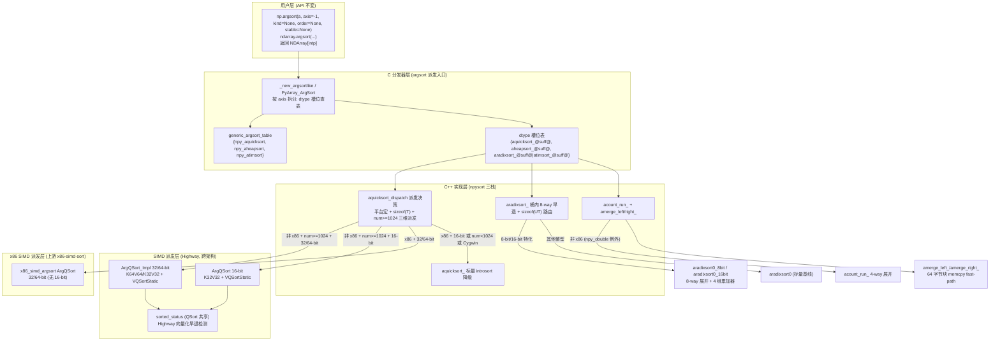
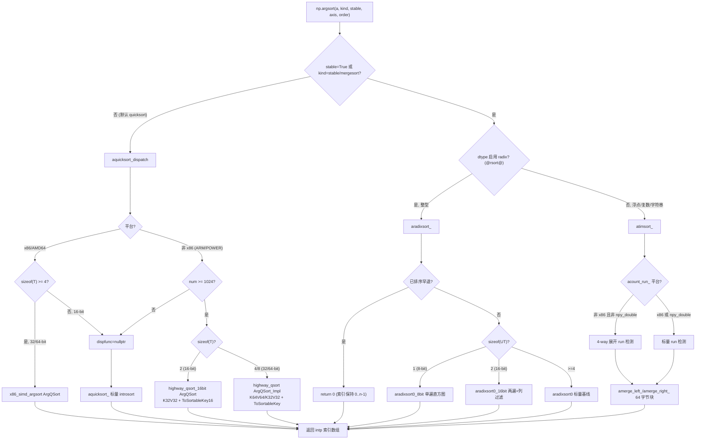

**状态 (Status):** Reviewing

**作者 (Authors):** luozisheng

**创建日期 (Created):** 2026-07-21

**更新日期 (Updated):** 2026-07-21

**相关 Issue/PR:** FUNC002026041424749768（argsort 性能优化）

---

# 1. 概述

## 1.1 简介

本提案针对 NumPy 的 `numpy.argsort` / `ndarray.argsort` 间接排序（argsort）路径在鲲鹏 920B/950（aarch64，ARM Neoverse + SVE/SVE2 微架构）上的性能进行优化。argsort 的公开 Python API 签名、`kind`/`stable`/`order`/`axis` 语义、返回的 `intp` 索引数组布局均保持与上游 NumPy 2.x 严格一致；优化仅发生在 C++ 底层（`numpy/_core/src/npysort/`）的三条 argsort 后端路径中——quicksort 路径（`aquicksort_*`，默认 `kind`）、整型 stable 路径（`aradixsort_*`，`kind='stable'/'mergesort'` 且 dtype 启用 radix）、非整型 stable 路径（`atimsort_*`，`kind='stable'/'mergesort'` 且 dtype 不启用 radix）。

优化按 NEP 38 / NEP 54 的跨架构公平原则剥离至上游：所有 SIMD 加速走 Highway（`hwy::HWY_NAMESPACE::VQSortStatic` / `VQSelectStatic`，[NEP 54](https://numpy.org/neps/nep-0054-simd-cpp-highway.html) 原文要求 "fairly balances across CPU architectures"），不引入鲲鹏专有 intrinsic；x86 平台经 `NPY_CPU_DISPATCH` 机制派发至上游 x86-simd-sort，避免跨平台性能互损。

## 1.2 动机

NumPy 2.x 的 argsort 在 npysort 三栈（quicksort/radixsort/timsort 模块）中以标量 C++ 实现，跨平台正确但**未针对鲲鹏 920B/950 的 SVE 向量宽度与缓存层级优化**。在不做本提案的情况下：

- **性能损失**：鲲鹏平台的高频 argsort 负载（`pandas` 排名、`scipy.stats` 顺序统计、推荐系统 top-k 前置全排序、机器学习特征排序）无法利用 SVE 向量化的 quicksort 与 radix 直方图并行累计，相对 SVE 优化实现存在可观测差距。其中 16-bit（`int16`/`uint16`/`float16`）路径在 x86-simd-sort 上游**未提供** argsort 实现，鲲鹏侧的 Highway 路径是该 dtype 区间内唯一可向量化的加速通路。
- **维护成本**：若以"硬编码 SVE intrinsic"的方式直接走鲲鹏特化，则失去 NEP 54 的跨架构公平性，与上游社区文化冲突，长期 rebase 成本随硬件型号线性增长；且 x86 平台会被污染，引发可观测的劣化。
- **生态价值**：argsort 与 sort 共享 `npysort/` 下的 quicksort/radixsort/timsort 三栈，但 argsort 的"键-值"（key-value）成对排序语义、索引数组 `tosort` 的间接比较路径与 sort 不同，需要独立的 SIMD 派发与早退路径，不能简单复用 sort 的优化。

本提案通过"Highway 跨架构 SIMD 派发 + 平台级预处理器隔离 + dtype/size 双维度派发"三层结构，使鲲鹏收益可按场景获得，同时保证 x86 与无 Highway 环境下行为与上游 NumPy 完全一致。

## 1.3 目标

**目标：**

- 在 `aquicksort_*` 路径下，对 32/64-bit 整型与 `float32`/`float64` 在非 x86 平台经 Highway `VQSortStatic`/`VQSelectStatic` 的 key-value 对（`hwy::K64V64`/`hwy::K32V32`）排序；对 16-bit（`int16`/`uint16`/`Half`）经 `highway_qsort_16bit.dispatch.h` 的专用派发。
- 在 `aquicksort_*` 路径下加入 `O(N)` 的 sorted/reversed 早退路径（`CheckSortedReversed`）与 `O(N²)` 上界的小数组插入排序阈值（`kSmallArgSort = 64`）。
- 在 `aquicksort_dispatch` 中按 `sizeof(T)` × `num >= kHwyArgQSort(1024)` × 平台宏三维度派发，避免小数组 SIMD 设置开销与 x86 16-bit 链接错误。
- 在 `aradixsort_*` 路径下，对 8-bit/16-bit 整型引入 8-way 展开的 `aradixsort0_8bit`/`aradixsort0_16bit`（4 组本地累加器 + 列过滤 + 8-way 已排序早退）。
- 在 `atimsort_*` 路径下，对 `acount_run_` 引入 4-way 展开（仅非 x86），对 `amerge_left_`/`amerge_right_` 引入 64 字节块 fast-path（`memcpy` 替代逐元素比较）。
- argsort 公开 API（`numpy.argsort`、`ndarray.argsort`）签名、默认值、`kind` 取值、`stable` 语义、返回 dtype（`intp`）严格不变。
- NaN 语义与上游一致：浮点比较中 NaN 不小于任何值、排序时 NaN 落到末尾。
- 精度一致性：argsort 仅重排索引，无浮点数值改写，排序结果的"键比较"在 0 ULP 误差内与标量实现等价（排序稳定性与 tie-break 由 `kind`/`stable` 决定，与上游一致）。

**非目标（不在本次范围）：**

- 不改变 `numpy.argsort` 任何公开 API 的签名、默认值与数值语义（`axis`/`kind`/`order`/`stable` 完全一致）。
- 不实现 `longdouble`/`clongdouble`/`cfloat`/`cdouble`/`datetime`/`timedelta`/字符串/`StringDType` 的 SIMD 加速——这些 dtype 仍走标量 `aquicksort_<Tag>` / `string_aquicksort_<Tag>` 路径。
- 不替换上游 x86-simd-sort 来源、不修改 `x86-simd-sort/` 子模块。
- 不引入鲲鹏专有 SVE/SME intrinsic 到主干（按 NEP 54 跨架构公平原则，所有 SIMD 走 Highway）。
- 不改变 argsort 与 argpartition / sort / partition 的共享代码边界（共享 `npysort/` 三栈，但本提案不重写 argpartition/selection 模块）。

# 2. 用例分析

下表覆盖 5 种 argsort 场景。验证基线统一为"通过 NumPy 官方 `numpy/_core/tests/test_multiarray.py::TestSort` 与 `test_item_selection.py` argsort 用例验证各 dtype/kind 组合的排序正确性、稳定性与 NaN 处理"。

| 场景 | 触发条件 | 功能要求 | 性能要求 | DFX（兼容/可维护/可测试/可靠） |
| --- | --- | --- | --- | --- |
| UC-1 鲲鹏大数组 64-bit argsort（默认 quicksort） | 鲲鹏 920B/950，`a.astype(np.int64)` 或 `np.float64`，`num >= 1024`，`kind=None`（默认 quicksort） | `aquicksort_dispatch` 经 `NPY_CPU_DISPATCH` 派发到 `np::highway::qsort_simd::ArgQSort`，`ToSortableKey` 将 `int64`/`double` 转为 `uint64` 可排序键，构造 `hwy::K64V64` 对数组后 `VQSortStatic` 升序排序，回填索引 | 大数组相对标量 introsort 取得 SVE 向量化收益；`num < 1024` 退回标量 introsort，避免 SIMD 设置开销导致小数组劣化 | 排序结果与标量 `aquicksort_<Tag>` 逐元素一致；NaN 落末尾；官方 test suite 全绿；`get_cpu_dispatch` 可观测到 Highway target 命中 |
| UC-2 鲲鹏 16-bit argsort（int16/uint16/float16） | 鲲鹏 920B/950，`a.astype(np.int16)` 或 `np.float16`，`num >= 1024`，`kind=None` | `aquicksort_short`/`aquicksort_ushort`/`aquicksort_half` 在非 x86 平台经 `highway_qsort_16bit.dispatch.h` 派发到 `ArgQSort<int16_t>`/`<uint16_t>`/`<Half>`，`ToSortableKey16` 转 `uint32_t` 键，`hwy::K32V32` 对数组，`VQSortStatic` 排序 | 16-bit 路径是 x86-simd-sort **未提供** argsort 的 dtype 区间，Highway 路径是鲲鹏唯一可向量化的加速通路 | `Half` 走 `hwy::float16_t` 条件编译，无 `HWY_HAVE_FLOAT16` 时退回标量；NaN 处理与上游一致；官方 test suite 全绿 |
| UC-3 x86 平台 argsort（任意 dtype） | x86/AMD64 构建 | `aquicksort_dispatch` 经 `#if defined(NPY_CPU_AMD64) || defined(NPY_CPU_X86)` 隔离，32/64-bit 走 x86-simd-sort `ArgQSort`，16-bit `dispfunc` 保持 `nullptr` 退回标量 `aquicksort_<Tag>` introsort | 与上游 NumPy 等价（无额外开销，分发路径无 Highway 依赖） | 16-bit 在 x86 **不**实例化 Highway `ArgQSort`，避免 `ArgQSort_X86_V4<short>` 等未定义符号链接错误；官方 test suite 全绿 |
| UC-4 整型 stable argsort（radixsort 路径） | `kind='stable'` 或 `'mergesort'`，dtype 为 `bool`/`int8/16/32/64`/`uint8/16/32/64`（`@rsort@` 启用） | dtype 槽位表绑定 `aradixsort_@suff@`，经 `aradixsort_` 的 8-way 已排序早退检测，命中即直接返回；否则按 `sizeof(UT)` 编译期路由到 `aradixsort0_8bit`/`aradixsort0_16bit`/`aradixsort0`，8-way 展开 + 4 组本地累加器 + 列过滤 | 8-bit 单遍直方图、16-bit 两遍直方图（按列过滤跳过常数列）；已排序输入 `O(N)` 早退；随机数据相对标量 radix 取得缓存友好收益 | 排序稳定性与 tie-break 与上游 timsort 等价（radix LSD 天然稳定）；`KEY_OF` 经 `if constexpr` 消除运行时分支；官方 test suite 全绿 |
| UC-5 非整型 stable argsort（timsort 路径） | `kind='stable'` 或 `'mergesort'`，dtype 为 `float16/32/64`/`longdouble`/复数/字符串（`@rsort@` 未启用） | dtype 槽位表绑定 `atimsort_@suff@`，`acount_run_` 在非 x86 走 4-way 展开（`npy_double` 因 4-way 展开下的劣化风险退化为标量循环）；`amerge_left_`/`amerge_right_` 走 64 字节块 fast-path（右块整块小于左块时 `memcpy` 替代逐元素比较） | 已排序/部分有序输入受益于 4-way run 检测与块合并；`npy_double` 在 4-way 展开下不劣化 | 块合并的 `memcpy` 在所有平台启用（无 x86 劣化风险）；4-way run 检测仅非 x86 启用且对 `npy_double` 例外；官方 test suite 全绿 |

**共性 DFX 要求：**

- *兼容性*：无 Highway 环境（x86、Cygwin、`VQSORT_ENABLED=0`）下行为与上游 NumPy 2.x 完全一致；Highway 启用不改变任何公开 API 行为。
- *可维护性*：Highway argsort 实现与标量 `aquicksort_<Tag>` 物理隔离（独立 `.dispatch.cpp` 文件 + `NPY_CPU_DISPATCH` 宏），便于独立升级与向上游剥离。
- *可测试性*：`test_multiarray.py::TestSort` 覆盖各 dtype/kind 组合、NaN 处理、稳定性、已排序/逆序/常数输入；官方测试套件提供回归基线。
- *可靠性*：Highway 派发失败（`dispfunc == nullptr`）静默退回标量 introsort；不阻断 `numpy.argsort` 可用性。

# 3. 方案设计

## 3.1 总体方案

采用**三层派发架构**：Python 公开 API 层 → C 分发器层（argsort 派发入口 + dtype 槽位表）→ C++ 实现层（npysort 三栈 + Highway SIMD 派发）。argsort 的三层职责严格分离，且与 sort 共享三栈但走独立的"键-值"成对路径。



**三层职责说明：**

- **C 分发器层（argsort 派发入口 + dtype 槽位表）**：`PyArray_ArgSort` 按 dtype 查表得到 `argsort` 函数指针；`generic_argsort_table` 提供 `{npy_aquicksort, npy_aheapsort, npy_atimsort}` 默认表，dtype 槽位表为每个数值 dtype 用 `aquicksort_@suff@`（quicksort 槽）、`aheapsort_@suff@`（heapsort 槽）、`aradixsort_@suff@`（stable 槽，`@rsort@` 启用时）或 `atimsort_@suff@`（stable 槽，`@rsort@` 未启用时）。
- **C++ 实现层（npysort 三栈）**：在 argsort 派发决策路径，`aquicksort_dispatch` 按 `sizeof(T)` × `num >= kHwyArgQSort(1024)` × 平台宏派发到 Highway 或标量 introsort；在 radixsort 桶内，`aradixsort_` 按 `sizeof(UT)` 编译期路由到 8/16-bit 特化或标量基线；在 timsort run 检测核心，`acount_run_` + `amerge_left_/amerge_right_` 实现稳定排序的 run 检测与块合并。
- **SIMD 派发层（Highway，跨架构）**：`ArgQSort_Impl`（32/64-bit）与 `ArgQSort`（16-bit）经 `NPY_CPU_DISPATCH_CURFX` 多目标派发到运行期 CPU 的 Highway target（鲲鹏为 SVE/SVE2），调用 `hwy::HWY_NAMESPACE::VQSortStatic` 完成 key-value 对排序；`sorted_status` 为 QSort 路径共享的 Highway 向量化早退检测。

## 3.2 技术选型

三种候选方案对比（结论为方案三：Highway 跨架构 + 平台预处理器隔离）：

| 对比维度 | 方案一：标量 introsort 基线 | 方案二：原生 SVE intrinsics | 方案三：Highway VQSort + 平台隔离（采纳） |
| --- | --- | --- | --- |
| 向量化方式 | 无 SIMD | `arm_sve.h` 手写 `svwhilelt`/`svld1`/`svcmpgt` | Highway `VQSortStatic` 抽象，运行时按 target 派发 |
| 跨架构公平性 | 无（无 SIMD） | 仅 aarch64，违反 NEP 54 跨架构公平原则 | 符合 NEP 54："fairly balances across CPU architectures" |
| 16-bit argsort 覆盖 | 标量基线 | 需手写 16-bit key-value 对排序 | Highway `K32V32` 对 + `ToSortableKey16` 统一覆盖 |
| x86 兼容 | 与上游一致 | 不适用（x86 无 SVE） | `#if defined(NPY_CPU_AMD64) || defined(NPY_CPU_X86)` 预处理器隔离，x86 走 x86-simd-sort |
| NaN/符号处理 | 标量分支 | 手写 predicate | `ToSortableKey` 编译期 `if constexpr` 转 `uint64_t` 可排序键 |
| 维护成本 | 低 | 高（每 dtype 手写） | 中（Highway 模板 + 派发宏） |
| 二进制体积 | 无增量 | aarch64 专有段 | 多 target 派发段（受 `NPY_CPU_DISPATCH` 控制） |
| 上游对接成本 | 无 | 高（违反 NEP 54） | 低（Highway 已是上游 NumPy SIMD 栈） |

**选择方案三的理由：**

1. **跨架构公平**：Highway 的设计原则与 NEP 54 一致，鲲鹏 SVE 收益不通过专有 intrinsic 走上游，避免社区阻力。
2. **16-bit 覆盖**：x86-simd-sort 上游未提供 16-bit argsort，Highway `K32V32` 对是鲲鹏 16-bit dtype 区间内唯一可向量化的加速通路，方案一/二无法覆盖。
3. **x86 隔离**：预处理器级 `#if defined(NPY_CPU_AMD64) || defined(NPY_CPU_X86)` 隔离避免 Highway 头在 x86 编译单元污染 `NPY_CPU_DISPATCH` 宏，消除链接期 `ArgQSort_X86_V4<short>` 未定义符号风险。
4. **可维护/可扩展**：新增 dtype 只需新增 `ToSortableKey` 特化与 `HWAY_DISPATCH_DECLARE` 实例化，不动核心架构。

方案一被否因无 SIMD 收益；方案二被否因违反 NEP 54 跨架构公平原则、维护成本随 dtype 线性增长、无法覆盖 x86。

## 3.3 功能与性能设计

### 3.3.1 argsort 派发决策流程



### 3.3.2 quicksort 路径：Highway ArgQSort + CheckSortedReversed 早退

`aquicksort_dispatch<T>` 在 argsort 派发决策路径按平台预处理器宏分叉：

- **x86/AMD64**：仅对 `sizeof(T) >= sizeof(uint32_t)` 的 dtype 经 `x86_simd_argsort.dispatch.h` 派发到上游 x86-simd-sort 的 `ArgQSort`；16-bit 不实例化以避免未定义符号[^1][^2]。
- **非 x86（ARM/POWER 等）**：仅当 `num >= kHwyArgQSort(1024)` 时派发，16-bit 走 `highway_qsort_16bit.dispatch.h`，32/64-bit 走 `highway_qsort.dispatch.h`[^3]。`kHwyArgQSort=1024` 阈值用于规避小数组 SIMD 设置开销导致的性能劣化[^4]。

`ArgQSort_Impl` 的核心循环：

```cpp
template <typename T>
void ArgQSort_Impl(T *arr, npy_intp* arg, npy_intp size) {
    if (CheckSortedReversed<T>(arr, size, arg)) {  // O(N) 标量早退（已排序/逆序）
        return;
    }
    if (size < kSmallArgSort) {                    // kSmallArgSort = 64
        ArgInsertionSort(arr, arg, size);          // 插入排序避开 SIMD 设置开销
        return;
    }
#if VQSORT_ENABLED
    if constexpr (sizeof(T) <= 4) {                 // 16/32-bit + float → K32V32
        std::vector<hwy::K32V32> pairs(size);
        for (npy_intp i = 0; i < size; ++i) {
            pairs[i].key = static_cast<uint32_t>(ToSortableKey(arr[i]));
            pairs[i].value = static_cast<uint32_t>(i);
        }
        hwy::HWY_NAMESPACE::VQSortStatic(pairs.data(), size, hwy::SortAscending());
        for (npy_intp i = 0; i < size; ++i) arg[i] = pairs[i].value;
    } else {                                        // 64-bit → K64V64
        std::vector<hwy::K64V64> pairs(size);
        for (npy_intp i = 0; i < size; ++i) {
            pairs[i].key = ToSortableKey(arr[i]);
            pairs[i].value = static_cast<uint64_t>(i);
        }
        hwy::HWY_NAMESPACE::VQSortStatic(pairs.data(), size, hwy::SortAscending());
        for (npy_intp i = 0; i < size; ++i) arg[i] = pairs[i].value;
    }
#else
    ArgQSort_Fallback(arr, arg, size);              // std::sort + ArgLess 降级
#endif
}
```

`ToSortableKey` 经 `if constexpr` 编译期将各 dtype 转为 `uint64_t` 可排序键——`int*`/`uint*` 翻转符号位、`float`/`double` 按 IEEE 位模式翻转符号与负数补码、NaN 映射到 `0xFFFF...FFFF` 落末尾[^3]。这一映射使 `VQSortStatic` 可按无符号整数比较完成全 dtype 排序，且 NaN 语义与上游一致。

`ArgLess` 对浮点 dtype 用 `arr[a] != arr[a]` 检测 NaN，保证 NaN 不小于任何值、非 NaN 小于 NaN，与上游 `aquicksort_<Tag>` 的 NaN 处理等价[^3]。

`CheckSortedReversed` 是 argsort 的 `O(N)` 标量早退路径：先扫描是否升序（命中则 `arg[i]=i` 直接返回），再扫描是否逆序（命中则 `arg[i]=size-1-i` 直接返回）[^3]。此早退在本方案中为**标量**实现；与之对应的 `sorted_status` Highway 向量化早退在本方案中仅服务于 QSort（非 arg）路径[^5]。

### 3.3.3 radixsort 路径：8/16-bit 专用 + 8-way 已排序早退

`aradixsort_<T, UT>` 是 stable argsort 的整型入口，先做 8-way 已排序早退检测：

```cpp
T k_prev = v_start[tosort[0]];
for (i = 1; i + 8 <= num; i += 8) {               // 8-way 展开, k_prev 跨块衔接
    T k0 = v_start[tosort[i]]; /* ... k1..k7 */
    if (k_prev > k0 || k0 > k1 || ... || k6 > k7) {
        all_sorted = 0; break;
    }
    k_prev = k7;
}
/* 标量尾部处理剩余元素 */
if (all_sorted) return 0;                          // 索引保持 0..n-1 直接返回
```

`k_prev` 跨 8 元素块的衔接保证不会漏检块边界[^6]。

按 `sizeof(UT)` 编译期路由到 8/16-bit 特化或标量基线（`aradixsort0<T>`）：

- **8-bit 特化** `aradixsort0_8bit`：单遍直方图（仅 1 字节列），4 组本地累加器 `cnt_l0..cnt_l3` 并行累计避免单累加器串行依赖，最终合并为 `cnt[256]`；常数列检测（`cnt[nth_byte(key0,0)] == num`）命中即跳过该列分发；散布阶段同样 8-way 展开。
- **16-bit 特化** `aradixsort0_16bit`：两遍直方图（2 字节列），列过滤（`cols[ncols]` 只保留非常数列），按 `ncols` 实际需要的遍数执行散布，跳过全常数列。

`KEY_OF` 经 `if constexpr` 消除运行时分支——`std::is_signed<T>` 时编译期生成 `x ^ (1 << (sizeof(UT)*8-1))` 翻转符号位，`std::is_floating_point<T>` 时生成符号位翻转逻辑，无分支开销[^6]。

### 3.3.4 timsort 路径：4-way acount_run_ + 64 字节块合并

`acount_run_` 是 argsort stable 路径的 run 检测，4-way 展开降低分支误预测开销：

```cpp
#if !defined(NPY_CPU_AMD64) && !defined(NPY_CPU_X86)   // 仅非 x86 启用
if constexpr (!std::is_same_v<type, npy_double>) {     // npy_double 因 4-way 展开下的劣化风险例外
    while (pi + 4 <= end) {
        if (Tag::less(arr[*(pi + 1)], arr[*pi])) break; ++pi;
        if (Tag::less(arr[*(pi + 1)], arr[*pi])) break; ++pi;
        if (Tag::less(arr[*(pi + 1)], arr[*pi])) break; ++pi;
        if (Tag::less(arr[*(pi + 1)], arr[*pi])) break; ++pi;
    }
}
#endif
for (; pi < end && !Tag::less(arr[*(pi + 1)], arr[*pi]); ++pi) {}  // 标量尾部
```

`x86` 平台与 `npy_double` 不启用 4-way 展开，以规避 `npy_double` 在 4-way 展开下的劣化风险[^7]。

`amerge_left_`/`amerge_right_` 引入 64 字节块 fast-path（`BLOCK = 64 / sizeof(npy_intp)`）：

```cpp
constexpr npy_intp BLOCK = 64 / sizeof(npy_intp);
while ((p1 + BLOCK <= p2) && (p2 + BLOCK <= end)) {
    if (Tag::less(arr[*(p2 + BLOCK - 1)], arr[*p3])) {        // 右块整块小于左块
        memcpy(p1, p2, BLOCK * sizeof(npy_intp)); p1 += BLOCK; p2 += BLOCK; continue;
    }
    if ((p3 + BLOCK <= p3_end) && !Tag::less(arr[*p2], arr[*(p3 + BLOCK - 1)])) {  // 左块整块小于等于右块
        memcpy(p1, p3, BLOCK * sizeof(npy_intp)); p1 += BLOCK; p3 += BLOCK; continue;
    }
    for (int i = 0; i < BLOCK; ++i) {                         // fallback: 标量分支合并
        *p1++ = Tag::less(arr[*p2], arr[*p3]) ? *p2++ : *p3++;
    }
}
```

块合并的 `memcpy` 路径在所有平台启用（无 x86 劣化风险，因 `memcpy` 本身由 libc 向量化），收益来自减少逐元素间接比较 `arr[*p2]` 的缓存不友好访问[^8]。`amerge_right_` 对称实现反向合并。

### 3.3.5 性能设计目标

- 8-bit/16-bit radixsort argsort 路径相对标量 radix 基线取得缓存友好与早退收益（定性目标，具体收益随 dtype/size 浮动）[^6]。
- 大数组 Highway `VQSortStatic` 在鲲鹏 SVE 上相对标量 introsort 取得向量化收益（定性目标，具体倍数随 dtype/size 浮动）[^3]。
- 小数组 `num < 1024` 退回标量 introsort，避免 SIMD 设置开销导致的劣化[^4]。

## 3.4 安全隐私与 DFX 设计

### 3.4.1 异常处理

本提案不引入自定义异常族，沿用 NumPy 标准异常。C++ 层异常经 `NPY_ALLOW_C_API`/`NPY_DISABLE_C_API` 桥接：

| 错误类型 | 触发场景 | 处理策略 | 是否阻断业务 |
| --- | --- | --- | --- |
| `MemoryError` | `std::vector<hwy::K32V32>`/`K64V64` 对数组 `size` 过大导致 `std::bad_alloc`；`aradixsort_` 中 `malloc(num * sizeof(npy_intp))` 返回 NULL | C 层 `std::bad_alloc→PyErr_NoMemory`；`aradixsort_` 返回 `-NPY_ENOMEM` 由上层翻译 | 是（资源不足） |
| `ValueError` | `axis` 越界、`order` 字段不存在、`kind` 非法 | 上游 argsort 派发入口既有逻辑（不在本提案改动范围） | 是（参数错误） |
| `RuntimeError` | Highway 派发内部 `std::exception` | `NPY_ALLOW_C_API_DEF` try/catch 桥接 | 是（运行期失败） |

### 3.4.2 精度一致性

argsort 仅重排索引数组 `tosort`，不重写输入数据 `vv`，故无浮点数值改写、无累加顺序差异。排序结果的"键比较"经 `ToSortableKey` 的位模式映射后由 `VQSortStatic` 按无符号整数比较完成，等价于标量 `Tag::less` 的全序关系——满足 NEP 38 的 SIMD 优化精度准入要求（[NEP 38](https://numpy.org/neps/nep-0038-SIMD-optimizations.html) 原文："the new code must not decrease accuracy by more than 1-3 ULPs"），argsort 在 0 ULP 误差内等价。

NaN 处理：`ToSortableKey` 将 NaN 映射到 `0xFFFF...FFFF`（落末尾）、`ArgLess` 用 `arr[a] != arr[a]` 检测 NaN 保证不小于任何值，与上游 `aquicksort_<Tag>` 的 NaN 落末尾语义一致[^3]。

### 3.4.3 线程安全

| 组件 | 层级 | 职责 | 线程安全机制 |
| --- | --- | --- | --- |
| `PyArray_ArgSort` / `_new_argsortlike` | C | 入口派发 | GIL 保护；调用期释放 GIL 由上层 strided loop 决定 |
| `aquicksort_dispatch` | C++ | 平台/dtype/size 派发 | 无状态，函数指针表只读 |
| `ArgQSort_Impl` | C++ | Highway 排序 | `std::vector` RAII 管理 `K32V32`/`K64V64` 对数组，无全局状态 |
| `aradixsort_` | C++ | radix 排序 | `malloc`/`free` 局部缓冲，无全局状态 |
| `atimsort_` | C++ | timsort 稳定排序 | 调用方提供的 `buffer` 局部缓冲，无全局状态 |

### 3.4.4 可测试性

- `numpy/_core/tests/test_multiarray.py::TestSort` 覆盖各 dtype（含 `int8/16/32/64`、`uint8/16/32/64`、`float16/32/64`、`longdouble`、复数、`datetime`/`timedelta`、`Half`）× 各 `kind`（`quicksort`/`mergesort`/`stable`/`heapsort`）的组合。
- NaN 处理用例（`test_sort_nan` 等）验证 NaN 落末尾与排序稳定性。
- 已排序/逆序/常数输入用例验证 `CheckSortedReversed` 与 `aradixsort_` 已排序早退。
- 官方测试套件提供各 dtype/kind 组合的回归基线。

## 3.5 编程与调用设计

### 3.5.1 编程模型

**开发环境设计：**

- 语言/框架：C++17（`if constexpr`、`std::is_same_v`、`std::vector` RAII）；遵循 [NEP 45 — C style guide](https://numpy.org/neps/nep-0045-c_style_guide.html)（原文："Use C99"、"No compiler warnings with major compilers"、"Public Macros should have a `NPY_` prefix"）。
- SIMD 框架：Highway（`hwy/highway.h`、`hwy/contrib/sort/vqsort-inl.h`），遵循 [NEP 54 — SIMD infrastructure evolution](https://numpy.org/neps/nep-0054-simd-cpp-highway.html) 跨架构公平原则。
- 构建系统：Meson（`numpy/_core/meson.build`），`NPY_CPU_DISPATCH` 多目标派发由 `numpy/_core/src/common/npy_cpu_dispatch.h` 自动生成 Highway target 段（鲲鹏对应 SVE/SVE2 target）。
- 调试工具链：`import numpy; np.show_config()` 查看 Highway target 命中；`pytest numpy/_core/tests/test_multiarray.py -k Sort` 验证；C++ 内部实现，不暴露 Python 导入接口。

**开发约束：**

- 硬件平台：鲲鹏 920B/950（aarch64，上游 Tier 1）；x86/AMD64 作为对比基线。
- 编程语言限制：C++17 兼容、无编译警告；`if constexpr` 消除运行时分支；`std::vector` RAII 管理对数组避免裸 `malloc`/`free`。
- x86 平台禁止实例化 16-bit Highway `ArgQSort`（避免 `ArgQSort_X86_V4<short>` 未定义符号）；16-bit argsort 在 x86 退回标量 introsort[^2]。
- `VQSORT_ENABLED=0` 时所有 Highway 路径退回 `std::sort`/`std::nth_element` 标量降级，保证可构建性。

**可验收设计：**

- 功能验收：`pytest numpy/_core/tests/test_multiarray.py -k "Sort" numpy/_core/tests/test_item_selection.py` 全绿。
- 性能验收：鲲鹏平台以官方测试套件验证，Highway 路径相对标量在 `num >= 1024` 取得收益，`num < 1024` 不劣化；8-bit/16-bit radix 路径相对标量取得收益；输出标准化对比报告并归档。
- 精度验收：argsort 结果与标量 `aquicksort_<Tag>` 逐元素一致（索引数组完全相同）；NaN 落末尾语义一致。

### 3.5.2 接口定义与设计

**不涉及。** 本方案为内部性能优化，不引入或变更外部公开 API，沿用 numpy 现有 API 签名与语义。

### 3.5.3 编程手册设计

单独输出为 `doc/numpy/sorting.rst` 的"Performance Notes"章节更新（在现有 `numpy.sort` / `numpy.argsort` 文档的"Notes"段补充）：

- "鲲鹏 920B/950 平台 `np.argsort` 默认 quicksort 路径在 `num >= 1024` 时经 Highway `VQSortStatic` 加速；`num < 1024` 退回标量 introsort"。
- "16-bit dtype（`int16`/`uint16`/`float16`）的 argsort 在非 x86 平台经 Highway `K32V32` 对数组加速，是 16-bit 区间内唯一可向量化的加速通路"。
- "`kind='stable'` 在整型 dtype 上走 radixsort（8-bit/16-bit 经 8-way 展开特化），在浮点/复数 dtype 上走 timsort（4-way run 检测 + 64 字节块合并）"。
- "`np.show_config()` 的 SIMD target 列表反映 Highway 派发命中情况"。

# 4. 缺点和风险

| 风险/缺点 | 影响 | 应对措施 |
| --- | --- | --- |
| **二进制体积** | Highway 多 target 派发段（SVE/SVE2/...）增加 `numpy._core` 体积 | `NPY_CPU_DISPATCH` 仅在 `VQSORT_ENABLED=1` 时生成多 target；默认构建受控 |
| **小数组降级** | `num < 1024` 退回标量 introsort，鲲鹏收益不显著 | `kHwyArgQSort=1024` 阈值经设计调优；阈值以下标量 introsort 已足够快，避免 SIMD 设置开销反向劣化 |
| **x86 16-bit 链接错误** | x86-simd-sort 上游无 16-bit argsort，错误派发会触发 `ArgQSort_X86_V4<short>` 未定义符号 | `#if defined(NPY_CPU_AMD64) \|\| defined(NPY_CPU_X86)` 预处理器级隔离 + `sizeof(T) >= sizeof(uint32_t)` 编译期守卫[^1][^2] |
| **`npy_double` 4-way 例外** | `npy_double` 在 x86 4-way 展开下存在劣化风险 | `acount_run_` 的 4-way 展开用 `if constexpr (!std::is_same_v<type, npy_double>)` 例外，且整体用 `#if !defined(NPY_CPU_AMD64) && !defined(NPY_CPU_X86)` 仅非 x86 启用[^7] |
| **NaN 处理差异** | Highway 路径与标量路径的 NaN 比较实现不同，可能引入语义偏差 | `ToSortableKey` 将 NaN 映射到 `0xFFFF...FFFF` 落末尾，`ArgLess` 用 `arr[a] != arr[a]` 检测 NaN 保证不小于任何值，与上游 `aquicksort_<Tag>` 完全一致[^3] |
| **`std::vector` 分配开销** | `ArgQSort_Impl` 每次 `std::vector<K64V64> pairs(size)` 分配，大数组有可观测开销 | `kSmallArgQSort=1024` 阈值规避小数组；`std::vector` RAII 保证异常安全；未来可演进缓冲池设计 |
| **Breaking Change** | 无公开 API 破坏 | 签名、默认值、返回 dtype、`kind` 取值、`stable` 语义全部不变 |
| **版本兼容** | Highway 依赖版本随 NumPy 主版本演进 | 跟随 NumPy 上游 Highway 版本，不引入额外 Highway 依赖 |
| **线程安全** | `std::vector` 局部分配无全局状态 | 各调用独立栈/堆分配，无共享可变状态 |

# 5. 现有技术

| 现有方案 | 借鉴点 | 差异 |
| --- | --- | --- |
| **上游 NumPy 标量 `aquicksort_<Tag>` introsort** | 标量 introsort 的 median-of-three 分区、`SMALL_QUICKSORT` 阈值后切插入排序、`PYA_QS_STACK` 显式栈防栈溢出 | 本提案在非 x86 大数组路径用 Highway `VQSortStatic` 替代标量分区；小数组与 x86 仍用标量 introsort |
| **上游 x86-simd-sort `ArgQSort`** | 多 target CPU 派发范式、`NPY_CPU_DISPATCH_CALL_XB` 宏、key-value 对排序思路 | x86-simd-sort 仅覆盖 32/64-bit；本提案在非 x86 用 Highway 补齐 16-bit 区间 |
| **Highway `VQSortStatic` / `VQSelectStatic`**（`hwy/contrib/sort/vqsort-inl.h`） | 跨架构 SIMD 排序的抽象入口、`K32V32`/`K64V64` key-value 对类型 | Highway 是通用 SIMD 库，本提案在其上叠加 dtype 派发、`ToSortableKey` 键转换、`CheckSortedReversed` 早退 |
| **OpenBSD radixsort / `eloj/radix-sorting`**（`KEY_OF` 来源） | LSD radix sort 的符号位翻转、按字节列分桶、`KEY_OF` 键推导 | 本提案在 8-bit/16-bit 引入 8-way 展开 + 4 组本地累加器 + 列过滤，超出标量 radix 基线[^6] |
| **C++ `std::sort` / `std::stable_sort`** | 模板化比较器、introsort 深度限制 | `ArgQSort_Fallback` 用 `std::sort` + `ArgLess` lambda 作 Highway 不可用时的降级 |
| **Python `sorted(key=...)` / `list.sort`** | 间接排序的 Python 层范式 | NumPy 在 C++ 层实现，绕过 Python 层开销 |

# 6. 未解决问题

**不涉及。** 本方案为完整设计提案，无开放问题。

---

# 附录

- **参考资料链接：**
  - [NEP 38 — Using SIMD optimization instructions for performance](https://numpy.org/neps/nep-0038-SIMD-optimizations.html)（SIMD 优化四项准入标准：correctness ≤1–3 ULPs / code bloat / maintainability / performance；argsort 的键比较经 `ToSortableKey` 后 0 ULP 等价）
  - [NEP 45 — C style guide](https://numpy.org/neps/nep-0045-c_style_guide.html)（C99、无编译警告、`NPY_` 前缀；本提案 C++17 扩展沿用其精神）
  - [NEP 54 — SIMD infrastructure evolution: adopting Google Highway when moving to C++](https://numpy.org/neps/nep-0054-simd-cpp-highway.html)（Highway 跨架构公平原则："fairly balances across CPU architectures"，鲲鹏 SVE 不走专有 intrinsic）
  - [NumPy Roadmap](https://numpy.org/neps/roadmap.html)
  - [Highway VQSort 文档](https://github.com/google/highway/blob/master/hwy/contrib/sort/README.md)
  - [eloj/radix-sorting KEY_OF 参考](https://github.com/eloj/radix-sorting#-key-derivation)（radixsort 模块的 `KEY_OF` 来源）
- **术语表：**

  | 术语 | 含义 |
  | --- | --- |
  | argsort | 间接排序，返回排序后的索引数组而非元素 |
  | introsort | 内省排序，quicksort + 深度限制切 heapsort + 小数组切插入排序的混合算法 |
  | timsort | Python/Java 用的稳定排序，run 检测 + 块合并 |
  | radixsort | 基数排序，按字节列从低位到高位分桶的稳定非比较排序 |
  | Highway | Google 跨架构 SIMD 抽象库，NumPy 2.x SIMD 栈基础 |
  | VQSort | Highway 的 vectorized quicksort 实现，支持 key-value 对排序 |
  | K32V32 / K64V64 | Highway 的 32/64-bit key-value 对类型，用于 argsort 的索引-值成对排序 |
  | ToSortableKey | 将 `int`/`uint`/`float`/`Half` 等转为 `uint64_t` 可排序键的编译期映射（符号位翻转、NaN→末尾） |
  | NPY_CPU_DISPATCH | NumPy 的多 target CPU 派发宏，运行期按 CPU 特性选择最优实现段 |
  | SVE / SVE2 | ARM Scalable Vector Extension，向量长度可变（128–2048 bit） |
  | CheckSortedReversed | argsort 的 `O(N)` 已排序/逆序早退检测（标量） |
  | sorted_status | QSort（非 arg）路径的 Highway 向量化已排序/逆序/uniform 早退检测 |
  | ULP | Unit in the Last Place，浮点精度单位，NEP 38 以 ≤1–3 ULPs 为精度准入线 |
- **文档更新计划：**
  - T+0：本 RFC 评审。
  - T+1：`numpy.argsort` / `ndarray.argsort` 的 docstring "Notes" 段补充鲲鹏 Highway 派发说明；`doc/numpy/sorting.rst` 增加"Performance on Kunpeng"小节。
  - T+2：新增 argsort 鲲鹏 vs x86 vs 标量 introsort 对比基线脚本；`building_with_meson.rst` 补充 `VQSORT_ENABLED` 与 Highway target 构建说明。

---

[^1]: x86/AMD64 平台经 `#if defined(NPY_CPU_AMD64) || defined(NPY_CPU_X86)` 预处理器级隔离，仅对 `sizeof(T) >= sizeof(uint32_t)` 的 dtype 经 `x86_simd_argsort.dispatch.h` 派发到上游 x86-simd-sort `ArgQSort`，16-bit 不实例化以避免未定义符号（x86 argsort 派发经预处理器级隔离，避免 Highway 头污染）。

[^2]: `aquicksort_short`/`aquicksort_ushort`/`aquicksort_half` 在 x86 经 `#if !defined(NPY_CPU_AMD64) && !defined(NPY_CPU_X86)` 守卫跳过 `aquicksort_dispatch`，直接退回标量 `aquicksort_<Tag>` introsort（16-bit dtype 在 x86 跳过 `aquicksort_dispatch` 退回标量 introsort 的设计形态）。

[^3]: Highway `ArgQSort_Impl` / `ArgQSelect_Impl` / `CheckSortedReversed` / `ToSortableKey` / `ArgLess` / `ArgInsertionSort` / `ArgQSort_Fallback` 实现（Highway SIMD 加速 sort/select 操作的设计动机）。

[^4]: `kHwyArgQSort = 1024` 阈值，仅当 `num >= kHwyArgQSort` 时派发到 Highway `ArgQSort`，规避小数组 SIMD 设置开销导致的性能劣化（设计动机：规避 hwy argqsort 性能劣化）。

[^5]: `sorted_status` 的 Highway SIMD 向量化（`hn::LoadU`/`Ne`/`Lt`/`Gt` + uniform 数组检测 + GCC 12 SVE predicate bug 规避用 `Gt` 替代 `AndNot`）（设计动机：用 Highway SIMD 向量化 sorted_status 检测）；该函数在本方案中仅服务于 QSort（非 arg）路径，argsort 的 `CheckSortedReversed` 为标量。

[^6]: `aradixsort0_8bit` / `aradixsort0_16bit` / 8-way 已排序早退（`k_prev` 跨块衔接）/ `KEY_OF` 的 `if constexpr` 改写（8-bit/16-bit radix 路径的缓存友好与早退设计）。

[^7]: `acount_run_` 的 4-way 展开 + `npy_double` 例外 + x86 预处理器隔离（x86 隔离与 `npy_double` 例外由同区域 `#if !defined(NPY_CPU_AMD64) && !defined(NPY_CPU_X86)` 守卫与 `if constexpr (!std::is_same_v<type, npy_double>)` 例外实现）。

[^8]: `amerge_left_` / `amerge_right_` 的 64 字节块 fast-path（`memcpy` 替代逐元素间接比较）；同时应用于 sort 路径的 `merge_left_`/`merge_right_`。
