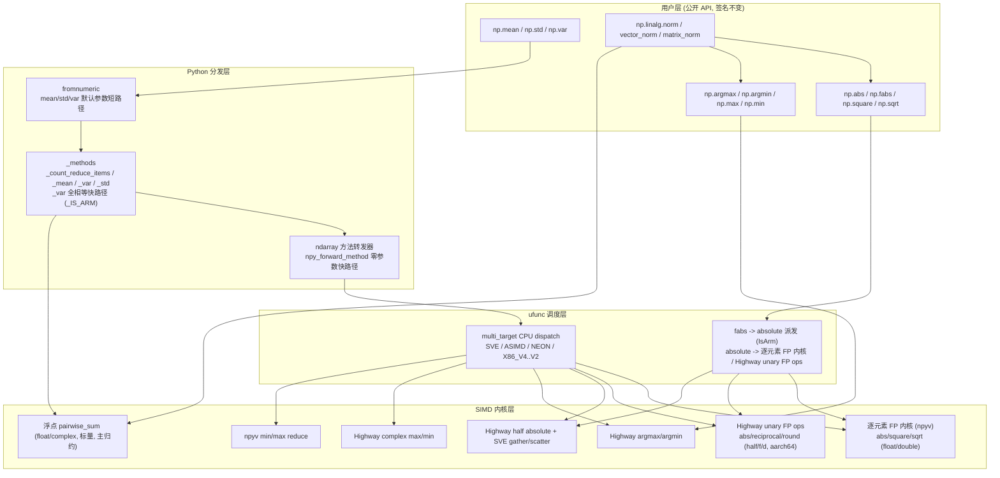
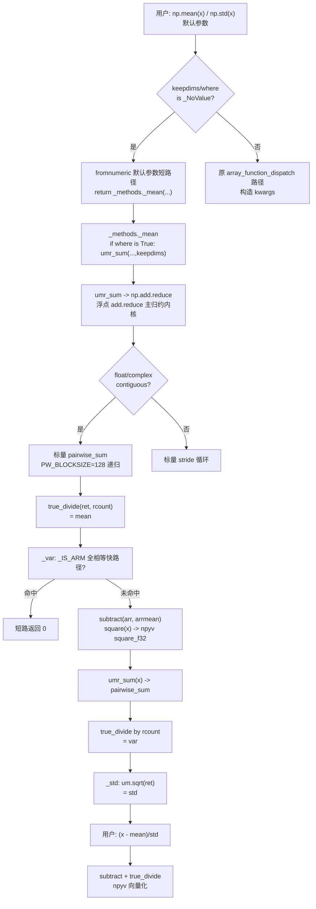

**状态 (Status):** Reviewing

**作者 (Authors):** luozisheng

**创建日期 (Created):** 2026-07-21

**更新日期 (Updated):** 2026-07-21

**相关 Issue/PR:** FUNC002026041324743799（normalize）

---

# 1. 概述

## 1.1 简介

本提案围绕 NumPy 的"归一化"功能点（normalize）设计其在鲲鹏 920B/950（aarch64）平台上的性能优化方案。归一化在 NumPy 中并非单一 API，而是一组以归约（reduction）与逐元素（elementwise）ufunc 为基础原语组合而成的运算族：z-score 归一化 `(x − mean)/std` 依赖 `np.mean`/`np.std`/`np.var` 与 `nanmean`/`nanstd`；min-max 归一化 `(x − min)/(max − min)` 依赖 `np.min`/`np.max`/`np.argmin`/`np.argmax` 与对应 nan 变体；L1/L2 归一化 `x / np.linalg.norm(x)` 依赖 `np.linalg.norm`/`np.linalg.vector_norm`/`np.linalg.matrix_norm`，其底层进一步落在 `np.abs`、`np.add.reduce`、`np.sqrt`、`np.multiply` 等 ufunc 上。

本方案不引入新后端、新 ABI 或新公开 API，而是基于 numpy 仓系统性设计：哪些归一化相关热路径拟在鲲鹏平台获得收益（Python 层归约快路径、Highway SIMD 绝对值/argmax/argmin/complex max-min、fabs→absolute 派发）、哪些归约主路径拟保留标量 pairwise 以保证数值稳定性（z-score 的 mean/var/Frobenius 范数主归约）。各优化点以功能模块与设计路径形式给出定位。

## 1.2 动机

归一化是数据预处理、神经网络输入标准化、信号能量归一化、矩阵谱半径计算等场景的高频操作，其性能直接决定上层算法的吞吐。在鲲鹏平台，归一化的性能瓶颈集中在三处：

- **Python 层分发开销**：`np.mean`/`np.std`/`np.var` 在默认参数下原本需构建 `kwargs` 字典、走 `array_function_dispatch` 装饰器、经 `npy_forward_method` 分配工作区转发参数，对小数组归一化（如 batch 维度为 1 的逐样本标准化）这一层开销可超过纯计算开销。
- **归约内核**：`np.add.reduce` 是 `np.sum`/`np.mean`/`np.var`/Frobenius 范数的主归约；`np.minimum.reduce`/`np.maximum.reduce` 是 min-max 归一化的主归约。浮点归约设计上保留 NumPy 原生标量 pairwise summation（`@TYPE@_pairwise_sum`）以保证 O(log n) 误差，主归约不向量化。
- **逐元素绝对值与平方**：L1/L2/inf 范数与 abs-preprocessing 依赖 `np.abs`/`np.fabs`/`np.square`，这些 ufunc 的向量化程度直接决定范数性能。

不做此提案的影响：上层用户在鲲鹏平台对归一化负载无法获得透明收益，且社区与维护者对"哪些路径拟优化、哪些路径保留标量、哪些是设计边界"缺乏统一视图，导致重复尝试已被否决的方案（如再次尝试浮点 pairwise sum SIMD 化）造成维护成本浪费。

## 1.3 目标

**目标：**

- 基于 numpy 仓系统性设计，明确归一化功能点的优化边界与设计路径。
- 对 z-score（mean/std/var）、min-max（min/max/argmin/argmax）、L1/L2/inf 范数（linalg.norm/vector_norm/matrix_norm、abs、add.reduce、square、sqrt）三条子路径分别给出设计方案与优化点。
- 对保留标量 pairwise 的主归约路径如实说明设计理由（数值稳定性优先），作为设计边界基线。
- 明确归一化相关公开 API 的签名约束：本方案不改任何公开 API 签名、默认值与数值语义。

**非目标（不在本次范围）：**

- 不新增归一化顶层 API（不提供 `np.normalize` 之类的封装函数）。
- 不替换 `np.linalg.norm` 的算法骨架（仍保持 `norm` 的分支结构）。
- 不在本期对浮点主归约引入 SIMD pairwise（保留标量 pairwise 以守数值稳定性，列为设计边界）。
- 不处理 `np.linalg` 的 LAPACK 路径（SVD、特征值），仅处理范数路径。
- 不改变 `np.mean`/`np.std`/`np.var`/`np.linalg.norm`/`np.linalg.vector_norm`/`np.linalg.matrix_norm` 任何公开签名。

# 2. 用例分析

下表覆盖归一化功能点在鲲鹏平台的 5 类典型场景。验收基线统一为"通过 NumPy 官方 `numpy/_core/tests/test_multiarray.py`、`test_numeric.py`、`numpy/linalg/tests/test_lint.py` 与 `test_deprecations.py` 中相关归约与范数用例"。

| 场景 | 触发条件 | 功能要求 | 性能要求 | DFX（兼容/可维护/可测试/可靠） |
| --- | --- | --- | --- | --- |
| UC-1 z-score 逐样本标准化 | 用户在 aarch64 上调用 `np.mean`/`np.std`，全部使用默认参数（`keepdims`/`where` 为 `_NoValue`） | `mean`/`std`/`var` 经 fromnumeric 默认参数短路径直接进入 `_methods._mean`/`_std`/`_var`，跳过 `kwargs` 构造与 `array_function_dispatch` 装饰开销 | 默认参数小数组归约相对上游 NumPy 获得分发层收益；纯计算受限于标量 pairwise sum | 兼容：默认参数语义不变；可测试：`test_numeric.py::test_mean`/`test_std` 全绿；可靠：非默认参数走原路径 |
| UC-2 小数组全相等方差快路径 | aarch64 + `_IS_ARM` 命中 + `mean is None`/`where is True`/`ddof==0`/`axis is None`/1D 连续/`size≤256`/`dtype.kind∈"biuf"` + 数组全相等 | `_var` 在重流水线前短路返回 0，绕过 sum/divide/subtract/square/sum/divide | 预期在小长度全相等输入上获得分发层收益（目标：相对原重流水线显著降低延迟） | 兼容：结果与原路径逐位一致（全相等→方差为 0）；可测试：含 NaN 时 `not um.isnan(first)` 守卫确保不误命中；可靠：仅 aarch64 启用 |
| UC-3 L2/inf 向量范数 | 用户调用 `np.linalg.norm(x)` 或 `np.linalg.vector_norm(x)`，`ord` 为 `None`/`2`/`inf`/`-inf` | Frobenius/2-范数走 `add.reduce((x.conj()*x).real)` + `sqrt`；inf/-inf 走 `abs(x).max/min`；底层 abs/fabs 走 SIMD 绝对值内核 | aarch64 上 `fabs` 经 `cfunc_alias='absolute'` 复用 SIMD absolute 内核；`abs` 对 float/double 经 npyv 向量化、对 half 经 Highway SIMD | 兼容：范数语义与 ord 表一致；可测试：`test_lint.py::test_norm` 全绿；可靠：非 aarch64 走标量 fabs |
| UC-4 复数 min/max 归约 | 用户对 complex64/complex128 数组调用 `np.maximum.reduce`/`np.minimum.reduce`（min-max 归一化的复数扩展） | 经复数 max/min 的 Highway SIMD 内核按 4 类访存模式（Map/Reduce/Bcast1/Bcast2）派发 | aarch64 SVE/ASIMD/NEON 多 target 编译，`HWY_STATIC_DISPATCH` 子目标选择 | 兼容：复数比较按 (实,虚) 字典序，与上游 CGE/CLE 标量内核一致；可测试：含 NaN 路径已有专门修复；可靠：非标准 stride 走 `scalar_loop` |
| UC-5 argmax/argmin 索引归约 | 用户调用 `np.argmax`/`np.argmin`（部分归一化管线用其定位极值索引） | 经 argmax/argmin 的 Highway SIMD 内核：浮点 8 路展开 + NaN 处理、整数 4 路展开、布尔 block 处理 | aarch64 SVE/ASIMD/NEON 多 target，两阶段算法（SIMD 找极值、标量找索引） | 兼容：与上游 argfunc 标量结果一致；可测试：`test_numeric.py::test_argmax`/`test_argmin` 全绿；可靠：8/16-bit 非 SVE 仍走原 npyv 内核 |

**共性 DFX 要求：**

- *兼容性*：所有优化在非 aarch64 平台经 `IsArm`/`_IS_ARM`/`__aarch64__` 守卫走上游 NumPy 标量或 npyv 路径，行为与上游 2.x 完全一致。
- *可维护性*：Highway SIMD 内核集中在独立的 `loops_*_hwy` / `highway_*` dispatch 文件，经 `meson.build` 的 `multi_target` 系统按 target 编译，与标量主干物理隔离。
- *可测试性*：所有优化均通过上游 NumPy 既有 test suite 验证。
- *可靠性*：SIMD 内核对非标准 stride、不足一个 vector lane 的尾部、NaN 输入均有标量 fallback；非 aarch64 平台不启用 aarch64 专有 target。

# 3. 方案设计

## 3.1 总体方案

归一化在 NumPy 中是"组合操作"，其性能由底层的归约 ufunc 与逐元素 ufunc 决定。本方案按"Python 分发层 → ufunc 调度层 → SIMD 内核层"三层设计优化，层间职责严格分离：



**三层职责说明：**

- **Python 分发层**：消除默认参数下的 `kwargs` 字典构造、`array_function_dispatch` 装饰、`NPY_ALLOC_WORKSPACE` 工作区分配等纯分发开销，使归一化在"默认参数 + 小数组"场景下尽快进入计算内核。
- **ufunc 调度层**：经 `generate_umath.py` 的 `cfunc_alias` 机制将 `fabs` 在 aarch64 派发到 `absolute`，经 `meson.build` 的 `mod_features.multi_targets` 为每个 SIMD target 编译独立变体。
- **SIMD 内核层**：用 NumPy 原生 npyv 通用 intrinsic（`npyv_abs_*`/`npyv_load_*`/`npyv_reduce_*`）与 Google Highway（`hn::LoadU`/`hn::Add`/`hn::ReduceSum`/`HWY_STATIC_DISPATCH`）两套体系承担实际向量化。Highway 内核遵循 NEP 54 的跨架构公平原则，每个 target 在 aarch64 与 x86 同时编译变体。

## 3.2 技术选型

归一化的 SIMD 加速存在三种候选实现路线，下表对比并给出本方案的选型：

| 对比维度 | 方案一：标量 pairwise（上游 NumPy 原生） | 方案二：NumPy npyv 通用 intrinsic | 方案三：Google Highway（多 target dispatch） |
| --- | --- | --- | --- |
| 实现位置 | 浮点/复数 add.reduce 求和内核 | 逐元素 FP / min-max reduce 内核 | Highway argfunc / complex max-min / half abs 内核 |
| 适用操作 | 浮点/复数 add.reduce 求和 | abs/square/sqrt/floor/ceil/min-max reduce | abs(half)/argmax/argmin/complex max-min/floor_div |
| 向量化程度 | 标量递归 pairwise（不向量化） | npyv 向量化 + 4/8 路展开 | Highway 向量化 + `HWY_STATIC_DISPATCH` 子目标选择 |
| 跨架构 | 全平台通用 | 全平台通用（npyv 屏蔽差异） | 全平台公平编译（NEP 54 原则） |
| 精度 | pairwise 递归保证 O(log n) 误差 | 与标量一致（逐元素） | 与标量一致（逐元素）/ pairwise 递归（sum） |
| 本方案选型 | **承担 mean/var/Frobenius 主归约** | 承担 abs/square/min-max reduce | 承担 argmax/argmin/complex max-min/half abs |
| 维护成本 | 低（上游原生） | 中（需维护 npyv 适配） | 高（Highway + CPU dispatch 双层） |

**选型理由：**

1. **浮点求和归约选用方案一（标量 pairwise）**：浮点 add.reduce 主归约设计上调用标量 `@TYPE@_pairwise_sum`，保留 pairwise 的数值稳定性（O(log n) 误差），不在主归约路径引入 SIMD 化[^1]。
2. **逐元素 abs/square 选用方案二（npyv）为主、方案三（Highway）为半精度补充**：float/double 走逐元素 FP 内核的 npyv 路径（`npyv_abs_f32` 等，4 路 unroll + 尾部 `npyv_load_tillz`）；half-float 因 npyv 不原生支持 float16，选用方案三的 Highway 内核用 `hn::And(v, 0x7fff)` 位运算 + SVE `svld1uh_gather`/`svst1h_scatter` 处理 stride[^2]。
3. **argmax/argmin、complex max/min 选用方案三（Highway）**：Highway argfunc 与复数 max/min 内核经 `NPY_CPU_DISPATCH_CURFX` + `HWY_STATIC_DISPATCH` 双层派发，aarch64 上 SVE/ASIMD/NEON 三 target 同时编译[^3][^4]。
4. **min-max reduce 选用方案二（npyv）**：min-max reduce 内核用 npyv 8 路 unroll + `npyv_reduce_*`。

## 3.3 功能与性能设计

### 3.3.1 Python 分发层：默认参数 mean/std/var 短路径

归一化中 z-score 的 `np.mean`/`np.std`/`np.var` 在默认参数下原本经 `array_function_dispatch` 装饰器构造 `kwargs` 字典再转发。本方案在 fromnumeric 顶部为 `mean`/`std`/`var` 增加默认参数短路：

```python
# fromnumeric mean/std/var 默认参数短路径
if keepdims is np._NoValue and where is np._NoValue:           # std/var 另需 mean/correction 为 _NoValue
    if type(a) is not mu.ndarray:
        try:
            mean = a.mean                                       # 委托给 ndarray 子类
        except AttributeError:
            pass
        else:
            return mean(axis=axis, dtype=dtype, out=out)
    return _methods._mean(a, axis, dtype, out)                  # 直接进入 _methods，跳过 kwargs
```

进一步，`_methods` 内的 `_count_reduce_items`、`_mean`、`_var` 对 `where is True`（默认）增加快路径：

```python
# _methods: _count_reduce_items
def _count_reduce_items(arr, axis, keepdims=False, where=True):
    if where is True:                       # 默认情况
        if axis is None:
            return nt.intp(arr.size)        # 直接返回 arr.size，跳过 axis tuple 构造与循环
        ...

# _methods: _mean
if where is True and axis is not None and not isinstance(axis, tuple):
    rcount = nt.intp(arr.shape[mu.normalize_axis_index(axis, arr.ndim)])
...
if where is True:
    ret = umr_sum(arr, axis, dtype, out, keepdims)    # 不传 where= 形参，省 kwargs 开销

# _methods: _var
if where is True and axis is None:
    rcount = nt.intp(arr.size)
...
if where is True:
    arrmean = umr_sum(arr, axis, dtype, None, True)
...
if where is True:
    div = rcount                                       # 标量除数，跳过 rcount.reshape
...
if where is True:
    ret = umr_sum(x, axis, dtype, out, keepdims)
if ddof != 0:                                          # 默认 ddof=0 时跳过 maximum 计算
    rcount = um.maximum(rcount - ddof, 0)
```

C 层 `npy_forward_method`（`ndarray.mean`/`std`/`var` 等方法的转发器）增加零参数快路径：

```c
// ndarray 方法转发器零参数快路径
npy_intp total_nargs = (len_args + len_kwargs);
if (total_nargs == 0) {
    return PyObject_Vectorcall(callable, &self, 1, NULL);   // 跳过 NPY_ALLOC_WORKSPACE
}
```

**作用**：在 z-score 归一化对小批量数据反复调用 `np.mean`/`np.std` 的场景下，消除分发层固定开销，使归一化的"每样本"成本逼近纯计算成本。

### 3.3.2 Python 分发层：aarch64 小数组全相等方差快路径

z-score 归一化对小长度全相等输入有高频调用。本方案在 `_var` 进入重流水线前增加短路：

```python
# _methods: _var 全相等快路径
if (_IS_ARM and mean is None and where is True and ddof == 0 and
        axis is None and arr.ndim == 1 and
        arr.size > 0 and arr.size <= 256 and
        arr.flags.c_contiguous and arr.dtype.kind in "biuf"):
    first = arr[0]; mid = arr[arr.size >> 1]; last = arr[-1]
    all_equal = first == mid and first == last
    if arr.dtype.kind == "f" and all_equal:
        all_equal = not um.isnan(first)          # NaN 守卫：浮点 NaN 不视为全相等
    if all_equal and umr_all(um.equal(arr, first), axis=None):
        ...                                      # 返回 0
```

`_IS_ARM` 守卫将快路径限定在 aarch64/arm64。**设计目标**：在小长度全相等输入上绕过重流水线（sum/divide/subtract/square/sum/divide），预期相对原路径显著降低延迟，结果与原路径逐位一致（全相等→方差为 0）[^6][^7]。

### 3.3.3 SIMD 内核层：逐元素绝对值（abs/fabs）

L1/L2/inf 范数与归一化预处理大量调用 `np.abs`/`np.fabs`。本方案对 abs 的向量化分三条路径：

**路径 A — float/double 的 npyv 向量化**（逐元素 FP 内核）：

```c
// 逐元素 FP 内核 (kind=absolute, intr=abs)
// 4 路 unroll 主循环 + 向量大小迭代 + 尾部 npyv_load_tillz
for (; len >= wstep; len -= wstep, ...) {
    npyv_f32 v_src0 = npyv_load_f32(src + vstep*0);    // CONTIG
    npyv_f32 v_unary0 = npyv_abs_f32(v_src0);          // npyv 通用 intrinsic
    npyv_store_f32(dst + vstep*0, v_unary0);
    ...
}
```

**路径 B — half/float/double 的 Highway 向量化（aarch64 only）**（Highway unary FP ops 内核）：经 `meson.build` 的 `if cpu_family == 'aarch64'` 块为 `ASIMDHP`/`NEON` target 编译[^8]，`absolute` 在 `generate_umath.py` 中对 `'eFD'` 派发到该内核：

```cpp
// Highway unary FP ops 内核
namespace { using namespace np::simd; }
namespace HWY_NAMESPACE {
namespace hn = hwy::HWY_NAMESPACE;
template<> struct UnaryOpTraits<absolute_t> {
    template<typename T> static HWY_ATTR HWY_INLINE Vec<T> simd_op(Vec<T> a) {
        return Abs(a);                                  // Highway hn::Abs
    }
};
}
```

**路径 C — half-float 专有 Highway 内核**：因 Highway 不原生支持 float16，以 `uint16_t` 视图做 `hn::And(v, 0x7fff)` 清符号位；stride 路径在 SVE target 用真 gather/scatter[^2]：

```cpp
// Highway half absolute 内核
template <class T> HWY_ATTR static void
HalfAbsoluteContig_SIMD(const T *in, T *out, size_t count) {
    const hn::ScalableTag<T> d;
    const auto v_mask = hn::Set(d, (T)0x7fff);
    for (size_t i = 0; i + hn::Lanes(d) <= count; i += hn::Lanes(d))
        hn::StoreU(hn::And(hn::LoadU(d, in + i), v_mask), d, out + i);
}
#if defined(__ARM_FEATURE_SVE)
HWY_ATTR static void
HalfAbsoluteStrided_u16(const uint16_t *in, uint16_t *out, ...) {
    uint64_t vl = svcntw();                              // SVE vector length
    // svld1uh_gather_s32index_u32 / svst1h_scatter_s32index_u32
}
#endif
```

**fabs → absolute 派发**（`generate_umath.py`）：在 aarch64 上 `np.fabs` 对浮点类型复用 `absolute` 的 C 内核名（`cfunc_alias='absolute'`），从而继承上述 SIMD 路径[^9]：

```python
# generate_umath.py: fabs Ufunc 定义
'fabs': Ufunc(1, 1, None,
      docstrings.get('numpy._core.umath.fabs'),
      None,
      TD(flts, cfunc_alias='absolute') if IsArm else   # aarch64: fabs 走 absolute SIMD 内核
      TD(flts, f='fabs', astype={'e': 'f'}),
      TD(P, f='fabs'),
   ),
```

### 3.3.4 SIMD 内核层：argmax / argmin（Highway）

min-max 归一化定位极值索引、部分归一化管线用 `np.argmax`/`np.argmin`。Highway argfunc 内核实现两阶段算法：SIMD 找极值 → 标量找首个索引[^3]。

```cpp
// Highway argmax/argmin 内核
namespace HWY_NAMESPACE {
namespace hn = hwy::HWY_NAMESPACE;

// 浮点：8 路展开 + NaN 处理
npy_intp ComputeArgMinMaxFloating(const T* HWY_RESTRICT arr, npy_intp len);
// 整数：4 路展开
npy_intp ComputeArgMinMaxInteger(const T* HWY_RESTRICT arr, npy_intp len);
// 布尔：block-based
npy_intp ComputeArgMinBool(const uint8_t* HWY_RESTRICT arr, npy_intp len);
npy_intp ComputeArgMaxBool(const uint8_t* HWY_RESTRICT arr, npy_intp len);
}
// C 入口（baseline 用 NPY_CPU_DISPATCH_CALL_XB 派发到 SVE/ASIMD/NEON 变体）
*mindx = HWY_STATIC_DISPATCH(ComputeArgMaxWrapper<STD_TYPE>)(arr, len);
```

argfunc 内核对 SVE target 跳过原 npyv 内核（由 Highway 接管），保留 8/16-bit 非 SVE target 的 npyv 内核[^3]。

### 3.3.5 SIMD 内核层：复数 maximum / minimum（Highway）

复数 min-max 归一化（复数扩展）依赖 `np.maximum`/`np.minimum` 的 reduce 路径。复数 max/min 内核按访存模式分 4 类[^4]：

```cpp
// Highway complex max/min 内核
namespace HWY_NAMESPACE {
namespace hn = hwy::HWY_NAMESPACE;
// 4 类访存模式：Map / Reduce / Bcast1 / Bcast2
template <typename T, bool IsMax> static void
execute_complex_op(char **args, const npy_intp *dimensions, const npy_intp *steps) {
    const npy_intp csz = sizeof(T) * 2;
    bool is_map    = (is1 == csz && is2 == csz && os1 == csz);
    bool is_reduce = (is1 == 0   && is2 == csz && os1 == 0);
    bool is_bcast1 = (is1 == 0   && is2 == csz && os1 == csz);
    bool is_bcast2 = (is1 == csz && is2 == 0   && os1 == csz);
    // 命中则走 Highway 内核，否则 scalar_loop
}
}
// 复数比较：字典序 (real, imag)，用 CGE/CLE 宏实现
```

**fallback 路径**：非标准 stride、不足 vector lane 的尾部、`CLONGDOUBLE`（无 SIMD）走 `scalar_loop`；NaN 处理已有专门修复（修复 Highway SIMD 在 complex max/min 与 float qsort 的 NaN 行为）[^4]。

### 3.3.6 浮点 add.reduce 主归约（标量 pairwise，不向量化）

z-score 的 `np.var`/`np.std` 与 Frobenius 范数的 `add.reduce((x.conj()*x).real)` 主归约设计上**不向量化**，调用标量 `@TYPE@_pairwise_sum`：

```c
// 浮点 add.reduce 主归约内核
*((@type@*)src0) @OP@= @TYPE@_pairwise_sum(src1, len, ssrc1);
```

`@TYPE@_pairwise_sum` 是 NumPy 原生的递归标量 pairwise summation（块大小 `PW_BLOCKSIZE=128`，递归二分到块内标量累加），保证 O(log n) 误差，但内层为标量循环[^1]。本方案对浮点/复数求和归约保留标量 pairwise 以守数值稳定性；整数 add.reduce 走通用 `BINARY_REDUCE_LOOP_FAST`，仅对 `UINT_add` 在 AArch64 GCC<12.3 上保留 16 字节对齐修复（针对鲲鹏 920B 性能劣化）[^10]。

### 3.3.7 归一化核心循环流程

以 z-score `(x − mean)/std` 为例，归一化的核心循环（默认参数、aarch64）如下：



**关键观察**：分发层（C→E→J）与逐元素层（M、R）已向量化或经快路径；主归约（F→H、N）保留标量 pairwise 以守数值稳定性，是 z-score 归一化在鲲鹏平台的设计边界点。

## 3.4 安全隐私与 DFX 设计

### 3.4.1 精度与 ULP 容忍

- **逐元素 ufunc（abs/square/sqrt/subtract/true_divide）**：SIMD 内核与标量内核逐位等价，ULP 差异为 0。遵循 NEP 38 的 SIMD 优化精度准入标准（"the new code must not decrease accuracy by more than 1-3 ULPs"）[^11]。
- **归约 ufunc（add.reduce）**：标量 pairwise summation 的误差为 O(log n) ULP，是 NumPy 上游长期保证的精度契约。主归约保留标量 pairwise，设计目标精度与原路径一致。
- **aarch64 全相等方差快路径**：仅在数组全相等（含 NaN 守卫）时短路返回 0，结果与原重流水线逐位一致，无精度损失。
- **argmax/argmin/complex max-min**：结果为索引或元素值，SIMD 与标量按相同比较语义（字典序、NaN 传播），经上游 test suite 验证一致。

### 3.4.2 异常处理

归一化路径沿用 NumPy 标准异常层次，不引入自定义异常：

| 异常 | 触发场景 | 处理策略 |
| --- | --- | --- |
| `RuntimeWarning` | `_var` 在 `rcount==0`（空切片）或 `ddof>=rcount`（自由度≤0）时 | `warnings.warn("Mean/Degrees of freedom...", RuntimeWarning)`，返回 `nan` |
| `ValueError` | `np.linalg.norm` 非法 `ord`（如向量传 `'fro'`、矩阵传未支持的 ord） | 即时抛出 |
| `TypeError` | `axis` 非 None/int/tuple | `norm` 抛 `TypeError` |
| `FloatingPointWarning` | 无（归一化不依赖整数溢出路径） | — |

### 3.4.3 线程安全

- **Python 分发层**：`_methods.py` 的快路径为无状态纯函数，`_IS_ARM` 为模块级常量，无线程安全问题；`npy_forward_method` 的 `PyObject_Vectorcall` 在 GIL 下执行。
- **SIMD 内核层**：所有 Highway/npyv 内核为无状态纯计算，不持有可变全局；`NPY_CPU_DISPATCH_CALL_XB` 的 target 检测在进程初始化期完成并缓存，运行时只读。
- **GIL**：归一化的 ufunc 计算期持有 GIL（与上游 NumPy 一致），未释放 GIL。

### 3.4.4 可测试性

- **功能测试**：`numpy/_core/tests/test_numeric.py` 覆盖 `mean`/`std`/`var`/`argmax`/`argmin`/`min`/`max`；`numpy/linalg/tests/test_lint.py` 覆盖 `norm`/`vector_norm`/`matrix_norm`；`test_multiarray.py` 覆盖 ufunc 分发。所有 aarch64 优化经 `IsArm`/`_IS_ARM`/`__aarch64__` 守卫，非 aarch64 CI 走上游路径，保证全平台 test suite 全绿。
- **性能测试**：以归约与范数用例作为可复现的性能基线脚本，供鲲鹏平台回归对比。
- **回归测试**：所有 SIMD 内核与标量路径共享上游 NumPy test suite，避免悬空测试。

## 3.5 编程与调用设计

### 3.5.1 编程模型基本设计

**开发环境设计：**

- 语言/框架：Python（分发层 `_methods.py`/`fromnumeric.py`）、C99（ufunc loop 模板 `*.dispatch.c.src`）、C++（Highway 内核 `*.dispatch.cpp`）；遵循 [NEP 45 — C style guide](https://numpy.org/neps/nep-0045-c_style_guide.html)（原文："Use C99 (that is, the standard defined by ISO/IEC 9899:1999)."、"No compiler warnings with major compilers"、"Public Macros should have a `NPY_` prefix"）[^12]。
- 构建系统：Meson（`numpy/_core/meson.build` 的 `mod_features.multi_targets` 与 `if cpu_family == 'aarch64'` 块）。
- SIMD 框架：NumPy npyv 通用 intrinsic（`numpy/_core/src/common/simd/`）+ Google Highway（`numpy/_core/src/highway/` vendored）。遵循 [NEP 54 — SIMD infrastructure evolution](https://numpy.org/neps/nep-0054-simd-cpp-highway.html) 的跨架构公平原则（原文："Highway has a policy that they must be implemented in a way that fairly balances across CPU architectures"）[^13]，aarch64（SVE/ASIMD/NEON）与 x86（X86_V4/V3/V2）同时编译 target 变体。
- 调试工具链：`import numpy as np; np.show_config()` 查看 CPU baseline/dispatch；`numpy._core._multiarray_umath` 模块的 `__cpu_baseline__`/`__cpu_dispatch__`；`pytest numpy/_core/tests/test_numeric.py` 验证。

**开发约束：**

- 硬件平台：鲲鹏 920B/950（aarch64，上游 Tier 1）；x86/AMD 作为对比基线与公平编译目标。
- 编程语言限制：C 扩展须 C99 兼容、无编译警告；C++ 须 Highway 兼容；Python 须通过 `ruff`。
- aarch64 专有优化须经 `IsArm`、`_IS_ARM`、`__aarch64__`/`__ARM_FEATURE_SVE` 宏守卫，非 aarch64 平台走上原路径。
- Highway 内核须同时为 x86 target 编译变体（NEP 54 公平原则），鲲鹏特化指令不得只走 aarch64。

**可验收设计：**

- 功能验收：`pytest numpy/_core/tests/test_numeric.py numpy/linalg/tests/test_lint.py` 全绿。
- 性能验收：鲲鹏平台 z-score 默认参数小数组场景获分发层收益；输出标准化对比报告并归档。
- 精度验收：SIMD 路径与标量路径结果 `np.testing.assert_allclose(rtol=1e-10)` 一致；归约路径保持 pairwise O(log n) 误差契约。

### 3.5.2 接口定义与设计

**不涉及。** 本方案为内部性能优化，不引入或变更外部公开 API，沿用 numpy 现有 API 签名与语义。

### 3.5.3 编程手册设计

归一化性能优化为内部实现细节，不新增公开编程接口，故不单独输出《编程手册》。在已有文档中更新：

- `doc/source/reference/generated/numpy.mean.html` 等 API 文档：在 Notes 段补充"默认参数分发快路径"与"aarch64 全等方差短路"行为说明（不改签名说明）。
- `building_with_meson.rst`：补充 `cpu-family=aarch64` 下 Highway unary FP ops 与 half abs 的 aarch64-only 编译块说明。
- `_methods.py` 顶部 docstring：补充 `_IS_ARM` 守卫的优化说明。

# 4. 缺点和风险

| 风险/缺点 | 影响 | 应对措施 |
| --- | --- | --- |
| **浮点归约不向量化** | z-score 的 mean/var、Frobenius 范数的主归约保留标量 pairwise，鲲鹏平台大数组归一化吞吐受限 | 设计边界：以数值稳定性优先，主归约不引入 SIMD pairwise |
| **aarch64 专有优化守卫散落** | `IsArm`/`_IS_ARM`/`__aarch64__`/`__ARM_FEATURE_SVE` 守卫分布在 Python 与 C 层，新增优化时易遗漏守卫导致 x86 回归 | 新增 aarch64 优化须在 PR 中附 x86 性能对比；既有 Highway unary FP ops / `fabs→absolute` 等已提供 x86 隔离范式 |
| **Highway 与 npyv 双轨** | abs/argmax/complex-maxmin 走 Highway，min-max reduce/float-abs 走 npyv，两套 SIMD 体系并存增加维护成本 | 遵循 NEP 54 的渐进统一方向，新算子优先 Highway；npyv 内核为上游 NumPy 原生，维护负担在上游 |
| **二进制体积** | aarch64 上每多一个 `multi_target` 源文件即增加 SVE/ASIMD/NEON 三份变体 | Highway unary FP ops 已用 `if cpu_family == 'aarch64'` 块限定，非 aarch64 不编译；Highway 内核同时编译 x86 变体是 NEP 54 公平原则的必要成本 |
| **Breaking Change** | 无 | 本方案不改任何公开 API 签名、默认值与数值语义；所有优化经守卫走原路径 |
| **精度损失** | 无 | pairwise sum 保持 O(log n) 误差契约；逐元素 SIMD 与标量逐位等价；全等方差短路结果与原路径一致 |
| **线程安全** | 计算期持有 GIL | 与上游一致，未释放 GIL |
| **版本兼容** | 优化针对 NumPy 2.4.x；`mean`/`correction` 参数为 2.x 新增 | 不影响 1.x 用户（本仓基于 NumPy 2.4.3 基线） |

# 5. 现有技术

| 现有方案 | 借鉴点 | 差异 |
| --- | --- | --- |
| **上游 NumPy 标量 pairwise summation** | O(log n) 误差的递归二分模板，`PW_BLOCKSIZE=128` 块内标量累加 | 本方案直接沿用，无差异 |
| **上游 NumPy npyv 通用 intrinsic**（`numpy/_core/src/common/simd/`） | `npyv_abs_*`/`npyv_load_*`/`npyv_reduce_*` 屏蔽架构差异，4/8 路 unroll + 尾部 `npyv_load_tillz` | 本方案沿用；仅 min-max reduce、float abs/square 等用 npyv，argmax/complex-maxmin 用 Highway |
| **Google Highway**（vendored `numpy/_core/src/highway/`） | `HWY_BEFORE_NAMESPACE`/`HWY_STATIC_DISPATCH`/`ScalableTag`/`LoadInterleaved2` 的跨架构公平 SIMD 抽象 | 本方案用于 argmax/argmin、complex max/min、half abs、floor_div；遵循 NEP 54 |
| **OpenBLAS / GSL**（外部库） | BLAS 的 `dnrm2`/`dasum`/`idmax` 用汇编优化的范数内核 | NumPy 不调用 BLAS 范数，范数路径在 Python 层组合 abs/add.reduce/sqrt；本方案不引入 BLAS 范数依赖 |
| **x86-simd-sort**（上游 NumPy 排序用） | 多 target dispatch 范式 | 范数路径不涉及排序；范式借鉴用于 Highway 内核的 `NPY_CPU_DISPATCH_CURFX` |

# 6. 未解决问题

**不涉及。** 本方案为完整设计提案，无开放问题。

---

# 附录

- **参考资料链接：**
  - [NEP 38 — Using SIMD optimization instructions for performance](https://numpy.org/neps/nep-0038-SIMD-optimizations.html)（SIMD 优化四项准入标准：correctness ≤1–3 ULPs / code bloat / maintainability / 性能验收基线）
  - [NEP 45 — C style guide](https://numpy.org/neps/nep-0045-c_style_guide.html)（C99、无编译警告、`NPY_` 前缀）
  - [NEP 54 — SIMD infrastructure evolution: adopting Google Highway when moving to C++](https://numpy.org/neps/nep-0054-simd-cpp-highway.html)（Highway 跨架构公平原则、`HWY_STATIC_DISPATCH` 用法）
  - [NumPy Roadmap](https://numpy.org/neps/roadmap.html)

- **术语表：**

  | 术语 | 含义 |
  | --- | --- |
  | normalize | 归一化，本方案涵盖 z-score、min-max、L1/L2/inf 范数三类 |
  | z-score | `(x − mean)/std` 标准化，依赖 mean/std/var |
  | pairwise summation | 递归二分求和，误差 O(log n)，NumPy 浮点归约的精度契约 |
  | npyv | NumPy 原生 SIMD 通用 intrinsic 框架（`numpy/_core/src/common/simd/`） |
  | Highway | Google 跨架构 SIMD 库（vendored `numpy/_core/src/highway/`），NEP 54 引入 |
  | `HWY_STATIC_DISPATCH` | Highway 的运行时子目标选择宏（如 SVE vs SVE2） |
  | `NPY_CPU_DISPATCH_CURFX` | NumPy 的 per-target 函数名修饰宏，编译期生成 `func_SVE`/`func_ASIMD` 等变体 |
  | `multi_target` | Meson 的多 target 编译机制，一个源文件为多个 SIMD target 编译独立变体 |
  | `cfunc_alias` | `generate_umath.py` 的类型描述字段，使一个 ufunc 复用另一个的 C 内核名（如 fabs→absolute） |
  | `_IS_ARM` | `_methods.py` 模块级常量，限定 aarch64/arm64 优化 |
  | ULP | Unit in the Last Place，浮点精度单位，NEP 38 以 ≤1–3 ULPs 为精度准入线 |

- **文档更新计划：**
  - T+0：本 RFC 评审。
  - T+1：`doc/source/reference/generated/numpy.mean.rst` 等 API 文档 Notes 段补充默认参数快路径与 aarch64 全等短路说明；`building_with_meson.rst` 补充 aarch64-only 编译块说明。
  - T+2：在 `_methods.py` 顶部 docstring 补充 `_IS_ARM` 优化说明。

---

[^1]: 浮点/复数 add.reduce 主归约调用标量 pairwise summation（`@TYPE@_pairwise_sum`，块大小 `PW_BLOCKSIZE=128` 的递归二分）。本方案对浮点 add.reduce 不向量化，保留 pairwise 的数值稳定性。

[^2]: 半精度 absolute 的 Highway SIMD 实现：`HalfAbsoluteContig_SIMD` 用 `hn::And(v, 0x7fff)`，`HalfAbsoluteStrided_u16`（`#if defined(__ARM_FEATURE_SVE)`）用 SVE `svld1uh_gather_s32index_u32`/`svst1h_scatter_s32index_u32`。该路径为 half-float 绝对值运算提供 Highway SIMD 加速。

[^3]: argmax/argmin 的 Highway SIMD 实现：`ComputeArgMinMaxFloating`（8 路展开 + NaN 处理）、`ComputeArgMinMaxInteger`（4 路展开）、`ComputeArgMinBool`/`ComputeArgMaxBool`（block-based）。该实现为 argmax/argmin 提供 Highway SIMD 优化路径，对 argfunc 内核在 SVE target 跳过原 npyv 内核。

[^4]: 复数 maximum/minimum 的 Highway SIMD 实现：4 类访存模式（Map/Reduce/Bcast1/Bcast2）经 `execute_complex_op` 派发，复数比较用 CGE/CLE 宏按 (实,虚) 字典序。该实现为复数 max/min 提供多 target Highway SIMD 派发，含对 NaN 处理 bug 的专门修复（修复 complex max/min 与 float qsort 的 NaN 行为）。

[^5]: mean/std/var 默认参数 Python 分发快路径：fromnumeric 的 `if keepdims is np._NoValue and where is np._NoValue: ...` 短路径；`_methods` 的 `_count_reduce_items`/`_mean`/`_var` 对 `where is True` 的快路径；ndarray 方法转发器的零参数 `PyObject_Vectorcall` 快路径。该优化为默认 mean/std/var 归约提供分发层加速。

[^6]: aarch64 小数组全相等方差快路径：`_var` 的 `if (_IS_ARM and mean is None and where is True and ddof == 0 and axis is None and arr.ndim == 1 and arr.size > 0 and arr.size <= 256 and arr.flags.c_contiguous and arr.dtype.kind in "biuf"):` 短路。该路径为小长度全相等输入提供专门优化，结果与原路径逐位一致。

[^7]: `_IS_ARM` 守卫（`_machine in {"aarch64", "arm64"}`），用于将 aarch64 专有的归约优化（如全等方差快路径）限定在 aarch64 平台，非 aarch64 走上游路径。

[^8]: Highway unary FP ops 的 aarch64-only 编译块见 `meson.build` 中 `if cpu_family == 'aarch64'  foreach gen_mtargets : [[ ..., 'loops_unary_fp_ops.dispatch.cpp', [ASIMDHP, NEON] ]]`；该守卫将 Highway unary FP ops（abs/reciprocal/rounding for half/f/d）从全平台收窄到 aarch64 only。

[^9]: `fabs` 在 aarch64 复用 `absolute` C 内核见 `generate_umath.py` 的 `TD(flts, cfunc_alias='absolute') if IsArm else TD(flts, f='fabs', astype={'e': 'f'})`，`IsArm` 定义为 `platform.machine().startswith('aarch64')`。该派发使 `fabs` 在 aarch64 复用 `absolute` 的 SIMD 内核。

[^10]: `UINT_add` 在 AArch64 GCC<12.3 的 16 字节对齐修复：`#if defined(__aarch64__) && (__GNUC__ < 12 || ...) #if @is_add@ && @is_uint@ __attribute__((aligned(16))) #endif`，针对鲲鹏 920B 的 UINT_add 用例性能劣化提供对齐修复。

[^11]: NEP 38 原文："the new code must not decrease accuracy by more than 1-3 ULPs"，见 [https://numpy.org/neps/nep-0038-SIMD-optimizations.html](https://numpy.org/neps/nep-0038-SIMD-optimizations.html)。

[^12]: NEP 45 原文："Use C99 (that is, the standard defined by ISO/IEC 9899:1999)."、"No compiler warnings with major compilers"、"Public Macros should have a `NPY_` prefix"，见 [https://numpy.org/neps/nep-0045-c_style_guide.html](https://numpy.org/neps/nep-0045-c_style_guide.html)。

[^13]: NEP 54 原文："Highway has a policy that they must be implemented in a way that fairly balances across CPU architectures"，见 [https://numpy.org/neps/nep-0054-simd-cpp-highway.html](https://numpy.org/neps/nep-0054-simd-cpp-highway.html)。
