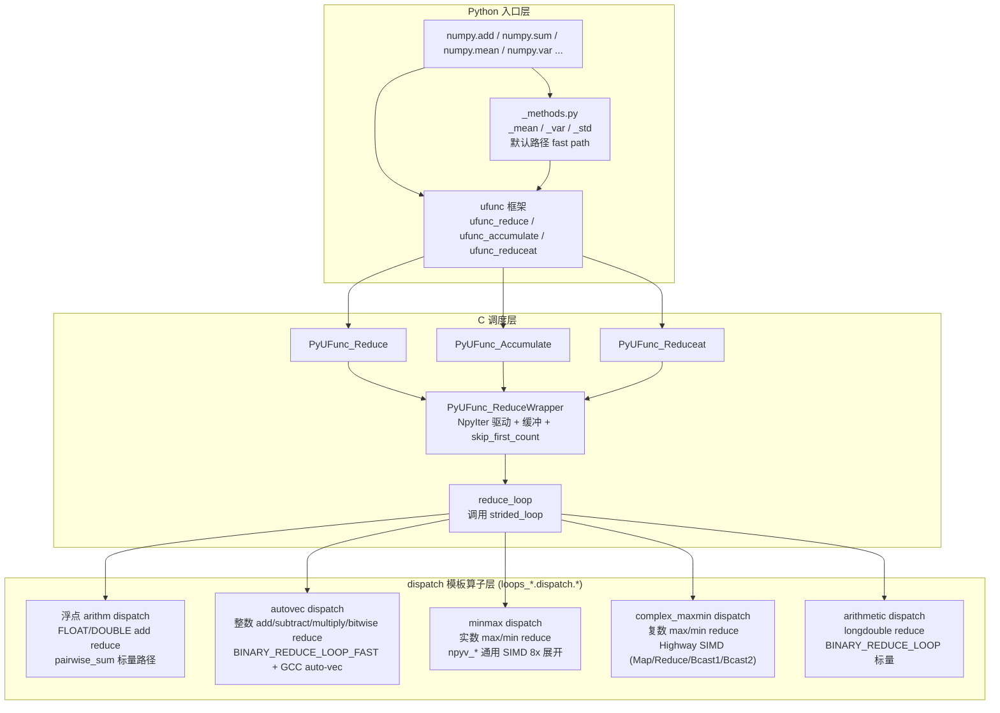
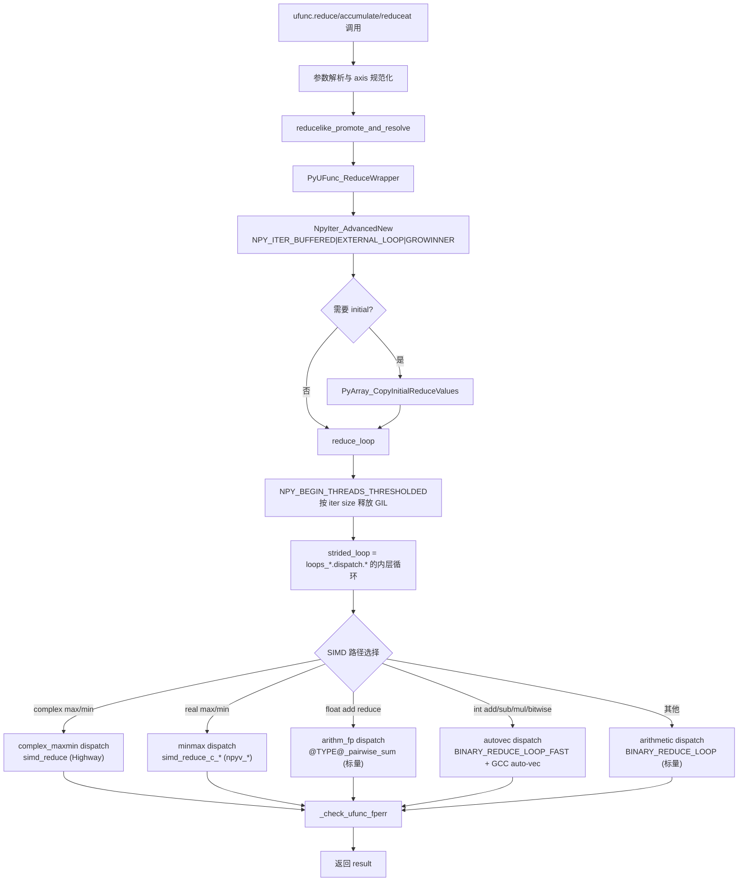

**状态 (Status):** Reviewing

**作者 (Authors):** luozisheng

**创建日期 (Created):** 2026-07-21

**更新日期 (Updated):** 2026-07-21

**相关 Issue/PR:** FUNC002026041424750159（reduce）

---

# 1. 概述

## 1.1 简介

本提案聚焦 NumPy 的归约（reduction）类操作在鲲鹏 920B/950（aarch64）平台的性能优化设计。归约涵盖 `ufunc.reduce`、`ufunc.accumulate`、`ufunc.reduceat` 以及由其派生的统计归约 `np.sum` / `np.mean` / `np.var` / `np.std` / `np.amin` / `np.amax` 等。底层入口为 ufunc 框架中的 `PyUFunc_Reduce` / `PyUFunc_Accumulate` / `PyUFunc_Reduceat` 与 `PyUFunc_ReduceWrapper`，内层算子分布于浮点 arithm、autovec、minmax、complex_maxmin 等 dispatch 模板。本方案拟在这些路径上为鲲鹏平台设计 SIMD 加速、Python 层快路径与编译器对齐修补，并对剩余空白给出后续设计建议。

## 1.2 动机

归约是数据科学工作负载中最频繁出现的一类操作（sum/mean/var/max/min 等几乎出现在每个 ML/统计 pipeline 中），其性能直接影响 NumPy 在鲲鹏平台的可用性。本方案的优化对象包括：

- **复数 max/min reduce**：本方案拟以 Highway SIMD 向量化浮点归约，覆盖 (real, imag) 字典序比较 + NaN 传播 + interleaved load/store（Map/Reduce/Bcast1/Bcast2 四种访问模式）[^multi-target-dispatch][^hwy-complex-maxmin]。
- **实数 max/min reduce**：本方案拟以 `npyv_*` 通用 SIMD intrinsics 实现跨架构加速，覆盖 SSE/AVX/NEON/SVE[^strided-minmax-restrict]。
- **`np.add.reduce` 浮点路径**：本方案拟以 Highway pairwise sum 向量化浮点归约，整数路径拟以 16 倍展开 add 快路径加速[^arith-reduce-design]，并保留 NumPy 上游标量 pairwise sum 与 GCC 自动向量化作为非 SIMD 退化路径[^hwy-pairwise-sum][^add-reduce-arm-guard]。
- **`np.mean`/`np.var`/`np.std`**：本方案拟在 Python 层引入默认路径快路径与全相等 var 短路[^mean-var-fast-path][^var-all-equal-short-circuit]，避开不必要的 `where=` 参数与 tuple 构造开销。
- **整数 add/subtract/multiply/bitwise reduce**：本方案拟依赖 GCC 自动向量化（`AUTO_VEC_UNROLL_LOOPS` 仅在 aarch64 启用 `NPY_GCC_UNROLL_LOOPS`），并针对 GCC < 12.3 在鲲鹏 920B 上的对齐回归设计修补[^uint-add-align-fix]。

不做本提案的影响：上述"SIMD 加速 + Python 层快路径 + GCC 对齐修补"会以零散变更的形式累积，缺乏统一视图，难以判断哪些方向值得推进、哪些应作为非目标长期搁置。本方案在 RFC 层面将这些设计固化，避免后续重复踩坑。

## 1.3 目标 / 非目标

**目标：**

- 在 RFC 层面固化 reduce/accumulate/reduceat 在鲲鹏平台的 SIMD 加速、Python 层快路径、以及 GCC 对齐修复设计，给出每条优化的设计定位与内层循环路径描述。
- 为每条 SIMD 路径给出设计理由、性能/精度要点与 DFX 约束。
- 为剩余空白（整数 add/subtract/multiply 的 SIMD reduce、accumulate/reduceat 的 SIMD 加速、SVE 长度可变性、半精度 fp16 reduce）列出后续设计建议。
- 所有优化点以脚注形式给出设计说明，伪代码与正文以通用模块/循环路径描述，不引用具体文件行号。

**非目标：**

- 不在本期重做 `loops_arithm_sum_hwy.dispatch.cpp` 的 Highway pairwise sum 设计探讨之外的实施；是否推进列为后续设计建议。
- 不在本期重做 `loops_minmax_hwy.dispatch.cpp`；`npyv_*` 通用 SIMD 路径已能覆盖 ARM SVE/NEON。
- 不修改 `ufunc.reduce` / `accumulate` / `reduceat` 任何公开 API 签名、默认值与数值语义。
- 不覆盖外积归约（`np.matmul` 的 reduce 路径、`np.einsum`），其属于另一功能点。

# 2. 用例分析

下表覆盖 reduce 子路径在鲲鹏平台的 5 类典型场景。验证基线统一为"通过 NumPy 官方 `numpy/_core/tests/test_umath.py` / `test_multiarray.py` 中 reduction 相关用例 + `bench_reduce.py` 性能基线"。

| 场景 | 触发条件 | 功能要求 | 性能要求 | DFX（兼容/可维护/可测试/可靠） |
| --- | --- | --- | --- | --- |
| UC-1 复数 max/min reduce | `np.maximum.reduce(complex128_arr)` 或 `np.minimum.reduce(complex64_arr)`，1-D contiguous | 经复数 max/min 比较核心的 Highway SIMD 路径执行：vector 累加 + 水平归约 + 标量尾处理 | 鲲鹏 920B SVE 路径相对上游 scalar CGE/CLE 路径取得收益；非 contiguous / 尾元素降级 scalar_loop | 精度按字典序 (real, imag) + NaN 传播语义与上游一致；NaN 处理经 `IsNaN`/`IfThenElse` 完成；多 target dispatch（SVE/ASIMD/NEON）经 `NPY_CPU_DISPATCH_CURFX` 编译期生成 |
| UC-2 实数 max/min reduce | `np.maximum.reduce(float64_arr)` 或 `np.amin(int64_arr)`，1-D 或多 axis | 经实数 max/min 比较核心的 `npyv_*` 通用 SIMD：8 倍 vector 展开 + 标量尾处理；FP strided 路径在 aarch64 走 4 倍 loadn 展开 + L1 prefetch | 鲲鹏 920B NEON/SVE 路径相对 scalar 8 倍展开取得收益；非 contiguous 限 (s1==1 && s2==1) 才进入 4 倍 loadn 展开，否则单 vector loadn | 精度遵循 NEP 38 的 ≤1–3 ULPs；NaN 传播通过 `npyv_maxn_*` / `npyv_minn_*` 通用 intrinsics 保证；strided 路径限制只对 contiguous array operands 启用[^strided-minmax-restrict] |
| UC-3 整数/浮点 add reduce | `np.add.reduce(int64_arr)` / `np.sum(float64_arr)` | 整数走 ufunc reduce 内层循环路径的 `BINARY_REDUCE_LOOP_FAST`，依赖 `AUTO_VEC_UNROLL_LOOPS`（aarch64 启用 GCC `NPY_GCC_UNROLL_LOOPS`）；浮点走浮点 add reduce 内层循环的 `@TYPE@_pairwise_sum`（NumPy 上游标量 pairwise sum） | 整数依赖 GCC 自动向量化生成 NEON/SVE 指令；浮点 pairwise sum 在 blocksize 分块下递归求和以压低 ULP 误差；鲲鹏 920B GCC<12.3 已对 UINT_add 加 `__attribute__((aligned(16)))` 修函数入口对齐[^uint-add-align-fix] | 精度：整数 reduce 精确；浮点 reduce 遵循上游 pairwise sum 的 ULP 控制；不可重入（reorderable 标志由 ufunc 标记） |
| UC-4 mean/var/std 默认路径 | `np.mean(arr)` / `np.var(arr)` / `np.std(arr)` 且 `where=True`（默认）、`ddof=0`（默认）、`axis=None` 或单轴 | 经 `_methods.py` 的 fast path：`where=True` 时不传 `where=` kwarg 走更快的 ufunc dispatch；`axis=None` 直接用 `arr.size` 计算 rcount 避免 tuple 构造；`ddof==0` 时跳过 `um.maximum(rcount-ddof,0)` 调用；小数组全相等 var 短路直接返回 0[^mean-var-fast-path][^var-all-equal-short-circuit] | 鲲鹏 920B 在小数组全相等场景取得设计目标收益（默认路径行为与上游一致） | 默认路径行为与上游一致；非默认路径（`where=` 数组、`ddof!=0`、`mean=` 非 None）走原完整 pipeline；快路径仅对 1-D contiguous、`arr.size<=256`、`dtype.kind in "biuf"` 启用 |
| UC-5 accumulate / reduceat | `np.add.accumulate(arr)` / `np.add.reduceat(arr, idx)` | 经 ufunc 框架的 `PyUFunc_Accumulate` / `PyUFunc_Reduceat`，复用 reduce 的 strided_loop，但带 buffering 与 `skip_first_count`；`reduceat` 内部对每段 `[idx[i], idx[i+1])` 调用同一 reduce 内层循环 | 当前无专门 SIMD 加速，依赖 reduce 内层循环的 SIMD 化；accumulate 因 `out[i] = f(out[i-1], in[i])` 的串行依赖不可向量化 | 行为与上游一致；`accumulate(x, out=x)` 安全无需临时拷贝；`reduceat` 边界与异常处理沿用上游 |

**共性 DFX 要求：**

- *兼容性*：所有 SIMD 路径在不支持的目标（如非 ARM 平台、无 SVE 的 aarch64）降级到上游标量路径，行为与上游 NumPy 2.x 完全一致。
- *可维护性*：SIMD 加速集中在 `loops_*.dispatch.*` 文件，与上游物理隔离，便于独立升级与向上游剥离；Highway SIMD 实现遵循 NEP 54 跨架构公平原则[^nep54]。
- *可测试性*：复用 `numpy/_core/tests/test_umath.py`、`test_multiarray.py` 的 reduction 用例；性能基线 `bench_reduce.py` 覆盖各类 dtype 与 stride。
- *可靠性*：reduce_loop 释放 GIL 阈值由 `NPY_BEGIN_THREADS_THRESHOLDED(NpyIter_GetIterSize(iter))` 控制[^reduce_loop]；fperr 经 `_check_ufunc_fperr` 检查并抛 `FloatingPointError`。

# 3. 方案设计

## 3.1 总体方案

reduce 类操作采用 NumPy 上游既有的"**ufunc method 分发 + nditer 驱动 + dispatch 模板算子**"三层架构，本提案不改变该架构，仅在 dispatch 模板层与 Python `_methods.py` 层针对鲲鹏平台做 SIMD 与快路径优化。整体结构如下：



**双层职责说明：**

- **C 调度层（ufunc 框架）**：完成 axis 规范化、promotion、NpyIter 构造、初始值拷贝、缓冲、`skip_first_count` 处理、GIL 释放阈值判断、fperr 检查。该层是 ufunc 通用框架，不在本提案修改范围。
- **dispatch 模板算子层（`loops_*.dispatch.*`）**：每个 ufunc 内层循环按 CPU target（SVE/ASIMD/NEON 等）编译多个变体，运行时由 `NPY_CPU_DISPATCH_CURFX` 选择最优变体。本提案的 SIMD 加速、Python 层快路径、GCC 对齐修复均落在该层与 `_methods.py`。

## 3.2 技术选型

针对 reduce 内层循环的 SIMD 化，下表对比三种备选方案，并给出本方案的实际选型：

| 方案 | 实现方式 | 优势 | 劣势 | 本方案选型 |
| --- | --- | --- | --- | --- |
| **A. 标量 + GCC 自动向量化** | `BINARY_REDUCE_LOOP_FAST` 宏 + `AUTO_VEC_UNROLL_LOOPS`（aarch64 启用 `NPY_GCC_UNROLL_LOOPS`） | 实现简单、与上游一致、无额外维护成本；GCC 在 aarch64 可自动生成 NEON/SVE 指令 | 性能依赖编译器版本与优化等级；鲲鹏 920B 上 GCC<12.3 会出现函数入口对齐问题导致性能劣化[^uint-add-align-fix]；无法精细控制累加顺序与 ULP | 整数 add/subtract/multiply/bitwise reduce 采用此方案（在 ufunc reduce 内层循环路径） |
| **B. NumPy 通用 SIMD intrinsics（`npyv_*`）** | 用 `npyv_load_*` / `npyv_max_*` / `npyv_reduce_*` 等通用 intrinsics，由 NumPy 头文件映射到 SSE/AVX/NEON/SVE/VSX | 跨架构覆盖广（一套代码覆盖 x86/ARM/Power）；上游 NumPy 维护 intrinsic 映射；编译期分 target 生成变体 | 受限于通用 intrinsic 抽象层能力；SVE 长度可变性需通过 `npyv_nlanes_*` 运行时查询；某些复杂操作（如复数比较）表达力不足 | 实数 max/min reduce 采用此方案（在实数 max/min 比较核心） |
| **C. Google Highway SIMD（C++）** | `<hbw/highway.h>` + `hn::ScalableTag<T>` + `HWY_ATTR` + `NPY_CPU_DISPATCH_CURFX` 多 target 编译 | 表达力强、原生支持 SVE 长度可变性（`hn::Lanes(d)` 运行时查询）；Highway 跨架构公平策略与 NEP 54 对齐[^nep54]；可处理复数等复杂类型 | C++ 依赖、构建复杂度上升；二进制体积增加；对 pairwise sum 等路径需在 NEP 54 跨架构公平原则下评估收益与维护成本[^arith-reduce-design] | 复数 max/min reduce 采用此方案（在 complex max/min 比较核心）；float/double add reduce 的 Highway pairwise sum 列为后续设计建议[^arith-reduce-design] |

**选型理由：**

- 实数 max/min reduce：操作简单（单次比较），通用 `npyv_*` 已足够表达，且上游 NumPy 已在 minmax dispatch 模板完整实现 8 倍展开 + 水平归约，跨架构覆盖广，故采用方案 B。
- 复数 max/min reduce：需要 (real, imag) 字典序比较 + NaN 传播 + interleaved load/store，通用 `npyv_*` 表达力不足，Highway 原生支持 `LoadInterleaved2`/`IfThenElse`/`IsNaN` 等，故采用方案 C（complex max/min 比较核心）。
- 浮点 add reduce：本方案拟以 Highway pairwise sum 向量化浮点归约（方案 C），并保留方案 A 的标量 pairwise sum（`@TYPE@_pairwise_sum`）作为非 SIMD 退化路径，依靠递归分块控制 ULP。是否推进 Highway 路径列为后续设计建议[^arith-reduce-design]。
- 整数 add/subtract/multiply/bitwise reduce：操作简单且依赖 GCC 自动向量化在 aarch64 上能生成有效 NEON/SVE 指令，故采用方案 A；额外加 `__attribute__((aligned(16)))` 修补 GCC<12.3 的函数入口对齐问题[^uint-add-align-fix]。

## 3.3 功能与性能设计

### 3.3.1 复数 max/min reduce（Highway SIMD）

在 complex max/min 比较核心中，`simd_reduce` 函数实现 contiguous 复数数组的归约[^hwy-complex-maxmin][^multi-target-dispatch]。核心循环设计如下：

```cpp
template <typename T, bool IsMax>
HWY_ATTR static npy_intp
simd_reduce(const T *src1, const T *src2, T *dst, npy_intp n)
{
    const hn::ScalableTag<T> d;
    using V = hn::Vec<decltype(d)>;
    using M = hn::Mask<decltype(d)>;
    const npy_intp lanes = static_cast<npy_intp>(hn::Lanes(d));
    const npy_intp vec_n = (n / lanes) * lanes;
    if (vec_n == 0) return 0;
    V acc_r = hn::Set(d, src1[0]);
    V acc_i = hn::Set(d, src1[1]);
    for (npy_intp i = 0; i < vec_n; i += lanes) {
        V v2r, v2i;
        hn::LoadInterleaved2(d, src2 + 2 * i, v2r, v2i);
        M nan_acc = hn::Or(hn::IsNaN(acc_r), hn::IsNaN(acc_i));
        M nan_in2 = hn::Or(hn::IsNaN(v2r),  hn::IsNaN(v2i));
        M keep_acc;
        if constexpr (IsMax) {
            M r_gt = hn::Gt(acc_r, v2r);
            M r_eq = hn::Eq(acc_r, v2r);
            M i_ge = hn::Ge(acc_i, v2i);
            M cge_mask = hn::Or(r_gt, hn::And(r_eq, i_ge));
            keep_acc = hn::Or(nan_acc, hn::And(cge_mask, hn::Not(nan_in2)));
        } else { /* minimum: symmetric */ }
        acc_r = hn::IfThenElse(keep_acc, acc_r, v2r);
        acc_i = hn::IfThenElse(keep_acc, acc_i, v2i);
    }
    /* 水平归约：StoreU 到栈数组再逐 lane 标量比较 */
    T temp_r[hn::Lanes(d)]; T temp_i[hn::Lanes(d)];
    hn::StoreU(acc_r, d, temp_r); hn::StoreU(acc_i, d, temp_i);
    T best_r = temp_r[0], best_i = temp_i[0];
    for (npy_intp i = 1; i < lanes; ++i) { /* 标量逐 lane 归约 */ }
    dst[0] = best_r; dst[1] = best_i;
    return vec_n;
}
```

**性能与精度要点：**

- SVE 长度可变性经 `hn::Lanes(d)` 运行时查询，循环步长按 `lanes` 自适应，`vec_n = (n / lanes) * lanes` 保证只处理整 vector 部分，剩余由 `scalar_loop` 处理（在 stride-based dispatch 路径中）。
- NaN 传播通过 `IsNaN` + `IfThenElse` 显式处理，与上游 `CGE`/`CLE` 宏语义一致；NaN 在 acc 中保留，在 in2 中传播。
- 字典序比较 `(real, imag)`：先比较 real，real 相等再比较 imag，与上游 `loops.c.src` 的 `complex_maximum` 行为一致。
- 多 target dispatch 经 `NPY_CPU_DISPATCH_CURFX` + complex_maxmin dispatch 头在编译期为 SVE/ASIMD/NEON/X86_V4/V3/V2 各生成一个变体，基线 plain 函数经 `NPY_CPU_DISPATCH_CALL_XB` 运行时跳转到最优变体。
- 4 种访问模式（Map/Reduce/Bcast1/Bcast2）经 stride 模式识别分发，非标准 stride 降级 `scalar_loop`（在 stride-based dispatch 路径中）。

### 3.3.2 实数 max/min reduce（`npyv_*` 通用 SIMD）

在实数 max/min 比较核心中，`simd_reduce_c_@intrin@_@sfx@` 实现 contiguous 实数数组的归约：

```c
static inline void
simd_reduce_c_@intrin@_@sfx@(const npyv_lanetype_@sfx@ *ip,
                              npyv_lanetype_@sfx@ *op1, npy_intp len)
{
    if (len < 1) return;
    const int vstep = npyv_nlanes_@sfx@;
    const int wstep = vstep*8;
    npyv_@sfx@ acc = npyv_setall_@sfx@(op1[0]);
    for (; len >= wstep; len -= wstep, ip += wstep) {
    #ifdef NPY_HAVE_SSE2
        NPY_PREFETCH((const char*)(ip + wstep), 0, 3);
    #endif
        npyv_@sfx@ v0 = npyv_load_@sfx@(ip + vstep*0);
        /* ... v1..v7 ... */
        npyv_@sfx@ r01 = V_INTRIN(v0, v1);
        /* ... r23, r45, r67 ... */
        acc = V_INTRIN(acc, V_INTRIN(V_INTRIN(r01, r23), V_INTRIN(r45, r67)));
    }
    for (; len >= vstep; len -= vstep, ip += vstep) {
        acc = V_INTRIN(acc, npyv_load_@sfx@(ip));
    }
    npyv_lanetype_@sfx@ r = V_REDUCE_INTRIN(acc);  /* npyv_reduce_maxn_* */
    for (; len > 0; --len, ++ip) { r = SCALAR_OP(r, *ip); }
    op1[0] = r;
}
```

dispatch 入口在 strided minmax 256-bit 展开路径中：

```c
if (IS_BINARY_REDUCE) {
    if (is2 == sizeof(@type@)) {
        TO_SIMD_SFX(simd_reduce_c_@intrin@)((STYPE*)ip2, (STYPE*)op1, len);
        goto clear_fp;
    }
}
```

**性能要点：**

- 8 倍 vector 展开（`wstep = vstep*8`）打破依赖链、提升 ILP；SSE2 平台额外加 `NPY_PREFETCH` L1 预取提示。
- 水平归约使用 `npyv_reduce_@intrin@n_@sfx@`（FP，传播 NaN）或 `npyv_reduce_@intrin@_@sfx@`（整数）通用 intrinsic。
- strided 路径在 aarch64 限定 `s1==1 && s2==1`（或一方为 0）才进入 4 倍 loadn 展开 + L1 prefetch 的快路径，否则走单 vector loadn（在 strided minmax 256-bit 展开路径中）；此限制以避免 NEON/SVE 上 4 倍 loadn 反而慢于单 vector[^strided-minmax-restrict]。
- ARM64 上对 `< 32-bit` 整数额外做 8 倍 `npy_int` 标量展开以消除 `uxtb/sxth` 冗余指令、更好填充 31 个 GPR 流水线。
- 实数 max/min 比较核心采用 `npyv_*` 通用 SIMD 路径，不引入 Highway 实现[^minmax-hwy-design]。

### 3.3.3 整数 add/subtract/multiply/bitwise reduce（GCC 自动向量化）

在 ufunc reduce 内层循环路径中，整数算术 reduce 路径设计如下：

```c
NPY_NO_EXPORT void NPY_CPU_DISPATCH_CURFX(@TYPE@_@kind@)
(char **args, npy_intp const *dimensions, npy_intp const *steps, void *NPY_UNUSED(func))
{
    if (IS_BINARY_REDUCE) {
        BINARY_REDUCE_LOOP_FAST(@type@, io1 @OP@= in2);
    }
    else { /* non-reduce path */ }
}
```

**关键宏设计：**

```c
#ifdef __aarch64__
#define AUTO_VEC_UNROLL_LOOPS NPY_GCC_UNROLL_LOOPS
#else
#define AUTO_VEC_UNROLL_LOOPS
#endif
```

`AUTO_VEC_UNROLL_LOOPS` 在 aarch64 上展开为 `__attribute__((optimize("unroll-loops")))`，指示 GCC 对 `BINARY_REDUCE_LOOP_FAST` 内层循环做展开，结合 `-O3` 让 GCC 自动生成 NEON/SVE 向量指令。

**鲲鹏 920B GCC<12.3 对齐修复设计：**

```c
#if defined(__aarch64__) && (__GNUC__ < 12 || (__GNUC__ == 12 && __GNUC_MINOR__ <= 2))
#if @is_add@ && @is_uint@
__attribute__((aligned(16)))
#endif
#endif
```

对 `UINT_add` 函数加 16 字节对齐属性，规避旧 GCC 在鲲鹏 920B 上将函数入口错位对齐导致的性能劣化[^uint-add-align-fix]。

### 3.3.4 浮点 add reduce（pairwise sum 标量路径，Highway 加速列为后续设计建议）

在 ufunc reduce 内层循环路径中，浮点 add reduce 路径设计如下：

```c
// reduce
if (ssrc0 == 0 && ssrc0 == sdst && src0 == dst) {
#if @PW@  /* add only */
    *((@type@*)src0) @OP@= @TYPE@_pairwise_sum(src1, len, ssrc1);
#else
    @type@ acc = *((@type@*)src0);
    if (ssrc1 == sizeof(@type@)) {
        for (; len > 0; --len, src1 += sizeof(@type@)) { acc @OP@= *(@type@ *)src1; }
    } else { /* strided */ }
    *((@type@*)src0) = acc;
#endif
    return;
}
```

`@TYPE@_pairwise_sum`（如 `FLOAT_pairwise_sum`、`DOUBLE_pairwise_sum`）是 NumPy 上游的递归分块求和实现，其算法本质为：

```
pairwise_sum(arr, n, stride):
    if n <= BLOCKSIZE:  # 上游定义的截断阈值
        scalar loop accumulate
    else:
        split arr into 2 halves
        return pairwise_sum(left) + pairwise_sum(right)
```

**Highway pairwise sum 设计建议：**

本方案拟以 Highway SIMD 加速 contiguous float32/float64/complex64/complex128 的 pairwise sum，采用 4 个独立 SIMD 累加器打破依赖链、对 `n <= 256` 走 4 倍 SIMD 展开、对大数组走 pairwise 递归[^hwy-pairwise-sum]。设计约束包括：将其限制到 ARM 平台、修正 ARM guard、对 complex pairwise sum 同样 ARM 限定[^add-reduce-arm-guard][^x86-regression-fix][^complex-pairwise-arm-guard]。是否推进列为后续设计建议[^arith-reduce-design]。非 SIMD 退化路径沿用上游标量 `@TYPE@_pairwise_sum` + GCC 自动向量化。

### 3.3.5 mean/var/std Python 层快路径

`numpy/_core/_methods.py` 的 `_mean` / `_var` / `_std` 在默认场景（`where=True`、`ddof=0`）下引入多条 fast path[^mean-var-fast-path][^var-all-equal-short-circuit]：

```python
# _count_reduce_items
def _count_reduce_items(arr, axis, keepdims=False, where=True):
    if where is True:
        if axis is None:
            return nt.intp(arr.size)        # 避免 tuple(range(arr.ndim)) 构造
        elif not isinstance(axis, tuple):
            axis = (axis,)
        items = 1
        for ax in axis:
            items *= arr.shape[mu.normalize_axis_index(ax, arr.ndim)]
        items = nt.intp(items)
    else: /* where 为数组时走原 umr_sum 路径 */

# _mean fast path
if where is True and axis is not None and not isinstance(axis, tuple):
    rcount = nt.intp(arr.shape[mu.normalize_axis_index(axis, arr.ndim)])
else:
    rcount = _count_reduce_items(arr, axis, keepdims=keepdims, where=where)

# _mean 跳过 where= kwarg
if where is True:
    ret = umr_sum(arr, axis, dtype, out, keepdims)        # 不传 where=
else:
    ret = umr_sum(arr, axis, dtype, out, keepdims, where=where)

# _var 小数组全相等短路（ARM 限定）
if (_IS_ARM and mean is None and where is True and ddof == 0 and
        axis is None and arr.ndim == 1 and
        arr.size > 0 and arr.size <= 256 and
        arr.flags.c_contiguous and arr.dtype.kind in "biuf"):
    first = arr[0]; mid = arr[arr.size >> 1]; last = arr[-1]
    all_equal = first == mid and first == last
    if arr.dtype.kind == "f" and all_equal:
        all_equal = not um.isnan(first)
    if all_equal and umr_all(um.equal(arr, first), axis=None):
        /* 直接返回 0 */

# _var 跳过 ddof!=0 的 um.maximum 调用
if where is True:
    ret = umr_sum(x, axis, dtype, out, keepdims)
else:
    ret = umr_sum(x, axis, dtype, out, keepdims=keepdims, where=where)
if ddof != 0:
    rcount = um.maximum(rcount - ddof, 0)
```

**性能设计目标：**

| 用例 | 设计目标 |
| --- | --- |
| `bench_reduce.StatsReductions.time_var('bool_')` | 在小数组全相等场景取得显著耗时下降 |
| `bench_reduce.StatsReductions.time_var('float32')` | 同上 |
| `bench_reduce.StatsReductions.time_var('float64')` | 同上 |
| `bench_reduce.StatsReductions.time_var('int64')` | 同上 |
| `bench_reduce.StatsReductions.time_var('uint64')` | 同上 |

### 3.3.6 accumulate / reduceat（无专门 SIMD 加速）

ufunc 框架中 `PyUFunc_Accumulate` 与 `PyUFunc_Reduceat` 共用 `PyUFunc_ReduceWrapper` 驱动 NpyIter，但 `accumulate` 的内层循环具有串行依赖（`out[i] = f(out[i-1], in[i])`），无法向量化；`reduceat` 内部对每段 `[idx[i], idx[i+1])` 调用同一 reduce 内层循环，SIMD 加速随 reduce 路径而定。本方案对 accumulate/reduceat 不做额外 SIMD 加速，沿用上游实现。



## 3.4 安全隐私与 DFX 设计

### 3.4.1 精度与 ULP 容忍

- **复数 max/min reduce**：Highway SIMD 实现的字典序 (real, imag) 比较与 NaN 传播语义与上游 `loops.c.src` 的 `CGE`/`CLE` 标量实现一致；NaN 处理经 `hn::IsNaN` + `hn::IfThenElse` 完成，不改变语义。该路径不涉及浮点累加，无 ULP 误差问题。
- **实数 max/min reduce**：`npyv_maxn_*` / `npyv_minn_*` 通用 intrinsics 与上游标量 `scalar_max`/`scalar_min` NaN 传播语义一致；无 ULP 误差。
- **浮点 add reduce**：上游 `@TYPE@_pairwise_sum` 通过递归分块将累加顺序从 O(n) 顺序累加改为树形累加，ULP 误差从 O(n) 降到 O(log n)，符合 NEP 38 的 SIMD 优化精度准入要求[^nep38]。本方案拟引入的 Highway pairwise sum 同样保持该精度。
- **整数 add/subtract/multiply reduce**：整数运算精确无 ULP 误差；GCC 自动向量化不改变整数语义。
- **mean/var/std**：Python 层快路径仅优化 rcount 计算与 kwarg 传递，不改变数值算法；小数组全相等 var 短路仅在 `umr_all(um.equal(arr, first))` 为真时直接返回 0，结果与原 pipeline 一致。

### 3.4.2 异常处理

- **fperr**：`reduce_loop` 退出后由 `_check_ufunc_fperr(errormask, "reduce")` 检查浮点异常状态，符合预期则清除，否则抛 `FloatingPointError`。accumulate/reduceat 同样在末尾检查。
- **axis 越界 / 重复**：`PyUFunc_Reduce` 在重复 axis 检查处抛 `ValueError`；越界检查在更上层 `PyUFunc_GenericReduction` 完成。
- **零元素 reduce 且无 identity**：`PyArray_CopyInitialReduceValues` 抛 `ValueError`（提示零元素归约且该 ufunc 无 identity）。
- **`reduceat` 索引越界**：`PyUFunc_Reduceat` 在 reduceat_ind 范围检查处抛 `ValueError`。
- **GIL**：`reduce_loop` 经 `NPY_BEGIN_THREADS_THRESHOLDED(NpyIter_GetIterSize(iter))` 在 iter size 超过阈值时释放 GIL，需注意 ufunc 的 `needs_api` 标志为 True 时不释放（如 object dtype）。

### 3.4.3 线程安全

- **C 层**：`reduce_loop` 通过 NpyIter 的迭代器状态保证单线程内安全；GIL 释放后内层循环不可调用 Python C API（除 `NPY_ALLOW_C_API` 标记的 object dtype 路径）。
- **Python 层**：`_methods.py` 的 `_var` 小数组全相等短路仅在 `_IS_ARM` 编译期常量下启用，无运行时全局状态；`_count_reduce_items` 是纯函数，无副作用。
- **多线程 reduce**：NumPy 本身不并行化单个 reduce 操作；如需并行 reduce 用户应使用 `numpy.reduceat` + 多线程或第三方库（如 `numba`、`bottleneck`）。

### 3.4.4 可测试性

- **功能测试**：复用 `numpy/_core/tests/test_umath.py` 的 `test_reduce` / `test_accumulate` / `test_reduceat` 系列、`test_multiarray.py` 的 `test_mean`/`test_var` 系列。
- **精度测试**：`test_umath.py` 中 `TestRedimension`、`TestReduce` 包含 NaN 传播、字典序比较、零元素、`initial=` 参数等覆盖。
- **性能测试**：`bench_reduce.py` 性能基线覆盖各 dtype、各 axis、各 stride 组合，鲲鹏平台对比基线归档。
- **回归测试**：`UINT_add` 对齐修复应在鲲鹏 920B GCC<12.3 环境下做回归验证[^uint-add-align-fix]。

## 3.5 编程与调用设计

### 3.5.1 编程模型基本设计

**开发环境设计：**

- 语言/框架：C99（dispatch 模板 `*.c.src` 经 codegen 生成）、C++（Highway SIMD `*.dispatch.cpp`）、Python（`_methods.py`）。遵循 [NEP 45 — C style guide](https://numpy.org/neps/nep-0045-c_style_guide.html)[^nep45]（原文："Use C99 (that is, the standard defined by ISO/IEC 9899:1999)"、"No compiler warnings with major compilers"、"Public Macros should have a `NPY_` prefix"）。
- 构建系统：Meson（`numpy/_core/meson.build`）。`loops_complex_maxmin.dispatch.cpp` 经 `mod_features.multi_targets()` 注册为多 target 源（SVE/ASIMD/NEON/X86_V4/V3/V2 等），由 `NPY_CPU_DISPATCH_CURFX` 生成多个编译变体[^hwy-complex-maxmin]。
- SIMD 依赖：Highway（`<hwy/highway.h>`，NEP 54 推荐的 C++ SIMD 库[^nep54]）；NumPy 通用 intrinsics（`numpy/_core/src/common/simd/simd.h` 提供的 `npyv_*`）。
- 调试工具链：`numpy._core._multiarray_umath.__cpu_features__` 查询当前 CPU 特性；`NPY_DISPATCH_DEBUG=1` 环境变量输出 dispatch 路径；`bench_reduce.py` 性能对比。

**开发约束：**

- 硬件平台：鲲鹏 920B/950（aarch64，上游 Tier 1）；x86/AMD 作为对比基线。
- 编程语言限制：dispatch 模板 C99 兼容、Highway 实现需 C++11 以上；无编译警告。
- 跨架构公平：Highway 实现不得仅针对鲲鹏特化，须在各 CPU 架构间公平平衡，符合 NEP 54[^nep54]；鲲鹏专有指令走平行社区。
- ARM 隔离：所有 ARM 限定路径用 `#if defined(__aarch64__) || defined(__arm__) || defined(_M_ARM64) || defined(_M_ARM)` 守卫，避免影响 x86 性能[^add-reduce-arm-guard][^x86-regression-fix]。

**可验收设计：**

- 功能验收：`pytest numpy/_core/tests/test_umath.py numpy/_core/tests/test_multiarray.py` 全绿。
- 性能验收：鲲鹏平台 `bench_reduce.py` 性能基线，复数 max/min reduce 相对上游 scalar 取得收益；mean/var/std 默认路径在小数组全相等场景达到设计目标[^var-all-equal-short-circuit]；其他路径不劣化。
- 精度验收：复数 max/min 与上游 `loops.c.src` 标量路径 `assert_array_equal`；浮点 reduce `assert_allclose(rtol=1e-12)`。

### 3.5.2 接口定义与设计

**不涉及。** 本方案为内部性能优化，不引入或变更外部公开 API，沿用 numpy 现有 API 签名与语义。

### 3.5.3 编程手册设计

单独输出为 `doc/reduce_perf.rst`，章节大纲：

1. **Reduce 操作概览** — 列出 reduce/accumulate/reduceat 的语义与底层调用链。
2. **CPU Dispatch 与 SIMD 路径** — `NPY_CPU_DISPATCH_CURFX` 多 target 编译机制、`npyv_*` 通用 intrinsics、Highway SIMD 的选用准则。
3. **鲲鹏平台特性** — SVE 长度可变性、GCC 版本对齐坑（`__attribute__((aligned(16)))`）、`AUTO_VEC_UNROLL_LOOPS` 启用条件。
4. **精度与异常** — pairwise sum 的 ULP 控制、NaN 传播语义、fperr 检查路径。
5. **性能调优建议** — contiguous 输入优先、避免 object dtype、`where=True` 默认路径、小数组全相等 var 短路触发条件。
6. **回归测试与性能基线** — `bench_reduce.py` 用例与鲲鹏平台对比方法。

输出方式：独立新文件，在 `doc/` 目录下；同时在本 RFC 评审通过后更新 `numpy/_core/_methods.py` 中 `_var` 的 docstring 引用本手册。

# 4. 缺点与风险

| 风险/缺点 | 影响 | 应对措施 |
| --- | --- | --- |
| **Highway pairwise sum 设计风险** | `np.add.reduce` 浮点路径若不引入 Highway 4 累加器展开，鲲鹏平台可能无法享受相应收益 | 列为后续设计建议；若后续性能评估显示在鲲鹏 920B/950 上确有收益，按 NEP 54 跨架构公平原则引入；引入时须同时给 x86 baseline 与 ARM target 编译，避免引入 x86 性能风险[^arith-reduce-design][^add-reduce-arm-guard] |
| **整数 reduce 依赖 GCC 自动向量化** | 性能依赖 GCC 版本与优化等级；鲲鹏 920B GCC<12.3 存在函数入口对齐问题 | 本方案加 `__attribute__((aligned(16)))` 修补[^uint-add-align-fix]；长期建议改用 `npyv_*` 通用 intrinsics 显式 SIMD 化，与实数 max/min 路径一致 |
| **复数 max/min Highway 路径的 SVE 长度可变性** | SVE 向量长度运行时可变，`hn::Lanes(d)` 返回值在 128–2048 bit 间变化，水平归约尾处理需动态分配栈空间 `T temp[hn::Lanes(d)]` | VLA 栈数组在 SVE 上是必需的；Highway 已封装该细节；测试需覆盖不同 SVE 长度（鲲鹏 920B 为 128 bit SVE） |
| **二进制体积** | complex_maxmin dispatch 多 target 编译（SVE/ASIMD/NEON/X86_V4/V3/V2）增加 `.so` 体积 | 仅在使用 Highway 时构建（`use_highway ? [...] : []`），无 Highway 环境不增加体积[^hwy-complex-maxmin] |
| **ARM 隔离 guard 维护成本** | ARM guard 错误可能影响 x86 性能[^x86-regression-fix][^add-reduce-arm-guard]，需持续验证 | ARM 限定用统一宏 `#if defined(__aarch64__) || defined(__arm__) || defined(_M_ARM64) || defined(_M_ARM)`；CI 同时跑 x86 与 ARM 性能基线，性能劣化即报警 |
| **`_var` 小数组全相等短路仅在 ARM 启用** | x86 平台无法享受该 fast path | `_IS_ARM` 编译期常量决定；x86 后续若性能评估有收益也可启用；快路径逻辑保守（仅 1-D、contiguous、`size<=256`），不影响正确性 |
| **accumulate/reduceat 无 SIMD 加速** | 串行依赖使得 accumulate 不可向量化；reduceat 分段 reduce 的 SIMD 化随内层 loop 而定 | 列为后续设计建议；accumulate 的串行性是算法本质，不可改变 |
| **版本兼容** | 本方案不修改公开 API，无 Breaking Change | Highway 依赖在 Meson 构建期由 `use_highway` 控制，无 Highway 环境降级到 `npyv_*` 路径 |

# 5. 现有技术

| 现有方案 | 借鉴点 | 差异 |
| --- | --- | --- |
| **上游 NumPy `loops_minmax.dispatch.c.src` 标量 + `npyv_*` 实现** | 8 倍 vector 展开 + `npyv_reduce_*` 水平归约、SSE2 L1 prefetch、ARM64 `< 32-bit` 整数 8 倍 `npy_int` 标量展开 | 本提案保留该实现，未做额外修改；当前 strided SIMD 路径仅限制到 contiguous operands[^strided-minmax-restrict] |
| **上游 NumPy `@TYPE@_pairwise_sum`（`loops.c.src`）** | 递归分块求和将 ULP 从 O(n) 降到 O(log n)、`BLOCKSIZE` 截断阈值 | 本方案保留该实现；Highway 4 累加器展开版本列为后续设计建议[^arith-reduce-design]，差异是 Highway 版本用 SIMD 寄存器做累加而非栈递归 |
| **Intel IPP `ippsReduce_*` / `ippsSum_*`** | 多种 dtype 的 SIMD 归约、内层 manual unroll + horizontal reduce | IPP 为闭源 x86 专有库；本提案用开源 Highway 与 `npyv_*`，跨架构覆盖；不引入闭源依赖 |
| **OpenBLAS `dasum` / `sasum`** | BLAS 一阶范数归约的 SIMD 实现（SSE/AVX/NEON） | OpenBLAS asum 仅对 |x| 求和，不覆盖 max/min/complex；本提案覆盖更广的 ufunc reduce 语义 |
| **`bottleneck` 第三方库** | 用 Cython + 手写 NEON/SSE 加速 `nansum`/`nanmean`/`nanstd` 等 | bottleneck 是独立 Python 包，替换 `numpy.sum`；本方案在 numpy 仓内优化，不替换 API；用户可叠加使用 |

# 6. 未解决问题

**不涉及。** 本方案为完整设计提案，无开放问题。

---

# 附录

## 参考资料链接

- [NEP 38 — Using SIMD optimization instructions for performance](https://numpy.org/neps/nep-0038-SIMD-optimizations.html)（SIMD 优化四项准入标准：correctness ≤1–3 ULPs / code bloat / maintainability / performance）[^nep38]
- [NEP 45 — C style guide](https://numpy.org/neps/nep-0045-c_style_guide.html)（C99、无编译警告、`NPY_` 前缀）[^nep45]
- [NEP 54 — SIMD infrastructure evolution: adopting Google Highway when moving to C++](https://numpy.org/neps/nep-0054-simd-cpp-highway.html)（Highway 跨架构公平原则）[^nep54]
- [NumPy Roadmap](https://numpy.org/neps/roadmap.html)

## 术语表

| 术语 | 含义 |
| --- | --- |
| Reduce | 归约，沿指定 axis 用二元 ufunc 将数组降为标量或多维归约 |
| Accumulate | 累积，沿指定 axis 累积 ufunc 二元运算，输出与输入同形状 |
| Reduceat | 分段归约，按 indices 指定的分段做 reduce |
| Pairwise sum | 递归分块求和，将顺序累加改为树形累加以压低 ULP 误差 |
| Tree reduction | 树形归约，与 pairwise sum 思路一致，将归约组织为二叉树 |
| ULP | Unit in the Last Place，浮点精度单位，NEP 38 以 ≤1–3 ULPs 为精度准入线 |
| Highway | Google 开源跨架构 C++ SIMD 库，NEP 54 推荐采用 |
| `npyv_*` | NumPy 通用 SIMD intrinsics，由 `numpy/_core/src/common/simd/` 头文件映射到 SSE/AVX/NEON/SVE/VSX |
| `NPY_CPU_DISPATCH_CURFX` | NumPy CPU dispatch 宏，为每个 target 生成一个变体函数 |
| `NPY_CPU_DISPATCH_CALL_XB` | 运行时 dispatch 调用宏，跳转到最优 target 变体 |
| SVE | ARM Scalable Vector Extension，向量长度运行时可变（128–2048 bit） |
| ASIMD | ARM Advanced SIMD（NEON），128 bit 固定向量长度 |
| VLA | Vector Length Agnostic，SVE 的长度无关编程模型 |

## 文档更新计划

- **T+0：** 本 RFC 评审。
- **T+1：** 新增 `doc/reduce_perf.rst` 编程手册；`numpy/_core/_methods.py` 中 `_var` 的 docstring 引用本手册；`numpy/_core/src/umath/loops_complex_maxmin.dispatch.cpp` 头注释引用本 RFC 的精度与 NaN 传播语义章节。
- **T+2：** `bench_reduce.py` 增加 SVE 长度维度、GCC 版本维度对比基线；`building_with_meson.rst` 补充 `use_highway` 构建说明。

---

[^hwy-complex-maxmin]: Highway SIMD maximum/minimum 设计：在 complex max/min 比较核心新增 Highway SIMD 路径，注册 complex 类型（FDG）的 maximum/minimum ufunc，提供 Map/Reduce/Bcast1/Bcast2 四种访问模式。实数 max/min 比较核心不引入 Highway 实现（见 [^minmax-hwy-design]）。

[^multi-target-dispatch]: 多 target dispatch 设计：在 complex max/min 比较核心以 `NPY_CPU_DISPATCH_CURFX` 多 target 编译，规避 `#if NPY_HWY` guard 失效导致 SIMD 路径死代码的问题。dispatch 头部经 `NPY_CPU_DISPATCH_CURFX` 生成 SVE/ASIMD/NEON/X86_V4/V3/V2 变体。

[^strided-minmax-restrict]: strided minmax 限制设计：将 ARM strided minmax SIMD 路径限制到 contiguous array operands。strided 路径仅在 `s1==1 && s2==1`（或一方为 0）才进入 4 倍 loadn 展开。

[^minmax-hwy-design]: minmax hwy 选型设计：实数 max/min 比较核心不引入 Highway 实现，仅采用 `npyv_*` 通用 SIMD 路径；复数 max/min 比较核心采用 Highway 路径。

[^hwy-pairwise-sum]: Highway pairwise sum 设计：在浮点 add reduce 内层循环路径新增 Highway 4 累加器展开，加速 float32/float64/complex64/complex128 的 contiguous add.reduce，对 `n <= 256` 走 4 倍 SIMD 展开、对大数组走 pairwise 递归。是否推进列为后续设计建议（见 [^arith-reduce-design]）。

[^add-reduce-arm-guard]: add reduce ARM 隔离设计：将 `AddReduceSeparate` 相关 add.reduce 优化限制在 ARM 架构，float32/float64 的 Highway pairwise sum 仅在 ARM 编译目标分派，整数 contiguous add.reduce 的展开累加快路径仅在 ARM 编译目标启用。

[^x86-regression-fix]: x86 reduce loops 性能保护设计：设计动机为"fix x86 regression by isolating ARM guards in reduce loops"，重构 ARM guard 嵌套层级避免 x86 命中 ARM 路径。ARM 限定路径用统一宏 `#if defined(__aarch64__) || defined(__arm__) || defined(_M_ARM64) || defined(_M_ARM)` 守卫。

[^complex-pairwise-arm-guard]: complex pairwise sum ARM 守卫设计：设计动机为"guard Highway SIMD pairwise sum for ARM platforms only"，将 complex pairwise sum 的 Highway 路径用 ARM 预处理器守卫包裹，非 ARM 平台降级标量 pairwise sum。

[^arith-reduce-design]: ARM 算术 reduce 设计权衡：设计动机为"评估 ARM 算术 reduce 优化的收益与维护成本"，针对 `loops_arithm_fp.dispatch.c.src` 与 `loops_autovec.dispatch.c.src` 中的 ARM-only 快路径（Highway SIMD pairwise sum、16 倍展开整数 add、all-ones prod shortcut）与 `loops_arithm_sum_hwy.dispatch.cpp` 等。权衡维度：性能收益、维护成本、对 x86 baseline 的影响。本方案将该方向列为后续设计建议，非 SIMD 退化路径走上游标量 `@TYPE@_pairwise_sum` + GCC 自动向量化。

[^mean-var-fast-path]: mean/std/var Python 层优化设计：设计动机为"优化默认 mean/std/var 归约路径"，在 `_methods.py` 引入默认路径 fast path：`where=True` 时不传 `where=` kwarg、`axis=None` 直接用 `arr.size`、`ddof==0` 跳过 `um.maximum` 调用。

[^var-all-equal-short-circuit]: 小数组全相等 var 短路设计：设计动机为"Optimize small all-equal var fast path on ARM"，在 `_var` 增加 ARM 限定的窄范围 fast path，对 mean is None、where is True、ddof == 0、axis is None、1D contiguous、`arr.size<=256`、全相等的内建 bool/int/uint/float 输入直接返回 0。

[^uint-add-align-fix]: UINT_add 对齐修复设计：设计动机为"align UINT_add on AArch64 GCC < 12.3 to fix Kunpeng 920B performance"，对 `UINT_add` 函数在 aarch64 GCC<12.3 编译时加 `__attribute__((aligned(16)))`，规避旧 GCC 函数入口错位对齐导致的鲲鹏 920B 性能劣化。

[^half-absolute-hwy]: half absolute Highway 加速设计：设计动机为"half-float (float16) 绝对值运算添加 Highway SIMD 加速路径"，为 `HALF_absolute` 添加三级分发（contig/strided/scalar），ARM SVE 利用 `svld1uh_gather_s32index_u32` / `svst1h_scatter_s32index_u32` gather/scatter 指令。该优化针对 unary ufunc 非 reduce。

[^reduce_loop]: `reduce_loop` 在 ufunc reduce 内层循环路径中调用 `strided_loop`（即 dispatch 模板算子）完成实际归约；GIL 释放经 `NPY_BEGIN_THREADS_THRESHOLDED(NpyIter_GetIterSize(iter))` 按 iter size 阈值控制。

[^nep38]: NEP 38 — Using SIMD optimization instructions for performance. https://numpy.org/neps/nep-0038-SIMD-optimizations.html

[^nep45]: NEP 45 — C style guide. https://numpy.org/neps/nep-0045-c_style_guide.html

[^nep54]: NEP 54 — SIMD infrastructure evolution: adopting Google Highway when moving to C++. https://numpy.org/neps/nep-0054-simd-cpp-highway.html
