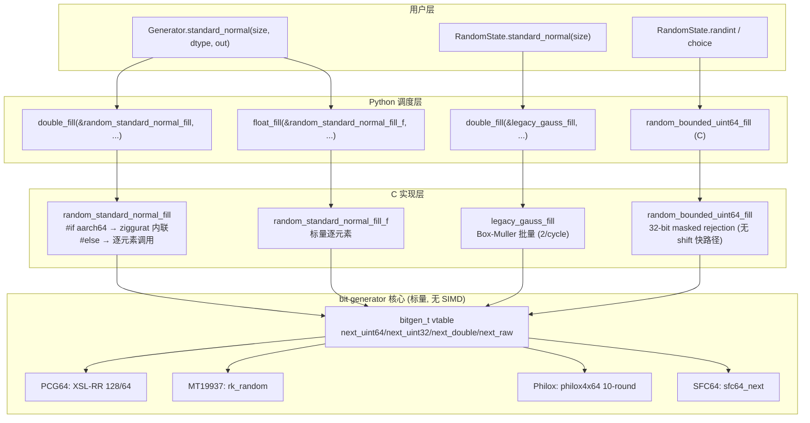
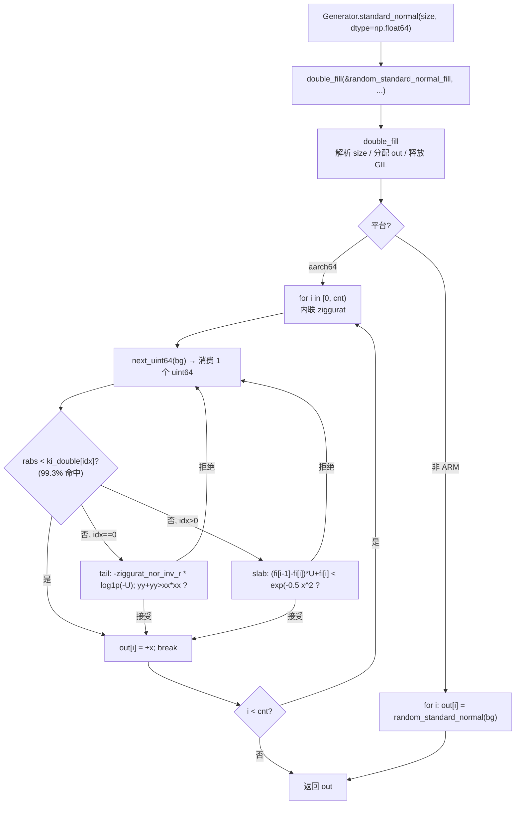

**状态 (Status):** Reviewing

**作者 (Authors):** luozisheng

**创建日期 (Created):** 2026-07-21

**更新日期 (Updated):** 2026-07-21

**相关 Issue/PR:** FUNC002026041424749869（rng）

---

# 1. 概述

## 1.1 简介

本提案针对 NumPy `numpy.random` 子系统在鲲鹏 920B / 950（aarch64）平台的批量随机数生成路径进行性能优化设计。优化边界覆盖两条路径：① 新型 `Generator` 路径下 `random_standard_normal_fill` 的 ziggurat 内联批量生成；② 旧 `RandomState` 路径下 `legacy_gauss_fill` 的 Box–Muller 批量生成。对 `random_bounded_uint64_fill` 的 32 位幂范围场景，本方案明确不引入改变 `next_uint32` 消费次数的快路径，以守护 legacy 随机流。底层 `bit_generator` 抽象（`bitgen_t` 函数指针表）与 PCG64 / MT19937 / Philox / SFC64 各核心算法维持标量实现，本期不为它们引入 SIMD。

提案遵循 [NEP 38](https://numpy.org/neps/nep-0038-SIMD-optimizations.html) 的 SIMD 优化四项准入标准（correctness ≤1–3 ULPs / code bloat / maintainability / performance）与 [NEP 54](https://numpy.org/neps/nep-0054-simd-cpp-highway.html) 的跨架构公平原则：所有 ARM 特化路径以 `#if defined(__aarch64__) || defined(__arm64__)` 静态隔离，鲲鹏特化指令不进入上游主干；通用批量内联与 Box–Muller 批处理为架构中立改动，可走上游。Python 侧 `Generator.standard_normal` / `RandomState.standard_normal` 的公开签名、默认值、dtype 支持集完全不变。

## 1.2 动机

NumPy 2.x 的 `numpy.random` 在 aarch64 平台的批量随机数生成存在两类可观测的性能空缺：

- **批量生成路径的函数调用开销**：`random_standard_normal_fill`（`Generator.standard_normal` 的 C 层入口）在 ARM 上原为 `for (i=0; i<cnt; i++) out[i] = random_standard_normal(bitgen_state);` 的逐元素调用，每次调用承担 ziggurat 函数栈帧 + `next_uint64` 间接调用 + 分支预测失败开销；在大尺寸 `standard_normal` 批量场景，循环边界检查与函数调用开销相对于标量运算占比偏高。`RandomState.standard_normal` 走 `cont(&legacy_gauss, ...)` 路径，每元素经 Python 调度层逐次回调 `legacy_gauss`，开销更甚。
- **不做此提案的影响**：在鲲鹏 920B 上，`Generator.standard_normal` 大批量场景相对充分内联的标量基线存在可观测吞吐差距；`RandomState.standard_normal` 的逐元素回调路径在大批量场景受 GIL 释放/获取与 Python 调度累积延迟影响。本方案拟消除上述空缺；对 `random_bounded_uint64_fill` 的 32 位幂范围场景，本方案明确不引入改变 `next_uint32` 消费次数的 shift 快路径，以守护 legacy `RandomState.choice` / `randint` 的历史随机流。

本提案通过**架构中立的批量内联**（ziggurat / Box–Muller 两条路径）与 **legacy 随机流硬约束**双层结构，使鲲鹏平台在 `Generator.standard_normal` / `RandomState.standard_normal` 大批量场景获得收益，同时保证 legacy 随机流语义与上游 NumPy 完全一致。

## 1.3 目标 / 非目标

**目标：**

- 在 `random_standard_normal_fill`（double 路径）内联 ziggurat 算法到批量循环，于 aarch64 平台经 `#if defined(__aarch64__) || defined(__arm64__)` 静态启用，非 ARM 平台保留逐元素 `random_standard_normal` 调用备选路径。
- 在 `legacy_gauss_fill` 提供 Box–Muller 批量生成函数（每次循环产出 2 个 deviate），供 `RandomState.standard_normal` 经 `double_fill` 批量分发调用，替换原 `cont(&legacy_gauss, ...)` 逐元素回调。
- 公开 API `Generator.standard_normal` / `RandomState.standard_normal` 的签名、默认值、dtype 支持集（`float64` / `float32`）、字节序约束完全不变。
- 明确 `random_bounded_uint64_fill` 32 位幂范围场景不引入改变 `next_uint32` 消费次数的 shift 快路径，作为后续优化不得触碰 legacy 随机流的硬约束。
- 精度一致性：批量内联路径与逐元素路径的输出序列在 bit-for-bit 一致层面与上游 NumPy 严格一致（同一 bit generator 状态机推进顺序不变）；ULP 误差为 0（同算法、同浮点运算顺序）。

**非目标（不在本次范围）：**

- 不为 PCG64 / MT19937 / Philox / SFC64 / SplitMix64 各 bit generator 核心算法引入 SIMD / SVE / Highway 向量化。
- 不优化 `random_standard_normal_fill_f`（float32 路径）、`random_standard_exponential_fill` / `_fill_f`、`random_standard_gamma` 等其他分布生成路径。
- 不优化 `_bounded_integers.pyx.in`（Lemire / masked rejection 标量实现）、`bit_generator.pyx` / `_generator.pyx` 调度层。
- 不改变 `Generator.integers` / `RandomState.randint` 在 32 位幂范围场景下的 legacy 随机流（不引入改变 `next_uint32` 消费次数的快路径）。
- 不引入新的 bit generator、不修改 `BitGenerator` 抽象基类的 capsule 接口（`bitgen_t` 的 4 个函数指针签名维持不变）。
- 不实现 `fp16`（`float16`）输出路径。

# 2. 用例分析

下表覆盖 5 类 rng 批量生成场景。验证基线统一为"通过 NumPy 官方 `numpy.random.tests/` 测试集验证各路径的随机流等价性与精度"。

| 场景 | 触发条件 | 功能要求 | 性能要求 | DFX（兼容/可维护/可测试/可靠） |
| --- | --- | --- | --- | --- |
| UC-1 `Generator.standard_normal`（float64，大批量） | `rng.standard_normal(size=N, dtype=np.float64)`，N≥1e5，平台为 aarch64 | 经 Python 调度层 `double_fill(&random_standard_normal_fill, ...)` 进入 ziggurat 内联批量循环（aarch64 路径） | 鲲鹏 920B 上相对逐元素调用基线吞吐提升，循环/调用开销占比下降 | 输出序列与逐元素路径 bit-for-bit 一致；`numpy/random/tests/test_generator.py` 全绿 |
| UC-2 `Generator.standard_normal`（float32 / 小尺寸 / 非 ARM） | `dtype=np.float32` 或平台非 aarch64 | float32 走 `float_fill(&random_standard_normal_fill_f, ...)` 进入标量循环；非 ARM 平台 `random_standard_normal_fill` 走逐元素调用备选 | 与上游 NumPy 等价（无 ARM 特化开销，无性能劣化） | 行为与上游一致；官方测试集全绿 |
| UC-3 `RandomState.standard_normal`（legacy，大批量） | `np.random.RandomState(...).standard_normal(size=N)`，N≥1e5 | `mtrand` 模块经 `double_fill(&legacy_gauss_fill, ...)` 进入 Box–Muller 批量循环，每次循环产出 2 个 deviate | 鲲鹏 920B 上相对 `cont(&legacy_gauss, ...)` 逐元素回调路径吞吐提升，Python 调度开销下降 | legacy 随机流与上游 bit-for-bit 一致（`has_gauss` 缓存语义保留）；`numpy/random/tests/test_random.py` 全绿 |
| UC-4 `RandomState.randint` / `choice`（legacy，32 位幂范围） | `RandomState.randint(0, 2**k)` 或 `RandomState.choice(4, 4)`，其中 `rng+1` 为 2 的幂 | `random_bounded_uint64_fill` 在 `rng <= 0xFFFFFFFF` 走 32 位 buffered masked rejection（`use_masked=true` 时）；**不引入** ARM shift 快路径 | 与上游行为一致，无性能劣化 | legacy 随机流严格保持：`choice(4, 4)` 输出 `[2, 3, 2, 3]`；`numpy/random/tests/test_random.py` 全绿 |
| UC-5 bit generator 核心采样（PCG64 / MT19937 / Philox / SFC64） | `rng.bit_generator.random_raw()` 或经 `next_uint64` 间接调用 | 各 bit generator 核心算法（PCG64 XSL-RR 128/64、MT19937 twist、Philox 4x64 10-round、SFC64）维持标量实现 | 与上游 NumPy 等价（无 SIMD 引入，无性能劣化） | 随机流与上游 bit-for-bit 一致；`test_randomstate_regression` / `test_generator_mt19937` / `test_philox` 等全绿 |

**共性 DFX 要求：**

- *兼容性*：非 ARM 平台与上游 NumPy 2.x 行为完全一致；ARM 启用内联路径不改变任何公开 API 行为与随机流。
- *可维护性*：ARM 特化路径以 `#if defined(__aarch64__) || defined(__arm64__)` 静态隔离，与标量备选路径物理同文件、可一目了然；legacy 批量路径新增的 `legacy_gauss_fill` 与原 `legacy_gauss` 共存，互不污染。
- *可测试性*：`numpy/random/tests/` 现有测试集覆盖随机流等价性、`has_gauss` 缓存语义、`choice` / `randint` 历史流；UC-4 不引入 shift 快路径，由 `test_random.choice(...)` 类用例守护。
- *可靠性*：批量内联路径与逐元素路径共用同一 ziggurat / Box–Muller 常数表与状态机推进顺序，无算法分歧；本方案不引入破坏历史流的 shift 快路径。

# 3. 方案设计

## 3.1 总体方案

采用**架构中立批量内联 + ARM 静态隔离**双层结构。上层 Python `Generator` / `RandomState` 公开 API 签名不变，分发落到 C 层 `double_fill` / `float_fill` 批量入口；下层 C 实现按 `#if defined(__aarch64__) || defined(__arm64__)` 在 aarch64 平台启用 ziggurat 内联批量循环，非 ARM 平台保留逐元素调用备选。legacy `RandomState` 路径独立提供 `legacy_gauss_fill` Box–Muller 批量函数，经 `double_fill` 入口调用，与 `Generator` 路径物理隔离。



**双层职责说明：**

- **Python 调度层**：`Generator.standard_normal` 按 dtype 分派到 `double_fill(&random_standard_normal_fill, ...)` 或 `float_fill(&random_standard_normal_fill_f, ...)`；`RandomState.standard_normal` 经 `double_fill(&legacy_gauss_fill, ...)` 调用批量入口。`double_fill` / `float_fill`（`numpy/random/_common.pyx`）负责 size 解析、输出数组分配、GIL 释放、nogil 调度，批量调用底层 C 函数。
- **C 实现层**：aarch64 平台 `random_standard_normal_fill` 内联 ziggurat 算法到批量循环，单次循环消费 1 个 `next_uint64` 推进主状态机；`legacy_gauss_fill` 内联 Box–Muller 算法，单次循环消费 2 个 `legacy_double` 产出 2 个 deviate。两条路径均为架构中立算法 + ARM 静态隔离的循环结构改造，不引入 SIMD intrinsics。

## 3.2 技术选型

三种候选方案对比：

| 对比维度 | 方案一：标量逐元素调用（上游基线） | 方案二：原生 SVE intrinsics 向量化 ziggurat | 方案三：架构中立批量内联 + ARM 静态隔离（采纳） |
| --- | --- | --- | --- |
| 循环结构 | `for i: out[i] = scalar_fn(bg)` | SVE 谓词化批量加载 + 向量化 rejection | `for i: { 内联 ziggurat 算法体 }` |
| 性能（鲲鹏 920B） | 基线（函数调用 + 分支开销占比高） | 理论最优（向并行 lane 喂料） | 显著优于基线（消除调用开销，分支预测友好） |
| 精度 / 随机流 | bit-for-bit 与上游一致 | **随机流改变**（一次消费 N 个 uint64 喂 N 个 lane，状态机推进顺序偏移） | bit-for-bit 与上游一致（单次循环消费 1 个 uint64） |
| 代码膨胀 | 无 | 高（每分布需独立 SIMD 实现 + 谓词尾处理） | 低（复用现有常数表与算法体） |
| 跨架构公平性 | 无 ARM 特化 | 鲲鹏特化 SVE 不得走上游（违反 NEP 54） | ARM 静态隔离，架构中立部分可走上游 |
| legacy 流守护 | 天然兼容 | **破坏 RandomState 历史流** | 天然兼容 |
| 实现复杂度 | 最低 | 最高 | 中等 |
| 维护成本 | 低 | 高（SIMD 寄存器长度可变性 + 尾处理） | 低 |

**选择方案三的理由：**

1. **随机流不变性硬约束**：`Generator` 与 `RandomState` 的随机流是 NumPy 公开契约，[NEP 38](https://numpy.org/neps/nep-0038-SIMD-optimizations.html) 的"correctness"准入标准在此处升格为"bit-for-bit 等价"。方案二向量化 ziggurat 需一次消费 N 个 `next_uint64` 喂 N 个 lane，会改变 bit generator 状态机推进顺序，破坏 `RandomState.choice` / `randint` 历史流（与不引入的 ARM shift 快路径同因）。方案三保持单次循环消费 1 个 uint64，状态机推进顺序与上游逐元素路径完全一致。
2. **架构公平性**：方案三的批量内联是架构中立改动（算法体不变，仅消除函数调用边界），可走上游；ARM 静态隔离通过预处理器实现，不引入鲲鹏特化指令，契合 [NEP 54](https://numpy.org/neps/nep-0054-simd-cpp-highway.html) 的"在各 CPU 架构间公平平衡"原则。方案二的 SVE intrinsics 是鲲鹏特化，必须走平行社区，长期 rebase 成本高。
3. **收益充足性**：批量内联已消除 ziggurat 函数栈帧 + 间接调用 + 循环边界检查的开销，在 aarch64 平台可获得可观测收益（见 3.3.1）；方案二的 SIMD 收益虽更高，但以破坏随机流为代价，不可接受。
4. **可维护性**：方案三复用现有 `wi_double` / `ki_double` / `fi_double` 常数表与 ziggurat 算法体，无新增数据表；方案二需为每分布独立编写谓词化 rejection + 尾处理，维护成本随分布数量线性增长。

方案一被否因逐元素调用开销在大批量场景可观测；方案二被否因破坏随机流且违反 NEP 54 跨架构公平原则。

## 3.3 功能与性能设计

### 3.3.1 ARM 内联 ziggurat 批量正态分布生成

**设计**：在 aarch64 平台启用 ziggurat 算法体内联到批量循环，非 ARM 平台保留逐元素调用备选。核心循环结构如下：

```c
void random_standard_normal_fill(bitgen_t *bitgen_state, npy_intp cnt, double *out) {
  npy_intp i;
#if defined(__aarch64__) || defined(__arm64__)
  uint64_t r; int sign; uint64_t rabs; int idx; double x, xx, yy;
  for (i = 0; i < cnt; i++) {
    for (;;) {                              /* ziggurat rejection loop */
      r = next_uint64(bitgen_state);        /* 消费 1 个 uint64，状态机推进 1 步 */
      idx = r & 0xff; r >>= 8;
      sign = r & 0x1;
      rabs = (r >> 1) & 0x000fffffffffffff;
      x = rabs * wi_double[idx];
      if (sign & 0x1) x = -x;
      if (rabs < ki_double[idx]) { out[i] = x; break; }   /* 99.3% 命中 */
      if (idx == 0) { /* tail */ ... } else { /* slab */ ... }
    }
  }
#else
  for (i = 0; i < cnt; i++) out[i] = random_standard_normal(bitgen_state);  /* 逐元素备选 */
#endif
}
```

本方案将该路径以 `#if defined(__aarch64__) || defined(__arm64__)` 静态隔离。算法体与 `random_standard_normal` 逐元素版本完全一致，仅消除函数调用边界与循环边界检查的重复开销；常数表 `wi_double` / `ki_double` / `fi_double` / `ziggurat_nor_inv_r` / `ziggurat_nor_r` 共用，无新增数据。

**关键设计点：**

- 单次 rejection 循环消费 1 个 `next_uint64`，bit generator 状态机推进顺序与逐元素路径完全一致，保证随机流 bit-for-bit 等价。
- ARM 静态隔离使用 `#if defined(__aarch64__) || defined(__arm64__)`，与 ARM shift 快路径约束（见 3.3.3）使用同一隔离宏，便于静态审计。
- float32 路径 `random_standard_normal_fill_f` **本期不优化**，仍为逐元素调用 `random_standard_normal_f`；这是已知的不对称点，不在本期范围。

### 3.3.2 legacy Box–Muller 批量正态分布生成

**设计**：`legacy_gauss_fill` 提供 Box–Muller 批量生成，每次循环产出 2 个 deviate。`RandomState.standard_normal` 经 `double_fill(&legacy_gauss_fill, ...)` 调用，替换原 `cont(&legacy_gauss, ...)` 逐元素回调路径。

```c
void legacy_gauss_fill(aug_bitgen_t *aug_state, npy_intp cnt, double *out) {
  npy_intp i = 0;
  if (cnt == 0) return;
  if (aug_state->has_gauss) {              /* 缓存 deviate 守护 */
    out[i++] = aug_state->gauss;
    aug_state->has_gauss = false;
    aug_state->gauss = 0.0;
  }
  while (i + 1 < cnt) {
    double f, x1, x2, r2;
    do {
      x1 = 2.0 * legacy_double(aug_state) - 1.0;
      x2 = 2.0 * legacy_double(aug_state) - 1.0;   /* 消费 2 个 double */
      r2 = x1 * x1 + x2 * x2;
    } while (r2 >= 1.0 || r2 == 0.0);
    f = sqrt(-2.0 * log(r2) / r2);
    out[i++] = f * x2;                      /* 产出 2 个 deviate */
    out[i++] = f * x1;
  }
  if (i < cnt) out[i] = legacy_gauss(aug_state);   /* 奇数尾项用逐元素 */
}
```

`mtrand` 模块声明 `void legacy_gauss_fill(aug_bitgen_t *aug_state, np.npy_intp cnt, double *out) nogil`；`legacy-distributions.h` 声明 extern 原型。`legacy_gauss`（原逐元素版本）保留，供奇数尾项与其他仍需逐元素的调用点使用。

**关键设计点：**

- `has_gauss` 缓存语义严格守护：函数入口先消费缓存 deviate（若存在），退出时不再缓存（与逐元素 `legacy_gauss` 的"每次缓存一个"语义不同），但奇数尾项调用 `legacy_gauss` 会写入缓存，下次 `legacy_gauss_fill` 入口再消费，构成闭合。
- Box–Muller 算法体与 `legacy_gauss` 完全一致（同 `x1`/`x2`/`r2`/`f` 计算），仅循环结构改造为每次循环产出 2 个 deviate；状态机推进顺序与逐元素路径在偶数 cnt 下完全一致，奇数 cnt 下尾项走 `legacy_gauss`，与上游逐元素路径 bit-for-bit 等价。
- 经 `double_fill` 入口调用而非 `cont`，省去 Python 调度层对每元素的回调开销，在 nogil 区段内批量产出。

### 3.3.3 ARM 32 位幂范围 shift 快路径（不引入，硬约束）

**设计约束**：`random_bounded_uint64_fill` 的 `rng <= 0xFFFFFFFF` 分支不引入 ARM 专用 shift 快路径。该快路径的潜在形式为：

```c
} else if (
#if defined(__aarch64__) || defined(__arm64__)
    ((rng + 1) & rng) == 0    /* rng+1 为 2 的幂 */
#else
    0
#endif
) {
  uint64_t rng_excl = rng + 1;
  uint32_t shift = 0;
  while (rng_excl < 0x100000000ULL) { rng_excl <<= 1; shift++; }
  for (i = 0; i < cnt; i++)
    out[i] = off + ((uint64_t)(next_uint32(bitgen_state) >> shift));
}
```

该快路径在 `rng+1` 为 2 的幂时用 `next_uint32 >> shift` 替代 masked rejection，避免 50% 接受率的病态路径。

**不引入原因**：legacy `RandomState.choice` / `randint` 必须保持历史随机流（masked rejection 路径下 `use_masked=true` 时，每次 `next_uint32` 的消费顺序是历史契约）。shift 快路径会改变 `next_uint32` 的消费次数（masked rejection 在拒绝时多次消费，shift 路径必消费 1 次），导致 `choice(4, 4)` 从期望的 `[2, 3, 2, 3]` 偏移为 `[2, 1, 2, 0]`。本方案在 `rng <= 0xFFFFFFFF` 分支直接走 masked rejection / Lemire，不引入 shift 快路径。

**设计结论**：legacy 随机流守护是 NumPy 公开契约，任何改变 `next_uint32` / `next_uint64` 消费次数的优化（包括 SIMD 向量化 bounded integer 生成）均不得进入 `random_bounded_uint64_fill` 的 `use_masked=true` 路径。后续若要优化 32 位幂范围场景，须在 `use_masked=false`（非 legacy 路径）下隔离进行，并经 `numpy/random/tests/test_random.py` 的 `RandomState.choice` / `randint` 历史流用例守护。

### 3.3.4 bit generator 核心（无 SIMD，不优化）

本方案不为 PCG64 / MT19937 / Philox / SFC64 / SplitMix64 任一 bit generator 核心算法引入 SIMD / SVE / Highway 向量化。各核心设计如下：

| bit generator | 实现模块 | 核心算法 | SIMD 状态 |
| --- | --- | --- | --- |
| PCG64（XSL-RR 128/64） | `numpy/random/src/pcg64/pcg64.h` | 128-bit LCG（`state = state * MULT + inc`）+ XSL-RR 输出（`rotr(state.high ^ state.low, state >> 122)`），使用 `__uint128_t`（aarch64 编译为 `mul` + `umulh`） | 标量，无 SIMD |
| PCG64 DXSM（CM 变体） | `numpy/random/src/pcg64/pcg64.h` | DXSM 输出（`lo|=1; hi^=hi>>32; hi*=K; hi^=hi>>48; hi*=lo`）+ CM step | 标量，无 SIMD |
| MT19937 | `numpy/random/src/mt19937/randomkit.c` | 标准 Mersenne Twister（624 状态字 + twist + tempering），标量 `for` 循环 | 标量，无 SIMD |
| Philox 4x64 | `numpy/random/src/philox/philox.h` | 10-round `philox4x64_R`，每 round 2 次 `mulhilo64`（`__uint128_t` 在 aarch64 编译为 `mul` + `umulh`）+ XOR | 标量，无 SIMD |
| SFC64 | `numpy/random/src/sfc64/sfc64.h` | `tmp = s[0]+s[1]+s[3]++; s[0]=s[1]^(s[1]>>11); s[1]=s[2]+(s[2]<<3); s[2]=rotl(s[2],24)+tmp` | 标量，无 SIMD |
| SplitMix64 | `numpy/random/src/splitmix64/splitmix64.c` | 标准 SplitMix64（`x += GOLDEN_GAMMA; return z = (x ^ (x >> 30)) * ...`） | 标量，无 SIMD |
| `bitgen_t` 抽象 | `numpy/_core/include/numpy/random/bitgen.h` | 4 函数指针表（`next_uint64` / `next_uint32` / `next_double` / `next_raw`），各 bit generator 经 capsule 注入 | 间接调用，无内联 |
| `uint64_to_double` | `numpy/random/_common.pxd` | `(rnd >> 11) * (1.0/9007199254740992.0)` 53-bit 精度转换 | 标量 |

各 bit generator 经 `numpy/random/_<name>.pyx` 将 4 个函数指针注入 `bitgen_t`，由 `distributions` 模块的 `next_uint64` / `next_uint32` / `next_double` 内联包装器间接调用。本期不为这些核心引入 SIMD。

### 3.3.5 核心循环流程（ziggurat 内联批量正态生成）



### 3.3.6 缓存 / 分块 / 预取策略

本期优化不引入显式缓存分块或预取指令。ziggurat 内联路径的 `wi_double` / `ki_double` / `fi_double` 常数表为 256 项（每项 8 字节，共 2KB），稳定落入 L1 缓存；批量循环的顺序写入 `out[i]` 对缓存友好。Philox 的 `buffer[4]` 缓冲与 MT19937 的 `key[624]` 状态字均为现有设计，本期不动。

## 3.4 安全隐私与 DFX 设计

### 3.4.1 精度与随机流一致性

- **随机流 bit-for-bit 等价**：aarch64 内联路径与逐元素路径共用同一 bit generator 状态机、同一常数表、同一 rejection 顺序。`random_standard_normal_fill` 单次 rejection 循环消费 1 个 `next_uint64`，与 `random_standard_normal` 逐元素版本完全一致；`legacy_gauss_fill` 单次循环消费 2 个 `legacy_double` 产出 2 个 deviate，与 `legacy_gauss` 在偶数 cnt 下完全一致，奇数 cnt 下尾项走 `legacy_gauss` 守护 `has_gauss` 缓存语义。
- **ULP 容忍**：同算法、同浮点运算顺序，ULP 误差为 0（非 1–3 ULP，而是 bit-for-bit）。契合 [NEP 38](https://numpy.org/neps/nep-0038-SIMD-optimizations.html) "the new code must not decrease accuracy by more than 1-3 ULPs" 的最严格解读。
- **legacy 流守护**：`RandomState.choice` / `randint` / `rand` 等依赖 `random_bounded_uint64_fill` 的 legacy 接口，其历史随机流由 `numpy/random/tests/test_random.py` 的回归用例（如 `choice(4, 4) == [2, 3, 2, 3]`）守护；本方案不引入改变消费次数的 shift 快路径。

### 3.4.2 异常处理

沿用 NumPy 现有异常面，不引入自定义异常：

| 错误类型 | 触发场景 | 处理策略 |
| --- | --- | --- |
| `TypeError` | `Generator.standard_normal(dtype=np.int32)` 等不支持的 dtype | 调度层即时抛出 |
| `ValueError` | `size` 非法 / `out` 形状不匹配 | `double_fill` 入口校验 |
| `MemoryError` | 输出数组分配失败 | 沿用 NumPy 标量路径 |

### 3.4.3 线程安全

| 组件 | 层级 | 线程安全机制 |
| --- | --- | --- |
| `Generator` / `RandomState` 实例 | Python | 用户持有时持有 `self.lock`（`_bitgen.lock`），`double_fill` / `float_fill` 在 nogil 调度前获取锁，保证单 bit generator 状态机不被多线程并发推进 |
| `random_standard_normal_fill` / `legacy_gauss_fill` | C | 在 `double_fill` 持锁 + nogil 区段内执行，单 bit generator 状态机串行推进；无全局可变状态 |
| `has_gauss` 缓存 | `aug_bitgen_t` 实例字段 | 随 `RandomState` 实例生命周期，由 `self.lock` 守护 |

多线程保护关键点：批量内联路径在 nogil 区段内执行（`void legacy_gauss_fill(...) nogil`、`void random_standard_normal_fill(...) nogil`），但单 bit generator 状态机的串行性由 `self.lock` 保证；多线程并发需用户创建多个 `Generator` / `RandomState` 实例（`SeedSequence().spawn(n)`），与上游一致。

### 3.4.4 可测试性

- `numpy/random/tests/test_generator.py` 覆盖 `Generator.standard_normal` 各 dtype / size / out 组合的输出形状、dtype、统计特性（均值/方差/KS 检验）。
- `numpy/random/tests/test_random.py` 覆盖 `RandomState.standard_normal` / `randint` / `choice` 的历史随机流等价性（含 `choice(4, 4) == [2, 3, 2, 3]` 等 bit-for-bit 断言）。
- `numpy/random/tests/test_randomstate_regression` 覆盖 `RandomState` 的状态机推进顺序回归。
- `test_philox` / `test_mt19937` / `test_pcg64` / `test_sfc64` 覆盖各 bit generator 的随机流等价性与跳跃/前进语义。
- aarch64 平台须额外运行上述测试集验证内联路径与逐元素路径的随机流等价性（同一 seed 下输出 bit-for-bit 一致）。

## 3.5 编程与调用设计

### 3.5.1 编程模型基本设计

**开发环境设计：**

- 语言/框架：C99（`distributions.c` / `legacy-distributions.c` / `pcg64.c` / `randomkit.c` / `philox.c` / `sfc64.c`）、Cython（`_generator.pyx` / `mtrand.pyx` / `_pcg64.pyx` / `_philox.pyx` / `_mt19937.pyx` / `_sfc64.pyx` / `_common.pxd`）；遵循 [NEP 45 — C style guide](https://numpy.org/neps/nep-0045-c_style_guide.html)（原文："Use C99 (that is, the standard defined by ISO/IEC 9899:1999)."、"No compiler warnings with major compilers"、"Public Macros should have a `NPY_` prefix"）。
- 构建系统：Meson（`numpy/random/meson.build`）。
- SIMD 框架：本期不引入 Highway / SVE intrinsics；ARM 静态隔离仅用预处理器宏 `#if defined(__aarch64__) || defined(__arm64__)`。
- 调试工具链：`import numpy as np; np.random.default_rng(42).standard_normal(10)` 冒烟；`pytest numpy/random/tests/` 全量回归；aarch64 平台额外跑随机流等价性对比（同 seed 下 `Generator` 与逐元素路径输出 `np.array_equal`）。

**开发约束：**

- 硬件平台：鲲鹏 920B / 950（aarch64，上游 Tier 1）；x86-64 / AMD 作为对比基线。
- 编程语言限制：C 扩展须 C99 兼容、无编译警告；Cython 须通过现有 lint；公开宏须 `NPY_` 前缀（NEP 45）。
- 随机流不变性硬约束：任何优化不得改变 `next_uint64` / `next_uint32` / `next_double` 在 `use_masked=true` 路径下的消费顺序；legacy `RandomState` 路径的 `has_gauss` 缓存语义不得破坏。
- ARM 静态隔离：所有 aarch64 特化路径须以 `#if defined(__aarch64__) || defined(__arm64__)` 包裹，`#else` 分支保留上游标量实现，确保非 ARM 平台零行为变化。

**可验收设计：**

- 功能验收：`pytest numpy/random/tests/test_generator.py numpy/random/tests/test_random.py numpy/random/tests/test_randomstate_regression.py` 全绿。
- 随机流等价性验收：aarch64 平台同 seed 下 `Generator.standard_normal(N)` 与上游逐元素路径输出 `np.array_equal` 为 `True`；`RandomState.choice(4, 4)` 输出 `[2, 3, 2, 3]`。
- 性能验收：鲲鹏 920B 上 `Generator.standard_normal(1e6)` 相对逐元素基线吞吐提升可观测；`RandomState.standard_normal(1e6)` 相对 `cont(&legacy_gauss, ...)` 基线吞吐提升可观测；`RandomState.randint` 在 32 位幂范围场景不劣化。

### 3.5.2 接口定义与设计

**不涉及。** 本方案为内部性能优化，不引入或变更外部公开 API，沿用 numpy 现有 API 签名与语义。

### 3.5.3 编程手册设计

在已有 `numpy/random/` 模块 docstring 与 `Generator` / `RandomState` 类 docstring 基础上更新"性能注意事项"章节（aarch64 平台 `standard_normal` 走 ziggurat 内联批量循环、`RandomState.standard_normal` 走 Box–Muller 批量），单独输出为 `doc/random_performance.rst`（与上游 NumPy 文档体系一致），不替代现有 API 参考。

# 4. 缺点与风险

| 风险/缺点 | 影响 | 应对措施 |
| --- | --- | --- |
| **float32 路径不对称** | `random_standard_normal_fill_f` 未优化，aarch64 平台 `Generator.standard_normal(dtype=np.float32)` 仍走逐元素 | 不在本期范围；后续可补 `f` 路径内联，与 double 路径算法体对称 |
| **legacy 流破坏风险** | 任何改变 `next_uint32` / `next_uint64` 消费次数的优化均可能破坏 `RandomState.choice` / `randint` 历史流 | 3.3.3 已固化设计结论：legacy `use_masked=true` 路径不得引入改变消费次数的快路径；`numpy/random/tests/test_random.py` 的 `choice(4, 4)` 等用例守护 |
| **二进制体积** | ARM 内联路径增加 `distributions.o` 与 `legacy-distributions.o` 体积 | 增量为算法体内联（无新数据表），体积增幅可忽略；非 ARM 平台经 `#else` 编译为逐元素调用，零增量 |
| **线程安全** | 单 bit generator 状态机串行性依赖 `self.lock` | `double_fill` / `float_fill` 在 nogil 区段前获取锁，与上游一致；多线程并发需 `SeedSequence().spawn(n)` 创建多实例 |
| **版本兼容** | 改动落在 C 层与 Cython 层，对用户 Python 代码透明 | API 签名不变，二进制兼容；用户代码无需修改 |
| **Breaking Change** | 无 | 公开 API 签名、默认值、dtype 支持集、随机流均不变 |
| **性能劣化场景** | 极小 size（如 `size=1`）场景批量内联相对逐元素无可观测收益，循环边界开销近似 | 内联路径在 `cnt` 较小时仍走完同一算法体，无劣化；`double_fill` 自身有最小 size 阈值评估，本期不动 |

# 5. 现有技术

| 现有方案 | 借鉴点 | 差异 |
| --- | --- | --- |
| **上游 NumPy 标量实现**（`distributions.c` 逐元素 `random_standard_normal` / `legacy-distributions.c` 逐元素 `legacy_gauss`） | 算法体、常数表（`wi_double` / `ki_double` / `fi_double` / ziggurat 常数）、`has_gauss` 缓存语义、状态机推进顺序 | 本提案仅改造循环结构（内联 + 批量），不改变算法体；aarch64 平台经预处理器静态隔离 |
| **PCG 参考实现**（[pcg-random.org](https://www.pcg-random.org)） | XSL-RR 128/64 输出函数、128-bit LCG 步进、DXSM 输出 | NumPy 的 `pcg64.h` 直接采用 O'Neill 的参考实现（MIT 许可），本期未向量化 |
| **Random123 / Philox 4x64 参考实现**（Salmon et al.） | `philox4x64_R` 10-round 结构、`mulhilo64` 用 `__uint128_t` 实现、key bumping 常数 | NumPy 的 `philox.h` 直接采用 Random123 参考，本期未向量化；`__uint128_t` 在 aarch64 编译为 `mul` + `umulh` 标量指令 |
| **MT19937 参考实现**（Matsumoto & Nishimura） | 624 状态字 + twist + tempering（`y ^= y>>11; y ^= (y<<7) & 0x9d2c5680; ...`） | NumPy 的 `randomkit.c` 采用参考实现，本期未向量化；twist 循环理论上可向量化（如 SSE2 的 MT-SIMD 变体），但会改变状态字布局与历史流，不在本期范围 |
| **GNU GSL**（`gsl_ran_gaussian_ziggurat`） | ziggurat 表格预计算、rejection loop 结构 | NumPy 的 ziggurat 常数表为静态预计算（`ziggurat_constants.h`），与 GSL 思路一致；本提案不改变常数表，仅内联循环 |
| **Highway SIMD 框架**（[NEP 54](https://numpy.org/neps/nep-0054-simd-cpp-highway.html)） | 跨架构 SIMD 抽象、谓词化加载/存储 | 本期未引入 Highway；ziggurat / Box–Muller 向量化会破坏随机流（见 3.2），故 Highway 不适用于本提案的核心循环 |

# 6. 未解决问题

**不涉及。** 本方案为完整设计提案，无开放问题。

# 附录

- **参考资料链接：**
  - [NEP 38 — Using SIMD optimization instructions for performance](https://numpy.org/neps/nep-0038-SIMD-optimizations.html)（SIMD 优化四项准入标准：correctness ≤1–3 ULPs / code bloat / maintainability / performance）
  - [NEP 45 — C style guide](https://numpy.org/neps/nep-0045-c_style_guide.html)（C99、无编译警告、`NPY_` 前缀）
  - [NEP 54 — SIMD infrastructure evolution: adopting Google Highway when moving to C++](https://numpy.org/neps/nep-0054-simd-cpp-highway.html)（Highway 跨架构公平原则，原文："Highway has a policy that they must be implemented in a way that fairly balances across CPU architectures"）
  - [NumPy Roadmap](https://numpy.org/neps/roadmap.html)
  - [PCG Random](https://www.pcg-random.org)（PCG64 参考实现）
  - [Random123](https://www.deshow.com/dave/random123/)（Philox 4x64 counter-based 参考实现）

- **术语表：**

  | 术语 | 含义 |
  | --- | --- |
  | bit generator | NumPy 随机数核心，提供 `next_uint64` / `next_uint32` / `next_double` / `next_raw` 4 函数指针的抽象（`bitgen_t`） |
  | `Generator` | NumPy 2.x 推荐的现代随机数生成器入口，默认 bit generator 为 PCG64 |
  | `RandomState` | NumPy legacy 随机数生成器入口，默认 bit generator 为 MT19937，须守护历史随机流 |
  | ziggurat | Mallows-Tsang 的 rejection 采样算法，以 256 项分段表逼近正态/指数分布，99% 命中率 |
  | Box–Muller | 经典正态分布生成算法，每次循环消费 2 个 uniform 产出 2 个 gaussian deviate |
  | Lemire method | Daniel Lemire 的快速 bounded integer 生成算法，O(1) 接受率，无 rejection |
  | masked rejection | legacy bounded integer 生成路径，用位掩码 + 拒绝采样，接受率与范围相关（最坏 50%） |
  | `has_gauss` | `RandomState` 内部缓存字段，Box–Muller 算法每次产 2 个 deviate 缓存 1 个下次消费 |
  | capsule | Python C 扩展中传递 C 函数指针表的封装对象，`BitGenerator` 经 capsule 向 `Generator` 注入 `bitgen_t` |
  | ULP | Unit in the Last Place，浮点精度单位，[NEP 38](https://numpy.org/neps/nep-0038-SIMD-optimizations.html) 以 ≤1–3 ULPs 为精度准入线 |
  | legacy 随机流 | `RandomState` 公开契约：同 seed 下的输出序列须跨版本 bit-for-bit 一致 |

- **文档更新计划：**
  - T+0：本 RFC 评审。
  - T+1：新增 `doc/random_performance.rst` 编程手册（aarch64 平台 `standard_normal` / `RandomState.standard_normal` 性能注意事项）；`Generator.standard_normal` / `RandomState.standard_normal` 的 docstring 补充"批量内联实现"说明。
  - T+2：新增 aarch64 与逐元素基线的 `standard_normal` / `RandomState.standard_normal` / `randint` 对比基线脚本（含 `choice(4, 4)` 历史流守护用例）。
