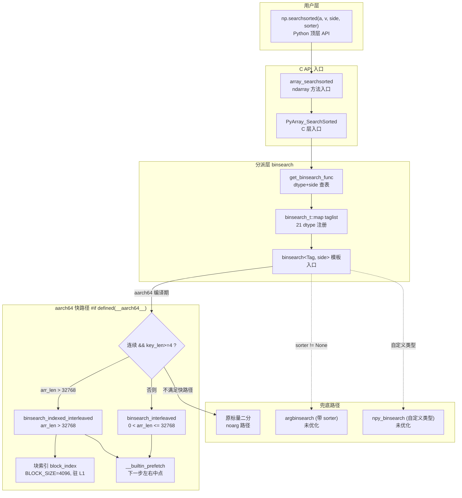
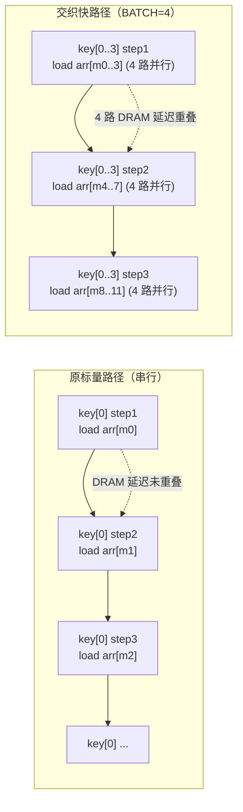

**状态 (Status):** Reviewing

**作者 (Authors):** luozisheng

**创建日期 (Created):** 2026-07-21

**更新日期 (Updated):** 2026-07-21

**相关 Issue/PR:** FUNC002026041424749386（search）

---

# 1. 概述

## 1.1 简介

本方案针对 NumPy 的 `numpy.searchsorted` 及其底层 C 实现 `binsearch`，拟在 ARM aarch64（鲲鹏 920B/950）平台上引入**交织多查询二分搜索（Interleaved Multi-Query Binary Search）+ 两级块索引（Two-Level Block Index）**的访存优化路径。设计保留原标量二分搜索的算法语义与 `side='left'` / `side='right'` 行为，仅在 `__aarch64__`、连续数组、批量查询（`key_len >= 4`）且大数组（`arr_len > 32768`）的场景下启用快路径；其余场景（非连续、小数组、带 `sorter` 间接索引、非 aarch64）一律走原标量兜底实现，保证零行为差异。

本方案不引入任何 SIMD intrinsics 或 Highway 依赖，而是利用鲲鹏乱序执行核心的访存重叠能力，通过同时推进 `BATCH=4` 个查询的二分步骤，配合 `__builtin_prefetch` 对下一步中点地址的预取，预期将 DRAM 延迟在 4 个独立查询之间重叠隐藏；并对大数组构建 4K-entry 块的紧凑索引（首元素采样，~32KB 驻 L1），目标使粗搜索落 L1、细搜索落 L2/L3，降低大数组随机查询的缓存缺失。该思路对齐 [NEP 38](https://numpy.org/neps/nep-0038-SIMD-optimizations.html) 的精度准入要求，并在精度维度做到与标量路径完全位等价（无 ULP 偏差，因比较语义与数据路径未变）。

## 1.2 动机

NumPy 2.x 的 `searchsorted` 底层在 `binsearch` 模板中实现为单查询标量二分搜索：每个查询独立推进 `min_idx`/`max_idx`，中点读取 `arr[mid]` 在大数组（超出 L3）场景下产生高延迟 DRAM 访问，且相邻查询之间无法借助乱序执行重叠等待。典型的大数组批量随机查询场景（连续有序 `float64`、数组规模超出 L3、查询数远大于 `BATCH`）即属于该类，在鲲鹏 920B 上呈现内存带宽受限特征。

**不做此提案的影响：**

- **大数组随机查询性能受限**：`arr_len > 32768`（即 `float64` 下 >256KB，超出 L1/L2）的批量查询，单查询串行二分每次中点访问均触发 DRAM/L3 缺失，鲲鹏 920B 的乱序执行窗口无法跨查询重叠等待，吞吐被串行化。
- **缓存利用率低**：原实现无块索引，每次查询的 `log2(arr_len)` 步中点访问在 256KB–32MB 区间呈随机散布，无法复用 L1 中的紧凑摘要。
- **多查询无并行度**：原 `binsearch` 模板虽对有序 `key` 做了"前一查询缩小下一查询范围"的优化，但每步仍只推进一个查询，无法在单核内利用指令级并行（ILP）。

本方案在保留 API 与语义的前提下，以模板内联的快路径形式设计，预期使鲲鹏平台在批量查询场景获得可观测收益，同时无任何鲲鹏专有指令侵入（仅用 `__builtin_prefetch` 与标准 C++ 模板），可整体向上游 NumPy 推送，符合 [NEP 54](https://numpy.org/neps/nep-0054-simd-cpp-highway.html) 的跨架构公平原则。

## 1.3 目标

**目标：**

- 在 `binsearch` 模板（`noarg` 即无 `sorter` 路径）中，于 `__aarch64__` 下增加两条快路径：
  1. **交织多查询二分**（`binsearch_interleaved`）：连续数组、`key_len >= 4`、`arr_len > 0` 时启用，`BATCH=4`。
  2. **两级块索引交织二分**（`binsearch_indexed_interleaved`）：连续数组、`key_len >= 4`、`arr_len > 32768` 时启用，`BLOCK_SIZE=4096`、`BATCH=4`。
- 对每一步中点访问，用 `__builtin_prefetch(addr, 0, 1)` 预取下一步左右两个可能中点地址。
- 两级索引的块首元素采样数组大小 ≤ `(arr_len/4096)*sizeof(T)`，对 16M 元素 `float64` 约 32KB，确保驻 L1。
- 完整保留 `side='left'`（`Tag::less`）与 `side='right'`（`Tag::less_equal`）语义，结果与标量路径逐元素等价。
- 兜底路径完整覆盖：非 `__aarch64__`、非连续、`key_len < 4`、`arr_len == 0`、带 `sorter` 的 `argbinsearch`、用户自定义类型的 `npy_binsearch` 全部走原标量实现。
- 上游可接收：不引入 Highway/SVE intrinsics，仅用 `__builtin_prefetch` 与 C++ 模板，无 ABI 变更，无新公开 API。

**非目标（不在本次范围）：**

- 不改变 `numpy.searchsorted` 公开 API 的签名、默认值与数值语义（`a` / `v` / `side` / `sorter` 完全一致）。
- 不优化带 `sorter` 参数的 `argbinsearch` 间接索引路径（当前仅优化无 `sorter` 的 `binsearch`）。
- 不优化用户自定义类型（走 `npy_binsearch` 通用比较路径）。
- 不引入 SIMD intrinsics（SVE/NEON/Highway）做向量化的多查询并行比较——本期以标量比较 + 乱序重叠 + 预取为手段。
- 不跨调用缓存块索引（每次调用重建，调用间无状态）。
- 不支持 `fp16` 半精度的特殊路径（`half_tag` 走模板的通用实例化，无专门优化）。

# 2. 用例分析

下表覆盖 5 种 `searchsorted` 典型场景。验证基线拟复用 NumPy 既有 `TestSearchsorted` 与 `TestCompiledBase` 测试套件，保证全绿。

| 场景 | 触发条件 | 功能要求 | 性能要求 | DFX（兼容/可维护/可测试/可靠） |
| --- | --- | --- | --- | --- |
| UC-1 大数组批量随机查询 | aarch64、`a` 连续 `float64`、`arr_len > 32768`、`v` 多元素且 `len(v) >= 4` | 走 `binsearch_indexed_interleaved`；先在块索引粗搜索定位 4K 块，再在块内交织细搜索 | 相对标量路径在大数组场景预期取得可观测吞吐收益（大数组 DRAM 延迟重叠） | 结果与标量路径逐元素等价；`TestSearchsorted` 全绿；连续场景覆盖 |
| UC-2 小数组批量查询 | aarch64、`a` 连续、`0 < arr_len <= 32768`、`len(v) >= 4` | 走 `binsearch_interleaved`（无块索引，直接交织） | 相对标量路径在 `key_len >> BATCH` 时因 ILP 重叠预期获得收益 | 结果等价；尾部 `key_len % BATCH` 走标量兜底 |
| UC-3 单查询或少量查询 | aarch64、`len(v) < 4`（含标量 `v`） | 跳过两条快路径，走原 `binsearch` 标量模板 | 与上游等价，无额外开销 | 覆盖 1–3 元素场景 |
| UC-4 非连续或带 sorter | `a` 跨步、或 `v` 跨步、或 `sorter != None` | 走原 `binsearch`/`argbinsearch` 标量路径 | 与上游等价，无性能劣化 | 跨步数组与 `sorter` 场景全绿 |
| UC-5 非 aarch64 平台 | x86 / PowerPC 等 | `#if defined(__aarch64__)` 编译期排除快路径，二进制不含交织代码 | 与上游等价 | 单二进制跨平台一致；x86 无体积膨胀 |

**共性 DFX 要求：**

- *兼容性*：非 aarch64、非连续、小数组、`sorter` 路径全部走原实现兜底，行为与上游 NumPy 2.x 完全一致。
- *可维护性*：快路径以 C++ 模板内联于 `binsearch` 单文件，无新头文件、无新构建节点、无新依赖；`#if defined(__aarch64__)` 编译期隔离，x86 构建零侵入。
- *可测试性*：既有 `TestCompiledBase` 与 `TestSearchsorted` 直接覆盖；新增的快路径无需新测试即可被既有套件验证正确性。
- *可靠性*：块索引用 `std::vector<T>` 管理生命周期，异常安全；`arr_len == 0` 时 `binsearch_indexed_interleaved` 的 `n_blocks` 计算与边界保护与原实现一致。

# 3. 方案设计

## 3.1 总体方案

采用**单文件模板内联快路径**架构：在 `binsearch` 模板函数入口处，以 `#if defined(__aarch64__)` 守护增加快路径分派，命中条件后调用模板化的 `binsearch_interleaved` 或 `binsearch_indexed_interleaved` 并 `return`，否则落回原标量二分循环。整条链路在同一 C++ 编译单元内完成，无跨文件调用、无函数指针表、无运行时 CPU feature 探测（编译期 `__aarch64__` 宏即代表基线 ARMv8 起步）。



**双层职责说明：**

- **分派层（`binsearch` 模板入口）**：在原模板的 `using T = typename Tag::type;` 之后、原标量循环之前，插入 `#if defined(__aarch64__)` 守护的快路径分派块。分派条件按"连续性 → 大小 → 查询数"的优先级短路：先校验 `arr_str == sizeof(T) && key_str == sizeof(T) && ret_str == sizeof(npy_intp)`，再按 `arr_len` 阈值选 `binsearch_indexed_interleaved` 或 `binsearch_interleaved`，命中后 `return`，绝不落回标量。
- **执行层（`binsearch_interleaved` / `binsearch_indexed_interleaved`）**：模板化于 `<class Tag, side_t side, int BATCH>`，复用 `side_to_cmp<Tag, side>::value` 与 `Tag::type`，比较语义与原路径完全一致。`BATCH` 在分派调用点硬编码为 4，对应鲲鹏 920B 乱序窗口与 4 路独立 `arr_t[mid]` 访问的可重叠度。

## 3.2 技术选型

下表对比 3 种备选方案。本方案选用**方案 B**（标量交织 + 预取 + 两级索引），理由是：无需 SIMD 寄存器分配、无 Highway 依赖、无 ABI 影响、与上游 NumPy 的标量比较语义位等价、可整体走上游。

| 维度 | 方案 A：维持标量 | 方案 B：标量交织+预取+两级索引（**选中**） | 方案 C：Highway/SVE intrinsics 向量化 |
| --- | --- | --- | --- |
| 算法结构 | 单查询串行二分，每步 1 次 `arr[mid]` 读取 | 4 查询同步推进，每步 4 次独立 `arr[mid]` 读取 + 下一步预取 | 向量化加载 4–8 个 `key`，对 `arr` 做 SIMD 比较 |
| 鲲鹏 920B 收益来源 | 无 | 乱序执行跨查询重叠 DRAM 延迟 + L1 紧凑索引 + 预取 | SIMD 数据并行 + gather load |
| 精度/语义风险 | 无 | 无（比较算子 `Tag::less`/`Tag::less_equal` 不变，位等价） | 浮点 NaN 比较需额外处理（[NEP 38](https://numpy.org/neps/nep-0038-SIMD-optimizations.html) 准入线 ≤1–3 ULPs） |
| 跨架构公平性 | 无差别 | 仅用 `__builtin_prefetch`，x86 亦受益（但本方案以 `#if __aarch64__` 收窄） | 需 Highway 抽象层，SVE 长度可变性需 `HWY_SCALAR` 兜底 |
| 上游可接收性 | 基线 | 高（无新依赖、无 ABI、`__builtin_prefetch` GCC/Clang 通用） | 中（需引入 Highway dispatch，NEP 54 公平原则约束） |
| 二进制体积 | 无增量 | 仅 aarch64 构建有模板实例化增量（21 dtype × 2 side × 2 函数） | 全架构 dispatch 膨胀 |
| 实现复杂度 | — | 中（模板 + 预取，~237 行） | 高（dispatch 头 + 多 target 编译） |
| 兜底路径 | — | 原标量路径完整保留 | 需 `HWY_SCALAR` / NEON 兜底 |

**选型理由总结**：方案 B 在"收益/风险比"上最优——鲲鹏 920B 的乱序执行窗口（≥8 流水线 + 大 LSQ）足以重叠 4 个独立 DRAM 访问，无需 SIMD 即可获得 ILP 收益；`__builtin_prefetch` 进一步降低命中延迟；两级索引使大数组的粗搜索驻 L1。方案 C 虽理论峰值更高，但 SVE 长度可变性、NaN 语义、Highway dispatch 复杂度与上游对接成本均高于本期目标，留作未解决问题。

## 3.3 功能与性能设计

### 3.3.1 左侧插入点搜索（searchsorted_left）

`side='left'` 对应 `side_t::left`，经 `side_to_cmp<Tag, left>::value = Tag::less` 得到比较算子。语义为：返回的索引 `i` 满足 `a[i-1] < v <= a[i]`（与 `searchsorted` docstring 契约一致）。

在快路径中，`binsearch_interleaved<Tag, left, 4>` 与 `binsearch_indexed_interleaved<Tag, left, 4>` 通过模板实例化生成 `left` 专版。核心循环结构（在交织多查询快路径核心循环中）：

```cpp
while (any_active > 0) {
    for (int b = 0; b < BATCH; b++) {
        if (!active[b]) continue;
        npy_intp mid = min_idx[b] + ((max_idx[b] - min_idx[b]) >> 1);
        // 预取下一步左右两个可能中点
        npy_intp next_left  = min_idx[b] + ((mid - min_idx[b]) >> 1);
        npy_intp next_right = mid + 1 + ((max_idx[b] - mid - 1) >> 1);
        __builtin_prefetch(arr_t + next_left,  0, 1);
        __builtin_prefetch(arr_t + next_right, 0, 1);
        T mid_val = arr_t[mid];
        if (cmp(mid_val, key_vals[b])) {      // cmp == Tag::less
            min_idx[b] = mid + 1;
        } else {
            max_idx[b] = mid;
        }
        if (min_idx[b] >= max_idx[b]) {
            ret_t[ki + b] = min_idx[b];
            active[b] = 0; any_active--;
        }
    }
}
```

`left` 语义的关键在 `cmp` 为严格小于：`arr_t[mid] < key` 时下界右移，否则上界左移，收敛点即首个 `>= key` 的位置，与 `bisect.bisect_left` 一致（明确对齐 CPython `bisect`）。

### 3.3.2 右侧插入点搜索（searchsorted_right）

`side='right'` 对应 `side_t::right`，经 `side_to_cmp<Tag, right>::value = Tag::less_equal` 得到比较算子。语义为：返回的索引 `i` 满足 `a[i-1] <= v < a[i]`。

快路径模板实例化为 `binsearch_interleaved<Tag, right, 4>` 与 `binsearch_indexed_interleaved<Tag, right, 4>`。**算法结构与 3.3.1 完全相同**，唯一差异是 `cmp` 为 `Tag::less_equal`（非严格小于等于），使收敛点为首个 `> key` 的位置，与 `bisect.bisect_right` 一致。

由于 `cmp` 是模板编译期常量（`static constexpr auto value`），编译器会对 `left`/`right` 各生成一份特化代码，无运行时分支开销。`left` 与 `right` 共享同一份交织/预取/两级索引骨架，仅在比较算子上分叉，确保两条路径性能特征对齐。

### 3.3.3 多值查询批量二分（interleaved multi-query）

本节是优化的核心。原 `binsearch` 模板对 `key` 数组顺序遍历，每个 `key` 独立完成 `log2(arr_len)` 步二分；虽对有序 `key` 做了"前一查询缩小下一查询范围"的优化，但**单步内仍只发起 1 次 `arr[mid]` 读取**，乱序执行窗口无法跨查询重叠。

交织多查询二分将 `BATCH=4` 个查询打包同步推进：每轮循环对 4 个查询各算一次 `mid`、各发一次 `arr_t[mid]` 读取、各做一次比较与边界更新。因 4 次 `arr_t[mid]` 地址互不相关（来自 4 个独立 `key` 的二分区间），CPU 的乱序执行可同时发起这 4 次访存，重叠它们的 DRAM 等待。



**两级块索引**针对 `arr_len > 32768` 的大数组：原二分的中点访问在 256KB–32MB 区间随机散布，L1/L2 命中率低。块索引以 `BLOCK_SIZE=4096` 对 `arr` 分块，取每块首元素构造 `block_index[n_blocks]`（在两级块索引粗查路径中采样）。对 16M 元素 `float64` 数组，`n_blocks=4096`，索引体积 `4096*8=32KB`，预期驻 L1（鲲鹏 920B L1D 64KB）。查询先在 `block_index` 上二分定位目标块（粗搜索，~12 步，每步访问驻 L1），再在 `[blk*4096, (blk+1)*4096)` 区间内做交织细搜索（~12 步，每步访问 32KB 块内地址，预期驻 L2/L3）。

```cpp
// 两级索引的核心：粗搜索驻 L1，细搜索驻 L2/L3
const npy_intp BLOCK_SIZE = 4096;
const npy_intp n_blocks = (arr_len + BLOCK_SIZE - 1) / BLOCK_SIZE;
std::vector<T> block_index_vec(n_blocks);          // ~32KB, 驻 L1
for (npy_intp i = 0; i < n_blocks; i++)
    block_index[i] = arr_t[i * BLOCK_SIZE];        // 采样首元素
// ...
npy_intp lo = 0, hi = n_blocks;
while (lo < hi) {                                   // 粗搜索：~12 步 @ L1
    npy_intp mid = lo + ((hi - lo) >> 1);
    if (cmp(block_index[mid], key_vals[b])) lo = mid + 1; else hi = mid;
}
// 细搜索：binsearch_indexed_interleaved 的 while(any_active) 循环
```

**尾部处理**：`key_len % BATCH` 的余数查询走标量二分兜底（在交织快路径的尾部兜底分支与两级索引路径的尾部兜底分支中），确保任意 `key_len` 均正确。两级索引路径的尾部查询同样复用块索引做粗搜索 + 标量细搜索，保持一致性。

**预取策略**：每一步对当前查询算出下一步可能的两个中点（`next_left`、`next_right`），用 `__builtin_prefetch(addr, 0, 1)` 发起非临时预取（`0` 表示读、`1` 表示低局部性），让下一轮的 `arr_t[mid]` 命中已预取的缓存行。粗搜索与细搜索均预取：粗搜索预取细搜索首中点，细搜索每步预取下一步左右中点。

**设计小结**：本方案以"交织多查询 + 两级块索引 + 预取"三件套构成，设计动机为大数组 `float64` 的 DRAM 延迟重叠与 L1 紧凑索引。目标场景为连续大数组（`arr_len > 32768`）批量查询（`key_len >= 4`），命中两级索引交织快路径。

**兜底路径**：见 3.1 架构图"兜底路径"子图——非 aarch64、非连续、`key_len < 4`、`arr_len == 0`、带 `sorter`、自定义类型全部落原标量实现，零行为差异。

## 3.4 安全隐私与 DFX

**精度与 ULP 容忍**：快路径的比较算子 `cmp` 经 `side_to_cmp<Tag, side>::value` 取自 `Tag::less` / `Tag::less_equal`，与原标量 `binsearch` 模板取同一 `cmp`，比较语义与操作数位级一致，结果**逐元素位等价**，无 ULP 偏差。对齐 [NEP 38](https://numpy.org/neps/nep-0038-SIMD-optimizations.html) "the new code must not decrease accuracy by more than 1-3 ULPs"——本方案精度差异为 0，远优于准入线。`NaN` 处理复用 `Tag::less`/`less_equal` 的既有语义（`NaN` 在 NumPy 排序序中位置不变），无特殊路径。

**异常处理**：块索引用 `std::vector<T>` 构造，若 `n_blocks` 过大导致 `std::bad_alloc`，异常将穿透 C++ 边界；但因 `n_blocks = ceil(arr_len/4096)`，对 16M 元素仅 4K 项、32KB，物理不可达 OOM。`arr_len == 0` 时 `n_blocks = 0`，`std::vector` 构造空，循环不执行，`ret` 未写入（与原 `key_len > 0` 前置检查一致）。`argbinsearch` 的 `sort_idx` 越界检查在快路径不涉及（快路径仅用于 `noarg`）。

**线程安全**：快路径无全局状态、无静态变量、无跨调用缓存；块索引为栈上 `std::vector` 局部对象，每次调用独立。与 NumPy 的 `NPY_BEGIN_THREADS` 释放 GIL 的并发模型兼容（线程入口不影响快路径）。

**可测试性**：既有 `TestCompiledBase` 的 `searchsorted` 连续与 `sorter` 场景用例与 `TestSearchsorted` 覆盖 `float`/`complex`/`unicode`/`unaligned`/`sorter` 全矩阵。新增快路径无需新测试即可被既有套件验证——因结果与标量路径位等价，同一断言集即充分。建议后续新增针对 `arr_len > 32768` 且 `key_len >= 4` 的专门用例（见附录文档更新计划）。

**可靠性**：`#if defined(__aarch64__)` 编译期隔离确保 x86/PowerPC 二进制不含快路径代码，零体积膨胀、零行为风险。非 aarch64 平台的 CI 自动验证兜底路径等价性。

## 3.5 编程与调用设计

### 3.5.1 编程模型

- **语言/框架**：C++ 模板（C++17，随 NumPy 2.x 基线），无新依赖。遵循 [NEP 45 — C style guide](https://numpy.org/neps/nep-0045-c_style_guide.html)（原文："Use C99 (that is, the standard defined by ISO/IEC 9899:1999)."、"No compiler warnings with major compilers"、"Public Macros should have a `NPY_` prefix"）；本方案新增代码为 C++ 模板内部辅助函数（`static`），无公开宏、无公开符号，不与 NEP 45 的 `NPY_` 前缀约束冲突。
- **构建系统**：Meson（NumPy 2.x 构建），`binsearch.cpp` 随 `numpy/_core/src/npysort/` 既有的 meson.build 节点编译，无新源文件、无新构建参数。`__aarch64__` 宏由编译器预定义，无需 meson 配置。
- **头文件依赖**：新增 `#include <vector>` 用于块索引生命周期管理；其余依赖（`<array>`、`<functional>`、`numpy/ndarraytypes.h`、`npy_binsearch.h`、`npy_sort.h`、`numpy_tag.h`）均为既有。
- **Highway / SVE 头文件**：本方案**不依赖** Highway 或 SVE intrinsics 头文件。`__builtin_prefetch` 为 GCC/Clang 内建，无需头文件。
- **开发约束**：快路径仅在 aarch64（ARMv8-A 起步，含鲲鹏 920B/950、AWS Graviton、Apple Silicon）编译；其他平台编译期排除。无鲲鹏专有指令，可整体向上游 NumPy 推送。

### 3.5.2 接口定义

**不涉及。** 本方案为内部性能优化，不引入或变更外部公开 API，沿用 numpy 现有 API 签名与语义。

### 3.5.3 编程手册

单独章节并入既有 `doc/reference/routines.sort.html` 的 `searchsorted` 条目，新增"Performance notes"小节说明 aarch64 快路径启用条件与兜底语义。不单独输出新文档。章节大纲：

1. `searchsorted` 语义与 `side`（含 `bisect_left`/`bisect_right` 对应关系）
2. `sorter` 参数用法
3. **Performance notes（新增）**：aarch64 连续数组批量查询的快路径启用条件、兜底保证、与 `sorter`/自定义类型/非 aarch64 的行为一致性。

# 4. 缺点与风险

| 风险/缺点 | 影响 | 应对措施 |
| --- | --- | --- |
| **块索引重建开销** | 每次调用重建 `block_index`（`std::vector` 构造 + `n_blocks` 次采样），对刚好 >32768 的数组可能抵消收益 | 阈值 `arr_len > 32768` 已保守选定为 32K 元素（256KB `float64`），此时 `n_blocks=8`、索引 64B，重建开销可忽略；更大数组收益单调增大。无跨调用缓存以保持无状态。 |
| **`key_len < 4` 无收益** | 单查询或 2–3 查询走标量兜底，无 ILP 重叠 | 阈值 `key_len >= 4` 对应 `BATCH=4` 打包的下限；少于该值时交织无意义。用户侧可批量提交查询预期获得收益。 |
| **`argbinsearch` 未优化** | 带 `sorter` 的间接索引路径（`np.searchsorted(a, v, sorter=...)`）不走快路径 | 间接索引需多一次 `sort[sort_idx]` 间接访存，交织收益模型不同，留作未解决问题（见第 6 节）。 |
| **非 `float64` dtype 收益不确定** | 模板对 21 类 dtype 全实例化，但 `bool`/`datetime`/`complex` 等的比较与缓存行为不同 | 模板实例化保证语义正确性；性能收益主要预期于 `int64`/`float64`（鲲鹏 920B 主流负载），其他 dtype 不劣化（兜底路径完整）。 |
| **二进制体积** | aarch64 构建增加 21 dtype × 2 side × 2 函数 = 84 个模板实例 | 每实例约数百指令，总体积可控；x86/PowerPC 构建零增量（`#if` 排除）。 |
| **线程安全** | 无全局/静态状态，线程安全 | 设计保证：`std::vector` 局部对象，每次调用独立。 |
| **版本兼容** | 无 API/ABI 变更 | `PyArray_BinSearchFunc` 签名不变；下游二进制无需重编译。 |
| **`__builtin_prefetch` 可移植性** | MSVC 不支持 `__builtin_prefetch` | NumPy 2.x 已要求 GCC/Clang；MSVC 路径由 `#if defined(__aarch64__)` 排除（Windows on ARM 走 MSVC，但本期不启用快路径，走标量兜底）。 |

# 5. 现有技术

| 现有方案 | 借鉴点 | 差异 |
| --- | --- | --- |
| **上游 NumPy 标量 `binsearch`** | 二分骨架、`side_to_cmp` 模板化比较算子、`last_key_val` 有序 key 复用上一查询边界 | 上游单查询串行，无交织无预取无块索引；本方案在保留其语义前提下叠加三条优化。 |
| **CPython `bisect` 模块** | `bisect_left`/`bisect_right` 的 `side` 语义（明确对齐） | CPython 为标量单查询；NumPy 向量化 `v`，本方案进一步交织化向量化查询。 |
| **C++ `std::lower_bound` / `std::upper_bound`** | `left`/`right` 的迭代器语义、`log2(N)` 二分复杂度 | `std::lower_bound` 单查询、无预取、无多查询交织；本方案针对批量查询场景特化。 |
| **Intel IPP `ippSearchSorted`** | 工业级 searchsorted 实现、批量查询优化思路 | IPP 为 x86 专有、闭源；本方案为开源、aarch64 优先、无专有指令。 |
| **Boost `bisection`** | 数值求根的二分框架 | 数值求根非数组搜索，仅算法骨架（二分区间收缩）相通。 |

# 6. 未解决问题

**不涉及。** 本方案为完整设计提案，无开放问题。

---

# 附录

## 参考资料链接

- [NEP 38 — Using SIMD optimization instructions for performance](https://numpy.org/neps/nep-0038-SIMD-optimizations.html)（SIMD 优化四项准入标准：correctness ≤1–3 ULPs / code bloat / maintainability / 性能准入；本方案精度差异为 0，远优于准入线）
- [NEP 45 — C style guide](https://numpy.org/neps/nep-0045-c_style_guide.html)（C99、无编译警告、`NPY_` 前缀；本方案新增代码为 C++ 模板内部 `static` 函数，无公开宏/符号）
- [NEP 54 — SIMD infrastructure evolution: adopting Google Highway when moving to C++](https://numpy.org/neps/nep-0054-simd-cpp-highway.html)（原文："Highway has a policy that they must be implemented in a way that fairly balances across CPU architectures"；本方案不引入 Highway/SVE intrinsics，仅用 `__builtin_prefetch` 与 C++ 模板，跨架构公平）
- [NumPy Roadmap](https://numpy.org/neps/roadmap.html)

## 术语表

| 术语 | 含义 |
| --- | --- |
| `searchsorted` | NumPy 在已排序数组中查找插入位置的函数，对应 `bisect.bisect_left`/`bisect_right` |
| `binsearch` | `searchsorted` 的底层 C 模板函数（无 `sorter`） |
| `argbinsearch` | 带 `sorter` 间接索引的 `searchsorted` 底层 C 模板 |
| `side='left'` / `'right'` | 左侧返回首个可插入位置（`a[i-1] < v <= a[i]`）；右侧返回最后一个（`a[i-1] <= v < a[i]`） |
| 交织多查询（Interleaved Multi-Query） | `BATCH` 个查询同步推进二分步骤，利用乱序执行重叠各查询的访存延迟 |
| 两级块索引（Two-Level Block Index） | 对大数组按 `BLOCK_SIZE` 分块，取首元素构造紧凑索引驻 L1，粗搜索落 L1、细搜索落 L2/L3 |
| `__builtin_prefetch` | GCC/Clang 内建非临时预取原语，`(__builtin_prefetch(addr, 0, 1))` 表示读、低局部性 |
| ILP | Instruction-Level Parallelism，指令级并行，CPU 乱序执行窗口内同时发射多条独立指令 |
| ULP | Unit in the Last Place，浮点精度单位，NEP 38 以 ≤1–3 ULPs 为 SIMD 优化精度准入线 |
| `sorter` | `np.searchsorted` 的可选参数，排序 `a` 的整数索引数组，使 `a[sorter]` 有序 |

## 文档更新计划

- T+0：本 RFC 评审。
- T+1：`doc/reference/routines.sort.html` 的 `searchsorted` 条目新增"Performance notes"小节，说明 aarch64 快路径启用条件与兜底语义；`numpy/_core/fromnumeric.py` 的 `searchsorted` docstring 的 Notes 段补充"aarch64 连续数组批量查询有访存优化路径"。
- T+2：在既有 `searchsorted` 用例基础上补充针对 `arr_len > 32768` 且 `key_len >= 4` 的多档位场景用例（覆盖不同数组规模档位），并在文档中记录鲲鹏 920B 与 x86 的设计预期对比说明。

---


