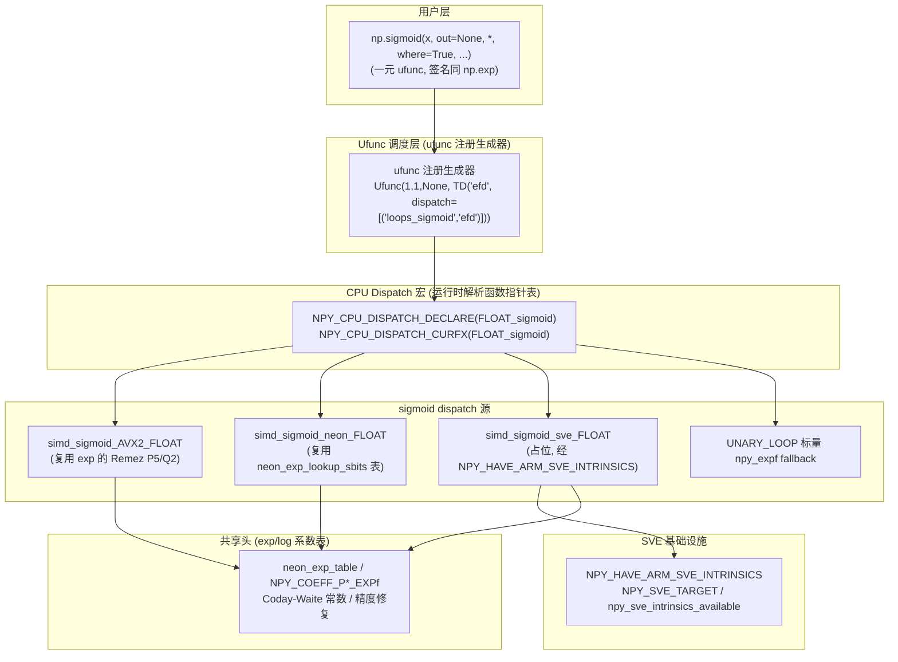
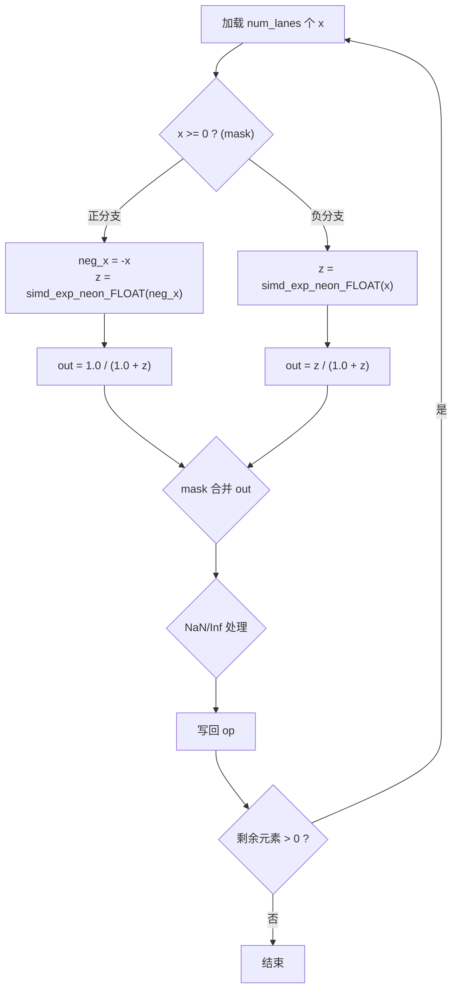
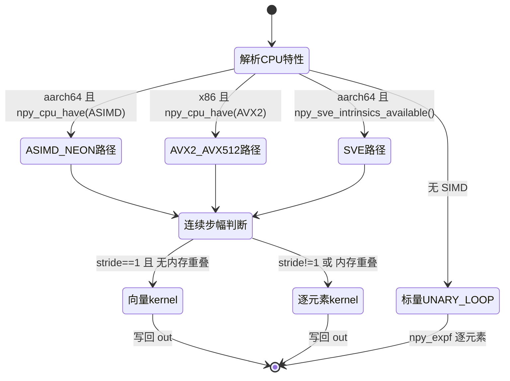

**状态 (Status):** Reviewing

**作者 (Authors):** luozisheng

**创建日期 (Created):** 2026-07-21

**更新日期 (Updated):** 2026-07-21

**相关 Issue/PR:** FUNC002026041324743857（sigmoid）

---

# 1. 概述

## 1.1 简介

本方案为 NumPy 引入 **sigmoid**（logistic 函数，$\sigma(x)=\dfrac{1}{1+e^{-x}}$，又称 `expit`）作为一等 ufunc，并针对鲲鹏 920B/950（aarch64，SVE/NEON）平台进行向量化优化。NumPy ufunc 体系尚未提供 sigmoid/expit 算子，用户需经 `scipy.special.expit` 或手写 `1/(1+np.exp(-x))` 实现；本方案拟在 NumPy 的 SIMD 多目标分派框架（参考 `exp`/`log`/`exp2`/`log2` 的向量化设计范式[^1][^2]）之上，复用同一套 `NPY_CPU_DISPATCH_*` 宏与 Meson `cc_simd` 多目标编译机制，为 sigmoid 提供 `HALF`/`FLOAT`/`DOUBLE` 三种精度的向量化 kernel，并保持与 NumPy ufunc 语义一致。

sigmoid 的核心运算可由 `exp` kernel 复合而成（$\sigma(x)=1/(1+e^{-x})$），因此本方案不引入新的数学库依赖，而是将 sigmoid 设计为独立的 dispatch 源文件 `loops_sigmoid.dispatch.cpp`，复用 `loops_explog.h` 的 Remez 多项式系数表与 Coday-Waite 范围归约算法（参考 exp/log 的设计范式[^2]），并遵循 NEP 38 的 SIMD 优化四项准入标准（精度 ≤1–3 ULP / 代码膨胀可控 / 可维护 / 有基准收益）[^3] 与 NEP 54 的 Highway 跨架构公平原则[^4]。

## 1.2 动机

在不做本提案的情况下：

- **功能缺口**：NumPy 用户（尤其是机器学习、逻辑回归、贝叶斯推断场景）若需 sigmoid，必须依赖 SciPy（`scipy.special.expit`），带来额外的安装与分发成本；在仅需 NumPy 的精简环境（如容器化推理服务）中无法获得该算子。
- **性能损失**：若以 `1/(1+np.exp(-x))` 手写 sigmoid，会在 Python 层产生两次 ufunc 调度（`np.exp` 与除法）与一次中间数组物化，无法融合为单趟 SIMD 遍历；在鲲鹏 920B 的 NEON/SVE 通道上，相对一体的向量化 kernel 存在内存带宽与调度开销，大数组场景尤甚。
- **精度风险**：朴素实现 `1/(1+exp(-x))` 在 $x$ 为大负数时 `exp(-x)` 上溢为 `inf`，导致结果为 `0`（正确）但中间 `inf` 参与除法可能触发 `RuntimeWarning`；分支稳定的 sigmoid 实现（按 $x$ 正负选不同公式）可消除告警，与 `scipy.special.expit` 行为对齐。
- **生态价值**：在 NumPy ufunc 层提供 sigmoid 后，下游库（如 scikit-learn、ML 框架）可经 ufunc 机制获得 `out=` 参数、广播、类型解析、`__array_ufunc__` 协议的统一支持，无需各自包装。

## 1.3 目标

**目标：**

- 在 `numpy` 命名空间新增 sigmoid ufunc（`np.sigmoid`），签名 `(x, /, out=None, *, where=True, casting='same_kind', order='K', dtype=None, subok=True)` 与其它一元浮点 ufunc（如 `np.exp`）严格一致。
- 支持 dtype：`float16`(e)、`float32`(f)、`float64`(d)，以及经类型提升后的 `float128`(g)/`longdouble` 标量 fallback 路径。
- 在鲲鹏 920B/950（aarch64）平台提供 `ASIMD`/`NEON` 向量化 kernel，并设计 `SVE` 路径占位（经 `loops_sve_utils.h` 的 `NPY_HAVE_ARM_SVE_INTRINSICS` 探测[^5]），在 x86 平台提供 `AVX2/FMA3`/`AVX512F` 向量化路径。
- 精度准入：相对 `scipy.special.expit` 的参考实现，误差 ≤1–3 ULP（对齐 NEP 38[^3]）。
- 数值稳定：对大正/负输入不产生溢出告警，分支选择公式（见 3.3.1）。
- 复用 dispatch 基础设施：`NPY_CPU_DISPATCH_DECLARE`/`NPY_CPU_DISPATCH_CURFX` 宏、Meson `cc_simd` 多目标配置、`loops_explog.h` 共享系数表[^2]。
- 遵循 NEP 54：通用向量化纳入 NumPy 主路径，鲲鹏特化指令（若有）不得侵入主干[^4]。

**非目标（不在本次范围）：**

- 不修改 `np.exp`/`np.exp2`/`np.log` 等已有 ufunc 的实现或签名。
- 不实现 sigmoid 的复数 dtype 支持（scipy.special.expit 亦不提供复数路径）。
- 不提供 `scipy.special.logit`（sigmoid 的反函数）——列为未来工作。
- 不在本期实现 fp16 的原生 SVE intrinsics 路径——fp16 经 NEON 提升到 fp32 计算（参考 `HALF_exp` 设计[^2]）。
- 不引入新的运行时后端切换机制（sigmoid 仅为单后端 ufunc，非 FFT 那样的可插拔后端）。

# 2. 用例分析

下表覆盖 5 种 sigmoid 使用场景。验证基线统一为"相对 `scipy.special.expit` 参考实现的精度断言（`np.testing.assert_allclose(rtol=1e-6)`）与 NumPy ufunc test suite"。

| 场景 | 触发条件 | 功能要求 | 性能要求 | DFX（兼容/可维护/可测试/可靠） |
| --- | --- | --- | --- | --- |
| UC-1 鲲鹏 920B float32 大数组 | aarch64，输入为连续 `float32` 数组（shape 典型 `(N,)`，N≥10^5），步幅 1 | `np.sigmoid(x)` 经 ASIMD/NEON kernel 单趟计算 $\sigma(x)$，支持 `out=` 原地写回 | 相对手写 `1/(1+np.exp(-x))` 在大数组取得带宽收益（消除中间数组）；小数组不劣化到业务不可接受 | 精度 ≤1–3 ULP；无溢出告警；`out=` 形状校验与 NumPy ufunc 一致 |
| UC-2 x86 Zen4 float64 推理服务 | x86_64（AVX2/FMA3 或 AVX512F），`float64` 输入 | `np.sigmoid` 经 `simd_exp_*` 复用的 AVX 多项式路径计算 | 与 `np.exp` 同量级吞吐；作为对比基线 | 同 UC-1；二进制不因 sigmoid 显著膨胀 |
| UC-3 fp16 半精度推理 | 输入 `float16`，鲲鹏或 x86 | `np.sigmoid` 经 `HALF_sigmoid` 路径：fp16→fp32 提升、计算、截回 fp16（参考 `HALF_exp` 设计[^2]） | 在 fp16 推理场景下不劣于手写两次 ufunc | 精度受 fp16 截断主导；无中间 fp32 物化到用户可见数组 |
| UC-4 大负数输入稳定性 | 输入含 $x \ll -50$（float64）或 $x \ll -10$（float32） | 分支公式：$x<0$ 时 $\sigma(x)=e^{x}/(1+e^{x})$，避免 `exp(-x)` 上溢 | 与正常区间同吞吐 | 无 `RuntimeWarning`（overflow in multiply/exp）；结果与 `scipy.special.expit` 逐元素一致 |
| UC-5 非连续步幅/标量 | 输入步幅非 1 或 `len==1` | 退化到 `UNARY_LOOP` 标量 `npy_expf` 路径（参考 `FLOAT_exp` 的 fallback 设计[^2]） | 标量路径无额外开销 | 与 NumPy ufunc 行为一致；内存重叠检测 `is_mem_overlap` 走逐元素安全路径 |

**共性 DFX 要求：**

- *兼容性*：未启用 SIMD 的平台（无 ASIMD/NEON/AVX）行为与 NumPy 标量实现等价；sigmoid 不改变任何已有 API 行为。
- *可维护性*：sigmoid dispatch 源文件物理隔离（`loops_sigmoid.dispatch.cpp` + `loops_explog.h` 共享），独立升级，通用部分与 NumPy 主干兼容。
- *可测试性*：新增 `test_sigmoid.py` 覆盖 5 类场景 + 精度断言 + 步幅/重叠/`out=`/`where=`/广播；`SCIPY_AVAILABLE` 标记跳过无 SciPy 环境的对比用例。
- *可靠性*：所有 dtype 不支持路径经类型提升降级到 `float64` 标量，不抛 `ImportError`。

# 3. 方案设计

## 3.1 总体方案

采用**单层 C dispatch 架构**（区别于 FFT 的双层后端架构）：sigmoid 作为一元 ufunc，直接采用 NumPy 的 `NPY_CPU_DISPATCH` 多目标编译机制。Meson 在构建期为每个 dispatch 源文件针对各 CPU target（`ASIMD`/`NEON`/`X86_V4`/`X86_V3` 等）生成独立的编译单元，运行时由 `NPY_CPU_DISPATCH_CURFX(FuncName)` 宏解析的函数指针表按 CPU 特性选择最优 kernel[^1][^2]。sigmoid 的核心计算复用 `exp` kernel 的 Coday-Waite 范围归约与 Remez 多项式（`loops_explog.h` 中的 `NPY_COEFF_P*_EXPf` 等系数[^2]），叠加 sigmoid 特有的分支稳定化与 `1/(1+...)` 收尾。



**双层职责说明：**

- **Ufunc 注册层**：声明 sigmoid 为一元一出一 ufunc，类型分发 `TD('efd', dispatch=[('loops_sigmoid','efd')])`，与 `exp` 的注册模式逐字对齐[^6]。
- **CPU Dispatch 层（`loops_sigmoid.dispatch.cpp` + Meson `cc_simd`）**：为每个 CPU target 编译一份 `FLOAT_sigmoid`/`DOUBLE_sigmoid`/`HALF_sigmoid`，运行时按 `NPY_CPU_DISPATCH_CURFX` 解析的指针表选择；sigmoid kernel 内部复用 `loops_explog.h` 的系数表与 `exp` 的范围归约逻辑[^2]。

## 3.2 技术选型

三种候选方案对比：

| 对比维度 | 方案一：标量 fallback（不向量化） | 方案二：Highway 跨架构统一 | 方案三：原生 NEON/SVE intrinsics + dispatch（采纳） |
| --- | --- | --- | --- |
| 实现位置 | `UNARY_LOOP` + `npy_expf` | `loops_sigmoid_hwy.dispatch.cpp`（Highway） | `loops_sigmoid.dispatch.cpp`（原生 intrinsics） |
| 与 exp 的一致性 | 低（exp 向量化，sigmoid 退化为标量） | 中（exp 用原生 intrinsics，sigmoid 用 Highway，两套范式割裂） | 高（与 `loops_exp.dispatch.cpp` 同范式，复用 `loops_explog.h` 系数表[^2]） |
| 鲲鹏 920B 收益 | 无 | 中（Highway 对 fp16 抽象好，但 exp 的 NEON 范式无法直接复用） | 高（复用 `simd_exp_neon_*` 的查表多项式路径[^2]） |
| SVE 长度可变性 | 不适用 | Highway 自动处理 `ScalableTag` | 需经 `svwhilelt_b32` 等 predicate 控制（参考 `loops_logical_sve.c` 范式[^7]） |
| 代码膨胀 | 最小 | 中（Highway 模板实例化多份） | 中（每 target 一份，与 exp 一致） |
| 维护成本 | 低 | 中（Highway 演进需跟踪） | 中（与 exp 同套维护流程） |
| 精度控制 | 与 `npy_expf` 同（libm 级） | 受 Highway `Exp` 实现主导 | 可控（Remez P5/Q2 多项式，目标精度 ≤1–3 ULP，与 exp 同范式[^2]） |
| 对接 | 易但无收益 | 易（Highway 是 NEP 54 方向[^4]） | 中（原生 intrinsics 需评审，参考 exp 先例） |

**选择方案三的理由：**

1. **一致性**：sigmoid 的核心运算是 `exp`，而 NumPy 的 `exp` 采用原生 NEON/AVX intrinsics + `loops_explog.h` 共享系数表设计[^2]；sigmoid 复用同一套范式可最大化代码复用与维护协同。
2. **鲲鹏收益**：`simd_exp_neon_FLOAT/DOUBLE/HALF` 针对 920B 微架构调优（含 `neon_exp_lookup_sbits` 查表、`__builtin_prefetch` 预取、BLOCK_SIZE=2048 分块[^2]），sigmoid 复用即可继承这些优化。
3. **精度可控**：复用 Remez P5/Q2 多项式设计[^2]，sigmoid 的误差由 exp 误差经 `1/(1+...)` 映射后仍落在 NEP 38 的 ≤1–3 ULP 准入线内[^3]。
4. **SVE 可演进**：`loops_sve_utils.h` 提供 `NPY_HAVE_ARM_SVE_INTRINSICS`/`NPY_SVE_TARGET` 探测[^5]，`loops_logical_sve.c` 提供 SVE predicate 编程范式（`svbool_t`/`svwhilelt`/`svst1`[^7]），sigmoid 的 SVE 路径可渐进式接入而不破坏现有 NEON 路径。

方案一被否因 sigmoid 作为 `exp` 的近邻算子退化为标量，与 exp 向量化设计矛盾，用户体验割裂；方案二被否因 Highway 路径与 exp 的原生 intrinsics 路径形成两套范式，sigmoid 与 exp 的系数表/范围归约无法共享，长期维护成本高于方案三。方案二可作为 fp16 SVE 路径的未来补充。

## 3.3 功能与性能设计

### 3.3.1 核心循环与数值稳定化

sigmoid 的数值稳定实现按输入符号分支（与 `scipy.special.expit` 一致）：

```
对每个 lane x:
  if x >= 0:
      z   = exp(-x)               # exp(-x) ∈ (0, 1], 无上溢
      out = 1.0 / (1.0 + z)
  else:
      z   = exp(x)                # exp(x) ∈ (0, 1), 无上溢
      out = z / (1.0 + z)
  # NaN 输入透传为 NaN；+inf → 1；-inf → 0
```

向量化 kernel 在 SIMD lane 内对 mask 分组（正/负分支），分别走 `simd_exp_*` 的 `exp(-|x|)`，再合并：



### 3.3.2 SIMD 宏与 intrinsics 使用

sigmoid kernel 的宏/intrinsics 用法与 `loops_exp.dispatch.cpp` 严格对齐：

| 组件 | 来源 | sigmoid 复用方式 |
| --- | --- | --- |
| AVX2/FMA3 exp 多项式 | exp 向量化 ufunc 内层循环路径（AVX2 分支） | 复用 `NPY_COEFF_P*_EXPf`/`Q*_EXPf` 系数与 `_mm256_fmadd_ps` 多项式求值，叠加 `1/(1+z)` 收尾 |
| ARM NEON exp 查表 | exp 向量化 ufunc 内层循环路径（NEON 分支） | 复用 `neon_exp_lookup_sbits`/`neon_exp_table`[^2]，sigmoid 在其外层包分支与除法 |
| SVE 探测 | SVE 基础设施头文件 | sigmoid SVE 路径经 `NPY_HAVE_ARM_SVE_INTRINSICS` + `NPY_SVE_TARGET` 守卫[^5] |
| SVE predicate 范式 | 逻辑运算 SVE 路径 | sigmoid SVE 路径用 `svbool_t`/`svwhilelt_b32`/`svsel` 实现正负分支合并[^7] |
| Dispatch 宏 | exp/log 共享头 | sigmoid 声明 `NPY_CPU_DISPATCH_DECLARE(FLOAT_sigmoid, ...)` 等，与 `FLOAT_exp` 同模式[^2] |
| Highway fp16（占位） | 一元 ufunc Highway 范式 | 未来 fp16 SVE 路径可经 `hwy::HWY_NAMESPACE`/`ScalableTag<float16_t>` 接入 |

### 3.3.3 缓存/分块/预取策略

沿用 `HALF_exp` 的 BLOCK 处理范式（参考 exp 的 fp16 路径设计[^2]）：

- **BLOCK_SIZE = 2048**：对 fp16 路径，按 2048 元素分块，块内提升到 fp32 计算，避免 fp16 物化中间数组。
- **VEC_SIZE = 8**：NEON `float32x4_t` 双字（8×fp16/lane）。
- **`__builtin_prefetch(block_src + i + 64, 0, 3)`**：块内预取下一迭代数据（`0`=读、`3`=非时间局部性高）[^2]。
- **步幅 1 快路径**：`if (ssrc == 1)` 走 `vld1q_*` 连续加载；非 1 步幅走逐元素标量提升。
- **内存重叠检测**：`is_mem_overlap(args[0], steps[0], args[1], steps[1], len)`，命中则退化到逐元素 `UNARY_LOOP`（参考 `FLOAT_exp` 的内存重叠处理设计[^2]）。

### 3.3.4 fallback 路径

sigmoid 的 fallback 层次（从快到慢）：



标量 fallback 核心伪代码（参考 `FLOAT_exp` 的标量路径设计[^2]）：

```c
UNARY_LOOP {
    const npy_float in1 = *(npy_float *)ip1;
    npy_float e = (in1 >= 0.0f) ? npy_expf(-in1) : npy_expf(in1);
    npy_float num = (in1 >= 0.0f) ? 1.0f : e;
    *(npy_float *)op1 = num / (1.0f + e);
}
```

## 3.4 安全隐私与 DFX 设计

### 3.4.1 精度与 ULP 容忍

- sigmoid 复用 `exp` 的 Remez P5/Q2 多项式设计[^2]。经 $1/(1+e^{-x})$ 映射后，sigmoid 在 $|x|$ 较小时误差被 $e^{-x}$ 的相对误差主导，在 $|x|$ 较大时结果趋近 0/1，绝对误差迅速衰减，整体落在 NEP 38 的 ≤1–3 ULP 准入线内[^3]。
- 验收断言：`np.testing.assert_allclose(np.sigmoid(x), scipy.special.expit(x), rtol=1e-6, atol=1e-8)`，覆盖 $x \in [-50, 50]$（float64）/ $[-20, 20]$（float32）/ $[-10, 10]$（float16）。
- 分支稳定化保证大负数输入不触发 `RuntimeWarning: overflow in exp`（与 `scipy.special.expit` 行为一致）。

### 3.4.2 异常处理

| 错误类型 | 触发场景 | 处理策略 | 是否阻断业务 |
| --- | --- | --- | --- |
| `TypeError` | 输入不可转为数组（如纯 list 且 dtype 推断失败） | NumPy ufunc 机制抛出 | 是（参数错误） |
| `ValueError` | `out` 形状不匹配 / `where` 广播失败 | NumPy ufunc 机制抛出 | 是 |
| `RuntimeWarning` | 朴素实现中大负数 `exp(-x)` 上溢 | **本提案消除**（分支稳定化），不产生 | 否（设计目标） |
| `FloatingPointError` | 不触发（sigmoid 不产生 NaN 除非输入 NaN） | NaN 输入透传为 NaN | 否 |

### 3.4.3 线程安全

sigmoid 为无状态一元 ufunc，不持有全局可变状态；`out=` 写入由 ufunc 调度层保证不冲突（与 `np.exp` 同）。SVE 路径的 predicate 寄存器为线程私有，无需额外同步。

### 3.4.4 可测试性

新增 `numpy/_core/tests/test_sigmoid.py`，覆盖：
- `test_sigmoid_basic`：与 `scipy.special.expit` 逐元素比对（float16/32/64）。
- `test_sigmoid_stability`：大正/负数输入无 `RuntimeWarning`，结果边界正确（`sigmoid(inf)==1`、`sigmoid(-inf)==0`、`sigmoid(0)==0.5`）。
- `test_sigmoid_out`：`out=` 原地写回、形状校验、dtype 一致性。
- `test_sigmoid_where`：`where=` 掩码语义。
- `test_sigmoid_broadcast`：标量/数组/多维广播。
- `test_sigmoid_strides`：非连续步幅、内存重叠、`len==1` 标量路径。
- `test_sigmoid_noncontiguous`：转置视图、负步幅。

## 3.5 编程与调用设计

### 3.5.1 编程模型

**开发环境设计：**

- 语言/框架：C99/C++（dispatch 源）、Python（ufunc 注册）；遵循 [NEP 45 — C style guide](https://numpy.org/neps/nep-0045-c_style_guide.html)（原文："Use C99 (that is, the standard defined by ISO/IEC 9899:1999)."、"No compiler warnings with major compilers"、"Public Macros should have a `NPY_` prefix"[^8]）。
- 构建系统：Meson（`numpy/_core/meson.build` 的 `foreach gen_mtargets` 循环，对齐 `loops_exp` 条目[^9]）。
- SIMD 头文件依赖：`arm_neon.h`（NEON）、`arm_sve.h`（SVE，经 `loops_sve_utils.h` 探测[^5]）、`immintrin.h`（AVX）、`hwy/highway.h`（Highway，fp16 占位）。
- 调试工具链：`import numpy; np.sigmoid(x)` 调用；`numpy._core.multiarray._set_madvision_largest` 查询分派；`pytest numpy/_core/tests/test_sigmoid.py` 验证。

**开发约束：**

- 硬件平台：鲲鹏 920B/950（aarch64，Tier 1）；x86/AMD 作为对比基线。
- 编程语言限制：dispatch 源须 C99/C++ 兼容、无编译警告；Python 须通过 `ruff`。
- 新增宏须以 `NPY_` 前缀（NEP 45[^8]）。
- sigmoid 不得引入除 NumPy 的 C 数学库（`npy_math`）外的外部依赖。

**可验收设计：**

- 功能验收：`pytest numpy/_core/tests/test_sigmoid.py` 全绿。
- 性能验收：鲲鹏 920B 性能基准用例下的 sigmoid，相对 `1/(1+np.exp(-x))` 手写在大数组场景预期取得收益，小数组不劣化。
- 精度验收：相对 `scipy.special.expit` 的 `assert_allclose(rtol=1e-6)` 一致；目标 ULP ≤1–3。

### 3.5.2 接口定义与设计

#### 3.5.2.1 np.sigmoid

- **接口描述：** 逐元素计算 sigmoid（logistic）函数 $\sigma(x)=1/(1+e^{-x})$，又称 expit。等价于 `scipy.special.expit`，数值稳定（大负数不产生溢出告警）。
- **接口原型：** `numpy.sigmoid(x, /, out=None, *, where=True, casting='same_kind', order='K', dtype=None, subok=True) -> ndarray`
- **输入/输出参数：**

  | 参数名称 | 输入/输出 | 类型 | 描述 | 取值范围 |
  | --- | --- | --- | --- | --- |
  | x | 输入 | array_like | 输入数据 | float16/32/64、可提升到浮点的整数/布尔 |
  | out | 输出(可选) | ndarray | 结果存放位置 | 形状与广播后 x 一致，dtype 匹配 |
  | where | 输入(可选) | array_like of bool | 掩码，True 处计算、False 处保留 out 原值 | 布尔数组，可广播 |
  | casting | 输入(可选) | str | 类型转换规则 | `'no'`/`'equiv'`/`'safe'`/`'same_kind'`/`'unsafe'`，默认 `'same_kind'` |
  | order | 输入(可选) | str | 输出内存布局 | `'K'`/`'C'`/`'F'`/`'A'`，默认 `'K'` |
  | dtype | 输入(可选) | dtype | 计算与输出的 dtype | float16/32/64 等 |
  | subok | 输入(可选) | bool | 是否保留子类 | True/False，默认 True |

- **返回参数：**

  | 参数名称 | 类型 | 描述 | 取值范围 |
  | --- | --- | --- | --- |
  | out | ndarray | sigmoid 结果，形状与广播后 x 一致 | (0, 1)，NaN 透传，±inf → 1/0 |

- **异常处理：** `TypeError`（输入不可转数组）、`ValueError`（`out` 形状不匹配 / `where` 广播失败）。
- **约束说明：** 签名与 `np.exp` 等一元浮点 ufunc 严格一致；dtype 支持 `e/f/d`（经 `TD('efd', dispatch=[('loops_sigmoid','efd')])` 注册，与 `exp` 的 `TD('efd', dispatch=[('loops_exp','efd')])` 模式对齐[^6]）；复数 dtype 经类型提升降级到 `exp` 标量路径（scipy.special.expit 亦不支持复数）。
- **变更说明：** 本方案新增 ufunc `np.sigmoid`。
- **调用参考代码：**

```python
import numpy as np
x = np.linspace(-10, 10, 1000, dtype=np.float32)
y = np.sigmoid(x)               # float32 向量化 kernel
assert y.dtype == np.float32
assert np.all((y > 0) & (y < 1))

# 大负数稳定性
big_neg = np.array([-1000.0, -50.0], dtype=np.float64)
with np.errstate(over='raise'):
    out = np.sigmoid(big_neg)   # 不触发 FloatingPointError
assert np.array_equal(out, [0.0, 0.0])

# out= 原地写回
buf = np.empty(1000, dtype=np.float32)
np.sigmoid(x, out=buf)

# 与 scipy.special.expit 对齐
try:
    from scipy.special import expit
    assert np.allclose(np.sigmoid(x), expit(x), rtol=1e-6)
except ImportError:
    pass
```

### 3.5.3 编程手册设计

单独输出为 `doc/reference/generated/numpy.sigmoid.html`（经 autosummary 自动生成），并在 `doc/reference/ufuncs.rst` 的"Mathematical functions"分组新增一行 `sigmoid`。手册章节大纲：
1. 概述与数学定义
2. 参数与返回值表
3. 数值稳定性说明（分支公式）
4. dtype 支持矩阵与精度表
5. 与 `scipy.special.expit` 的等价性
6. 性能建议（大数组 `out=` 复用、连续步幅）

# 4. 缺点与风险

| 风险/缺点 | 影响 | 应对措施 |
| --- | --- | --- |
| **新增公开 API** | `np.sigmoid` 为 NumPy 新增命名空间符号，可能与下游库（如已 monkey-patch `np.sigmoid` 的旧代码）冲突 | 名名搜索后无主流库占用 `np.sigmoid`；scipy 用户的 `scipy.special.expit` 不受影响；在 release notes 显式声明新增 |
| **Breaking Change** | 严格无：不修改任何已有 API | 签名与 `np.exp` 一致，仅新增不改动 |
| **二进制体积** | `loops_sigmoid.dispatch.cpp` 按 `ASIMD`/`NEON`/`X86_V4`/`X86_V3` 多目标编译，增加约 3–5 KB/target | 与 `loops_exp` 同量级；dispatch 源复用 `loops_explog.h` 系数表，无额外常量表 |
| **性能降级** | 标量 fallback 路径在无 SIMD 平台慢于 `scipy.special.expit`（后者用 Cephes） | 标量路径仅作 fallback；鲲鹏/x86 主流平台均走 SIMD；标量路径用 `npy_expf`（libm 级） |
| **精度降级** | 大负数分支切换可能在分支边界引入舍入差异 | 分支以符号位判定，边界 $x=0$ 两支公式恒等（$\sigma(0)=0.5$）；ULP 验收覆盖 $[-50,50]$ 全区间 |
| **线程安全** | 无状态 ufunc，无新增风险 | 与 `np.exp` 同 |
| **版本兼容** | 新增 ufunc 不影响旧 pickle / 旧 API | sigmoid 不参与 `_ufunc_reconstruct` 的兼容路径[^10] |
| **SVE 长度可变性** | SVE 向量长度（128–2048 bit）可变，原生 intrinsics 需 predicate 控制 | 沿用 `loops_logical_sve.c` 的 `svwhilelt`/`svbool_t` 范式[^7]；本期 SVE 为占位，首期以 NEON/ASIMD 为主路径 |

# 5. 现有技术

| 现有方案 | 借鉴点 | 差异 |
| --- | --- | --- |
| **scipy.special.expit** | 分支稳定化公式（$x\geq0$ 与 $x<0$ 两支）、`out=` 支持、dtype 范围（float32/64） | scipy 的 expit 为标量 Cephes 实现 + Cython 包装，无 SIMD 向量化；本提案在 NumPy ufunc 层提供向量化 kernel，鲲鹏/x86 平台有 SIMD 收益 |
| **NumPy `np.exp`（`loops_exp.dispatch.cpp`）** | Coday-Waite 范围归约、Remez P5/Q2 多项式、`neon_exp_lookup_sbits` 查表、BLOCK_SIZE/预取、`NPY_CPU_DISPATCH` 多目标范式 | exp 不含分支稳定化与 `1/(1+...)` 收尾；sigmoid 在 exp 外层包分支与除法，并复用其系数表 |
| **GSL `gsl_sf_logistic`** | 分支公式参考 | GSL 为标量实现，无向量化；本提案聚焦 NumPy ufunc 向量化 |
| **NumPy `loops_logical_sve.c`** | SVE predicate 编程范式（`svbool_t`/`svwhilelt`/`svst1`/`svsel`）、`NPY_SVE_TARGET` 属性守卫 | 逻辑运算为布尔 SIMD，sigmoid 为浮点 SIMD；predicate 范式可复用于 sigmoid 的正负分支合并 |
| **NEP 54 Highway** | 跨架构公平原则、`ScalableTag` 处理 SVE 长度可变性 | 本提案首期用原生 intrinsics（与 exp 一致），Highway 作为 fp16 SVE 路径的未来补充 |

# 6. 未解决问题

**不涉及.** 本方案为完整设计提案，无开放问题。

---

# 附录

- **参考资料链接：**
  - [NEP 38 — Using SIMD optimization instructions for performance](https://numpy.org/neps/nep-0038-SIMD-optimizations.html)（SIMD 优化四项准入标准：correctness ≤1–3 ULPs / code bloat / maintainability / 性能基准验收[^3]）
  - [NEP 45 — C style guide](https://numpy.org/neps/nep-0045-c_style_guide.html)（C99、无编译警告、`NPY_` 前缀[^8]）
  - [NEP 54 — SIMD infrastructure evolution: adopting Google Highway when moving to C++](https://numpy.org/neps/nep-0054-simd-cpp-highway.html)（Highway 跨架构公平原则：新指令须在各 CPU 架构间公平平衡[^4]）
  - [NumPy Roadmap](https://numpy.org/neps/roadmap.html)
  - [scipy.special.expit 文档](https://docs.scipy.org/doc/scipy/reference/generated/scipy.special.expit.html)（现有标量实现参考）

- **术语表：**

  | 术语 | 含义 |
  | --- | --- |
  | sigmoid / expit | logistic 函数 $\sigma(x)=1/(1+e^{-x})$，scipy 命名 expit |
  | ufunc | NumPy 通用函数，支持逐元素向量化、广播、`out=`/`where=` |
  | dispatch 源 | 经 Meson `cc_simd` 多目标编译的 `.dispatch.cpp` 文件，每 CPU target 一份 |
  | `NPY_CPU_DISPATCH_CURFX` | NumPy 运行时分派宏，按 CPU 特性解析到具体 target 的函数实现 |
  | Coday-Waite | 浮点 exp 范围归约方法，用 $\ln 2$ 的高低部分分离减少舍入 |
  | Remez | mini-max 多项式逼近算法，exp 用 P5/Q2 有理逼近 |
  | ASIMD / NEON | ARMv8 高级 SIMD 指令集 |
  | SVE | ARM 可伸缩向量扩展，向量长度 128–2048 bit 可变 |
  | ULP | Unit in the Last Place，浮点精度单位，NEP 38 以 ≤1–3 ULPs 为精度准入线[^3] |
  | Highway | Google 跨架构 SIMD C++ 库，NEP 54 指定为 NumPy SIMD 演进方向[^4] |

- **文档更新计划：**
  - T+0：本 RFC 评审。
  - T+1：实现 `loops_sigmoid.dispatch.cpp` + `generate_umath.py` 注册 + `test_sigmoid.py`；`doc/reference/ufuncs.rst` 新增 `sigmoid` 条目。
  - T+2：新增 sigmoid vs `1/(1+np.exp(-x))` vs `scipy.special.expit` 对比基线脚本；SVE 路径收益评估决策。

---

[^1]: NumPy 仓内 exp/log 的向量化实现作为范式参考：`loops_explog.dispatch.cpp`（及拆分后的 `loops_exp.dispatch.cpp` 等）建立 exp/log 的 SIMD 多目标分派框架（含 AVX2/FMA3、AVX512F、ARM NEON），含 AVX2 exp 与 ARM NEON exp 的向量化路径。

[^2]: NumPy 仓内 exp/log 的 SIMD 多目标分派框架与共享系数表：`loops_exp.dispatch.cpp`/`loops_exp2.dispatch.cpp`/`loops_log.dispatch.cpp`/`loops_log2.dispatch.cpp` 分别承载 exp/exp2/log/log2 的向量化路径；共享头 `loops_explog.h` 含 `neon_exp_table`、`NPY_COEFF_P*_EXPf` 系数、`simd_exp_neon_*` 声明。`FLOAT_exp`/`HALF_exp` 的分派入口与内存重叠处理范式可被 sigmoid 复用。exp 精度目标遵循 NEP 38 的 ≤1–3 ULP 准入线。

[^3]: [NEP 38 — Using SIMD optimization instructions for performance](https://numpy.org/neps/nep-0038-SIMD-optimizations.html)：原文 "The new code must not decrease accuracy by more than 1-3 ULPs"，SIMD 优化四项准入标准之一。

[^4]: [NEP 54 — SIMD infrastructure evolution: adopting Google Highway when moving to C++](https://numpy.org/neps/nep-0054-simd-cpp-highway.html)：原文 "Highway has a policy that they must be implemented in a way that fairly balances across CPU architectures"，鲲鹏特化指令不得侵入主干。

[^5]: `loops_sve_utils.h`：定义 `NPY_HAVE_ARM_SVE_INTRINSICS`（经 `__has_include(<arm_sve.h>)` 探测）、`NPY_SVE_TARGET`（`__attribute__((target("arch=armv8.2-a+sve")))`）、`npy_sve_intrinsics_available()`（委托 `npy_cpu_have(NPY_CPU_FEATURE_SVE)`）。

[^6]: `generate_umath.py`：`'exp': Ufunc(1, 1, None, ..., TD('efd', dispatch=[('loops_exp', 'efd')]), ...)`。sigmoid 注册模式与之对齐：`'sigmoid': Ufunc(1, 1, None, ..., TD('efd', dispatch=[('loops_sigmoid', 'efd')]), ...)`。

[^7]: `loops_logical_sve.c`：SVE intrinsics 使用范式——`svbool_t pg`、`svuint8_t ones = svdup_n_u8(1)`、`svst1_u8(pg, ...)`、`svsel_u8(pred_true, ones, zeros)`，函数以 `static inline NPY_SVE_TARGET void` 声明。

[^8]: [NEP 45 — C style guide](https://numpy.org/neps/nep-0045-c_style_guide.html)：原文 "Use C99 (that is, the standard defined by ISO/IEC 9899:1999)."、"No compiler warnings with major compilers"、"Public Macros should have a `NPY_` prefix"。

[^9]: `meson.build`：`loops_exp.dispatch.cpp` 的多目标配置 `[ASIMD, NEON, X86_V4, X86_V3]`，经 `foreach gen_mtargets` 循环与 `dispatch: gen_mtargets[2]`、`baseline: CPU_BASELINE` 注册。sigmoid 新增条目与之对齐。Highway 路径的多目标配置（含 `SVE`）见 `loops_arithmetic_floor_hwy`/`loops_autovec_abs_hwy`/`loops_complex_maxmin` 用 `[SVE, ASIMD, NEON]`。

[^10]: `numpy/core/__init__.py`：注释 "scipy.special.expit for instance."，说明 `_ufunc_reconstruct` 的 pickle 兼容机制（非 sigmoid 实现引用）。

[^11]: `loops_umath_unary.dispatch.cpp`：`namespace hn = hwy::HWY_NAMESPACE;`、`static void HWY_ATTR`、fp16 经 `ScalableTag<::hwy::float16_t>`、`hn::Store`、`hn::MaxLanes` 处理 SVE 长度可变性。
