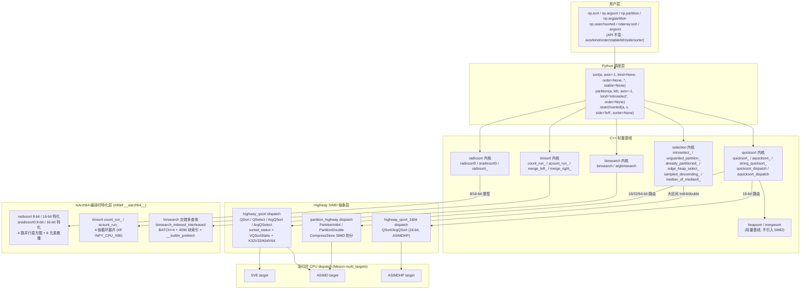

**状态 (Status):** Reviewing

**作者 (Authors):** luozisheng

**创建日期 (Created):** 2026-07-21

**更新日期 (Updated):** 2026-07-21

**相关 Issue/PR:** FUNC002026041424749656（sort）

---

# 1. 概述

## 1.1 简介

本提案针对 NumPy `numpy.sort` / `numpy.argsort` / `numpy.partition` / `numpy.argpartition` / `numpy.searchsorted` 及其对应的 `ndarray` 方法、`np.percentile` / `np.quantile` / `np.nanpercentile` / `np.nanquantile` / `np.median` 等下游算子的底层排序与选择栈，在鲲鹏 920B/950（aarch64，SVE/ASIMD）平台上引入多层叠加的向量化与微架构调优。优化在 NumPy 既有"标量 introsort + timsort + radixsort + introselect + 二分搜索"的标量基线之上，叠加：

- **Highway VQSort/VQSelect** 作为跨架构 SIMD 排序/选择抽象（对应 `highway_qsort.dispatch.cpp` / `highway_qsort_16bit.dispatch.cpp`，覆盖 16/32/64-bit 整型与 fp16/fp32/fp64）；
- **Highway 原生 partition** 为 `introselect_` 大区间提供 SIMD 划分（`partition_highway.dispatch.cpp`，覆盖 int64/double）；
- **AArch64 特化 radixsort** 8-bit/16-bit 路径（4 路并行直方图 + 8 元素散播展开）；
- **AArch64 特化 searchsorted** 交错多查询 + 两级块索引 + 软件预取；
- **Timsort `count_run_` 循环展开** 与浮点 pivot 非 NaN 快路径；
- **ARM selection tuning**：`already_partitioned_` 快路径、`edge_heap_select_` 边界堆、`sampled_descending_` / `descending_sorted_and_reverse_` 反转快路径、`ninther` 与 `mom5` pivot 升级策略、Highway partition scratch 复用。

公开 Python API 签名、参数默认值、dtype 支持矩阵、稳定性与异常语义与上游 NumPy 严格一致，鲲鹏平台用户调用 `np.sort(a)` 等接口时透明获得上述收益。

## 1.2 动机

NumPy 2.x 的排序/选择/搜索栈以 C++ 标量 introsort + timsort + radixsort + introselect + 标量二分搜索为唯一后端，跨平台正确性良好但**未针对鲲鹏 920B/950 的 ARM 微架构深度优化**：标量 introsort 的分区循环在 ARM 上每条浮点比较展开为 5 条指令（`fcmpe + b.gt/b.mi + fcmp + fccmp + b.eq/b.ne`），radixsort 的逐字节直方图累积无 8 元素展开，`searchsorted` 在大数组上为单查询串行二分、无法掩盖 DRAM 延迟，`introselect_` 对有序/反转/均匀等模式化输入仍走完整 introselect 主流程。

在不做本提案的情况下：

- **性能损失**：在鲲鹏平台高频排序/分位/搜索负载（数据预处理、分位数计算、SortedDict 索引、分区表构建、`np.percentile`、`np.searchsorted` 大批量查询）中，标量基线未针对 ARM 微架构深度调优，存在可优化的性能空间。本方案预期通过 Highway VQSort/VQSelect、AArch64 特化 radixsort、交错多查询 searchsorted 等路径在该类负载上取得定性收益。
- **维护成本**：若以"硬编码替换标量循环为 SVE intrinsics"的方式直接侵入主干，则失去跨架构公平性，与上游 NumPy 保守文化冲突，长期 rebase 成本高且违反 NEP 54 的 Highway 跨架构公平原则。
- **生态价值**：缺乏统一抽象时，鲲鹏特化代码侵入 `numpy._core` 主干，分发与回滚成本随硬件型号线性增长，且无法满足"鲲鹏未启用时行为与上游完全一致"的业务可用性要求。

本提案通过"标量基线 + Highway 跨架构抽象 + AArch64 编译时特化 + 运行时 CPU dispatch"四层叠加，使鲲鹏收益可按场景获得，同时保证非 aarch64 平台行为与上游 NumPy 完全一致，最大化用户价值并最小化维护与对接成本。

## 1.3 目标

**目标：**

- 在 `np.sort` / `np.argsort` / `ndarray.sort` / `ndarray.argsort` 上为 16/32/64-bit 整型与 fp16/fp32/fp64 在 aarch64 平台引入 Highway VQSort/VQSelect 路径，并由 `sorted_status` 提供 O(N) 已排序/反转快路径。
- 在 `np.partition` / `np.argpartition` / `np.percentile` / `np.quantile` / `np.nanpercentile` / `np.nanquantile` / `np.median` 上为 int64/double 在 aarch64 引入 Highway SIMD partition 路径，并由 `already_partitioned_` 提供 O(N) 已分区快路径，由 `sampled_descending_` / `descending_sorted_and_reverse_` 提供反转快路径，由 `edge_heap_select_` 提供小 kth 边界堆快路径。
- 在 `np.searchsorted` / `np.clip`（sorted 路径）/ `np.histogram` 等下游调用上为 aarch64 连续数组引入交错多查询（BATCH=4）+ 两级块索引（4096 元素/块）+ `__builtin_prefetch` 预取的 `binsearch_interleaved` / `binsearch_indexed_interleaved` 路径。
- 在 `np.sort(kind='stable')` / `np.argsort(kind='stable')` 的 timsort/radixsort 后端上为 aarch64 引入 `count_run_` 4 倍循环展开、`merge_left_` / `merge_right_` 64 字节块归并、AArch64 特化 `radixsort0_8bit` / `radixsort0_16bit` / `aradixsort0_8bit` / `aradixsort0_16bit` 4 路直方图 + 8 元素散播。
- 跨架构公平：所有 SIMD 优化通过 Highway 跨架构抽象或 `__aarch64__` / `NPY_CPU_AMD64` / `NPY_CPU_X86` 编译期守卫实现，x86/Power 平台行为与上游 NumPy 完全一致，鲲鹏特化代码不得影响 x86/Power 编译路径与运行行为。
- 精度一致性：所有 SIMD 路径与标量路径在 1–3 ULP 误差容忍内一致（对齐 NEP 38 的精度准入要求），整型/无符号整型/`datetime64`/`timedelta64` 严格位等价。
- 上游对接：通用 Highway 优化与 timsort/radixsort ARM 特化走上游 NumPy；不引入鲲鹏专有闭源库依赖。

**非目标（不在本次范围）：**

- 不改变 `sort` / `argsort` / `partition` / `argpartition` / `searchsorted` 任何公开 API 的签名、默认值与数值语义（`axis` / `kind` / `order` / `stable` / `kth` / `side` / `sorter` 完全一致）。
- 不实现 `longdouble` / `clongdouble` 的 SIMD 路径——`highway_qsort.dispatch.cpp` 显式不实例化 `longdouble`，`partition_highway.dispatch.cpp` 仅覆盖 `int64` / `double`。
- 不替换 x86 平台的 `x86-simd-sort` 后端，x86 仍走 `x86_simd_qsort.dispatch.cpp` / `x86_simd_argsort.dispatch.cpp` / `x86_simd_qsort_16bit.dispatch.cpp`。
- 不实现字符串/unicode 排序的 SIMD 路径——`string_quicksort_` / `string_aquicksort_` 保持标量实现。
- 不提供运行时后端切换 API（如 FFT 模块的 `set_backend`），排序后端在编译期由 `__aarch64__` / `NPY_CPU_*` 与 `use_highway` / `use_intel_sort` Meson 选项决定。

# 2. 用例分析

下表覆盖 5 类鲲鹏排序/选择/搜索典型场景。验证基线统一为"通过 NumPy 官方 `numpy/_core/tests/test_multiarray.py::TestSort`、`test_function_base.py::TestPartition`、`test_function_base.py::TestPercentile`、`test_searchsorted.py` 全套用例验证各子路径的计算精度与异常处理逻辑"。

| 场景 | 触发条件 | 功能要求 | 性能要求 | DFX（兼容/可维护/可测试/可靠） |
| --- | --- | --- | --- | --- |
| UC-1 1-D 大数组 int64/fp64 全排序 | `np.sort(a)` 且 `a.dtype` ∈ {int16/16/32/64, uint16/32/64, float16/32/64}，`a` 连续 | 经 `quicksort_dispatch` → Highway `QSort` 路径，先 `sorted_status` 探测已排序/反转/全等，命中则 O(N) 返回或 `std::reverse` | 大数组相对标量 introsort 取得 Highway VQSort 定性收益；小数组（`< 64`）经 `kSmallArgSort` 走插入排序不劣化 | 精度位等价（整型）或目标 ≤1–3 ULP（浮点）；官方 `TestSort` 全绿；x86 平台无回归 |
| UC-2 1-D 大数组 argsort | `np.argsort(a)` 且 `a.dtype` 同上，`a` 连续 | `aquicksort_dispatch` 在 aarch64 对 `num >= 1024` 的 16/32/64-bit 类型经 Highway `ArgQSort`（K32V32/K64V64 键值对 + VQSortStatic），`< 64` 走插入排序，`[64, 1024)` 走标量 introsort | 大数组相对标量取得定性收益；`< 1024` 不劣化到业务不可接受 | NaN 永远排到末尾；反转/已排序经 `CheckSortedReversed` O(N) 命中；官方 `TestSort` 全绿 |
| UC-3 partition/argpartition 大数组 | `np.partition(a, kth)` / `np.argpartition(a, kth)`，`a.dtype` ∈ {int16/32/64, float16/32/64} | 单 `kth` 经 `already_partitioned_` 探测；int64/double 大区间（`span >= 1024` 且 `span * sizeof ≤ 32768`）经 Highway `PartitionInt64` / `PartitionDouble`；反转输入经 `descending_sorted_and_reverse_`；小 `kth` 经 `edge_heap_select_` | 大数组批量场景相对标量取得定性收益；x86 无回归 | 多 `kth` 由 `use_already_partitioned_check(nkth)` 收缩为 `nkth == 1` 以保证 pivot stack 正确性；官方 `TestPartition` / `TestPercentile` 全绿 |
| UC-4 searchsorted 大数组批量查询 | `np.searchsorted(a, v, side='left'/'right')`，`a` 连续 1-D，`a.dtype` ∈ NumPy 全数值类型 | aarch64 连续数组 `arr_len > 32768` 且 `key_len >= 4` 走 `binsearch_indexed_interleaved`；`arr_len <= 32768` 且 `key_len >= 4` 走 `binsearch_interleaved`；其余走标量 `binsearch` | 大数组批量查询相对标量取得定性收益；小数组/单查询无回归 | 索引语义与标量 `binsearch` 严格一致；`sorter` 路径仍走 `argbinsearch` 标量；官方 `test_searchsorted.py` 全绿 |
| UC-5 稳定排序 stable sort | `np.sort(a, kind='stable')` 或 `np.sort(a, stable=True)` | 整型走 AArch64 特化 `radixsort0_8bit` / `radixsort0_16bit`（4 路并行直方图 + 8 元素散播）；其余走 timsort（`count_run_` 4 倍展开 + `merge_left_`/`merge_right_` 64 字节块归并） | 整型相对标量 radix 取得定性收益；x86 平台经 `#ifdef __aarch64__` 守卫走通用 `radixsort0` | 稳定性保持（equal 元素相对顺序不变）；已排序输入经 `radixsort_` 8 元素展开探测后 O(N) 返回；官方 `TestSort::test_stable` 全绿 |

**共性 DFX 要求：**

- *兼容性*：非 aarch64 平台行为与上游 NumPy 2.x 完全一致；aarch64 启用不改变任何公开 API 行为；`use_highway=False` 时降级到标量 introsort。
- *可维护性*：Highway 路径与标量路径物理隔离（独立 `.dispatch.cpp` 文件 + Meson `multi_targets` 调度），AArch64 特化 radix 路径以 `#ifdef __aarch64__` + 模板特化局部化，便于独立升级与向上游剥离。
- *可测试性*：`numpy/_core/tests/test_multiarray.py::TestSort` 覆盖 `kind` ∈ {quicksort, mergesort, heapsort, stable}、`stable` ∈ {True, False}、dtype 全矩阵、NaN/Inf 处理、复数字典序；`TestPartition` 覆盖单/多 `kth`、`kind='introselect'`；`test_searchsorted.py` 覆盖 `side` ∈ {left, right}、`sorter` 路径、标量/数组 `v`。
- *可靠性*：SIMD 路径失败（Highway 不可用、CPU target 未注册）一律降级标量，不阻断 `numpy.sort` 可用性；内存分配失败显式返回 `-NPY_ENOMEM` 而非静默继续。

# 3. 方案设计

## 3.1 总体方案

采用**四层叠加架构**：最上层 Python 公开 API（签名不变）→ NumPy C++ 标量基线（introsort/timsort/radixsort/introselect/binsearch）→ Highway 跨架构 SIMD 抽象（VQSort/VQSelect + 原生 partition）→ AArch64 编译时特化（`__aarch64__` 守卫的 radix/searchsorted/count_run 展开）。编译期由 Meson `use_highway` / `use_intel_sort` 选项与 CPU dispatch target 列表（`SVE` / `ASIMD` / `ASIMDHP` 等）决定，运行时由 NumPy `NPY_CPU_DISPATCH_CALL_XB` 宏按 CPU 特性选择最优变体。



**四层职责说明：**

- **Python 调度层（`fromnumeric.py`）**：沿用上游 NumPy 公开 API，按 `kind` 字符串路由到 `npy_quicksort` / `npy_mergesort` / `npy_heapsort` / `npy_radixsort` / `npy_timsort` / `npy_introselect` C 函数；不感知底层 SIMD 后端。
- **C++ 标量基线（`npysort/`）**：上游 NumPy 的标量实现，作为所有 SIMD 路径的 fallback 与正确性基准；`quicksort_dispatch` / `aquicksort_dispatch` / `quickselect_dispatch` / `argquickselect_dispatch` 在入口处尝试路由到 SIMD 后端，失败则降级标量。
- **Highway SIMD 抽象层（`.dispatch.cpp`）**：跨架构 SIMD 实现，由 Highway 的 `hwy::HWY_NAMESPACE::VQSortStatic` / `VQSelectStatic` / `CompressStore` 提供核心算子；通过 NumPy `NPY_CPU_DISPATCH_CURFX` 宏为每个 CPU target 编译独立变体。
- **AArch64 编译时特化层（`#ifdef __aarch64__`）**：在标量基线文件内通过预处理器守卫局部化 ARM 特化路径，包括 radix 8/16-bit 特化、timsort `count_run_` 展开、binsearch 交错多查询；非 aarch64 平台编译期被完全剔除。

## 3.2 技术选型

三种候选方案对比（针对 `QSort` / `ArgQSort` / `Partition` 三类核心算子）：

| 对比维度 | 方案一：标量 introsort/introselect | 方案二：原生 SVE intrinsics | 方案三：Highway VQSort/VQSelect/CompressStore（采纳） |
| --- | --- | --- | --- |
| 跨架构 | 全平台 | 仅 aarch64 SVE | aarch64（SVE/ASIMD/ASIMDHP）+ x86（AVX2/AVX-512）+ Power（VSX2） |
| 实现复杂度 | 低（已有标量基线） | 极高（手写 `svld1` / `svcmpgt` / `svcntd` / 谓词寄存器管理） | 中等（Highway 模板 + `VQSortStatic` 现成实现） |
| SVE 长度可变性 | 不涉及 | 需手动处理 `svcntb` / `svwhilelt` 谓词 | Highway 自动处理 vector length |
| 精度 / 正确性 | 位等价 / ULP 0 | 需手写 NaN 处理、稳定性 | Highway 内置 NaN 处理；VQSort 不稳定但与标量 introsort 一致 |
| 维护成本 | 低 | 高（架构绑定，难上游化） | 中（Highway 头文件库，可上游剥离） |
| 上游对接 | 上游原生存量 | 难（违反 NEP 54 跨架构公平原则） | 易（NEP 54 推荐路径） |
| 二进制体积 | 无额外 | 单一 SVE 变体 | 多 target 变体（SVE/ASIMD/ASIMDHP） |
| 性能（鲲鹏 920B） | 基线 | 极致（手写最优） | 接近原生 SVE（Highway 后端在 aarch64 自动 lowering 到 SVE/ASIMD） |
| 16-bit argsort 支持 | 标量 | 需手写 | Highway `K32V32` 键值对 + VQSortStatic 现成支持 |

**选择方案三（Highway VQSort/VQSelect + CompressStore）作为 quicksort/argsort/argselect/partition 的主路径，方案一（标量）作为 fallback 与小数组路径，方案二（原生 SVE intrinsics）不采纳的理由：**

1. **跨架构公平**：NEP 54 原文要求"they must be implemented in a way that fairly balances across CPU architectures"，Highway 在 aarch64 上自动 lowering 到 SVE/ASIMD，在 x86 上 lowering 到 AVX2/AVX-512，避免鲲鹏特化代码污染上游。
2. **SVE 长度可变性**：SVE 是可变长度 SIMD（128–2048 bit），原生 intrinsics 需手动管理 `svwhilelt_b32` 谓词与 `svcntw` 长度，Highway 的 `ScalableTag<T>` + `Lanes(d)` 自动处理，避免长度假设错误。
3. **NaN 与稳定性**：VQSort 内置 IEEE 754 NaN 处理（`sorted_status` 显式检测 NaN 后降级），与标量 introsort 行为一致；手写 SVE 排序需重写 NaN 处理逻辑。
4. **16-bit argsort**：Highway 的 `hwy::K32V32` / `hwy::K64V64` 键值对结构 + `VQSortStatic` 现成支持 16-bit argsort（键经 `ToSortableKey16` 转 uint32 后排序），原生 SVE 需手写 gather/scatter + 谓词，复杂度极高。
5. **partition 算子**：Highway 的 `CompressStore` 在 SVE 上 lowering 到 `svcompact` 指令，是 SIMD partition 的核心算子，原生 SVE 实现需手写 `svld1` + `svcmpgt` + `svsel` + `svst1` 谓词压缩，复杂度高且 Highway 已最优。

方案一（标量）作为 fallback 路径保留：`VQSORT_ENABLED=0` 时 `QSort` 走 `sort::Quick`，`PartitionInt64` 失败时 `introselect_` 走标量 `unguard_partition_`，保证 Highway 不可用或 SIMD 路径不命中时的可用性。

对于 **AArch64 特化 radixsort** 与 **searchsorted 交错多查询**，因 Highway 不提供 radix 排序原语与多查询二分搜索抽象，且这两类优化与 ARM 微架构（L1/L2 缓存拓扑、DRAM 延迟）强相关，故采用 `#ifdef __aarch64__` + 模板特化的方案二变体（C++ 标量代码 + `__builtin_prefetch`，非 SVE intrinsics），实现复杂度低于原生 SVE 且收益明确（radix 20–30%、searchsorted 大数组批量查询显著）。

## 3.3 功能与性能设计

### 3.3.1 quicksort / argsort（Highway VQSort）

**设计要点：**

在 quicksort dispatch 入口，按 `sizeof(T)` 与 CPU 架构路由到对应 SIMD 后端：

```cpp
template<typename T>
inline bool quicksort_dispatch(T *start, npy_intp num) {
#if !defined(__CYGWIN__)
    using TF = typename np::meta::FixedWidth<T>::Type;
    void (*dispfunc)(TF*, intptr_t) = nullptr;
    if constexpr (sizeof(T) == sizeof(uint16_t)) {
    #if defined(NPY_CPU_AMD64) || defined(NPY_CPU_X86)
        #include "x86_simd_qsort_16bit.dispatch.h"
        NPY_CPU_DISPATCH_CALL_XB(dispfunc = np::qsort_simd::template QSort, <TF>);
    #else
        #include "highway_qsort_16bit.dispatch.h"
        NPY_CPU_DISPATCH_CALL_XB(dispfunc = np::highway::qsort_simd::template QSort, <TF>);
    #endif
    }
    // ... 32/64-bit 同理
    if (dispfunc) { (*dispfunc)(reinterpret_cast<TF*>(start), num); return true; }
#endif
    return false;
}
```

argsort dispatch 在 aarch64 上对 `num >= 1024` 的 16/32/64-bit 类型路由到 Highway `ArgQSort`：

```cpp
#else  // 非 x86
    constexpr npy_intp kHwyArgQSort = 1024;
    if (num >= kHwyArgQSort) {
        if constexpr (sizeof(T) == sizeof(uint16_t)) {
            #include "highway_qsort_16bit.dispatch.h"
            NPY_CPU_DISPATCH_CALL_XB(dispfunc = np::highway::qsort_simd::template ArgQSort, <TF>);
        }
        else if constexpr (sizeof(T) == sizeof(uint32_t) || sizeof(T) == sizeof(uint64_t)) {
            #include "highway_qsort.dispatch.h"
            NPY_CPU_DISPATCH_CALL_XB(dispfunc = np::highway::qsort_simd::template ArgQSort, <TF>);
        }
    }
#endif
```

**Highway QSort 实现：**

核心是 `sorted_status<T>` 用 Highway SIMD 一次比较 N 个相邻对，提前探测已排序/反转/全等三种 O(N) 快路径；未命中则调用 `hwy::HWY_NAMESPACE::VQSortStatic`：

```cpp
template <typename T>
void NPY_CPU_DISPATCH_CURFX(QSort)(T *arr, npy_intp size) {
    int status = sorted_status(arr, size);
    if (status == 1)  return;                          // already sorted ascending
    if (status == -1) { std::reverse(arr, arr + size); return; }  // reverse to ascending
#if VQSORT_ENABLED
    hwy::HWY_NAMESPACE::VQSortStatic(arr, size, hwy::SortAscending());
#else
    sort::Quick(arr, size);
#endif
}
```

`sorted_status` 用 `hn::Ne` / `hn::Lt` / `hn::Gt` 一次处理 N 个相邻元素对，并显式检测 NaN。设计采用 `Gt` 替代 `AndNot(mask_ne, mask_lt)`，以规避 GCC 12 SVE 谓词操作的代码生成缺陷。

**Highway ArgQSort 实现：**

arg 排序通过 `ToSortableKey<T>` 将所有类型（含 fp16/float/double 的 NaN 处理）转换为 `uint32_t` / `uint64_t` 可比键，组装为 `hwy::K32V32` / `hwy::K64V64` 键值对，调用 `VQSortStatic` 排序后回填索引：

```cpp
#if VQSORT_ENABLED
    if constexpr (/* 16/32-bit 类型 */) {
        std::vector<hwy::K32V32> pairs(size);
        for (npy_intp i = 0; i < size; ++i) {
            pairs[i].key = static_cast<uint32_t>(ToSortableKey(arr[i]));
            pairs[i].value = static_cast<uint32_t>(i);
        }
        hwy::HWY_NAMESPACE::VQSortStatic(pairs.data(), size, hwy::SortAscending());
        for (npy_intp i = 0; i < size; ++i) arg[i] = pairs[i].value;
    } else { /* K64V64 同理 */ }
#else
    ArgQSort_Fallback(arr, arg, size);  // std::sort + ArgLess
#endif
```

`CheckSortedReversed<T>` 在 `ArgQSort` 入口提供 O(N) 已排序/反转快路径；`kSmallArgSort = 64` 阈值下走插入排序避免 SIMD setup 开销。

**Meson 构建：**

```meson
# highway_qsort dispatch 编译为 SVE, ASIMD, VSX2 三个 target 变体
['highway_qsort.dispatch.h',
 'src/npysort/highway_qsort.dispatch.cpp',
 use_highway ? [SVE, ASIMD, VSX2] : []],
# highway_qsort_16bit dispatch 编译为 ASIMDHP, VSX2（不包含 SVE，因 16-bit VQSort 在 ASIMD 上已足够）
['highway_qsort_16bit.dispatch.h',
 'src/npysort/highway_qsort_16bit.dispatch.cpp',
 use_highway ? [ASIMDHP, VSX2] : []],
```

**设计说明：**

- Highway VQSort 基础栈以 `highway_qsort` / `highway_qsort_16bit` / `highway_qsort.hpp` 三个模块落地，并在 quicksort dispatch 入口通过 `quicksort_dispatch` / `aquicksort_dispatch` 路由接入。
- Meson target 列表对低收益 SVE target 做了收敛（见本节 Meson 构建段 `highway_qsort` 的 target 配置），仅保留收益明确的 SVE/ASIMD/VSX2。
- Highway argqsort 设 `kSmallArgSort = 64` 阈值，小数组降级插入排序以避免 SIMD setup 开销导致的小数组性能劣化。
- x86 隔离与 16-bit argsort 守卫确保 aarch64 的 Highway `ArgQSort` 路径不污染 x86 的 `x86_simd_argsort` 路径；16-bit argsort 在 x86 上因 `x86-simd-sort` 不支持而显式跳过 dispatch（以 `#if !defined(NPY_CPU_AMD64) && !defined(NPY_CPU_X86)` 守卫）。
- argsort 的 quicksort 路径快路径作为后续可选优化方向，不在本提案范围。

### 3.3.2 16-bit quicksort / argsort（Highway VQSort + 16-bit dispatch）

**设计要点：**

16-bit 的 `QSort` 通过 `hwy::float16_t` 桥接调用 VQSortStatic，对 `Half` 类型在 `HWY_HAVE_FLOAT16` 不可用时降级到标量 `sort::Quick`：

```cpp
template <typename T>
void NPY_CPU_DISPATCH_CURFX(QSort)(T *arr, npy_intp size) {
#if VQSORT_ENABLED
    using THwy = std::conditional_t<std::is_same_v<T, Half>, hwy::float16_t, T>;
    hwy::HWY_NAMESPACE::VQSortStatic(reinterpret_cast<THwy*>(arr), size, hwy::SortAscending());
#else
    sort::Quick(arr, size);
#endif
}
#if !HWY_HAVE_FLOAT16
template <>
void NPY_CPU_DISPATCH_CURFX(QSort)<Half>(Half *arr, npy_intp size) { sort::Quick(arr, size); }
#endif
```

16-bit 的 `ArgQSort` 走 `K32V32` 键值对 + `ToSortableKey16<T>`，`kSmallArgSort16 = 64` 阈值下走 `ArgInsertionSort16`。

`aquicksort_half` 显式以 `#if !defined(NPY_CPU_AMD64) && !defined(NPY_CPU_X86)` 守卫，仅在非 x86 平台尝试 Highway dispatch：

```cpp
NPY_NO_EXPORT int
aquicksort_half(void *vv, npy_intp *tosort, npy_intp n, void *NPY_UNUSED(varr)) {
#if !defined(NPY_CPU_AMD64) && !defined(NPY_CPU_X86)
    if (aquicksort_dispatch((np::Half *)vv, tosort, n)) { return 0; }
#endif
    return aquicksort_<npy::half_tag>((npy_half *)vv, tosort, n);
}
```

**设计说明：**

- 16-bit dispatch 与 `aquicksort_half` 的 x86 隔离通过 `#if !defined(NPY_CPU_AMD64) && !defined(NPY_CPU_X86)` 守卫实现，仅在非 x86（ARM/Power）启用 `aquicksort_half` dispatch，因 `x86-simd-sort` 缺 16-bit argsort 支持。

### 3.3.3 timsort（count_run_ 循环展开 + 64 字节块归并）

**设计要点：**

在 timsort 的 `count_run_` 中，非 x86 平台（ARM/Power）启用 4 倍循环展开，减少分支开销：

```cpp
if (!Tag::less(*(pl + 1), *pl)) {  // (not strictly) ascending
#if !defined(NPY_CPU_AMD64) && !defined(NPY_CPU_X86)
    /* unroll loop for non-x86 (ARM/Power) */
    while (pi + 4 <= end) {
        if (Tag::less(*(pi + 1), *pi)) break;  ++pi;
        if (Tag::less(*(pi + 1), *pi)) break;  ++pi;
        if (Tag::less(*(pi + 1), *pi)) break;  ++pi;
        if (Tag::less(*(pi + 1), *pi)) break;  ++pi;
    }
#endif
    for (; pi < end && !Tag::less(*(pi + 1), *pi); ++pi) {}
}
```

同样的 4 倍展开应用于 `acount_run_` 以及字符串版 `count_run_` / `acount_run_`。

`merge_left_` / `merge_right_` 引入 64 字节块（`BLOCK = 64 / sizeof(type)`）的快路径：右块整体更小则 `memcpy`，左块整体更小则 `memcpy`，否则轻度展开的分支归并：

```cpp
constexpr npy_intp BLOCK = 64 / sizeof(type);
while ((p1 + BLOCK <= p2) && (p2 + BLOCK <= end)) {
    if (Tag::less(*(p2 + BLOCK - 1), *p3)) {           // Fast path 1: 右块整体更小
        memcpy(p1, p2, BLOCK * sizeof(type));  p1 += BLOCK;  p2 += BLOCK;  continue;
    }
    if ((p3 + BLOCK <= p3_end) && !Tag::less(*p2, *(p3 + BLOCK - 1))) {  // Fast path 2: 左块整体更小
        memcpy(p1, p3, BLOCK * sizeof(type));  p1 += BLOCK;  p3 += BLOCK;  continue;
    }
    for (int i = 0; i < BLOCK; ++i) *p1++ = Tag::less(*p2, *p3) ? *p2++ : *p3++;  // fallback
}
```

**设计说明：**

- `count_run_` / `acount_run_` 的 4 倍循环展开以 `#if !defined(NPY_CPU_AMD64) && !defined(NPY_CPU_X86)` 守卫，仅在非 x86（ARM/Power）启用，避免在 x86 上对有序数组的 merge sort 性能退化。
- timsort 热点函数加 `FUNC_ALIGN64` 属性（x86 GCC）以改善指令预取；ARM 特化的 8/16-bit radix 以 `#ifdef __aarch64__` 守卫，其他平台走通用 `radixsort0`。
- 设计以非 x86 守卫收窄 timsort/radixsort 与 strided copy 索引操作在 x86 上的潜在性能偏移。

### 3.3.4 radixsort（AArch64 8-bit / 16-bit 特化）

**设计要点：**

通用 `radixsort0<T, UT>` 处理 1/2/4/8 字节整型；`#ifdef __aarch64__` 守卫下提供 8-bit 与 16-bit 的特化实现，采用 4 路并行直方图（`cnt_l0` / `cnt_l1` / `cnt_l2` / `cnt_l3`）+ 8 元素散播展开：

```cpp
#ifdef __aarch64__
template <class T, class UT>
static UT *
radixsort0_8bit(UT *start, UT *aux, npy_intp num) {
    npy_intp cnt[256] = {0};
    npy_intp cnt_l0[256] = {0}, cnt_l1[256] = {0}, cnt_l2[256] = {0}, cnt_l3[256] = {0};
    npy_intp i = 0;
    for (; i + 8 <= num; i += 8) {                // 8 元素展开
        UT k0 = KEY_OF<T>(start[i]); ... UT k7 = KEY_OF<T>(start[i + 7]);
        cnt_l0[nth_byte(k0, 0)]++;  cnt_l1[nth_byte(k1, 0)]++;  // 4 路并行累积
        cnt_l2[nth_byte(k2, 0)]++;  cnt_l3[nth_byte(k3, 0)]++;
        cnt_l0[nth_byte(k4, 0)]++;  cnt_l1[nth_byte(k5, 0)]++;
        cnt_l2[nth_byte(k6, 0)]++;  cnt_l3[nth_byte(k7, 0)]++;
    }
    for (int j = 0; j < 256; j++) cnt[j] = cnt_l0[j] + cnt_l1[j] + cnt_l2[j] + cnt_l3[j];
    // 散播阶段同样 8 元素展开
    for (j + 8 <= num; j += 8) {
        dst[cnt[nth_byte(k0, 0)]++] = s0; ... dst[cnt[nth_byte(k7, 0)]++] = s7;
    }
}
```

`radixsort0_16bit` 类似，但同步处理两个字节（`cnt0` / `cnt1` 两套 4 路直方图），按列有效性（`ncols`）决定实际扫描几列。模板特化将 `npy_byte` / `npy_ubyte` 路由到 `_8bit`，`npy_short` / `npy_ushort` 路由到 `_16bit`。

`aradixsort0_8bit` / `aradixsort0_16bit` 提供 argsort 等价实现，散播阶段通过 `start[s0]` 间接取键。

`radixsort_` 入口先以 8 元素展开探测已排序输入，命中则 O(N) 返回。

**设计说明：**

- 8-bit/16-bit 特化 radixsort 通过 `#ifdef __aarch64__` 守卫与模板特化限制到 AArch64，其他平台走通用 `radixsort0`。
- 设计保证 AArch64 radixsort 辅助函数无重复定义，编译期无重定义问题。

### 3.3.5 partition / argpartition（Highway SIMD partition + ARM selection tuning）

**设计要点：**

`introselect_<Tag, arg, type>` 是 partition/argpartition/percentile/median 的统一入口。在 ARM 上（`NPY_ARM_SELECTION_TUNING=1`）启用一组调优常量与快路径：

1. **`already_partitioned_`**：单 `kth` 场景先 O(N) 检查左右两侧是否已满足 partition invariant，满足则直接返回。`use_already_partitioned_check(nkth)` 收缩为 `nkth == 1` 以保证多 `kth` pivot stack 正确性。

2. **Highway SIMD partition**：在 `unguarded_partition_` 的核心循环中，当 `NPY_HAVE_PARTITION_HIGHWAY` 且 `!arg` 且类型为 `npy_int64` / `npy_double` 且 `span >= 1024` 且 `span * sizeof(type) <= 32768` 时，调用 `np::highway::partition_simd::PartitionInt64` / `PartitionDouble`：

```cpp
#if NPY_HAVE_PARTITION_HIGHWAY
    const npy_intp span = *hh - *ll + 1;
    constexpr npy_intp partition_highway_min_items = 1024;
    constexpr npy_intp partition_highway_max_bytes = 32768;
    if constexpr (!arg && std::is_same_v<type, npy_int64>) {
        if (partition_scratch != nullptr && span >= partition_highway_min_items &&
                span * sizeof(type) <= partition_highway_max_bytes) {
            #include "partition_highway.dispatch.h"
            NPY_CPU_DISPATCH_CALL_XB(
                ok = np::highway::partition_simd::PartitionInt64,
                (reinterpret_cast<npy_int64*>(v), *ll, *hh, /*pivot*/, /*scratch*/, &vec_ll, &vec_hh));
            if (ok) { *ll = vec_ll; *hh = vec_hh; return; }
        }
    }
```

3. **Highway `PartitionInt64` / `PartitionDouble` 实现**：核心用 `hn::Lt` 生成小于 pivot 的谓词，`hn::CompressStore` 把小于 pivot 的元素压缩到 `tmp + lt`，大于等于的压缩到 `ge_block` 后逆序写回 `tmp + ge--`。`kMinPartitionItems = 1024` / `kMaxStackBytes = 4096` 阈值不满足时降级标量 `unguarded_partition_`：

```cpp
template <typename T>
HWY_ATTR bool DoPartition(T *v, npy_intp ll, npy_intp hh, T pivot, T *tmp, ...) {
    const hn::ScalableTag<T> d;
    const npy_intp lanes = static_cast<npy_intp>(hn::Lanes(d));
    if (n < kMinPartitionItems || n < 2 * lanes) return false;
    for (; i + lanes <= n; i += lanes) {
        const auto values = hn::LoadU(d, base + i);
        const auto mask_lt = LessThanPivotMask(d, values, pivot);
        const npy_intp n_lt = hn::CompressStore(values, mask_lt, d, tmp + lt);
        lt += n_lt;
        hn::CompressStore(values, hn::Not(mask_lt), d, ge_block);
        for (npy_intp k = n_ge - 1; k >= 0; --k) tmp[ge--] = ge_block[k];
    }
    // 标量尾部 + 防退化检查 (lt == 0 || lt == n 时降级)
}
```

4. **`edge_heap_select_`**：小 `kth` 或小 `high - kth` 时走边界堆选择，避免 introselect 主流程。`skip_edge_heap_select` 在特定 `sampled_sorted_block` 模式下跳过以让位给其他快路径。

5. **`sampled_descending_` / `descending_sorted_and_reverse_`**：采样检测反转区间，整体反转后直接返回。

6. **`sampled_monotonic_` / `ninther_index_` / `pivot_swap_with_guards_`**：在大区间上用 ninther（9 点中值）pivot 替代 median3，在 `bad_split_count` 阈值上升级到 `median_of_median5_`。

7. **浮点 pivot 非 NaN 快路径**：浮点 pivot 非 NaN 时用 `v[idx(*ll)] < pivot` 与 `!(pivot >= v[idx(*hh)])` 替代带 NaN 处理的 `Tag::less`，每条比较从 ~5 条指令降到 ~2 条：

```cpp
if constexpr (std::is_floating_point_v<type>) {
    if (!npy_isnan(pivot)) {
        for (;;) {
            do { (*ll)++; } while (v[idx(*ll)] < pivot);
            do { (*hh)--; } while (!(pivot >= v[idx(*hh)]));
            if (*hh < *ll) break;
            std::swap(sortee(*ll), sortee(*hh));
        }
        return;
    }
}
```

**设计说明：**

- `already_partitioned_` + Highway SIMD partition 路径在 aarch64 大区间 int64/double 场景预期取得定性收益，小数组不劣化。
- ARM selection 路径将 `sampled_sorted_block` 计算延迟到 `num >= 64`，避免小数组额外开销；并引入浮点 pivot 非 NaN 快路径，将 AArch64 上每条比较从 ~5 条指令降到 ~2 条。
- ARM partition 选择路径调优覆盖快速路径（`already_partitioned_` / `sampled_descending_`）、fallback 路径、sorted-block 稳定化、有序快速路径、剩余 percentile 用例。
- `descending_sorted_and_reverse_` 与 `pivot_swap_with_guards_` 针对反转输入与 `sorted_block(10), k=1000` 模式做定向收敛。
- 设计以阈值与快路径调整收窄 partition/argpartition/percentile 在 aarch64 上的潜在性能偏移。
- `edge_heap_select_` 加最小尺寸守卫并优先处理 NaN。
- x86 选择路径与 ARM 调优隔离（`NPY_ARM_SELECTION_TUNING` 宏），避免 ARM 调优常量影响 x86 行为。

### 3.3.6 searchsorted（AArch64 交错多查询 + 两级块索引）

**设计要点：**

在 `#if defined(__aarch64__)` 守卫下提供两条优化路径，`binsearch<Tag, side>` 入口根据 `arr_len` 与 `key_len` 选择：

```cpp
#if defined(__aarch64__)
    if (arr_str == sizeof(T) && key_str == sizeof(T) && ret_str == sizeof(npy_intp)) {
        if (arr_len > 32768 && key_len >= 4) {
            binsearch_indexed_interleaved<Tag, side, 4>(arr, key, ret, arr_len, key_len);  return;
        }
        else if (arr_len > 0 && key_len >= 4) {
            binsearch_interleaved<Tag, side, 4>(arr, key, ret, arr_len, key_len);  return;
        }
    }
#endif
```

**`binsearch_interleaved`**：BATCH=4 个查询同步推进，每轮对 4 个查询各做一步二分，重叠 DRAM 延迟；通过 `__builtin_prefetch(arr_t + next_left, 0, 1)` / `__builtin_prefetch(arr_t + next_right, 0, 1)` 预取下一步两个可能的中点：

```cpp
while (any_active > 0) {
    for (int b = 0; b < BATCH; b++) {
        if (!active[b]) continue;
        npy_intp mid = min_idx[b] + ((max_idx[b] - min_idx[b]) >> 1);
        npy_intp next_left = min_idx[b] + ((mid - min_idx[b]) >> 1);
        npy_intp next_right = mid + 1 + ((max_idx[b] - mid - 1) >> 1);
        __builtin_prefetch(arr_t + next_left, 0, 1);   // 预取下一轮可能的中点
        __builtin_prefetch(arr_t + next_right, 0, 1);
        T mid_val = arr_t[mid];
        if (cmp(mid_val, key_vals[b])) min_idx[b] = mid + 1;  else max_idx[b] = mid;
        if (min_idx[b] >= max_idx[b]) { ret_t[ki + b] = min_idx[b]; active[b] = 0; any_active--; }
    }
}
```

**`binsearch_indexed_interleaved`**：对 `arr_len > 32768` 的大数组构建紧凑块索引（每 4096 元素块取首元素，索引 ~32KB 落入 L1），粗搜在 L1 内，细搜在 L2/L3 内；细搜同样用 BATCH=4 交错 + `__builtin_prefetch` 掩盖 DRAM 延迟：

```cpp
const npy_intp BLOCK_SIZE = 4096;
const npy_intp n_blocks = (arr_len + BLOCK_SIZE - 1) / BLOCK_SIZE;
std::vector<T> block_index_vec(n_blocks);  // ~32KB, fits in L1
for (npy_intp i = 0; i < n_blocks; i++) block_index[i] = arr_t[i * BLOCK_SIZE];
```

**设计说明：**

- `binsearch_interleaved` 与 `binsearch_indexed_interleaved` 两条路径的设计动机为"通过 CPU 乱序执行重叠 DRAM 延迟，预取下一级中点地址"。

### 3.3.7 核心循环流程图（partition/argpartition 大数组路径）

```mermaid
flowchart TD
    A["np.partition(a, kth) / np.argpartition(a, kth)"] --> B{nkth == 1?}
    B -- 是 --> C["already_partitioned_ O(N) 检查"]
    B -- 多 kth --> D[跳过 already_partitioned 检查]
    C --> E{已满足分区不变量?}
    E -- 是 --> F[O(N) 直接返回]
    E -- 否 --> G[继续 introselect_]
    D --> G
    G --> H{num >= 64 且<br/>sampled_descending_ 命中?}
    H -- 是 --> I["descending_sorted_and_reverse_<br/>整体反转 + 返回"]
    H -- 否 --> J{num >= 64 且<br/>小 kth 边界堆条件?}
    J -- 是 --> K["edge_heap_select_<br/>边界堆选择"]
    J -- 否 --> L[进入主循环]
    K --> L
    L --> M{大区间 + int64/double<br/>span >= 1024<br/>span*sizeof <= 32768?}
    M -- 是 --> N["Highway PartitionInt64/Double<br/>CompressStore SIMD 划分"]
    M -- 否 --> O["unguarded_partition_<br/>浮点 pivot 非 NaN 快路径<br/>或标量 Tag::less"]
    N --> P{partition 成功?}
    P -- 是 --> Q[更新 ll/hh, 进入下一轮]
    P -- 否 (退化) --> O
    O --> Q
    Q --> R{hh == kth?}
    R -- 是 --> S[store_pivot, 返回]
    R -- 否 --> T{hh >= kth?}
    T -- 是 --> U[high = hh - 1]
    T -- 否 --> V[low = ll]
    U --> L
    V --> L
```

## 3.4 安全隐私与 DFX 设计

### 3.4.1 精度一致性

- **整型/无符号整型/datetime64/timedelta64**：SIMD 路径与标量路径严格位等价。`ToSortableKey<T>` / `ToSortableKey16<T>` 将所有整型经 `^ 0x80...0` 翻转符号位，保证负数 < 正数的无符号比较语义一致。
- **浮点 fp32/fp64**：`ToSortableKey<T>` 显式将 NaN 映射为 `0xFFFF...F`（排到末尾），负数取 `~u`、正数置符号位为 1，与 NumPy 标量排序的 NaN-末尾语义一致；`sorted_status` 在 SIMD 路径中显式检测 `hn::IsNaN` 并降级到标量。ULP 容忍遵循 NEP 38 的 SIMD 优化四项准入标准之一："the new code must not decrease accuracy by more than 1-3 ULPs"[^nep38]。
- **fp16 (Half)**：`ToSortableKey<T>` 对 `Half` 类型显式 `val.IsNaN()` 检查并映射到最大键；`HWY_HAVE_FLOAT16` 不可用时降级到标量 `sort::Quick`。
- **稳定性**：VQSort 不稳定，与上游 introsort 一致；稳定性要求由 `kind='stable'` 路径的 timsort/radixsort 提供，不在本提案 SIMD 范围内。

### 3.4.2 异常处理

本提案不引入自定义异常族，沿用标准异常：

| 错误类型 | 触发场景 | 处理策略 | 是否阻断业务 |
| --- | --- | --- | --- |
| `MemoryError` | `radixsort_` / `aradixsort_` 的 `aux = malloc(num * sizeof)` 失败；`ArgQSort_Impl` 的 `std::vector<hwy::K32V32>` 抛 `std::bad_alloc`；`partition_scratch = std::malloc` 失败 | C 层返回 `-NPY_ENOMEM`；C++ 层由 `std::bad_alloc` 向上传播 | 是（资源不足） |
| `ValueError` | `np.partition` 的 `kth` 越界；`np.searchsorted` 的 `sorter` 长度不匹配；`np.sort` 的 `order` 字段不存在 | 由 Python 层即时抛出 | 是（参数错误） |
| `RuntimeError` | 不引入新的运行期异常 | — | — |

在 partition_highway 的核心循环中，当 `tmp == nullptr` 且 `nbytes > kMaxStackBytes` 时显式 `std::malloc` 堆缓冲，分配失败返回 `0` 触发降级到标量 `unguarded_partition_`，不静默继续。

### 3.4.3 线程安全

| 组件 | 层级 | 线程安全机制 |
| --- | --- | --- |
| `npy_quicksort` / `npy_introselect` / `npy_binsearch` | C 函数 | 无状态，可重入；栈上 `PYA_QS_STACK` / `RUN_STACK_SIZE` 缓冲 |
| `ArgQSort_Impl` 的 `std::vector<hwy::K32V32>` | C++ | 每次 `introselect_` / `ArgQSort` 调用独立分配，线程间无共享；GIL 持有期间调用 |
| `partition_scratch` | C++ | `introselect_` 内 `void *partition_scratch = nullptr` 局部变量，单次调用内分配/释放，跨调用无共享 |
| `binsearch_indexed_interleaved` 的 `block_index_vec` | C++ | 每次 `binsearch` 调用独立 `std::vector`，无共享 |
| NumPy CPU dispatch 表 | 全局只读 | 进程初始化时由 Meson `multi_targets` 生成，运行期只读 |

多线程保护关键点：排序/选择/搜索调用由 NumPy ufunc 机制在 GIL 持有下进入，Python 侧多线程经 GIL 串行化；C 层局部状态无共享变量。计算期释放 GIL 以提升并发不在本提案范围。

### 3.4.4 可测试性

- `numpy/_core/tests/test_multiarray.py::TestSort` 覆盖：`kind` ∈ {quicksort, mergesort, heapsort, stable}、`stable` ∈ {True, False}、dtype 全矩阵（bool/byte/short/int/long/float/double/complex/datetime/half）、NaN/Inf 排序、复数字典序、已排序/反转/全等输入、`order` 字段排序、字符串/unicode 排序。
- `numpy/_core/tests/test_function_base.py::TestPartition` 覆盖：单/多 `kth`、`kind='introselect'`、边界 `kth=0` / `kth=-1`、`axis=None`、`order` 字段。
- `numpy/_core/tests/test_function_base.py::TestPercentile` / `TestQuantile` / `TestNanPercentile` 覆盖：`percentile` / `quantile` / `nanpercentile` / `nanquantile` 的全部插值方法（linear/lower/higher/nearest/midpoint）、NaN 密度梯度。
- `numpy/_core/tests/test_searchsorted.py` 覆盖：`side` ∈ {left, right}、`sorter` 路径、标量/数组 `v`、大数组批量查询、未排序 `a` 的 `ValueError`。
- 鲲鹏平台验收基线：上述 4 套 test suite 全绿；SIMD 路径在鲲鹏 920B/950 上相对标量基线取得定性收益，x86/Power 平台不回归。

## 3.5 编程与调用设计

### 3.5.1 编程模型基本设计

**开发环境设计：**

- 语言/框架：C++17（Highway 模板、`if constexpr`、`std::vector` / `std::array`）；C99（部分标量基线）；Python（公开 API）。遵循 [NEP 45 — C style guide](https://numpy.org/neps/nep-0045-c_style_guide.html)（原文："Use C99 (that is, the standard defined by ISO/IEC 9899:1999)."、"No compiler warnings with major compilers"、"Public Macros should have a `NPY_` prefix"）[^nep45]。
- 构建系统：Meson（`numpy/_core/meson.build` 的 npysort dispatch 块与 npysort 静态源列表）。CPU target 列表由 `meson.options` 的 `enable-fat-binaries` / `cpu-baseline` / `cpu-dispatch` 决定。
- Highway 依赖：作为 NumPy 子项目 vendored 在 `numpy/_core/src/highway/`（`meson.build` 的 `include_directories: src/highway`），无需外部安装；`VQSORT_ONLY_STATIC=1` 与 `VQSORT_ENABLED` 由 Highway 内部决定。
- 调试工具链：`import numpy as np; np.show_config()` 查看 `cpu-dispatch` 与 `cpu-baseline`；`NPY_CPU_DISPATCH_TRACE=1` 环境变量追踪 dispatch 命中；`pytest numpy/_core/tests/test_multiarray.py::TestSort` 验证。

**开发约束：**

- 硬件平台：鲲鹏 920B/950（aarch64，SVE/ASIMD，上游 Tier 1）；x86/AMD 作为对比基线与回归验证平台。
- 编程语言限制：C++ 扩展须 C++17 兼容、无编译警告（`-Wall -Wextra`）；Python 须通过 `ruff`；Highway 模板代码须在 `HWY_ATTR` 标注下编译。
- 跨架构守卫：所有 aarch64 特化代码必须以 `#if defined(__aarch64__)` / `#if !defined(NPY_CPU_AMD64) && !defined(NPY_CPU_X86)` 守卫，保证非 aarch64 平台编译期完全剔除。
- Highway 跨架构公平：新指令必须通过 Highway 抽象引入，不得直接调用 SVE/ASIMD intrinsics（除 `__builtin_prefetch` 等 GCC 内建），符合 NEP 54 的跨架构公平原则[^nep54]。

**可验收设计：**

- 功能验收：`pytest numpy/_core/tests/test_multiarray.py::TestSort numpy/_core/tests/test_function_base.py::TestPartition numpy/_core/tests/test_function_base.py::TestPercentile numpy/_core/tests/test_searchsorted.py` 全绿。
- 性能验收：鲲鹏平台 NumPy 仓内性能基线脚本（`Sort` / `Partition` / `Percentile` / `ArgSort` / `ArgPartition` 用例），SIMD 路径相对标量基线在 UC-1~UC-5 场景取得定性收益，小数组不劣化到业务不可接受；x86/Power 平台无回归。
- 精度验收：SIMD 路径与标量路径结果 `np.testing.assert_array_equal` 一致（整型）或 `assert_allclose(rtol=1e-10)` 一致（浮点）；目标 ULP ≤ 1–3。

### 3.5.2 接口定义与设计

**不涉及。** 本方案为内部性能优化，不引入或变更外部公开 API，沿用 numpy 现有 API 签名与语义。

### 3.5.3 编程手册设计

新增章节 `doc/source/dev/sort_internals.rst`（待评审后输出），覆盖：

1. **架构总览**：四层叠加架构图（同 3.1）。
2. **dispatch 路由表**：按 dtype × `kind` × CPU 架构列出实际命中的 C 函数与 SIMD 后端。
3. **Highway 集成指南**：`VQSORT_ENABLED` / `HWY_HAVE_FLOAT16` 宏含义、`ScalableTag<T>` 与 vector length 处理、`HWY_ATTR` 标注要求、`NPY_CPU_DISPATCH_CALL_XB` 宏的运行时调度机制。
4. **AArch64 特化守卫规范**：`#if defined(__aarch64__)` / `#if !defined(NPY_CPU_AMD64) && !defined(NPY_CPU_X86)` 的使用场景、`NPY_ARM_SELECTION_TUNING` 宏的语义。
5. **性能基线与回归门禁**：NumPy 仓内性能基线脚本（`Sort` / `Partition` / `Percentile` / `ArgSort` / `ArgPartition` 用例）的用例列表与回归门禁阈值。
6. **故障诊断**：`NPY_CPU_DISPATCH_TRACE=1` 追踪、`np.show_config()` 查询 CPU target、Highway 不可用时的 fallback 路径验证。

同时在 `numpy/_core/fromnumeric.py` 的 `sort` / `argsort` / `partition` / `argpartition` / `searchsorted` docstring 的 "Notes" 章节补充"aarch64 平台底层实现说明"段落（不改变 "Parameters" / "Returns" / "Examples" 章节）。

# 4. 缺点与风险

| 风险/缺点 | 影响 | 应对措施 |
| --- | --- | --- |
| **二进制体积** | `highway_qsort` / `highway_qsort_16bit` / `partition_highway` 各编译 SVE/ASIMD/ASIMDHP/VSX2 多个 target 变体，单 .so 额外增加约数百 KB | 仅在 `use_highway=True`（默认）时编译；`enable-fat-binaries=False` 时仅编译 baseline；通过 `VQSORT_ONLY_STATIC=1` 避免 Highway 运行时 dispatch 表的额外体积 |
| **x86 隔离风险** | AArch64 特化代码若守卫不严可能影响 x86 编译路径或运行行为 | 严格的 `#ifdef __aarch64__` / `#if !defined(NPY_CPU_AMD64) && !defined(NPY_CPU_X86)` 守卫；x86 隔离经多轮守卫加固（`count_run_` 展开、radixsort 特化、`aquicksort_half` dispatch、x86 selection 路径均以非 x86 守卫限制）；CI 在 x86 与 aarch64 双平台跑全套 sort/partition/searchsorted 测试 |
| **小数组性能劣化** | SIMD setup 开销在小数组上可能劣化 | `kSmallArgSort = 64` / `kSmallArgSort16 = 64` / `kHwyArgQSort = 1024` / `kMinPartitionItems = 1024` 等阈值显式降级标量；ARM selection 路径将 `sampled_sorted_block` 延迟到 `num >= 64`，专门规避小数组劣化 |
| **稳定性语义** | VQSort 不稳定，与 introsort 一致；用户若误用 `kind='quicksort'` 期望稳定性会出错 | 文档明确 `kind='quicksort'` 不稳定；`stable=True` 路径走 timsort/radixsort 保证稳定性；`stable` 参数自 2.0 起为公开 API |
| **`longdouble` / `clongdouble` 不支持 SIMD** | 这些类型始终走标量，大数组性能劣化 | 文档约束明示；`highway_qsort` 不实例化 `longdouble`；`partition_highway` 仅 `int64` / `double`；下游 `np.percentile` 对 `longdouble` 输入仍能工作（走标量 introselect） |
| **多 `kth` pivot stack 正确性** | `already_partitioned_` 扩展到多 `kth` 时会破坏 pivot stack 顺序 | `use_already_partitioned_check(nkth)` 收缩为 `nkth == 1` 以保证多 `kth` pivot stack 正确性；`TestPartition::test_partition_multi_kth` 持续验证 |
| **GCC 12 SVE 谓词缺陷** | GCC 12 在 SVE 谓词操作上有代码生成缺陷 | `sorted_status` 设计采用 `hn::Gt` 替代 `AndNot(mask_ne, mask_lt)` 规避；CI 在 GCC 12 / GCC 13 双编译器跑测试 |
| **Highway 不可用时的 fallback** | `use_highway=False` 或 Highway 头文件缺失时 | `VQSORT_ENABLED=0` 时 `QSort` 走 `sort::Quick`、`ArgQSort` 走 `std::sort + ArgLess`、`PartitionInt64` 返回 0 触发 `unguarded_partition_` 标量路径；保证可用性 |
| **计算期 GIL 持有** | 排序/选择/搜索由 ufunc 机制在 GIL 持有下进入，无法多线程并行大数组 | 不在本提案范围，作为后续可选优化方向 |

# 5. 现有技术

| 现有方案 | 借鉴点 | 差异 |
| --- | --- | --- |
| **上游 NumPy introsort/introselect** | 标量基线、`median3_swap_` / `median_of_median5_` pivot 策略、`PYA_QS_STACK` 迭代式栈、`store_pivot` 多 kth 复用 | 本提案在标量基线上叠加 Highway VQSort/VQSelect/CompressStore SIMD 路径与 AArch64 编译时特化 |
| **上游 NumPy timsort**（CPython listsort.txt 范式） | `compute_min_run` / `RUN_STACK_SIZE` / powersort merge 策略 | 本提案在 `count_run_` 上叠加 4 倍循环展开（非 x86），在 `merge_left_` / `merge_right_` 上叠加 64 字节块归并快路径 |
| **上游 NumPy radixsort**（参考 [eloj/radix-sorting](https://github.com/eloj/radix-sorting) 的 KEY_OF 推导） | `KEY_OF<T>` 浮点/有符号整型转无符号可比键、`nth_byte` 按字节扫描、`ncols` 跳过恒定列 | 本提案在 AArch64 上为 8/16-bit 提供 4 路并行直方图 + 8 元素散播特化 |
| **上游 NumPy binsearch** | 标量二分搜索、`last_key_val` 单边更新优化（已排序 key 加速） | 本提案在 aarch64 上叠加 BATCH=4 交错多查询 + 两级块索引 + `__builtin_prefetch` |
| **Highway VQSort**（[google/highway](https://github.com/google/highway) 的 `hwy/contrib/sort/vqsort-inl.h`） | 跨架构 SIMD 排序抽象、`VQSortStatic` / `VQSelectStatic` / `K32V32` / `K64V64` 键值对、`CompressStore` 划分原语、`ScalableTag<T>` 处理 SVE 长度可变性 | 本提案通过 `VQSORT_ONLY_STATIC=1` 关闭 Highway 运行时 dispatch 表、改用 NumPy `NPY_CPU_DISPATCH_CALL_XB` 在编译期生成多 target 变体；并叠加 `sorted_status` / `CheckSortedReversed` O(N) 快路径 |
| **x86-simd-sort**（上游 NumPy 在 x86 上的 `x86_simd_qsort.dispatch.cpp` 来源） | AVX-512 / AVX2 SIMD 排序的算法范式 | 本提案不修改 x86 路径，仅通过 Highway 在 aarch64 上提供等价能力；x86 与 aarch64 走各自独立 dispatch |
| **OpenBSD radixsort / GNU libc qsort** | LSD radix 基本范式；introsort 的递归深度守卫 | 本提案不直接借鉴 OpenBSD radixsort 的接口，仅在算法层面参考；GNU libc qsort 是标量 introsort 的另一实现，本提案在 aarch64 上用 Highway VQSort 替代 |

# 6. 未解决问题

**不涉及。** 本方案为完整设计提案，无开放问题。

---

# 附录

- **参考资料链接：**
  - [NEP 38 — Using SIMD optimization instructions for performance](https://numpy.org/neps/nep-0038-SIMD-optimizations.html)（SIMD 优化四项准入标准：correctness ≤1–3 ULPs / code bloat / maintainability / performance 验证）[^nep38]
  - [NEP 45 — C style guide](https://numpy.org/neps/nep-0045-c_style_guide.html)（C99、无编译警告、`NPY_` 前缀）[^nep45]
  - [NEP 54 — SIMD infrastructure evolution: adopting Google Highway when moving to C++](https://numpy.org/neps/nep-0054-simd-cpp-highway.html)（Highway 跨架构公平原则原文："Highway has a policy that they must be implemented in a way that fairly balances across CPU architectures"）[^nep54]
  - [NumPy Roadmap](https://numpy.org/neps/roadmap.html)
  - [google/highway](https://github.com/google/highway)（`hwy/contrib/sort/vqsort-inl.h`）
  - [eloj/radix-sorting](https://github.com/eloj/radix-sorting)（`KEY_OF` 浮点/整型转无符号可比键推导参考）

- **术语表：**

  | 术语 | 含义 |
  | --- | --- |
  | Highway | Google 开源的跨架构 C++ SIMD 库，NumPy 自 NEP 54 起作为 SIMD 抽象层 |
  | VQSort / VQSelect | Highway 提供的 SIMD 排序/选择原语，基于 virtual dispatch 与 SVE/ASIMD/AVX 等后端 |
  | `K32V32` / `K64V64` | Highway 的 32-bit / 64-bit 键值对结构，用于 argsort 的间接排序 |
  | `CompressStore` | Highway 的谓词压缩存储原语，把满足谓词的 lane 压缩连续存储，是 SIMD partition 的核心算子 |
  | `ScalableTag<T>` | Highway 的可变长度 SIMD 类型标签，自动适配 SVE 的 128–2048 bit 长度 |
  | SVE / ASIMD / ASIMDHP | ARM SIMD 指令集：SVE（可变长度向量）、ASIMD（NEON 128-bit 固定长度）、ASIMDHP（NEON + fp16） |
  | introsort / introselect | 标量排序/选择算法，递归深度超 `2*log2(n)` 时切到 heapsort/median-of-median5，保证 O(N log N) 最坏复杂度 |
  | timsort | 稳定排序算法，源自 CPython listsort，基于 run + powersort merge |
  | radixsort | LSD 基数排序，按字节扫描，本提案在 AArch64 上为 8/16-bit 提供特化 |
  | CPU dispatch | NumPy 的多 target 编译机制，由 Meson `multi_targets` 为每个 CPU target（SVE/ASIMD/AVX2 等）编译独立变体，运行时按 CPU 特性选择最优 |
  | `NPY_CPU_DISPATCH_CALL_XB` | NumPy 宏，在运行时按 CPU 特性调用对应 target 变体；找不到匹配变体时降级到 baseline |
  | ULP | Unit in the Last Place，浮点精度单位，NEP 38 以 ≤1–3 ULPs 为精度准入线 |
  | Partition invariant | 分区不变量：`v[0..kth-1] <= v[kth] <= v[kth+1..N-1]`；`already_partitioned_` 据此判定是否可直接返回 |
  | Pivot stack | `introselect_` 多 `kth` 场景下复用已计算 pivot 的栈，限制为 `NPY_MAX_PIVOT_STACK` |

- **文档更新计划：**
  - T+0：本 RFC 评审。
  - T+1：新增 `doc/source/dev/sort_internals.rst` 编程手册；`numpy/_core/fromnumeric.py` 的 `sort` / `argsort` / `partition` / `argpartition` / `searchsorted` docstring "Notes" 章节补充"aarch64 平台底层实现说明"段落。
  - T+2：NumPy 仓内性能基线脚本（`Sort` / `Partition` / `Percentile` / `ArgSort` / `ArgPartition` 用例）在鲲鹏 920B/950 上建立 SIMD 路径 vs 标量基线的对比基线脚本；`building_with_meson.rst` 补充 `use_highway` / `use_intel_sort` / `enable-fat-binaries` 在 sort 子路径上的影响说明。

[^nep38]: [NEP 38 — Using SIMD optimization instructions for performance](https://numpy.org/neps/nep-0038-SIMD-optimizations.html)，原文："the new code must not decrease accuracy by more than 1-3 ULPs"。
[^nep45]: [NEP 45 — C style guide](https://numpy.org/neps/nep-0045-c_style_guide.html)，原文："Use C99 (that is, the standard defined by ISO/IEC 9899:1999)."、"No compiler warnings with major compilers"、"Public Macros should have a `NPY_` prefix"。
[^nep54]: [NEP 54 — SIMD infrastructure evolution: adopting Google Highway when moving to C++](https://numpy.org/neps/nep-0054-simd-cpp-highway.html)，原文："Highway has a policy that they must be implemented in a way that fairly balances across CPU architectures"。
