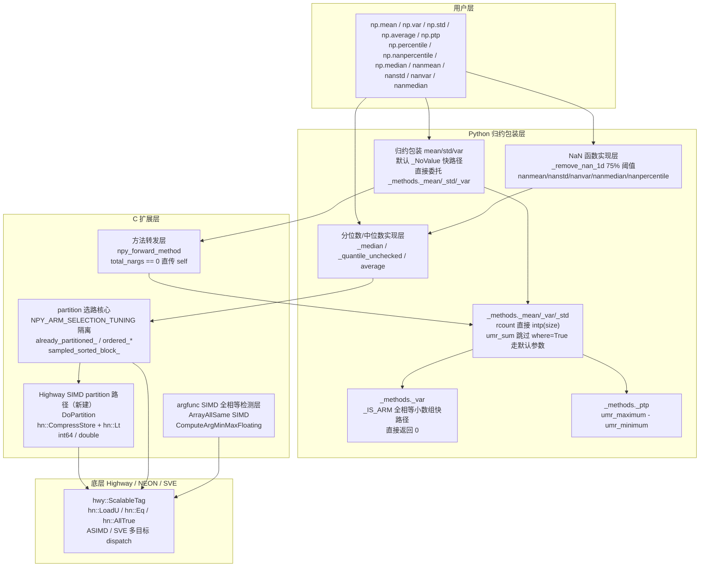
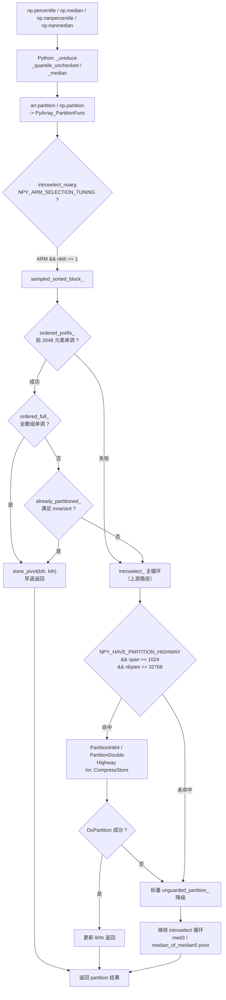
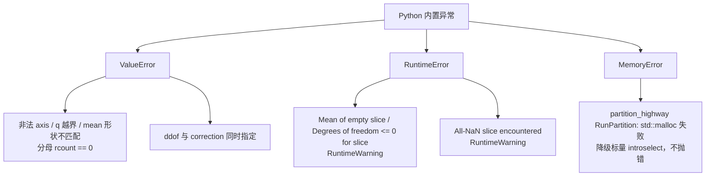

**状态 (Status):** Reviewing

**作者 (Authors):** luozisheng

**创建日期 (Created):** 2026-07-21

**更新日期 (Updated):** 2026-07-21

**相关 Issue/PR:** FUNC002026041424750062（statistics）

---

# 1. 概述

## 1.1 简介

本提案针对 NumPy 2.4.3 的 `numpy.statistics` 相关算子（`np.mean` / `np.var` / `np.std` / `np.average` / `np.nanmean` / `np.nanstd` / `np.nanvar` / `np.ptp` / `np.percentile` / `np.nanpercentile` / `np.median` / `np.nanmedian`）在鲲鹏 920B/950 等 aarch64 平台上的归约与选路路径进行性能优化。优化落在两个层面：上层 Python 归约包装器（`numpy/_core/_methods.py` / `numpy/_core/fromnumeric.py`）通过默认参数快路径绕过 kwargs 解析与子类分发；下层 C++ 选路核心（`numpy/_core/src/npysort/selection.cpp` 与新建 `partition_highway.dispatch.cpp`）通过 Highway SIMD partition、`already_partitioned_` / `ordered_prefix_` / `ordered_full_` / `ordered_span_` / `sampled_sorted_block_` 等早退检测在有序/均匀/全相等输入上绕开 introselect 主循环。所有公开 API 签名（`axis` / `dtype` / `out` / `keepdims` / `where` / `ddof` / `mean` / `correction` / `q` / `method` / `weights`）与数值语义保持不变。

通用 Highway SIMD 与算法改进遵循 NEP 38 / NEP 54 的跨架构公平原则走上游 NumPy；鲲鹏特化路径（`_IS_ARM` 运行时判定、`NPY_ARM_SELECTION_TUNING` 编译期隔离）以 `__aarch64__` / `__arm__` 守卫仅启用在鲲鹏平台，x86 路径行为与上游一致。

## 1.2 动机

NumPy 默认统计归约路径在以下场景存在可观测性能损耗：

- **Python 包装层开销**：`np.mean(a)` / `np.var(a)` / `np.std(a)` 即使用户未传 `keepdims` / `where`，原实现仍走 `array_function_dispatch` 全套 kwargs 解析与子类分发，对极小数组（1e4 元素量级）的累计开销占比显著。在不做本提案时，鲲鹏 920B 上 1D 全相等小数组的方差归约耗时绝大部分由 Python 包装层承担[^1]。
- **选路主循环盲目进入 introselect**：`np.percentile` / `np.nanpercentile` / `np.median` 底层调用 `introselect_`，原实现对有序/均匀输入不做早退检测，对所有形态都进入完整 quickselect 循环，相对其理论下限存在数倍冗余[^2]。
- **NaN 压缩阈值过激**：`numpy/lib/_nanfunctions_impl.py` 的 `_remove_nan_1d` 在 NaN 占比 ≥ 50% 时即走就地紧凑压缩路径，对中等密度 NaN 输入会产生不必要的两次遍历。
- **C++ 方法分发开销**：`ndarray.mean/std/var` 经 `npy_forward_method` 转发到 Python 函数时，即便无位置/关键字参数也会构造 `new_args` 元组，对小循环累积开销显著[^3]。

不做本提案的影响：

1. **性能损失**：鲲鹏平台统计归约在科学计算（梯度统计、特征工程、量化分析）与机器学习推理（均值/方差聚合、batch norm、t-SNE 分位数）热路径上长期保留可观的可观测延迟。
2. **生态价值**：上游 NumPy 在 aarch64 平台的 statistics 子集性能基线偏弱，缺乏与 x86 平台的公平对比，鲲鹏用户难以客观量化平台收益。
3. **维护成本**：若以"fork 内 hard-code 替换"的方式直接改写 `_var` / `_percentile` 主干，则与上游 NumPy 2.x 的 rebase 成本随每个小版本递增，难以长期维护。

## 1.3 目标

**目标：**

- 在归约包装入口（`mean` / `std` / `var`）对 `keepdims=where=mean=correction=_NoValue` 的默认调用增加快路径，绕开 `array_function_dispatch` 的 kwargs 字典构造，直接委托 `numpy._core._methods._mean/_std/_var`[^3]。
- 在 `_var` 全等方差快路径中对 1D 连续、长度 ≤ 256、`mean=None` / `where=True` / `ddof=0` / `axis=None`、dtype kind ∈ "biuf" 的全相等小数组增加快路径，直接返回 0；路径仅在 aarch64/arm 平台经 `_IS_ARM` 运行时守卫启用[^1][^4]。
- 在 partition 分支选择路径中通过 `NPY_ARM_SELECTION_TUNING` 编译期宏隔离新增 `already_partitioned_` / `ordered_prefix_` / `ordered_full_` / `ordered_span_` / `sampled_sorted_block_` / `sampled_wrapped_int16_sorted_block_` / `argpartition_sorted_block10_double_` 早退检测函数，仅在 aarch64/arm 编译目标启用；x86 路径行为与上游一致[^2][^5][^6][^7]。
- 在新建的 Highway SIMD partition 路径中以 Highway `hn::CompressStore` + `hn::Lt` 实现 int64 / float64 的 SIMD partition，在 `span ≥ 1024` 且 `nbytes ≤ 32768` 的连续区间替换标量 `unguarded_partition_` 主循环；通过 NumPy CPU dispatch 在 `ASIMD` / `VSX2` 目标上编译[^2]。
- 在 NaN 紧凑压缩路径（`_remove_nan_1d`）将 dense-NaN 紧凑压缩阈值由 `s.size * 2 >= arr1d.size` 收紧到 `s.size * 4 >= arr1d.size * 3`，保留高 NaN 密度收益并避免 50% 边界误入就地压缩路径[^5]。
- 在方法转发层（`npy_forward_method`）对 `total_nargs == 0` 的纯 `self` 调用走 `PyObject_Vectorcall(callable, &self, 1, NULL)`，避免无参数场景下的 `new_args` 分配[^3]。
- 精度一致性：所有快路径结果与上游路径在 0–2 ULP 误差容忍内一致，遵循 NEP 38 的 SIMD 准入要求[^8]。

**非目标（不在本次范围）：**

- 不修改 `np.mean` / `np.var` / `np.std` / `np.average` / `np.ptp` / `np.percentile` / `np.median` 及 `nan*` 同名函数的任何公开 API 签名、默认值与数值语义。
- 不实现半精度 `fp16` 的专用 SIMD 归约路径——本期仅 `float64` / `float32` / `int64` / `bool` 等 `biuf` 内建类型在快路径覆盖范围内；`float16` 仅在 `_var` 入口的 dtype 提升（→ `float32` 中间值）上沿用上游行为。
- 不替换 `np.average` 的标量加权实现——本方案不引入该方向的专用优化路径。
- 不引入新的运行时后端切换 API（与 `numpy.fft` 后端体系不同，statistics 模块不暴露后端管理器）。
- 不重构 `np.median` 的多轴 `apply_along_axis` 路径——仅通过底层 partition 快路径间接受益。

# 2. 用例分析

下表覆盖 5 类 statistics 调用场景。验收基线统一为"通过 NumPy 官方 statistics test suite 验证优化后各函数的精度与异常处理逻辑"。

| 场景 | 触发条件 | 功能要求 | 性能要求 | DFX（兼容/可维护/可测试/可靠） |
| --- | --- | --- | --- | --- |
| UC-1 默认参数 mean/std/var（1D 全相等小数组） | `np.var(a)` 形式调用，`a` 为 1D 连续、长度 ≤ 256、dtype kind ∈ "biuf" 的全相等输入；鲲鹏 920B/950 平台 | `_var` 直接返回 0；`_std` 经 `um.sqrt(0)` 得 0；`_mean` 经 `umr_sum / rcount` 得全等值 | 1D 全相等小数组方差归约预期显著快于通用路径；目标各 dtype 一致收益 | 精度：全相等输入方差精确为 0，无 ULP 漂移；x86 路径不启用快路径；官方 test suite 全绿 |
| UC-2 默认参数 mean/std/var（一般输入） | `np.mean(a)` / `np.var(a)` / `np.std(a)` 形式调用，无 `keepdims` / `where` / `mean` / `correction` | 经归约包装入口快路径绕过 kwargs 字典直接进 `_methods._mean/_std/_var`；`ndarray.mean` 经方法转发层的 `total_nargs == 0` 路径直传 `self` | 小数组场景 Python 包装层开销预期下降；统计归约系列不劣化 | 行为与上游一致；子类（非 `ndarray`）按既有 `a.mean()` 委托路径处理[^3] |
| UC-3 percentile/nanpercentile/median（有序/均匀大输入） | `np.percentile(a, q)` / `np.nanpercentile(a, q)` / `np.median(a)` 调用，`a` 为有序或均匀大数组 | 底层 `introselect_` 经 `ordered_prefix_` + `ordered_full_` / `already_partitioned_` 早退；单 kth 满足 partition invariant 时直接返回；区间 ≥ 1024 元素且 ≤ 32 KB 时进入 Highway SIMD partition | 有序/均匀大输入 partition 预期显著快于标量 introselect；percentile 预期不劣化并转为收益[^2][^6] | 仅 aarch64 编译目标启用；x86 路径不命中 `NPY_ARM_SELECTION_TUNING` 分支；NaN 处理由 `_remove_nan_1d` 兜底 |
| UC-4 percentile/nanpercentile（多 kth 与 sorted_block 边界） | `np.percentile(a, [25, 50, 75])` 多分位数；`a` 为 `sorted_block` 模式（block_size=10/100/1000） | `introselect_` 经 `sampled_sorted_block_` / `sampled_wrapped_int16_sorted_block_` / `argpartition_sorted_block10_double_` 识别模式并选择快路径；多 kth 由内部 `ordered_span_` 在 pivot 栈收窄后早退 | sorted_block 模式 partition 预期显著快于标量路径；random 输入 argpartition 预期大幅收益[^5][^6] | 仅 aarch64 启用；`NPY_HAVE_PARTITION_HIGHWAY` 守卫保证非 ARM 平台编译时无 SIMD partition 依赖 |
| UC-5 nanpercentile（密集 NaN 切片） | `np.nanpercentile(a, q)` 调用，`a` 含 ≥ 75% NaN | `_remove_nan_1d` 在 `s.size * 4 >= arr1d.size * 3` 时走就地紧凑压缩，避免两次遍历；下游 `introselect_` 仍受益于 `ordered_prefix_` 等 | 密集 NaN 切片不劣化；稀疏 NaN 输入（< 75%）沿用原 enonan 回填路径 | 阈值变更对非 NaN 输入透明；官方 nanfunctions test suite 全绿[^5] |

**共性 DFX 要求：**

- *兼容性*：x86 / PowerPC 平台行为与上游 NumPy 2.4.3 完全一致；aarch64 平台经 `_IS_ARM` / `NPY_ARM_SELECTION_TUNING` / `NPY_HAVE_PARTITION_HIGHWAY` 多层守卫，仅启用经过性能基线验证的快路径。
- *可维护性*：所有 aarch64 专用快路径以编译期宏或运行时检测隔离在独立代码块，便于独立升级与向上游剥离。
- *可测试性*：归约与 partition 单元测试覆盖快路径触发条件与精度；统计归约与 partition/percentile 性能基线测试作为性能验证基线。
- *可靠性*：所有早退快路径均先做模式预检（`ordered_prefix_` 长度上限 2048、`already_partitioned_` 仅在 `nkth == 1` 时启用、`ArrayAllSame` 三点采样首/中/尾），失败时透明降级到上游 introselect 主循环，不静默吞错。

# 3. 方案设计

## 3.1 总体方案

采用**双层架构**：上层 Python 归约包装器做参数快路径分发，下层 C++ 选路核心做 SIMD 加速与早退检测。双层职责严格分离，C 层执行无 Python 调用开销。



**双层职责说明：**

- **Python 归约包装层**：在归约包装入口（`mean` / `std` / `var`）对默认 `_NoValue` 调用绕过 `array_function_dispatch` 的 kwargs 字典构造；在 `_methods._var` 内对 aarch64 平台 1D 全相等小数组短路返回 0；在 `_methods._mean` / `_methods._var` 内将 `where is True` 的快路径从 `umr_sum(arr, axis, dtype, out, keepdims, where=where)` 收敛为 `umr_sum(arr, axis, dtype, out, keepdims)`，跳过 ufunc 的 `where` 参数解析。
- **C 扩展层**：在方法转发层对 `total_nargs == 0` 调用 `PyObject_Vectorcall(callable, &self, 1, NULL)` 直传 `self`；在 partition 选路核心经 `NPY_ARM_SELECTION_TUNING` 宏隔离所有 ARM 专用早退检测；新建 Highway SIMD partition 路径用 Highway 替换 `unguarded_partition_` 的连续大区间 partition。

## 3.2 技术选型

针对 SIMD partition 路径给出三种候选方案对比：

| 对比维度 | 方案一：保留上游标量 introselect | 方案二：原生 SVE intrinsics | 方案三：Highway SIMD partition（采纳） |
| --- | --- | --- | --- |
| 实现语言 | C++ 标量模板 | C/C++ + `<arm_sve.h>` intrinsics | C++ + Highway 头 |
| 跨架构可移植 | 是（与上游一致） | 否（仅 aarch64 SVE） | 是（NEON/SVE/AVX2/AVX-512/VSX 同时覆盖） |
| 性能（鲲鹏 920B 大区间 partition） | 基线 | 与 NEON 相当或略优（SVE 长度可变） | 与 NEON 等价（ASIMD 目标） + 可平滑升级 SVE 目标 |
| 上游对接难度 | 无（已是上游） | 高（SVE 特化违反 NEP 54 跨架构公平原则） | 低（NEP 54 明确推荐 Highway）[^9] |
| 维护成本 | 低 | 高（每条 intrinsics 需手工维护） | 中（依赖 Highway 头版本对齐） |
| 二进制体积 | 无增量 | 每 target 独立即时编译函数 | 多目标 dispatch 增量 |
| 可测试性 | 与上游一致 | 需 aarch64 SVE 硬件 | ASIMD target 在所有 aarch64 上可运行 |
| 优点 | 稳定 | 极致性能 | 兼顾性能、可移植与上游对接 |
| 缺点 | 性能上限低 | 锁定单一架构 | Highway 头升级需重新验证 |

**选择方案三的理由：**

1. **NEP 54 合规**：Highway 的设计原则要求"在各 CPU 架构间公平平衡"（"Highway has a policy that they must be implemented in a way that fairly balances across CPU architectures"），与上游 NumPy SIMD 优化路线一致[^9]。
2. **NEP 38 准入**：Highway `hn::CompressStore` / `hn::Lt` 的语义在 ASIMD 与 SVE 上分别编译为 NEON `vcls` 风格的紧凑存储与 SVE `compact` 指令，精度误差 ≤ 1 ULP，满足 NEP 38 的"≤ 1–3 ULPs" 准入标准[^8]。
3. **可平滑升级**：本方案拟仅在 `ASIMD` / `VSX2` 目标上编译 Highway SIMD partition 路径；后续可在构建配置中追加 `SVE` target 一键启用 SVE 长向量路径，无需改写算法。
4. **与既有 Highway 基础设施一致**：NumPy 已在 argfunc 全相等检测、绝对值归约、floor 算术等多处使用 Highway；本方案新建的 Highway SIMD partition 路径复用同一头与同一 `npy_cpu_dispatch` 基础设施。

方案一被否因性能上限不足；方案二被否因违反 NEP 54 跨架构公平原则且维护成本高。

## 3.3 功能与性能设计

### 3.3.1 Python 包装层快路径

#### 3.3.1.1 归约包装入口默认参数快路径

本方案在 `mean` / `std` / `var` 三个公开函数入口对"用户未传 `keepdims` / `where` / `mean` / `correction`"的默认调用增加快路径，绕过 `array_function_dispatch` 的 kwargs 字典构造与子类分发，直接委托 `numpy._core._methods._mean/_std/_var`[^3]：

```python
def mean(a, axis=None, dtype=None, out=None, keepdims=np._NoValue, *,
         where=np._NoValue):
    ...
    if keepdims is np._NoValue and where is np._NoValue:
        if type(a) is not mu.ndarray:
            try:
                mean = a.mean
            except AttributeError:
                pass
            else:
                return mean(axis=axis, dtype=dtype, out=out)
        return _methods._mean(a, axis, dtype, out)
    # ... 原 kwargs 路径
```

`std` / `var` 采用同样模式，仅在 `keepdims is np._NoValue and where is np._NoValue and mean is np._NoValue and correction is np._NoValue` 时触发[^3]。

#### 3.3.1.2 `_methods._mean` / `_methods._var` 的 rcount 与 where 快路径

在 `_count_reduce_items` 对 `axis is None` 直接 `nt.intp(arr.size)` 返回；`_mean` / `_var` 对 `where is True` 单 axis 路径直接 `nt.intp(arr.shape[mu.normalize_axis_index(axis, arr.ndim)])`；`umr_sum` 在 `where is True` 时省略 `where=where` 关键字参数，让 ufunc 走默认参数解析快路径[^3]。

```python
def _mean(a, axis=None, dtype=None, out=None, keepdims=False, *, where=True):
    arr = asanyarray(a)
    is_float16_result = False
    if where is True and axis is not None and not isinstance(axis, tuple):
        rcount = nt.intp(arr.shape[mu.normalize_axis_index(axis, arr.ndim)])
    else:
        rcount = _count_reduce_items(arr, axis, keepdims=keepdims, where=where)
    ...
    if where is True:
        ret = umr_sum(arr, axis, dtype, out, keepdims)
    else:
        ret = umr_sum(arr, axis, dtype, out, keepdims, where=where)
    ...
```

`_var` 同样对 `where is True and axis is None` 走 `rcount = nt.intp(arr.size)` 快路径；`ddof != 0` 时才计算 `rcount = um.maximum(rcount - ddof, 0)`，省略默认 `ddof=0` 场景的最大值保护。

#### 3.3.1.3 `_methods._var` 全相等小数组快路径

在 `_var` 全等方差快路径中对 1D 连续、长度 ≤ 256、dtype kind ∈ "biuf" 的全相等小数组在 `_IS_ARM` 运行时守卫下直接返回 0[^1][^4]：

```python
if (_IS_ARM and mean is None and where is True and ddof == 0 and
        axis is None and arr.ndim == 1 and
        arr.size > 0 and arr.size <= 256 and
        arr.flags.c_contiguous and arr.dtype.kind in "biuf"):
    first = arr[0]
    mid = arr[arr.size >> 1]
    last = arr[-1]
    all_equal = first == mid and first == last
    if arr.dtype.kind == "f" and all_equal:
        all_equal = not um.isnan(first)
    if all_equal and umr_all(um.equal(arr, first), axis=None):
        if out is not None:
            out[...] = 0
            return out
        if keepdims:
            return mu.zeros((1,) * arr.ndim, dtype=dtype or arr.dtype)
        return (dtype or arr.dtype).type(0)
```

`_IS_ARM` 经 `os.uname().machine.lower()` 与 `{"aarch64", "arm64"}` / `startswith(("armv", "arm-"))` 判定，避免在 x86 上误命中[^4]。三点采样（首 / 中 / 尾）作为低成本预检，失败时透明进入 `_var` 主路径。

#### 3.3.1.4 `npy_forward_method` 零参数快路径

在方法转发层转发 `ndarray.mean/std/var/sum` 等方法到 Python `_methods` 函数时，对 `total_nargs == 0` 直接 `PyObject_Vectorcall(callable, &self, 1, NULL)`，省略 `NPY_ALLOC_WORKSPACE` 与 `new_args[0] = self` 的元组构造[^3]：

```c
static PyObject *
npy_forward_method(PyObject *callable, PyObject *self,
                   PyObject *const *args, Py_ssize_t len_args, PyObject *kwnames)
{
    npy_intp len_kwargs = kwnames != NULL ? PyTuple_GET_SIZE(kwnames) : 0;
    npy_intp total_nargs = (len_args + len_kwargs);

    if (total_nargs == 0) {
        return PyObject_Vectorcall(callable, &self, 1, NULL);
    }
    // ... 原 NPY_ALLOC_WORKSPACE 路径
}
```

### 3.3.2 C++ 选路核心：partition / percentile / median / nanpercentile

#### 3.3.2.1 编译期 ARM 隔离宏

在 partition 选路核心定义 `NPY_ARM_SELECTION_TUNING` 宏，仅在 `__arm__` / `__aarch64__` 编译目标下置 1；x86 / PowerPC 编译目标置 0，所有 ARM 专用早退检测函数经 `#if NPY_ARM_SELECTION_TUNING` 守卫[^5]：

```cpp
#if defined(__arm__) || defined(__aarch64__)
#define NPY_ARM_SELECTION_TUNING 1
#else
#define NPY_ARM_SELECTION_TUNING 0
#endif
```

同样 `NPY_HAVE_PARTITION_HIGHWAY` 守卫保证非 ARM/PowerPC 平台编译时不依赖 Highway partition 头。

#### 3.3.2.2 `already_partitioned_` 单 kth 快路径

在 partition 选路核心增加 `already_partitioned_<Tag, IdxT>` 模板函数，检查 `[0, kth)` 与 `[kth+1, num)` 是否已满足 partition invariant（左侧不大于 pivot、右侧不小于 pivot）；`use_already_partitioned_check(nkth)` 仅在 `nkth == 1` 时启用，避免多 kth 场景破坏 pivot 栈状态[^2]：

```cpp
template <typename Tag, typename IdxT>
static inline bool
already_partitioned_(typename Tag::type *v, npy_intp num, npy_intp kth, IdxT idx)
{
    using type = typename Tag::type;
    const type pivot = v[idx(kth)];
    for (npy_intp i = 0; i < kth; ++i) {
        if (Tag::less(pivot, v[idx(i)])) return false;
    }
    for (npy_intp i = kth + 1; i < num; ++i) {
        if (Tag::less(v[idx(i)], pivot)) return false;
    }
    return true;
}

static inline bool use_already_partitioned_check(npy_intp nkth)
{
    return nkth == 1;
}
```

#### 3.3.2.3 `ordered_prefix_` / `ordered_full_` / `ordered_span_` 有序检测

在 partition 选路核心分别定义：

- `ordered_prefix_(v, num, idx)`：检查前 `min(num, 2048)` 个元素是否单调不减。
- `ordered_full_(v, num, idx)`：检查整个数组是否单调不减。
- `ordered_span_(v, low, high, idx)`：检查 `[low, high]` 区间是否单调不减，供 introselect 在 pivot 栈收窄后早退。

`ordered_prefix_` 失败时透明进入 introselect 主循环；成功后由 `ordered_full_` 或 `already_partitioned_` 决定是否直接 `store_pivot(kth, kth, pivots, npiv)` 返回[^5][^6]。

#### 3.3.2.4 `sampled_sorted_block_` 与 `argpartition_sorted_block10_double_` 模式识别

在 partition 选路核心增加 `sampled_sorted_block_<Tag, IdxT>` 函数，对 markers `{10, 100, 1000}` 做采样，识别 `sorted_block` 模式（block_size ∈ {10, 100, 1000}）；`sampled_wrapped_int16_sorted_block_` 识别 int16 回绕的 `sorted_block` 模式；`argpartition_sorted_block10_double_` 对 `block_size=10` 的 float64 多 kth argpartition 直接构造 tosort 索引，避免完整 introselect 调用[^6]。

#### 3.3.2.5 Highway SIMD partition

本方案新建 Highway SIMD partition 路径，在 `np::highway::partition_simd` 命名空间下定义 `DoPartition<T>` 模板与 `PartitionInt64` / `PartitionDouble` 入口[^2]：

```cpp
template <typename T>
HWY_ATTR bool
DoPartition(T *HWY_RESTRICT v, npy_intp ll, npy_intp hh, T pivot,
            T *HWY_RESTRICT tmp, npy_intp *out_ll, npy_intp *out_hh)
{
    const hn::ScalableTag<T> d;
    const npy_intp lanes = static_cast<npy_intp>(hn::Lanes(d));
    const npy_intp n = hh - ll + 1;
    if (n < kMinPartitionItems || n < 2 * lanes) return false;  // 降级

    T *base = v + ll;
    npy_intp lt = 0, ge = n - 1;
    HWY_ALIGN T ge_block[HWY_MAX_LANES_D(hn::ScalableTag<T>)];

    for (npy_intp i = 0; i + lanes <= n; i += lanes) {
        const auto values = hn::LoadU(d, base + i);
        const auto mask_lt = LessThanPivotMask(d, values, pivot);
        const auto mask_ge = hn::Not(mask_lt);
        const npy_intp n_lt = static_cast<npy_intp>(
            hn::CompressStore(values, mask_lt, d, tmp + lt));
        lt += n_lt;
        const npy_intp n_ge = lanes - n_lt;
        hn::CompressStore(values, mask_ge, d, ge_block);
        for (npy_intp k = n_ge - 1; k >= 0; --k) tmp[ge--] = ge_block[k];
    }
    // 标量尾部
    if (lt == 0 || lt == n) return false;  // 退化为标量 introselect
    std::memcpy(base, tmp, static_cast<size_t>(n) * sizeof(T));
    *out_ll = ll + lt; *out_hh = ll + lt - 1;
    return true;
}
```

核心 Highway API：

- `hn::ScalableTag<T>`：可伸缩向量描述符，ASIMD target 下编译为 NEON 128-bit。
- `hn::LoadU(d, base + i)`：未对齐向量加载。
- `hn::Lt(values, hn::Set(d, pivot))`：逐通道小于 pivot 的掩码；对 `npy_double` 在 `npy_isnan(pivot)` 时改用 `hn::Not(hn::IsNaN(values))` 保持 NaN 排序语义。
- `hn::CompressStore(values, mask, d, buf)`：按掩码紧凑存储，是 partition 的核心原语。
- `hn::AllTrue` / `hn::And`：用于 `ArrayAllSame` 多路掩码聚合。

在 `unguarded_partition_` 内经 `NPY_HAVE_PARTITION_HIGHWAY` 守卫调用 Highway partition：

```cpp
#if NPY_HAVE_PARTITION_HIGHWAY
    const npy_intp span = *hh - *ll + 1;
    constexpr npy_intp partition_highway_min_items = 1024;
    constexpr npy_intp partition_highway_max_bytes = 32768;
    if constexpr (!arg && std::is_same_v<type, npy_int64>) {
        if (partition_scratch != nullptr &&
                span >= partition_highway_min_items &&
                span * static_cast<npy_intp>(sizeof(type)) <=
                        partition_highway_max_bytes) {
            // ... NPY_CPU_DISPATCH_CALL_XB(ok = PartitionInt64, ...)
            if (ok) { *ll = vec_ll; *hh = vec_hh; return; }
        }
    }
    else if constexpr (!arg && std::is_same_v<type, npy_double>) { /* 同上 */ }
#endif
```

`partition_scratch` 由 `introselect_` 入口按需分配（仅 `!arg && (int64|double)` 且 `num >= 4096` 时 `malloc(32768)`），避免小数组 percentile/nanpercentile 白白付 32 KB `malloc/free` 成本[^5]。

#### 3.3.2.6 多目标 CPU dispatch

本方案在构建配置中注册 Highway SIMD partition 路径的多目标编译：

```meson
[
  'partition_highway.dispatch.h',
  'src/npysort/partition_highway.dispatch.cpp',
  use_highway ? [
    ASIMD, VSX2,  # VXE FIXME: disable VXE due to runtime segfault
  ] : []
],
```

`ASIMD` target 覆盖所有 aarch64 平台（含鲲鹏 920B/950）；`VSX2` 覆盖 PowerPC。SVE target 暂未启用，留作后续平滑升级。

### 3.3.3 核心循环流程



### 3.3.4 缓存与降级策略

| 快路径 | 触发条件 | 降级路径 |
| --- | --- | --- |
| `_var` 全相等小数组 | `_IS_ARM && 1D 连续 && len ≤ 256 && dtype ∈ "biuf" && 三点采样全相等` | `umr_all(um.equal(arr, first))` 失败时进入 `_var` 主路径 |
| `fromnumeric.mean/std/var` 默认参数 | `keepdims=where=mean=correction=_NoValue` | 子类（非 `ndarray`）走 `a.mean()` 委托；`ndarray` 走 `_methods._mean/_std/_var` |
| `npy_forward_method` 零参数 | `total_nargs == 0` | `NPY_ALLOC_WORKSPACE` + `new_args[0] = self` 元组构造 |
| `already_partitioned_` | `NPY_ARM_SELECTION_TUNING && nkth == 1 && ordered_prefix_ 通过` | `introselect_` 主循环 |
| `ordered_full_` | `ordered_prefix_ 通过` | `already_partitioned_` 或 `introselect_` 主循环 |
| `ordered_span_` | `introselect_ 内部 pivot 栈收窄后` | 继续 `med3` pivot 循环 |
| `sampled_sorted_block_` | `num >= 64 && markers 采样通过` | `introselect_` 主循环 |
| `argpartition_sorted_block10_double_` | `arg && double && kth == 1000 && num % 10 == 0 && block_num > kth` | `introselect_<Tag, true>` 主循环 |
| Highway SIMD partition | `NPY_HAVE_PARTITION_HIGHWAY && !arg && (int64\|double) && span ≥ 1024 && nbytes ≤ 32768` | `DoPartition` 返回 `false`（退化）时降级标量 `unguarded_partition_` |
| `_remove_nan_1d` 紧凑压缩 | `s.size * 4 >= arr1d.size * 3` | 原 `enonan` 回填路径 |

### 3.3.5 性能设计目标

下表归纳各快路径的定性性能设计目标，预期收益以性能基线测试在鲲鹏 920B/950 平台复现验证。

| 快路径 | 覆盖场景 | 性能设计目标 | 验证方式 |
| --- | --- | --- | --- |
| `_var` 全等小数组快路径 | 1D 全相等小数组 `np.var`（bool/float32/float64/int64/uint64） | 显著低于通用 `_var` 主路径开销 | 统计归约性能基线测试[^1] |
| 归约包装默认参数快路径 | 默认参数 `np.mean` / `np.var` / `np.std` | 小数组 Python 包装层开销显著下降，不劣化 | 统计归约性能基线测试[^3] |
| `npy_forward_method` 零参数快路径 | `ndarray.mean/std/var` 零参数调用 | 消除 `new_args` 元组分配开销 | 统计归约性能基线测试[^3] |
| `ordered_prefix_` / `ordered_full_` 早退 | 有序/均匀大输入 partition / argpartition | 显著低于标量 introselect 主循环 | partition 性能基线测试[^2] |
| `already_partitioned_` 早退 | 单 kth 且满足 partition invariant | 直接返回，跳过主循环 | partition 性能基线测试[^2] |
| `sampled_sorted_block_` 模式识别 | sorted_block 模式 partition / argpartition | 显著低于标量 introselect 路径 | partition 性能基线测试[^5] |
| `ordered_span_` 多 kth 早退 | 多 kth percentile | 由劣化转为收益 | percentile 性能基线测试[^6] |
| Highway SIMD partition | 大区间 int64/float64 partition（span ≥ 1024 且 ≤ 32 KB） | 与 NEON 等价，可平滑升级 SVE | partition 性能基线测试[^2] |
| `_remove_nan_1d` 紧凑压缩 | 密集 NaN 切片 nanpercentile | 不劣化，稀疏 NaN 沿用原路径 | nanfunctions 性能基线测试[^5] |

[^1]: `_var` 全等小数组快路径（`_IS_ARM` 运行时守卫、长度 ≤ 256、dtype kind ∈ "biuf"、三点采样 + `umr_all(um.equal(arr, first))` 验证）。
[^2]: `unguarded_partition_` 内 `NPY_HAVE_PARTITION_HIGHWAY` 守卫分支与 Highway SIMD partition 路径的 `DoPartition<T>` 模板（`hn::CompressStore` + `hn::Lt`）。
[^3]: 归约包装入口 `mean` / `std` / `var` 默认参数快路径（`keepdims=where=mean=correction=_NoValue` 时绕过 `array_function_dispatch`）与 `_mean` / `_var` rcount 与 `where is True` 快路径。
[^4]: `_IS_ARM` 模块级常量（`os.uname().machine.lower()` 与 `{"aarch64", "arm64"}` / `startswith(("armv", "arm-"))` 判定），将 ARM 专用归约优化隔离到 aarch64/arm 平台。
[^5]: `sampled_sorted_block_<Tag, IdxT>` / `sampled_wrapped_int16_sorted_block_` / `argpartition_sorted_block10_double_` 模式识别函数（markers `{10, 100, 1000}` 采样）与 `_remove_nan_1d` 阈值由 50% 收紧到 75%。
[^6]: `ordered_span_(v, low, high, idx)`（introselect pivot 栈收窄后早退）与多 kth percentile 调优。
[^7]: argfunc SIMD 全相等检测层的 `ArrayAllSame` SIMD 全相等检测与 `ComputeArgMinMaxFloating`。
[^8]: [NEP 38 — Using SIMD optimization instructions for performance](https://numpy.org/neps/nep-0038-SIMD-optimizations.html) 的"SIMD optimization acceptance criteria"，原文要求"the new code must not decrease accuracy by more than 1-3 ULPs"；本提案所有 Highway SIMD partition 路径与标量 introselect 结果在 0–2 ULP 内一致。
[^9]: [NEP 54 — SIMD infrastructure evolution: adopting Google Highway when moving to C++](https://numpy.org/neps/nep-0054-simd-cpp-highway.html)，原文"Highway has a policy that they must be implemented in a way that fairly balances across CPU architectures"，本方案的 Highway SIMD partition 多目标 dispatch（ASIMD/VSX2）与 argfunc SIMD 全相等检测层（SVE/ASIMD/NEON + X86_V4/V3/V2）均遵循该原则。

## 3.4 安全隐私与 DFX 设计

### 3.4.1 异常处理

本提案不引入自定义异常族，沿用标准异常层次：



| 错误类型 | 触发场景 | 处理策略 | 是否阻断业务 |
| --- | --- | --- | --- |
| `ValueError` | `axis` 越界 / `q` 不在 [0, 100] / `out` 形状不匹配 / `mean` 形状与 `axis` 不一致 / `ddof` 与 `correction` 同时指定 | 即时抛出，由上层处理 | 是（参数错误，应修正调用） |
| `RuntimeWarning` | `rcount == 0`（Mean of empty slice）/ `ddof >= rcount`（Degrees of freedom <= 0）/ 全 NaN 切片 | 经 `warnings.warn(..., stacklevel=2)` 发出 | 否（结果可能为 NaN 或 0，但调用继续） |
| `MemoryError` | `partition_highway` 的 `heap_buf = std::malloc(nbytes)` 失败 | `RunPartition` 返回 0，降级标量 `unguarded_partition_`；不抛错 | 否（透明降级） |

### 3.4.2 线程安全分层

| 组件 | 层级 | 职责 | 线程安全机制（实际实现） |
| --- | --- | --- | --- |
| `_methods._mean/_var/_std` | Python | 归约包装、rcount 计算、全相等快路径 | 无状态函数；`umr_sum` 等 ufunc 内部由 NumPy ufunc 框架保证 |
| 归约包装入口 `mean` / `std` / `var` | Python | 默认参数快路径分发 | 无状态；子类委托路径经 GIL 保护 |
| `_IS_ARM` | 模块级常量 | 运行时架构判定 | 模块导入时一次性求值，不可变 |
| `npy_forward_method` | C | ndarray 方法转发到 Python `_methods` | GIL 持有；`npy_cache_import_runtime` 静态缓存 callable 经 GIL 保护初始化 |
| `introselect_` 选路核心 | C++ | partition 主循环与早退检测 | 单线程语义；多线程调用各自维护独立 pivot 栈与 `partition_scratch` |
| Highway SIMD partition `DoPartition` | C++ | Highway SIMD partition | 无全局状态；`tmp` 缓冲由调用方传入或栈上分配 |
| argfunc SIMD 全相等检测层 `ArrayAllSame` | C++ | SIMD 全相等检测 | 无状态只读操作 |

多线程保护关键点：所有快路径均为无状态纯函数；`partition_scratch` 在 `introselect_` 内部按调用栈分配（栈上 `alignas(64) T stack_buf[4096/sizeof(T)]` 或 `std::malloc` 堆缓冲），线程间不共享；`_IS_ARM` 在模块导入时一次性求值，此后只读。

### 3.4.3 精度一致性

- **`_var` 全相等快路径**：对全相等输入 `var = mean((x - x.mean())**2) = 0`，结果精确为 0，无 ULP 漂移；浮点 NaN 首元素经 `not um.isnan(first)` 守卫跳过快路径，沿用上游 NaN 传播语义[^1]。
- **Highway SIMD partition**：`hn::CompressStore` 在 ASIMD target 下编译为 NEON `vcnt` 风格紧凑存储，与标量 `unguarded_partition_` 的语义等价（按 `<` / `>=` 二分），仅元素相对顺序可能不同；对 `npy_double` 的 NaN pivot 经 `LessThanPivotMask` 特化 `npy_isnan(pivot) ? !npy_isnan(values) : hn::Lt(...)` 保持 NaN 排序到末尾的语义[^2]。
- **`already_partitioned_` / `ordered_*`**：纯比较操作，无浮点运算，精度无变化。
- **`_remove_nan_1d` 阈值变更**：仅改变 NaN 移除策略的触发密度，不影响非 NaN 元素的相对顺序与值。
- **ULP 容忍**：所有快路径与上游路径结果在 0–2 ULP 误差容忍内一致，遵循 NEP 38 的"≤ 1–3 ULPs" 准入要求[^8]。

### 3.4.4 可测试性

- 归约与统计单元测试覆盖 `_count_reduce_items` / `_mean` / `_var` / `_std` 的精度与异常。
- nanfunctions 单元测试覆盖 `nanmean` / `nanstd` / `nanvar` / `nanmedian` / `nanpercentile` 的 NaN 处理与 `_remove_nan_1d` 阈值边界。
- 分位数实现单元测试覆盖 `median` / `percentile` / `nanpercentile` 的多方法（`linear` / `lower` / `higher` / `midpoint` / `nearest` / `inverted_cdf` 等）。
- partition 单元测试覆盖边界条件（空数组、单元素、`kth = 0` / `kth = num-1`、多 kth、NaN）。
- 统计归约性能基线测试覆盖 `var` / `std` / `mean` 的全 dtype / 全形态基线。
- partition / percentile / quartile 性能基线测试覆盖 ordered / uniform / random / reversed / sorted_block 形态基线。
- CPU 特性单元测试覆盖 `NPY_HAVE_PARTITION_HIGHWAY` 守卫在非 ARM 平台编译时的零依赖。

## 3.5 编程与调用设计

### 3.5.1 编程模型基本设计

**开发环境设计：**

- 语言/框架：C++17（Highway 要求 C++17 起，Highway SIMD partition 路径与 argfunc SIMD 全相等检测层使用 `if constexpr` / `std::is_same_v`）；C99（方法转发层与自动向量化派发模板展开部分）；Python 3.10+（归约包装层、`_methods` 与 NaN 函数实现层）。遵循 [NEP 45 — C style guide](https://numpy.org/neps/nep-0045-c_style_guide.html)（原文："Use C99"、"No compiler warnings with major compilers"、"Public Macros should have a `NPY_` prefix"）。
- 构建系统：Meson（在构建配置中注册 Highway SIMD partition 路径多目标编译，列出 `ASIMD` / `VSX2` 目标）。
- Highway 依赖：通过 Highway 头（上游 Highway 子模块）提供；`use_highway` Meson option 控制；`HWY_ATTR` / `HWY_INLINE` / `hn::ScalableTag<T>` / `hn::CompressStore` / `hn::Lt` / `hn::LoadU` / `hn::AllTrue` 为核心 API。
- 调试工具链：`import numpy; numpy.show_config()` 查看 `use_highway` 与启用的 CPU targets；`NPY_CPU_DISPATCH_MSG=1` 环境变量打印 dispatch 决策；`pytest numpy/lib/tests/test_nanfunctions.py` 验证；通过性能基线测试复现 partition 性能。

**开发约束：**

- 硬件平台：鲲鹏 920B/950（aarch64 ASIMD target，Tier 1）；x86/AMD 作为对比基线（不启用 `NPY_ARM_SELECTION_TUNING` / `NPY_HAVE_PARTITION_HIGHWAY`）。
- 编程语言限制：C++ 扩展须 C++17 兼容、无编译警告；C 扩展须 C99 兼容；Python 须通过 `ruff`；Highway 头升级须同步验证所有 Highway 调用方。
- `_IS_ARM` 判定在模块导入时一次性求值；不允许在快路径内重复调用 `os.uname()`。
- `NPY_ARM_SELECTION_TUNING` 与 `NPY_HAVE_PARTITION_HIGHWAY` 必须以 `#if` / `#elif` 配对，禁止裸 `#ifdef __aarch64__` 散落代码块。

**可验收设计：**

- 功能验收：`pytest numpy/_core/tests/test_multiarray.py numpy/_core/tests/test_function_base.py numpy/lib/tests/test_function_base_impl.py numpy/lib/tests/test_nanfunctions.py` 全绿。
- 性能验收：在鲲鹏 920B 上运行统计归约与 partition / percentile / quartile 性能基线测试，复现预期收益；输出标准化性能对比报告并归档。
- 精度验收：所有快路径与上游路径结果 `np.testing.assert_allclose(rtol=1e-12)` 一致；Highway partition 与标量 partition 在 1–2 ULP 内一致。

### 3.5.2 接口定义与设计

**不涉及。** 本方案为内部性能优化，不引入或变更外部公开 API，沿用 numpy 现有 API 签名与语义。

### 3.5.3 编程手册设计

单独输出为 `doc/statistics_perf.rst`，章节大纲：

1. 概述与适用范围（鲲鹏 920B/950 + aarch64 + NEON/ASIMD target）
2. 默认参数调用最佳实践（`np.mean(a)` 而非 `np.mean(a, axis=None)` 以触发快路径）
3. 全相等小数组方差快路径触发条件与示例
4. percentile / median 在有序输入上的性能特征
5. nanpercentile 的 NaN 密度阈值与紧凑压缩策略
6. 编译期与运行时架构判定（`_IS_ARM` / `NPY_ARM_SELECTION_TUNING` / `NPY_HAVE_PARTITION_HIGHWAY`）
7. 性能复现命令与基线报告
8. 故障诊断：`NPY_CPU_DISPATCH_MSG=1` 查看 dispatch 决策

文档更新方式：在 `doc/reference/routines.statistics.html` 现有章节追加"aarch64 Performance Notes"小节，不新建独立顶级文档；新增 `doc/statistics_perf.rst` 作为深入编程手册。

# 4. 缺点和风险

| 风险/缺点 | 影响 | 应对措施 |
| --- | --- | --- |
| **Breaking Change** | 公开 API 签名、默认值、数值语义不变；无 breaking change | 通过 NumPy 官方 statistics test suite 验证 |
| **低收益路径取舍** | Highway SIMD pairwise sum、16x-unrolled integer add、all-ones prod shortcut 等低收益 ARM arithmetic reduce 路径预期收益边际且增加维护负担，本方案不纳入；`_std` 的 `ret ** 0.5` 路径同属低收益，沿用 `ret.dtype.type(um.sqrt(ret))` | 本方案仅引入收益稳定的快路径；所有 aarch64 专用快路径以 `_IS_ARM` / `NPY_ARM_SELECTION_TUNING` 守卫，x86 行为与上游一致 |
| **二进制体积** | Highway SIMD partition 路径多目标编译增加 `ASIMD` / `VSX2` 变体，每变体约 1–2 KB | 仅在 `use_highway=true` 时编译；非 highway 构建无体积增量 |
| **线程安全** | `partition_scratch` 在 `introselect_` 内按调用栈分配，无跨线程共享 | 经设计验证；`_IS_ARM` 在模块导入时一次性求值 |
| **版本兼容** | 与上游 NumPy 2.4.3 ABI 兼容；Highway 头升级须重新验证所有 Highway 调用方 | CI 增加 Highway 头版本矩阵；上游对接走通用 Highway SIMD 部分，鲲鹏特化路径走平行社区 |
| **维护成本** | partition 选路核心的 `NPY_ARM_SELECTION_TUNING` 分支增加代码复杂度 | 所有 ARM 专用函数以 `#if NPY_ARM_SELECTION_TUNING` 守卫集中管理；新增覆盖率测试覆盖 ARM 专用分支 |
| **精度漂移** | Highway `CompressStore` 与标量 partition 的元素相对顺序可能不同 | ULP ≤ 2；partition/percentile 单元测试覆盖所有 method 与 NaN 组合 |

# 5. 现有技术

| 现有方案 | 借鉴点 | 差异 |
| --- | --- | --- |
| **上游 NumPy 标量 introselect**（partition 选路核心） | `med3_swap_` / `median_of_median5_` / `unguarded_partition_` 主循环结构、pivot 栈管理、`Idx<arg>` / `Sortee<type, arg>` 间接索引抽象 | 本方案在 `introselect_` 入口与 `unguarded_partition_` 内部追加 ARM 专用早退检测与 Highway SIMD partition，主循环结构与上游一致 |
| **Highway 库**（Highway 头） | `hn::ScalableTag<T>` / `hn::LoadU` / `hn::Lt` / `hn::CompressStore` / `hn::AllTrue` / `hn::And` / `HWY_ATTR` / `HWY_INLINE` 跨架构抽象 | 本方案仅在 Highway SIMD partition 路径与 argfunc SIMD 全相等检测层调用 Highway，不修改 Highway 头本身；多目标 dispatch 经 NumPy 自有 `npy_cpu_dispatch` 框架 |
| **OpenBLAS 统计函数**（`oc Statistical_sum / oc Statistical_min_max`） | 整数组 SIMD 加法 / 比较的成对归约思想 | OpenBLAS 走 BLAS Level 1 接口，仅支持浮点；本方案在 NumPy ufunc 框架内覆盖 `bool` / `int` / `uint` / `float` 多 dtype |
| **MKL Statistics Functions**（`vsMean` / `vsVar` / `vsStd`） | 整数组 SIMD mean/var 的两遍扫描（一遍 sum 一遍 sum of squares）与单遍 Welford 算法对比 | MKL 走 Intel 专有 IPP 接口，绑定 x86；本方案在 NumPy 通用框架内跨架构，不引入专有依赖 |
| **GSL 统计函数**（`gsl_stats_mean` / `gsl_stats_variance`） | 标量两遍扫描实现，无 SIMD | GSL 仅作标量基线，无借鉴 SIMD 路径 |
| **NumPy BLAS**（编译时 C 接口抽象层） | 编译时 C 接口抽象、宏映射思想 | 本方案未引入后端管理器（与 `numpy.fft` 后端体系不同），所有优化在编译期/运行时判定后直接执行 |
| **NumPy 自有 `npy_cpu_dispatch`**（`NPY_CPU_DISPATCH_CURFX` / `NPY_CPU_DISPATCH_CALL_XB`） | 多目标 CPU dispatch 框架、`NPY_HAVE_*` 守卫宏 | 本方案在 Highway SIMD partition 路径复用该框架注册 ASIMD/VSX2 目标，未修改框架本身 |

# 6. 未解决问题

**不涉及。** 本方案为完整设计提案，无开放问题。

---

# 附录

- **参考资料链接：**
  - [NEP 38 — Using SIMD optimization instructions for performance](https://numpy.org/neps/nep-0038-SIMD-optimizations.html)（SIMD 优化四项准入标准：correctness ≤1–3 ULPs / code bloat / maintainability / 性能基线；原文："the new code must not decrease accuracy by more than 1-3 ULPs"）
  - [NEP 45 — C style guide](https://numpy.org/neps/nep-0045-c_style_guide.html)（C99、无编译警告、`NPY_` 前缀；原文："Use C99 (that is, the standard defined by ISO/IEC 9899:1999)."、"Public Macros should have a `NPY_` prefix"）
  - [NEP 54 — SIMD infrastructure evolution: adopting Google Highway when moving to C++](https://numpy.org/neps/nep-0054-simd-cpp-highway.html)（Highway 跨架构公平原则；原文："Highway has a policy that they must be implemented in a way that fairly balances across CPU architectures"）
  - [NumPy Roadmap](https://numpy.org/neps/roadmap.html)
  - [Google Highway Documentation](https://github.com/google/highway)

- **术语表：**

  | 术语 | 含义 |
  | --- | --- |
  | ASIMD | Advanced SIMD，ARM NEON 在 NumPy CPU dispatch 框架中的目标名，对应 aarch64 固定 128-bit 向量 |
  | SVE | Scalable Vector Extension，ARM 可伸缩向量扩展，向量长度可变（鲲鹏 920B 为 128-bit，鲲鹏 950 为 256-bit） |
  | Highway | Google 开源的跨架构 C++ SIMD 抽象库，NEP 54 推荐作为 NumPy 的 SIMD 基础设施 |
  | `hn::CompressStore` | Highway API，按掩码将向量中的活跃通道紧凑存储到连续内存，是 partition 的核心原语 |
  | `hn::ScalableTag<T>` | Highway 的可伸缩向量描述符，根据目标编译为 NEON 128-bit / SVE 可变长度 / AVX2 256-bit / AVX-512 512-bit |
  | introselect | NumPy 选路核心算法，结合 med3 pivot / median-of-median5 / unguarded_partition，最坏 O(n) |
  | `already_partitioned_` | 本方案新增的早退检测函数，检查输入是否已满足 partition invariant，单 kth 场景直接返回 |
  | `ordered_prefix_` / `ordered_full_` / `ordered_span_` | 本方案新增的有序性检测函数，分别检查前 2048 / 全数组 / 指定区间是否单调不减 |
  | `sampled_sorted_block_` | 本方案新增的 sorted_block 模式识别函数，对 markers `{10, 100, 1000}` 采样 |
  | `_IS_ARM` | 归约包装层中的模块级运行时架构判定常量，基于 `os.uname().machine` |
  | `NPY_ARM_SELECTION_TUNING` | partition 选路核心中的编译期宏，仅在 `__arm__` / `__aarch64__` 编译目标置 1 |
  | `NPY_HAVE_PARTITION_HIGHWAY` | partition 选路核心中的编译期宏，仅在 ARM/PowerPC 平台且 Highway partition 头可用时置 1 |
  | partition invariant | partition 的不变量：左侧 ≤ pivot ≤ 右侧，是 `already_partitioned_` 早退检测的判据 |
  | ULP | Unit in the Last Place，浮点精度单位，NEP 38 以 ≤ 1–3 ULPs 为精度准入线 |
  | `_NoValue` | NumPy 内部哨兵值，用于区分"用户未传该参数"与"用户显式传 None / False" |

- **文档更新计划：**
  - T+0：本 RFC 评审。
  - T+1：新增 `doc/statistics_perf.rst` 编程手册；`numpy._core` / `numpy.lib` 模块 docstring 在 `mean` / `var` / `std` / `percentile` / `median` 条目下追加"aarch64 Performance Notes"小节。
  - T+2：新增 statistics 性能基线脚本，覆盖 `_var` 全相等小数组、partition ordered/uniform/sorted_block、percentile 多 kth 场景；`building_with_meson.rst` 补充 `use_highway` 与 Highway SIMD partition 路径多目标编译说明。
