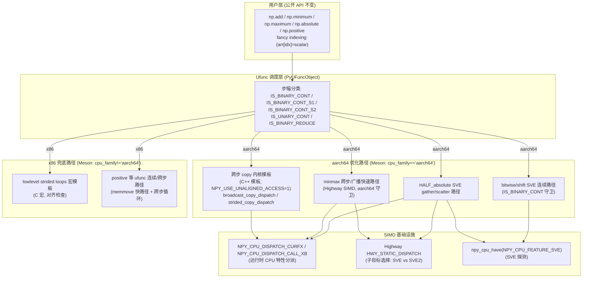
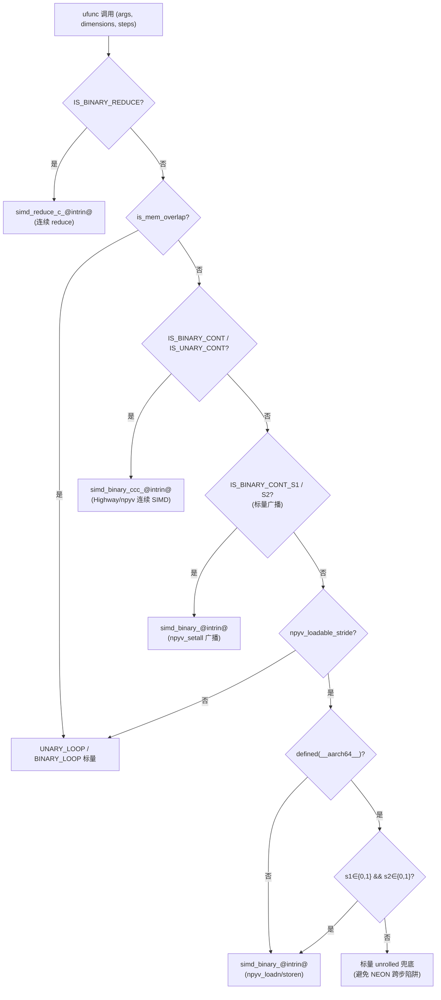

**状态 (Status):** Reviewing

**作者 (Authors):** luozisheng

**创建日期 (Created):** 2026-07-21

**更新日期 (Updated):** 2026-07-21

**相关 Issue/PR:** FUNC002026041424749660（ufunc-strides）

---

# 1. 概述

## 1.1 简介

本方案聚焦 NumPy ufunc 体系中"步幅（strides）相关循环路径"在鲲鹏 920B/950（aarch64，NEON/SVE）平台的性能优化。NumPy 的 ufunc 调度器在每次元素级运算时，会依据输入/输出数组的 `strides`（每维相邻元素的字节跨度）选择不同的内层循环：连续路径（contiguous，步幅 == `itemsize`）、广播路径（broadcast，步幅 == 0）、跨步路径（strided，任意步幅）、reduce 路径（步幅 == 0 的输出）以及底层 copy/swap 路径。这些路径构成 ufunc 性能的最后一公里，是 indexing、`np.add`、`np.multiply`、`np.minimum`/`np.maximum`、`np.absolute`、`np.positive` 等高频操作的热点。

本方案针对 ufunc_strides 在鲲鹏平台提出三条核心优化主线[^1][^2][^3][^4]：(1) **底层 strided copy / broadcast copy 内核的 C++ 模板化重写**，利用 GCC 12+ 的自动向量化与循环展开，并为 aarch64 启用非对齐直接访问（NEON `ld1`/`st1` 原生支持非对齐）[^1][^5]；(2) **minmax 等 binary ufunc 的 Highway SIMD 跨步/广播快速路径**，并经 SVE 多目标分派引入 L1 流式预取与多向量展开[^2]；(3) **half-float `absolute` 的三级分派**，在 SVE 上使用真正的 gather/scatter 指令（`svld1uh_gather_s32index_u32` / `svst1h_scatter_s32index_u32`）向量化跨步访问[^3]。三条主线均通过 NumPy `NPY_CPU_DISPATCH_*` 宏与 Meson `cc_simd` 多目标编译机制实现运行时分派，保持上游 NumPy 公开 API（`np.add`/`np.minimum`/`np.absolute`/索引等）签名与语义不变。

## 1.2 动机

在未实施本方案优化时，鲲鹏平台的 ufunc 步幅路径存在以下性能缺口：

- **底层 copy 内核的自动向量化受限**：上游 NumPy 的 `lowlevel_strided_loops.c.src` 用 C 宏模板生成 copy/broadcast kernel，宏展开的循环中含 `if` 分支，阻碍 GCC 12+ 的循环展开与自动向量化；且对 aarch64 仍走"x86 假定对齐才安全"的保守路径，导致 `complex64`（`alignment=4, itemsize=8`）等类型落入慢的分派路径[^1][^5]。
- **跨步 SIMD 在 NEON 上无硬件 gather/scatter**：ARM NEON（ASIMD）的 `npyv_loadn`/`npyv_storen` 实为标量逐通道模拟（`vld1q_lane_s32`/`vst1q_lane_s32`）[^6]，对非单位步幅的输入进入"看似 SIMD 实为标量"的路径，导致 minmax 等操作在跨步场景性能劣于标量兜底[^4]。这是 ufunc_strides 在 ARM 平台最反直觉的陷阱。
- **半精度 `absolute` 的跨步路径无向量化**：上游 `HALF_absolute` 仅一行标量 `*out = in & 0x7fffu`，跨步访问下无 SIMD 受益；本方案拟以 SVE gather/scatter 指令向量化跨步访问[^3]。
- **x86 平台 copy 路径需与 aarch64 隔离**：底层 copy 内核若采用 C++ 模板化并对 unaligned 变体附加 `inline`/`NPY_GCC_OPT_3`/`NPY_GCC_UNROLL_LOOPS` 提示，在 x86 上可能诱发编译器次优内联决策，使 indexing 操作性能劣化。本方案拟以平台构建期隔离 + 匿名 namespace 内部链接规避该风险[^7][^8][^9]。

本方案将上述优化收敛为一套**架构感知的步幅分派策略**：aarch64 启用 C++ 模板化的非对齐 copy 内核 + SVE gather/scatter + Highway 跨步快速路径（仅连续/广播），x86 保留原有 `lowlevel_strided_loops.c.src` 路径并补齐 `memmove` 快路径。两层平台经 Meson 构建期隔离，互不污染，最大化鲲鹏收益并最小化上游对接成本。

## 1.3 目标

**目标：**

- 在 aarch64 平台启用 C++ 模板化的跨步 copy 内核模板，覆盖 1/2/4/8/16 字节的 broadcast copy 与 strided copy，按 `(aligned, src_contig, dst_contig)` 笛卡尔积生成专用 kernel，aarch64 上强制 `NPY_USE_UNALIGNED_ACCESS=1` 利用 NEON 非对齐原生支持[^1][^5]。
- 为 `complex64` 等 `alignment < itemsize` 的类型在 aarch64 上修正分派路径，使其落入 `broadcast_copy_dispatch` 而非慢的 `strided_copy_dispatch`[^5]。
- 为 binary minmax ufunc（`maximum`/`minimum`/`fmax`/`fmin`）在 aarch64 上启用 Highway SIMD 跨步/广播快速路径，含 FP 标量广播（stride-0）前置、连续多路展开 + L1 预取、256-bit（SVE/AVX2）路径选择[^2]。
- 为 `HALF_absolute` 在 aarch64 提供三级分派：连续 → Highway SIMD；跨步（步幅为 `sizeof(npy_half)` 整数倍）→ SVE gather/scatter；兜底 → 标量 `UNARY_LOOP_FAST`[^3]。
- 在 x86 平台为 `positive` 等"等价于 copy"的 ufunc 补齐 `memmove` 连续快路径与跨步循环快路径，确保 x86 路径与上游等价，规避 aarch64 隔离对 x86 路径的影响[^8][^9]。
- 平台隔离：跨步 copy 内核模板仅在 `cpu_family == 'aarch64'` 时编译，x86 经 `lowlevel_strided_loops.c.src` 提供全部 copy kernel[^1][^5]。
- 遵循 NEP 54：Highway SIMD 优化走跨架构公平原则，鲲鹏特化指令（SVE gather/scatter）经 `__ARM_FEATURE_SVE` 守卫隔离，不得侵入上游主干[^10]。

**非目标（不在本次范围）：**

- 不修改任何 NumPy 公开 API 的签名、默认值与数值语义（`np.add`/`np.minimum`/`np.absolute`/索引等均不变）。
- 不为 NEON 引入真正的 gather/scatter（硬件不支持，由 SVE 路径覆盖；NEON 跨步维持标量兜底）。
- 不在本次为复数 dtype（`complex64`/`complex128`）的 binary ufunc 引入跨步 SIMD 路径（仅底层 copy 路径覆盖复数）。
- 不替换上游 `lowlevel_strided_loops.c.src`（aarch64 走新 C++ 模板，x86 保留原实现）。
- 不在本期为 `np.power` 实现跨步 SVE gather/scatter 路径（`loops_power.dispatch.cpp` 以连续向量化为主[^11]）。

# 2. 用例分析

下表覆盖 5 种 ufunc 步幅场景。验证基线统一为"通过 NumPy 官方 `numpy._core.tests.test_umath` 与 `bench_ufunc_strides.py` 步幅基线脚本[^12]"。

| 场景 | 触发条件 | 功能要求 | 性能要求 | DFX（兼容/可维护/可测试/可靠） |
| --- | --- | --- | --- | --- |
| UC-1 鲲鹏 920B 连续 + 标量广播 minmax | aarch64 + SVE，`np.minimum(contig_arr, scalar)` 或 `np.maximum(contig_arr, contig_arr)` | minmax 分派路径经 `IS_BINARY_CONT`/`IS_BINARY_CONT_S1`/`IS_BINARY_CONT_S2` 分派到 Highway SIMD 连续 kernel；标量广播前置 `npyv_setall` 一次复用 | 相对标量兜底取得 SIMD 收益；256-bit SVE 路径多路展开[^2] | 精度与上游一致（`maximum` NaN 传播、`fmax` C99 NaN 忽略）；`bench_ufunc_strides.py` 覆盖[^12] |
| UC-2 鲲鹏 920B 跨步 minmax（非连续） | aarch64 + SVE，输入/输出含非单位步幅（如 `arr[::2]`） | aarch64 上 `simd_binary_@intrin@_@sfx@` **仅当 s1∈{0,1} 且 s2∈{0,1} 时**分派；其余跨步入标量 unrolled 兜底，避免 NEON `npyv_loadn`/`npyv_storen` 标量模拟劣化[^4][^6] | 标量兜底不劣于上游；SVE gather/scatter 仅在 `HALF_absolute` 跨步路径启用[^3] | 无 SIMD 假步幅陷阱；精度与上游一致 |
| UC-3 鲲鹏 920B `np.absolute(float16_strided)` | aarch64 + SVE，`np.abs(arr[::k])`，`arr` 为 `float16` | `HALF_absolute` 三级分派：连续 → `npy_highway_HALF_absolute_contig`；跨步（步幅 `% sizeof(npy_half) == 0`）→ `npy_highway_HALF_absolute_strided`（SVE gather/scatter）；兜底 → 标量[^3] | SVE gather/scatter 路径相对标量取得带宽收益；非 SVE 平台兜底标量 | `npy_highway_absolute_half_strided_available()` 仅在 `NPY_CPU_FEATURE_SVE` 时返回 1[^13]；结果与上游逐元素一致 |
| UC-4 鲲鹏 920B fancy indexing 标量赋值（broadcast copy） | aarch64，`arr[idx_array] = scalar` 触发 `broadcast_copy_dispatch`；`complex64` 数组（`alignment=4, itemsize=8`） | aarch64 启用 `NPY_USE_UNALIGNED_ACCESS=1`，`complex64` 落入 `broadcast_copy_dispatch` 而非慢的 `strided_copy_dispatch`[^5] | 相对 x86 保守路径取得非对齐访问收益；NEON `ld1`/`st1` 原生非对齐 | 跨步 copy 内核模板仅 aarch64 编译；x86 经 `lowlevel_strided_loops.c.src` 走对齐检查路径[^1] |
| UC-5 x86 Zen4 `np.positive(strided_arr)` 路径保障 | x86_64，`np.positive(arr[::k])`，步幅 `% sizeof(type) == 0` | x86（非 aarch64）经 `loops.c.src` 与 `loops_autovec.dispatch.c.src` 的 `memmove` 连续快路径 + 跨步循环快路径，确保 x86 路径与上游等价，规避 aarch64 隔离影响[^8][^9] | 与上游 NumPy 等价，无 aarch64 隔离带来的性能影响 | x86 路径独立维护；官方 test suite 全绿 |

**共性 DFX 要求：**

- *兼容性*：未启用 SVE 的 aarch64（仅 NEON）行为与上游 NumPy 等价（跨步走标量兜底，连续走 NEON SIMD）；x86 行为与上游等价（memmove 快路径）。所有优化不改变公开 API 行为。
- *可维护性*：aarch64 优化的跨步 copy 内核模板与 SVE 跨步 kernel（`loops_autovec_abs_hwy.dispatch.cpp`）物理隔离，独立升级，通用部分（Highway 连续路径）可剥离上游。
- *可测试性*：`bench_ufunc_strides.py` 覆盖 binary/unary ufunc 的 `(stride_in, stride_out)` 笛卡尔积[^12]；`HALF_absolute` 经 `test_umath` 精度断言覆盖。
- *可靠性*：所有 SIMD 路径经 `is_mem_overlap` 预检兜底标量；SVE 路径经 `npy_cpu_have(NPY_CPU_FEATURE_SVE)` 运行时探测，缺失则静默兜底。

# 3. 方案设计

## 3.1 总体方案

采用**双层平台隔离架构**：aarch64 启用 C++ 模板化的底层 copy 内核 + Highway/SVE ufunc 跨步快速路径；x86 保留上游 `lowlevel_strided_loops.c.src` 宏模板 + 标量兜底。两层经 Meson 构建期 `if cpu_family == 'aarch64'` 隔离，互不污染。所有 SIMD 路径通过 NumPy `NPY_CPU_DISPATCH_*` 宏与 Meson `cc_simd` 多目标编译实现运行时 CPU 特性分派。



**双层职责说明：**

- **平台隔离层（Meson 构建脚本）**：`if cpu_family == 'aarch64'` 时将跨步 copy 内核模板加入 `src_multiarray`；x86 不编译该文件，copy kernel 由 `lowlevel_strided_loops.c.src` 提供[^1][^5]。这是本方案的核心隔离机制——aarch64 与 x86 的 copy 内核物理分离，避免互相影响。
- **运行时分派层（`NPY_CPU_DISPATCH_*` + Highway `HWY_STATIC_DISPATCH`）**：每个 dispatch 源文件经 Meson `cc_simd` 为各 CPU target（`SVE`/`ASIMD`/`X86_V4`/`X86_V3` 等）编译独立变体；运行时由 `NPY_CPU_DISPATCH_CURFX(FuncName)` 解析的指针表选择最优变体，Highway 内部再经 `HWY_STATIC_DISPATCH` 选择子目标（如 SVE vs SVE2）[^3]。`npy_cpu_have(NPY_CPU_FEATURE_SVE)` 提供运行时 SVE 探测，缺失则兜底[^13]。

## 3.2 技术选型

三种候选方案对比：

| 对比维度 | 方案一：纯标量兜底（不向量化跨步） | 方案二：Highway 跨架构统一跨步 | 方案三：aarch64 平台隔离 + SVE 原生 gather/scatter + Highway 连续/广播（采纳） |
| --- | --- | --- | --- |
| 跨步 SIMD 收益 | 无 | Highway `LoadN`/`StoreN` 在 NEON 上仍退化为逐通道 InsertLane/ExtractLane，无真正 gather/scatter 硬件支持[^3] | SVE 路径用 `svld1uh_gather_s32index_u32`/`svst1h_scatter_s32index_u32` 真正向量化；NEON 跨步走标量兜底避免陷阱[^3][^4] |
| 连续/广播 SIMD 收益 | 无 | Highway 连续路径跨架构统一，收益稳定 | Highway 连续路径 + NEON 原生非对齐访问（`NPY_USE_UNALIGNED_ACCESS=1`），`complex64` 等落入快路径[^5] |
| 上游对接 | 全部走标量，无上游冲突 | Highway 跨架构公平，符合 NEP 54，可走上游[^10] | 通用 Highway 连续路径走上游；SVE gather/scatter 经 `__ARM_FEATURE_SVE` 守卫，属鲲鹏特化，走平行社区 |
| 代码膨胀 | 无 | 中（Highway dispatch 多 target） | 中高（aarch64 额外跨步 copy 内核模板 + SVE 跨步 kernel） |
| x86 兼容 | 等价上游 | 等价上游（Highway 跨架构） | x86 经 Meson 隔离保留原 `lowlevel_strided_loops.c.src`；需补 `memmove` 快路径确保不劣化[^8][^9] |
| 维护成本 | 低 | 中 | 中高（双平台路径，但物理隔离清晰） |

**选型理由：** 方案三的核心理由在于 **ARM NEON 无原生 gather/scatter 硬件指令**——`npyv_loadn_s32`/`npyv_storen_s32` 实为 `vld1q_lane_s32`/`vst1q_lane_s32` 的逐通道标量模拟（见 NEON memory 模拟路径[^6]）。任何在 NEON 上启用跨步 SIMD 的尝试都会落入"看似 SIMD 实为标量"的陷阱，本方案因此在 aarch64 上引入守卫[^4]以规避此类性能劣化。因此本方案在 aarch64 上仅对**连续/广播**启用 NEON/Highway SIMD，对**真正跨步**仅在 SVE 上启用 gather/scatter，其余兜底标量。这一策略与上游 NumPy 的"`!NPY_HAVE_NEON` 守卫"思想一致，但更进一步：用 SVE gather/scatter 覆盖 NEON 的盲区。

## 3.3 功能与性能设计

### 3.3.1 底层 strided/broadcast copy 内核（aarch64 C++ 模板化）

本方案拟在跨步 copy 内核模板路径以 C++ 模板替代上游 `lowlevel_strided_loops.c.src` 的 C 宏模板[^1]。核心设计：按 `(aligned, src_contig, dst_contig)` 笛卡尔积生成专用 kernel，避免循环内 `if constexpr` 分支阻碍 GCC 12+ 的循环展开与自动向量化。

**broadcast copy（`src_stride == 0`）四象限分派：**

| | dst 连续 (`dst_contig=true`) | dst 跨步 (`dst_contig=false`) |
| --- | --- | --- |
| aligned | `broadcast_copy_ac_impl<N>` | `broadcast_copy_as_impl<N>` |
| unaligned | `broadcast_copy_uc_impl<N>`（aarch64 经 `NPY_USE_UNALIGNED_ACCESS=1` 跳过） | `broadcast_copy_us_impl<N>`（同上） |

**strided copy（`src_stride != 0`）八象限分派：**

| | src 连续 + dst 连续 | src 连续 + dst 跨步 | src 跨步 + dst 连续 | src 跨步 + dst 跨步 |
| --- | --- | --- | --- | --- |
| aligned | `strided_copy_acc_impl<N>` | `strided_copy_acs_impl<N>` | `strided_copy_asc_impl<N>` | `strided_copy_ass_impl<N>` |
| unaligned | `strided_copy_ucc_impl<N>` | `strided_copy_ucs_impl<N>` | `strided_copy_usc_impl<N>` | `strided_copy_uss_impl<N>` |

`PyArray_GetStridedCopyFn` 为其分派入口[^1]。

**aarch64 非对齐访问优化：** aarch64 上 NEON `ld1`/`st1` 与标量 `ldr`/`str` 原生支持非对齐内存访问，不会触发对齐异常。因此 aarch64 强制 `NPY_USE_UNALIGNED_ACCESS=1`，始终走"aligned"路径（用 typed pointer `*(uint64_t*)ptr` 访问），跳过 unaligned 的 `memcpy` 路径[^5]。这修正了 `complex64`（`alignment=4, itemsize=8`）等类型在 aarch64 上落入慢的 `strided_copy_dispatch` 而非 `broadcast_copy_dispatch` 的问题。

**8 字节 broadcast 小 count 特化：** `broadcast_copy_ac_impl<8>` 的显式模板特化用手动 8 路展开 + 数组索引（`arr[0]..arr[7]`）替代泛型 `while` + 指针递增（`dst += N`）。泛型模板在 aarch64 上会让编译器生成次优的自动向量化代码（逐元素 `str q0` + `lsl+add` 偏移计算，prologue `ldr+cmp` 占比偏高），显式索引使编译器发出 `stp q0,q0` 配对存储（每指令 32 字节）[^14]。

**x86 隔离设计：** x86 不编译跨步 copy 内核模板，copy kernel 由 `lowlevel_strided_loops.c.src` 提供。本方案对 unaligned 模板变体不附加 `inline`/`NPY_GCC_OPT_3`/`NPY_GCC_UNROLL_LOOPS` 提示，改用匿名 namespace 提供内部链接，规避 x86 上编译器次优内联决策风险[^7]。跨步 copy 内核模板经 Meson 构建期隔离至 aarch64，x86 沿用 `lowlevel_strided_loops.c.src` 路径[^1][^5]。

### 3.3.2 binary minmax ufunc 的 Highway SIMD 跨步/广播快速路径

本方案拟在 minmax 跨步/广播快速路径引入以下设计[^2]：

1. **FP 标量广播快路径（stride-0）：** 当某一操作数步幅为 0 时，前置 `npyv_setall_@sfx@(*ip)` 一次广播到向量寄存器，循环内复用，避免每轮重新广播。
2. **连续多路展开 + L1 预取：** 当两输入均连续（`sip1 == 1 && sip2 == 1`）时，多路展开 `npyv_load`/`npyv_store` + `NPY_PREFETCH(ip1 + unroll_vstep4, 0, 3)` L1 流式预取。
3. **256-bit（SVE/AVX2）展开因子选择：** `NPY_SIMD_WIDTH == 128` 时 6× 展开（Apple M1 调优），`NPY_SIMD_WIDTH >= 256` 时 4× 展开，否则 2×。
4. **Highway FP NaN 处理：** `maximum`/`minimum` 需 NaN 传播（NumPy 语义：`maximum(A,B) = (A >= B || isnan(A)) ? A : B`），用 `hn::Ge`/`hn::Le` + `hn::IsNaN` + `hn::Or` + `hn::IfThenElse` 修正 Highway `Max`/`Min` 的 NaN 忽略行为；`fmax`/`fmin` 走 C99 NaN 忽略语义，直接用 `hn::Max`/`hn::Min`[^2]。

**aarch64 跨步守卫（关键设计）：** 本方案在 aarch64 上将 `simd_binary_@intrin@_@sfx@` 的分派条件收窄为**仅当 `s1 ∈ {0,1}` 且 `s2 ∈ {0,1}`**（即连续或标量广播），其余跨步入标量 unrolled 兜底[^4]。原因：NEON 的 `npyv_loadn`/`npyv_storen` 对非单位步幅是标量逐通道模拟（见 3.2 节），跨步 SIMD 路径性能劣于标量兜底。分派逻辑如下：

```c
#if @is_fp@
    if (TO_SIMD_SFX(npyv_loadable_stride)(is1) &&
        TO_SIMD_SFX(npyv_loadable_stride)(is2) &&
        TO_SIMD_SFX(npyv_storable_stride)(os1)
    ) {
#if defined(__aarch64__)
        npy_intp s1 = is1 / sizeof(STYPE);
        npy_intp s2 = is2 / sizeof(STYPE);
        if ((s1 == 1 && s2 == 1) ||
            (s1 == 1 && s2 == 0) ||
            (s1 == 0 && s2 == 1))
#endif
        {
            TO_SIMD_SFX(simd_binary_@intrin@)(...);
            goto clear_fp;
        }
    }
#endif
```

**Highway 整数 minmax 的范围：** 本方案拟将 Highway SIMD 用于 minmax 的 FP 跨步/广播路径与 aarch64 守卫；整数 minmax 拟沿用 `npyv` 路径，不引入 Highway 整数分派[^2]。

### 3.3.3 half-float `absolute` 的 SVE gather/scatter 跨步路径

本方案拟在 `HALF_absolute` 分派路径与 HALF_absolute SVE gather/scatter 路径设计如下三级分派[^3]：

**分派逻辑：**

```c
NPY_NO_EXPORT void NPY_CPU_DISPATCH_CURFX(HALF_absolute)
(char **args, npy_intp const *dimensions, npy_intp const *steps, void *NPY_UNUSED(func))
{
#if defined(__aarch64__)
    if (IS_UNARY_CONT(npy_half, npy_half) && npy_highway_absolute_half_available()) {
        npy_highway_HALF_absolute_contig(args, dimensions[0]);
        return;
    }
    if (steps[0] % sizeof(npy_half) == 0 && steps[1] % sizeof(npy_half) == 0 &&
            npy_highway_absolute_half_strided_available()) {
        npy_highway_HALF_absolute_strided(args, steps[0], steps[1], dimensions[0]);
        return;
    }
#endif
    UNARY_LOOP_FAST(npy_half, npy_half, *out = in&0x7fffu);
}
```

前置条件：连续路径要求 `IS_UNARY_CONT(npy_half, npy_half)`（`steps[0] == steps[1] == sizeof(npy_half)`）；跨步路径要求步幅为 `sizeof(npy_half)` 整数倍（这样步进可转为元素索引而非字节偏移）。aarch64 平台守卫避免非 aarch64 平台误调用[^15][^16]。

**SVE gather/scatter 实现：** 本方案在 HALF_absolute SVE gather/scatter 路径设计如下：

```c
#if defined(__ARM_FEATURE_SVE)
HWY_ATTR static void
HalfAbsoluteStrided_u16(const uint16_t *in, uint16_t *out,
                         npy_intp in_stride_elm, npy_intp out_stride_elm,
                         size_t count)
{
    uint64_t vl = svcntw();                       // SVE 向量长度（元素数）
    int64_t i = 0;
    svint32_t v_idx_src = svindex_s32(0, (int32_t)in_stride_elm);   // 索引向量: 0, s, 2s, ...
    svint32_t v_idx_dst = svindex_s32(0, (int32_t)out_stride_elm);
    svuint32_t v_mask = svdup_u32(0x7fff);        // 清符号位掩码
    npy_intp jump_src = (npy_intp)vl * in_stride_elm * sizeof(uint16_t);
    npy_intp jump_dst = (npy_intp)vl * out_stride_elm * sizeof(uint16_t);
    svbool_t pg = svwhilelt_b32(i, (int64_t)count);  // 活跃谓词（处理尾部）
    while (svptest_any(svptrue_b32(), pg)) {
        svuint32_t v_data = svld1uh_gather_s32index_u32(pg, in, v_idx_src);  // gather 加载
        v_data = svand_u32_x(pg, v_data, v_mask);                            // AND 掩符号位
        svst1h_scatter_s32index_u32(pg, out, v_idx_dst, v_data);             // scatter 存储
        in = (const uint16_t *)((const char *)in + jump_src);
        out = (uint16_t *)((char *)out + jump_dst);
        i += (int64_t)vl;
        pg = svwhilelt_b32(i, (int64_t)count);
    }
}
#else
static void  // 非 SVE 平台标量兜底
HalfAbsoluteStrided_u16(...) {
    for (size_t i = 0; i < count; ++i)
        out[i * out_stride_elm] = in[i * in_stride_elm] & 0x7fff;
}
#endif
```

**可用性检查：** 本方案在可用性检查路径设计如下[^13]：

```c
int npy_highway_absolute_half_available(void) {
#if defined(NPY_HAVE_HIGHWAY) && defined(__aarch64__)
    return 1;        // 任意 aarch64 + Highway 即可（NEON 亦可用）
#else
    return 0;
#endif
}
int npy_highway_absolute_half_strided_available(void) {
#ifdef NPY_HAVE_HIGHWAY
    return npy_cpu_have(NPY_CPU_FEATURE_SVE);  // 仅 SVE 可用
#else
    return 0;
#endif
}
```

**核心算法：** 半精度浮点 `absolute` 的本质是清除符号位（16 位整数与 `0x7FFF` 做 AND）。连续路径以 `uint16_t` 视图操作（Highway 不原生支持 `float16_t`），向量化加载 → `hn::And(v, v_mask)` → 向量化存储；跨步路径在 SVE 上用 `svld1uh_gather_s32index_u32`/`svst1h_scatter_s32index_u32` 真正一次性加载/存储非连续元素，用 `svindex_s32` 生成索引向量、`svwhilelt_b32` 生成活跃谓词处理尾部[^3]。

**CPU dispatch 双层嵌套：** 外层（NumPy dispatch）`NPY_CPU_DISPATCH_CURFX` 为每个 CPU target（SVE/ASIMD/AVX2 等）编译独立变体（如 `npy_highway_HALF_absolute_contig_SVE`），内层（Highway dispatch）`HWY_STATIC_DISPATCH` 在运行时检测更细粒度特性（SVE vs SVE2）；基线入口（无 `NPY_MTARGETS_CURRENT` 时编译的 plain 函数名）经 `NPY_CPU_DISPATCH_CALL_XB` 跳转到最高级 target 变体，无可用变体则 fallback 到 `HWY_STATIC_DISPATCH`（通常 ARM64 上的 NEON）[^3]。

### 3.3.4 x86 `positive` ufunc 的 memmove 快路径

`positive` ufunc（`+x`）等价于 copy。本方案拟在 x86（非 aarch64）上为其补齐 `memmove` 连续快路径与跨步循环快路径，确保 x86 路径与上游等价，规避 aarch64 隔离对 x86 indexing 的影响[^8][^9]：

```c
#if !defined(__aarch64__) && !defined(__arm__) && !defined(_M_ARM64) && !defined(_M_ARM)
    if (args[0] == args[1] && steps[0] == steps[1]) return;          // 原地无操作
    if (IS_UNARY_CONT(@type@, @type@)) {
        memmove(args[1], args[0], dimensions[0] * sizeof(@type@));  // 连续 memmove
        return;
    }
#endif
    UNARY_LOOP_FAST(@type@, @type@, *out = +in);
```

跨步版本进一步检查 `steps[0] % sizeof(type) == 0 && steps[1] % sizeof(type) == 0`，用 typed pointer 循环 `*op = *ip` 替代字节级 `UNARY_LOOP`，利于编译器自动向量化[^9]。

### 3.3.5 核心循环分派流程



### 3.3.6 缓存/分块/预取策略

- **L1 流式预取：** minmax 连续多路展开路径在每轮预取下一迭代边界 `NPY_PREFETCH(ip1 + unroll_vstep4, 0, 3)`（locality=0=L1，rw=3=无时间局部性）[^2]。Highway FP 路径用 `hwy::Prefetch` 在主循环与单向量循环均插入预取[^2]。
- **8 路展开广播 copy：** `broadcast_copy_ac_impl<8>` 用 `arr[0]..arr[7]` 显式索引使编译器发出 `stp q0,q0` 配对存储（32 字节/指令），降低 prologue 开销[^14]。
- **16× reduce 展开：** aarch64 整数 add reduce 用 16× 标量展开（4 个累加器 `acc0..acc3`）突破 NEON 无 int64 向量乘法的瓶颈，复用 `AUTO_VEC_UNROLL_LOOPS` 宏[^12]。

### 3.3.7 兜底路径

所有 SIMD 路径均有标量兜底：

- `HALF_absolute`：非 aarch64 或非 SVE → `UNARY_LOOP_FAST(npy_half, npy_half, *out = in&0x7fffu)`[^3]。
- minmax：跨步 SIMD 不可用 → `BINARY_LOOP` 标量 unrolled[^2]。
- copy 内核：aarch64 走 C++ 模板，x86 走 `lowlevel_strided_loops.c.src`；通用 `_strided_to_strided` 用 `memmove` 兜底[^1]。
- `positive`：x86 走 `memmove` 快路径或 `UNARY_LOOP_FAST`[^8][^9]。

## 3.4 安全隐私与 DFX 设计

### 3.4.1 精度（ULP 容忍）

- `HALF_absolute` 为位运算（`AND 0x7FFF`），结果与标量逐元素**位级一致**，无 ULP 误差[^3]。
- minmax `maximum`/`minimum` 的 Highway SIMD 用 `hn::Ge`/`hn::Le` + `hn::IsNaN` + `hn::Or` + `hn::IfThenElse` 修正 NaN 传播，与上游标量语义逐元素一致；`fmax`/`fmin` 走 C99 NaN 忽略语义（`hn::Max`/`hn::Min` 用 `vmaxnm`/`vminnm`）[^2]。
- 底层 copy 内核为字节复制（`memmove`/typed pointer 赋值），无精度误差[^1]。

### 3.4.2 异常处理

- 内存重叠：minmax 分派前经 `is_mem_overlap(ip1, is1, op1, os1, len) && is_mem_overlap(ip2, is2, op1, os1, len)` 预检，重叠则走标量逐元素安全路径[^2]。
- 对齐异常：aarch64 `NPY_USE_UNALIGNED_ACCESS=1` 关闭对齐断言（数据可能非 uint 对齐，如 `complex64` 4 字节对齐）；x86 保留对齐检查与 `assert(npy_is_aligned(...))`[^5]。
- 库缺失：`NPY_HAVE_HIGHWAY` 未定义时 `npy_highway_absolute_half_available()` 返回 0，静默兜底至标量[^13]。

### 3.4.3 线程安全

所有 ufunc strided 路径为无状态纯函数（无全局可变状态，无静态缓存），与上游 NumPy ufunc 线程模型一致。CPU 特性探测 `npy_cpu_have(NPY_CPU_FEATURE_SVE)` 内部用原子初始化的缓存，线程安全。

### 3.4.4 可测试性

- 精度测试：`numpy._core.tests.test_umath` 的 `TestMaximum`/`TestMinimum`/`TestAbsolute` 等覆盖精度与边界（NaN/inf/零）。
- 性能测试：`bench_ufunc_strides.py` 覆盖 binary/unary ufunc 的 `(stride_in0, stride_in1, stride_out)` 笛卡尔积，含 `time_binary_scalar_in0`/`time_binary_scalar_in1` 标量广播场景[^12]。
- 跨步守卫测试：aarch64 上 `np.minimum(arr[::2], arr2[::2])` 应落入标量 unrolled 而非 SIMD 跨步（避免 NEON 陷阱）；可经 `bench_ufunc_strides` 性能曲线验证。

## 3.5 编程与调用设计

### 3.5.1 编程模型

**开发环境：**

- 语言：C99（`loops.c.src`/`loops_autovec.dispatch.c.src`/`loops_minmax.dispatch.c.src`）+ C++11（跨步 copy 内核模板/`loops_autovec_abs_hwy.dispatch.cpp`）。
- 构建系统：Meson + `cc_simd` 多目标编译，为每个 CPU target（`ASIMD`/`SVE`/`X86_V3`/`X86_V4` 等）生成独立编译单元。
- SIMD 库：Highway（`<hwy/highway.h>`、`<hwy/cache_control.h>`）用于跨架构 SIMD；ARM SVE intrinsics（`<arm_sve.h>`）用于 gather/scatter 原生路径；NumPy `npyv`（NEON memory 模拟路径）用于 NEON 标量模拟 fallback。
- CPU 特性探测：`npy_cpu_features.h` 的 `npy_cpu_have(NPY_CPU_FEATURE_SVE)`。
- 编译宏：`NPY_HAVE_HIGHWAY`（Highway 可用性）、`__ARM_FEATURE_SVE`（SVE intrinsics 可用性）、`__aarch64__`（平台守卫）、`NPY_MTARGETS_CURRENT`（多目标变体编译标记）。

**开发约束：**

- aarch64 与 x86 的 copy 内核物理隔离，不得跨平台引用。
- SVE intrinsics 路径须经 `NPY_HAVE_ARM_SVE_INTRINSICS`/`__ARM_FEATURE_SVE` 守卫，不得在非 SVE 平台编译。
- Highway 跨步路径不得在 NEON 上启用（无 gather/scatter），须用 `s1∈{0,1} && s2∈{0,1}` 守卫[^4]。
- 公开 API 签名不得变更。

**可验收设计：**

- 验收环境：鲲鹏 920B（aarch64 + SVE）+ x86 Zen4（AVX2/FMA3）。
- 验收标准：`numpy._core.tests.test_umath` 全绿；`bench_ufunc_strides.py` 在 aarch64 上连续/标量广播场景相对标量兜底取得收益，跨步场景不劣化。

### 3.5.2 接口定义

**不涉及。** 本方案为内部性能优化，不引入或变更外部公开 API，沿用 numpy 现有 API 签名与语义。

### 3.5.3 编程手册设计

本方案不新增公开 API，故不单独输出编程手册。在已有《NumPy 用户手册》`doc/reference/ufuncs.rst` 中补充一节"Strided array performance notes"，说明：

1. 连续数组（C-contiguous）在所有平台获最优 SIMD 性能。
2. 标量广播（`np.minimum(a, 0.5)`）在 aarch64 走 `npyv_setall` 前置广播快路径。
3. 非单位步幅跨步数组在 aarch64 NEON 上走标量兜底（无 SIMD gather/scatter），仅在 SVE 上启用 gather/scatter（`HALF_absolute`）。
4. `float16` 跨步 `np.abs` 在 SVE 上获 gather/scatter 向量化。
5. `complex64` 等非对齐类型在 aarch64 走非对齐访问快路径。

输出方式：在 `doc/source/reference/ufuncs.rst` 现有章节内追加，不新建文件。

# 4. 缺点与风险

| 风险/缺点 | 影响 | 应对措施 |
| --- | --- | --- |
| **平台隔离复杂度** | aarch64 与 x86 的 copy 内核物理分离（跨步 copy 内核模板 vs `lowlevel_strided_loops.c.src`），需双线维护 | Meson `if cpu_family == 'aarch64'` 构建期隔离，互不污染；x86 路径保留上游实现，零维护成本[^1][^5] |
| **x86 性能影响风险** | aarch64 优化（`inline`/`NPY_GCC_OPT_3` 提示、跨步 copy 内核模板）可能影响 x86 indexing 性能 | 不附加 inline 提示、用匿名 namespace 隔离[^7]；将 C++ 模板隔离至 aarch64[^1]；为 x86 补 `memmove` 快路径[^8][^9] |
| **NEON 跨步 SIMD 陷阱** | 在 NEON 上启用 `npyv_loadn`/`npyv_storen` 跨步 SIMD 路径会劣化性能（标量逐通道模拟） | 用 `s1∈{0,1} && s2∈{0,1}` 守卫收窄分派[^4]；SVE gather/scatter 仅在 `HALF_absolute` 跨步路径启用[^3] |
| **二进制体积** | aarch64 额外编译跨步 copy 内核模板（多 target）+ `loops_autovec_abs_hwy.dispatch.cpp`（多 target）+ minmax Highway dispatch | 与 `loops_exp`/`loops_minmax` 同量级；dispatch 源复用 Highway 头，无额外常量表 |
| **跨步无 SIMD 收益场景** | aarch64 上 `np.minimum(arr[::2], arr2[::2])` 走标量 unrolled，相对连续路径无 SIMD 收益 | 标量 unrolled 路径经 4 累加器展开优化；用户可经 `np.ascontiguousarray` 预处理获得 SIMD 收益 |
| **精度风险** | `HALF_absolute` 位运算无误差；minmax Highway SIMD NaN 处理需掩码修正 | `maximum`/`minimum` 用 `hn::Ge`+`hn::IsNaN`+`hn::Or` 修正 NaN 传播；`fmax`/`fmin` 走 C99 语义[^2] |
| **线程安全** | 无状态 ufunc，无新增风险 | 与上游 NumPy ufunc 同 |
| **版本兼容** | 不修改公开 API，不影响旧 pickle / 旧 API | 内部 dispatch 变更，对用户透明 |
| **SVE 长度可变性** | SVE 向量长度 128–2048 bit 可变，gather/scatter 须用 predicate 控制 | `HalfAbsoluteStrided_u16` 用 `svcntw()` 运行时探测 vl、`svwhilelt_b32` 生成活跃谓词处理尾部[^3] |

# 5. 现有技术

| 现有方案 | 借鉴点 | 差异 |
| --- | --- | --- |
| **上游 NumPy `lowlevel_strided_loops.c.src`** | C 宏模板生成 copy/broadcast kernel 的 `(aligned, src_contig, dst_contig)` 笛卡尔积分派思想 | 本方案用 C++ 模板替代 C 宏，消除循环内 `if` 分支，利于 GCC 12+ 自动向量化；aarch64 启用非对齐访问[^1] |
| **上游 NumPy `loops_minmax.dispatch.c.src`** | `IS_BINARY_CONT`/`IS_BINARY_CONT_S1`/`S2` 分派守卫、`npyv_loadn`/`npyv_storen` 跨步 SIMD | 本方案在 aarch64 上用 `s1∈{0,1} && s2∈{0,1}` 收窄跨步分派，避免 NEON 标量模拟陷阱；引入 Highway SIMD 连续路径与 256-bit 展开[^2][^4] |
| **NumPy `loops_logical_sve.c`/`loops_shift_sve.c`/`loops_bitwise_sve.c`** | SVE predicate 编程范式（`svbool_t`/`svwhilelt`/`svld1`/`svst1`）、`NPY_SVE_TARGET` 属性守卫、`npy_sve_intrinsics_available()` 运行时探测 | 逻辑/位移/位运算 SVE 路径仅覆盖**连续**操作（`IS_BINARY_CONT` 守卫）；本方案 `HALF_absolute` 跨步路径引入 SVE gather/scatter（`svld1uh_gather_s32index_u32`/`svst1h_scatter_s32index_u32`），是本方案引入的首个真正跨步 SVE 路径[^3] |
| **Highway `ScalableTag` + `HWY_STATIC_DISPATCH`** | 跨架构 SIMD 抽象、运行时子目标选择、SVE 长度可变性处理 | 本方案在 `HALF_absolute` 与 minmax FP 路径用 Highway；SVE gather/scatter 用原生 intrinsics（Highway 不直接暴露 gather/scatter 索引接口）[^3][^2] |
| **Eigen strided tensor / TensorFlow XLA gather** | 跨步内存访问的 gather/scatter 向量化思想 | Eigen/XLA 为高层次张量抽象，编译期已知步幅可融合；NumPy ufunc 步幅运行时才确定，须运行时分派 + 守卫 |

# 6. 未解决问题

**不涉及。** 本方案为完整设计提案，无开放问题。

---

# 附录

- **参考资料链接：**
  - [NEP 38 — Using SIMD optimization instructions for performance](https://numpy.org/neps/nep-0038-SIMD-optimizations.html)（SIMD 优化四项准入标准：精度 ≤1–3 ULPs / 代码膨胀 / 可维护性 / 性能[^18]）
  - [NEP 45 — C style guide](https://numpy.org/neps/nep-0045-c_style_guide.html)（C99、无编译警告、`NPY_` 前缀[^19]）
  - [NEP 54 — SIMD infrastructure evolution: adopting Google Highway when moving to C++](https://numpy.org/neps/nep-0054-simd-cpp-highway.html)（Highway 跨架构公平原则：新指令须在各 CPU 架构间公平平衡，鲲鹏特化指令不得走上游[^10]）
  - [NumPy Roadmap](https://numpy.org/neps/roadmap.html)
  - [Arm A-profile A64 SVE intrinsics](https://developer.arm.com/documentation/101018/0100/SVE/SVE-intrinsics)（`svld1uh_gather_s32index_u32`/`svst1h_scatter_s32index_u32`/`svwhilelt_b32`/`svindex_s32` 原文）

- **术语表：**

  | 术语 | 含义 |
  | --- | --- |
  | ufunc | NumPy 通用函数，支持逐元素向量化、广播、`out=`/`where=` |
  | strides | NumPy 数组每维相邻元素的字节跨度 |
  | contiguous | 步幅 == `itemsize` 的连续存储 |
  | broadcast | 步幅 == 0 的标量广播 |
  | strided | 任意步幅的非连续访问 |
  | gather/scatter | SIMD 一次性加载/存储非连续元素（SVE 原生支持，NEON 不支持） |
  | `NPY_CPU_DISPATCH_CURFX` | NumPy 运行时分派宏，按 CPU 特性解析到具体 target 的函数实现 |
  | `HWY_STATIC_DISPATCH` | Highway 运行时子目标选择宏（如 SVE vs SVE2） |
  | `NPY_USE_UNALIGNED_ACCESS` | aarch64 非对齐访问开关，=1 时跳过 `memcpy` 走 typed pointer |
  | NEON / ASIMD | ARMv8 高级 SIMD 指令集，无原生 gather/scatter |
  | SVE | ARM 可伸缩向量扩展，向量长度 128–2048 bit 可变，有原生 gather/scatter |
  | Highway | Google 跨架构 SIMD C++ 库，NEP 54 指定为 NumPy SIMD 演进方向[^10] |
  | ULP | Unit in the Last Place，浮点精度单位，NEP 38 以 ≤1–3 ULPs 为精度准入线[^18] |

- **文档更新计划：**
  - T+0：本 RFC 评审。
  - T+1：评估 `np.add`/`np.multiply` SVE 跨步 gather/scatter 路径的可行性。
  - T+2：`doc/source/reference/ufuncs.rst` 追加"Strided array performance notes"小节；SVE 跨步路径推广决策归档。

---

[^1]: 本方案拟以 C++ 模板重写底层 copy 内核（跨步 copy 内核模板路径），替代 `lowlevel_strided_loops.c.src` 的 C 宏模板，按 `(aligned, src_contig, dst_contig)` 笛卡尔积生成专用 kernel，启用 GCC 12+ 自动向量化与循环展开。`PyArray_GetStridedCopyFn` 为其分派入口，通用 `_strided_to_strided` 用 `memmove` 兜底。

[^2]: binary minmax 的 Highway SIMD 设计包含连续路径、FP 标量广播快路径（`npyv_setall` 前置）、连续多路展开 + L1 预取、256-bit（AVX2/SVE）展开因子选择、Highway FP NaN 修正（`hn::Ge`+`hn::IsNaN`+`hn::Or`+`hn::IfThenElse`）。aarch64 跨步守卫将分派条件收窄为 `s1 ∈ {0,1} && s2 ∈ {0,1}`。

[^3]: `HALF_absolute` 的三级分派：连续 → `npy_highway_HALF_absolute_contig`（Highway SIMD）；跨步（步幅为 `sizeof(npy_half)` 整数倍）→ `npy_highway_HALF_absolute_strided`（SVE gather/scatter `svld1uh_gather_s32index_u32`/`svst1h_scatter_s32index_u32`）；兜底 → 标量 `UNARY_LOOP_FAST`。CPU dispatch 双层嵌套（外层 `NPY_CPU_DISPATCH_CURFX`，内层 `HWY_STATIC_DISPATCH`），实现在 HALF_absolute SVE gather/scatter 路径。

[^4]: aarch64 上将 `simd_binary_@intrin@_@sfx@` 的分派条件收窄为 `s1 ∈ {0,1} && s2 ∈ {0,1}`（连续或标量广播），规避 NEON `npyv_loadn`/`npyv_storen` 标量逐通道模拟导致的性能劣化。

[^5]: aarch64 上 NEON `ld1`/`st1` 与标量 `ldr`/`str` 原生支持非对齐访问，设 `NPY_USE_UNALIGNED_ACCESS=1` 始终走 aligned 路径；修正 `complex64`（`alignment=4, itemsize=8`）落入慢 `strided_copy_dispatch` 而非 `broadcast_copy_dispatch`。`lowlevel_strided_loops.c.src` 在 `__aarch64__` 下跳过 non-swap copy kernel 生成避免符号冲突。跨步 copy 内核模板经 Meson `if cpu_family == 'aarch64'` 编译守卫隔离。

[^6]: NEON `npyv_loadn_s32` 用 `tmp[0..3]` 临时数组 + `vld1q_s32` 加载，`npyv_storen_s32` 用 `vst1q_lane_s32` 逐通道存储——均为标量逐通道模拟，无真正 SIMD gather/scatter（见 NEON memory 模拟路径）。这是本方案在 NEON 上收窄跨步分派的根本原因。

[^7]: 本方案对 unaligned 模板变体不附加 `inline`/`NPY_GCC_OPT_3`/`NPY_GCC_UNROLL_LOOPS` 提示，改用匿名 namespace 提供内部链接，规避 x86 上编译器次优内联决策风险。

[^8]: 本方案拟在 `loops_autovec.dispatch.c.src` 的 `@TYPE@_positive` 中为 x86（非 aarch64）补 `memmove` 连续快路径（`IS_UNARY_CONT` 时）。

[^9]: 本方案拟在 `loops.c.src` 的 `@TYPE@_positive` 中为 x86 补跨步循环快路径（`steps % sizeof(type) == 0` 时用 typed pointer 循环）。

[^10]: [NEP 54 — SIMD infrastructure evolution: adopting Google Highway when moving to C++](https://numpy.org/neps/nep-0054-simd-cpp-highway.html)：原文 "Highway has a policy that they must be implemented in a way that fairly balances across CPU architectures"，通用 Highway SIMD 优化走上游，鲲鹏特化 SVE 指令经 `__ARM_FEATURE_SVE` 守卫走平行社区。

[^11]: `loops_power.dispatch.cpp` 为 `np.power` 提供 float32/float64 的 Highway SIMD 向量化实现（X86_V4/V3、SVE、NEON_VFPV4），以连续向量化为主。

[^12]: `bench_ufunc_strides.py`：覆盖 binary/unary ufunc 的 `(stride_in, stride_out)` 笛卡尔积性能基线，含 `time_binary_scalar_in0`/`time_binary_scalar_in1` 标量广播场景。本方案拟将其作为步幅基线脚本。

[^13]: `npy_highway_absolute_half_available()` 在 `NPY_HAVE_HIGHWAY && __aarch64__` 时返回 1（任意 aarch64 + Highway，NEON 亦可用）；`npy_highway_absolute_half_strided_available()` 仅在 `npy_cpu_have(NPY_CPU_FEATURE_SVE)` 时返回 1（仅 SVE 可用跨步 gather/scatter）。实现于可用性检查路径。

[^14]: `broadcast_copy_ac_impl<8>` 的显式模板特化用手动 8 路展开 + 数组索引（`arr[0]..arr[7]`）替代泛型 `while` + `dst += N` 指针递增，使编译器发出 `stp q0,q0` 配对存储（32 字节/指令），降低 prologue 开销。实现于 8 字节 broadcast copy 特化路径。

[^15]: 本方案在 `loops_autovec.dispatch.c.src` 的 `HALF_absolute` 外层加 `#if defined(__aarch64__)` 守卫，避免非 aarch64 平台误调用 Highway 路径。

[^16]: 本方案在 `meson.build` 中将 `loops_autovec_abs_hwy` 的编译隔离至 aarch64，`loops_autovec_abs_hwy_avail.c` 的 `npy_highway_absolute_half_available()` 加 `__aarch64__` 守卫。

[^17]: 为复数 `maximum`/`minimum` 启用 Highway SIMD 多目标分派（连续路径），见 `loops_complex_maxmin.dispatch.cpp`/`.h`。复数跨步 SIMD 路径不在本期范围。

[^18]: [NEP 38 — Using SIMD optimization instructions for performance](https://numpy.org/neps/nep-0038-SIMD-optimizations.html)：原文 "The new code must not decrease accuracy by more than 1-3 ULPs"，SIMD 优化四项准入标准之一。

[^19]: [NEP 45 — C style guide](https://numpy.org/neps/nep-0045-c_style_guide.html)：原文 "Use C99 (that is, the standard defined by ISO/IEC 9899:1999)."、"No compiler warnings with major compilers"、"Public Macros should have a `NPY_` prefix"。
