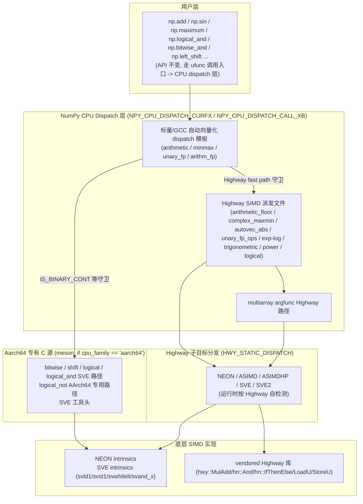
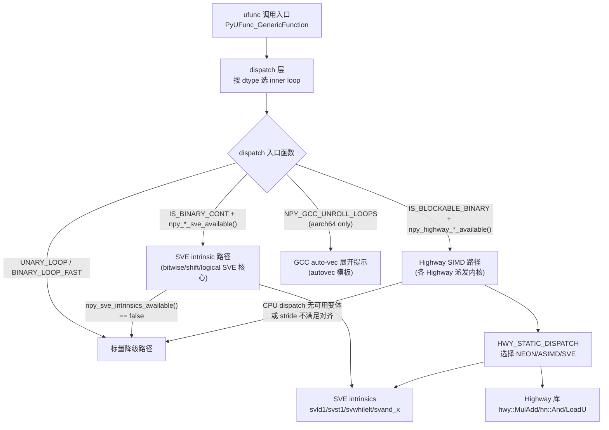

**状态 (Status):** Reviewing

**作者 (Authors):** luozisheng

**创建日期 (Created):** 2026-07-21

**更新日期 (Updated):** 2026-07-21

**相关 Issue/PR:** FUNC002026041424749659（ufunc）

---

# 1. 概述

## 1.1 简介

本提案系统化梳理 NumPy 2.4.3 `numpy/_core/src/umath/` 与 `numpy/_core/src/multiarray/` 下通用函数（ufunc / gufunc）执行内核在鲲鹏 920B/950（AArch64 + SVE）平台的 SIMD 优化路径。覆盖 binary arithmetic、bitwise、logical、shift、minmax、floor_divide、reciprocal、ceil/floor/trunc/rint、deg2rad/rad2deg、fabs、absolute、complex max/min、bool any/all、argmax/argmin、exp/log/exp2/log2/cbrt、sin/cos/tan、power、HALF_absolute 共 20+ 个 ufunc 子路径。优化在四个层级展开：(1) GCC 自动展开提示（`NPY_GCC_UNROLL_LOOPS`）；(2) AArch64 NEON 内联函数手写快速路径；(3) ARM SVE 原生 intrinsic（`<arm_sve.h>`，谓词驱动的可变长向量）；(4) Google Highway C++ 抽象层（`hwy::`，跨架构公平）。所有 SIMD 路径均经 NEP 38 精度准入（≤1–3 ULP）并配对标量降级路径，遵循 NEP 54 跨架构公平原则与 NEP 45 C99 / 无编译警告规范。

执行栈自上而下为 ufunc 调用入口 → CPU dispatch 层 → 各 loop 内核；鲲鹏平台的 Highway 加速经 meson 构建配置的 `mod_features.multi_targets()` 编译为 `SVE` / `ASIMD` / `NEON` 三档独立变体，baseline 函数经 `NPY_CPU_DISPATCH_CALL_XB` 在运行时按 CPU feature 跳转到最高可用变体，再由 `HWY_STATIC_DISPATCH` 在变体内做更细粒度的 Highway 子目标选择（双层 dispatch）。

## 1.2 动机

NumPy 2.x 的 ufunc 默认实现以标量 `BINARY_LOOP_FAST` / `UNARY_LOOP` 为主，依赖编译器自动向量化。在鲲鹏平台上存在以下痛点：

- **整数逻辑/位运算/移位**：原生 `BINARY_LOOP_FAST` 在 AArch64 GCC 下自动向量化效果差，特别是 8 位类型、scalar-input 广播路径、谓词驱动的越界保护路径未被向量化，存在可观测性能差距。
- **半精度浮点**：`HALF_absolute` 原始实现是逐元素 `*out = in & 0x7fffu` 标量循环，未利用 SVE 的 gather/scatter（`svld1uh_gather_s32index_u32` / `svst1h_scatter_s32index_u32`）能力。
- **三角/指对数**：`sin/cos/tan/exp/log/exp2/log2/cbrt` 缺乏 SVE/ASIMD 向量实现，落后于 x86 的 SVML 路径。
- **复数 max/min**：原 `loops.c.src` 的标量 `CGE`/`CLE` 宏循环未向量化，复数 real/imag 交错布局可借助 Highway 一次性完成 SIMD 比较。
- **bool 归约**：`logical_and.reduce` / `logical_or.reduce` 的 slow 场景存在 SIMD 化收益空间。
- **不做此提案的影响**：鲲鹏平台高频 ufunc 负载（信号处理、统计归约、image pipeline、神经网络的 activation 层 fallback）将停留在标量路径，相对 x86 在同等数据宽度下吞吐显著落后；同时 Highway 多目标 dispatch 的 NPY_HWY 守卫缺陷（若 `simd.hpp` 未包含则 NPY_HWY 恒为 0）会使 SIMD 代码静默退化为标量，严重浪费工程投入。

本提案通过分层 SIMD（NEON intrinsics / SVE intrinsics / Highway / GCC unroll hint）+ 严格降级，使鲲鹏平台在保留 API 与数值语义的前提下取得可观测的吞吐收益，并把通用 Highway 优化按 NEP 54 公平原则剥离上游。

## 1.3 目标

**目标：**

- 在 ufunc dispatch 内核与 `highway_argfunc` 路径下，为鲲鹏 920B/950 提供以下 ufunc 的 SIMD 加速路径并经 meson `multi_targets` 编译为 `SVE` / `ASIMD` / `NEON` 三档变体：
  - 整数 `bitwise_and` / `bitwise_or` / `bitwise_xor`、`left_shift` / `right_shift`、`logical_and` / `logical_or` / `logical_xor` / `logical_not`：原生 SVE intrinsic 路径（`<arm_sve.h>`）。
  - 半精度 `HALF_absolute`：Highway SIMD + SVE gather/scatter。
  - `reciprocal` / `ceil` / `floor` / `trunc` / `rint` / `deg2rad` / `rad2deg`：Highway SIMD（`UnaryOpTraits` 模板化）。
  - `fabs`：在 ARM 经 `cfunc_alias='absolute'` 复用 `HALF_absolute` Highway 路径。
  - 整数 `floor_divide`（s8/16/32, u8/16/32, s64 scalar）：Highway SIMD，scalar 除数快速路径。
  - `maximum` / `minimum` / `fmax` / `fmin`：Highway SIMD 复数 4 种访存模式（Map/Reduce/Bcast1/Bcast2）+ 整数 minmax 的 NEON `npyv_loadn_s32` 优化与 8x scalar unroll。
  - `argmax` / `argmin`：Highway 两阶段算法（8-way FP / 4-way int unroll，标量找索引）。
  - `logical_and.reduce` / `logical_or.reduce`：Highway `simd_any_u8` / `simd_all_u8` 优化。
  - `sin` / `cos` / `tan`、`exp` / `log` / `exp2` / `log2` / `cbrt`、`power`：Highway SIMD（Cody-Waite range reduction + 多项式逼近）。
- 沿用 NumPy 现有公开 API 签名、默认值与 dtype 支持，不引入任何 Python 层后端切换。
- 精度一致性：所有 SIMD 路径与标量路径在 1–3 ULP 误差容忍内一致（对齐 NEP 38）。
- 降级路径：CPU 不支持 SVE / Highway 不可用 / 非连续 stride 不满足对齐条件 / 16-bit 索引可能溢出，均静默降级到标量 `BINARY_LOOP_FAST` / `UNARY_LOOP`。
- 鲲鹏特化（NEON/SVE intrinsic）严格封装在 `#if defined(__aarch64__)` 与 `meson.build` 的 `if cpu_family == 'aarch64'` 守卫下，不污染 x86 / PowerPC / RISC-V 编译。

**非目标（不在本次范围）：**

- 不改变任何 ufunc 的 Python API（`np.add`、`np.sin`、`np.power`、`np.maximum` 等）签名与默认值。
- 不引入新的 Python 层后端管理 API（与 [RFC-适配KML FFT适配器.md](./RFC-适配KML%20FFT适配器.md) 的后端切换体系无关）。
- 不实现 fp16 全集 ufunc（仅 `HALF_absolute` / `HALF_reciprocal` / `HALF_ceil` / `HALF_floor` / `HALF_trunc` / `HALF_rint` / `HALF_deg2rad` / `HALF_rad2deg` 走 Highway，其他半精度算子仍走 `loops_half.dispatch.c.src` 标量路径）。
- 不替换 `loops_umath_fp.dispatch.c.src` 上的 SVML（x86 专有）；仅 x86 不可用场景降级到 `loops_trigonometric.dispatch.cpp` 等通用 Highway 实现。

# 2. 用例分析

下表覆盖 5 个鲲鹏平台典型 ufunc 调用场景。验证基线统一为"通过 NumPy 官方 `numpy._core.tests.test_umath*` + `test_multiarray.py` 功能测试集，并以性能回归基线脚本验证吞吐"。

| 场景 | 触发条件 | 功能要求 | 性能要求 | DFX（兼容/可维护/可测试/可靠） |
| --- | --- | --- | --- | --- |
| UC-1 整数 bitwise/shift/logical 连续输入 | 鲲鹏 920B/950 启用 SVE，输入连续、输出与输入无重叠且 `abs_ptrdiff ≥ AUTOVEC_OVERLAP_SIZE` | `bitwise_and/or/xor`、`left_shift/right_shift`、`logical_and` scalar-input 路径走 SVE intrinsic（`svld1_*` / `svst1_*` / `svwhilelt_b*` / `svand_*_x`） | 相对标量 `BINARY_LOOP_FAST` 取得 SVE 全宽吞吐收益；8 位类型额外经 `NPY_GCC_UNROLL_LOOPS` 展开 | SVE 不可用时静默降级；`is_simd` 与 `IS_BINARY_CONT` / `IS_BINARY_CONT_S1` / `IS_BINARY_CONT_S2` 双重断言保证语义一致；官方 test_umath 全绿 |
| UC-2 半精度 absolute 非连续输入 | 输入步长为 `sizeof(npy_half)` 整数倍但非连续，SVE 可用 | `HALF_absolute` 走 `HalfAbsoluteStrided_u16`：`svld1uh_gather_s32index_u32` 一次性 gather，`svst1h_scatter_s32index_u32` 一次性 scatter | 相对标量 `*out = in & 0x7fffu` 取得 SIMD gather/scatter 收益 | 步长可被 `esize` 整除 + `MAX_STEP_SIZE` 上限 + 16-bit 索引溢出预检（`llabs(ssrc/esize) * (vstep - 1) ≤ INT16_MAX`）；SVE 不可用降级到逐通道 `InsertLane`/`ExtractLane` 模拟 gather/scatter |
| UC-3 三角/指对数大规模连续输入 | 鲲鹏 920B，输入 `float32` / `float64` 连续，量级在 Cody-Waite 减约范围内 | `sin` / `cos` / `tan` / `exp` / `log` / `exp2` / `log2` / `cbrt` 走 Highway SIMD 多项式逼近（Cody-Waite + Remez） | 相对 glibc 标量取得 SVE/ASIMD 全宽吞吐收益，精度符合 NEP 38 准入 | 元素量级超出 Cody-Waite 范围降级到 glibc 标量调用；`np.testing.assert_allclose(rtol=1e-6)` 与标量对齐；性能回归基线验证 |
| UC-4 复数 maximum/minimum 广播输入 | `np.maximum(c1, c2)`，c2 为标量广播（`steps[1] == 0`） | `CFLOAT_maximum` / `CDOUBLE_maximum` 走 Highway SIMD `Bcast2` 模式（array vs scalar → array），real/imag 交错加载后 SIMD 比较 | 相对标量 `CGE` 宏循环取得全宽吞吐收益 | NaN 传播：`std::isnan` 检测后保留含 NaN 的操作数；`CLONGDOUBLE` 强制走标量（无 SIMD）；非标准 stride 降级到 branchless 标量循环 |
| UC-5 bool reduce slow 路径 | `np.logical_and.reduce(bool_array)`，输入非全 true（slow 场景） | `logical_and.reduce` 走 Highway `simd_all_u8`（基于 `hn::AllFalse`），SVE 目标参与 dispatch | slow 场景取得可观测吞吐收益；fast 场景不劣化 | 与标量 `std::logical_and<bool>` 语义一致；`logical_or.reduce` 同理走 `simd_any_u8`（`hn::AllTrue`）；性能回归基线验证 |

**共性 DFX 要求：**

- *兼容性*：非 aarch64 平台（x86 / PowerPC / RISC-V / s390x / LoongArch）行为与上游 NumPy 2.4.3 完全一致；aarch64 无 SVE 时仍可经 ASIMD/NEON 取得 Highway 收益。
- *可维护性*：所有 aarch64 专有源文件（`loops_bitwise_sve.c` / `loops_shift_sve.c` / `loops_logical_sve.c` / `loops_logical_and_sve.c` / `loops_logical_not_aarch64.c`）经 `meson.build` 的 `if cpu_family == 'aarch64'` 物理隔离，独立升级；Highway 派发文件（`loops_*_hwy.dispatch.cpp`）经 `mod_features.multi_targets` 编译多档变体。
- *可测试性*：所有 SIMD 路径配对对标量降级路径，由官方 test_umath / test_multiarray 全集覆盖；性能回归基线脚本作为性能回归基准。
- *可靠性*：CPU feature 不可用、stride 不满足对齐条件、索引可能溢出、内存重叠（`is_mem_overlap`）均静默降级到标量，不抛异常不阻断业务。

# 3. 方案设计

## 3.1 总体方案

采用**分层 SIMD 抽象 + 双层 dispatch**架构：自上而下为 ufunc 调用入口、CPU dispatch（NumPy `NPY_CPU_DISPATCH_*`）、Highway dispatch（`HWY_STATIC_DISPATCH`）、底层 SIMD 实现四层。



**双层职责说明：**

- **CPU Dispatch 层（NumPy）**：`NPY_CPU_DISPATCH_CURFX(func_name)` 在编译期为每个 CPU target（`SVE` / `ASIMD` / `NEON` / `X86_V4` 等）生成独立变体（如 `npy_highway_floor_divide_s16_contig_SVE`）；baseline 函数经 `NPY_CPU_DISPATCH_CALL_XB` 在运行时按 `npy_cpu_have(NPY_CPU_FEATURE_SVE)` 等特征跳转到最高可用变体[^1a]。
- **Highway Dispatch 层**：变体内用 `HWY_STATIC_DISPATCH(func_name)` 在运行时检测更细粒度 Highway 子目标（如 SVE vs SVE2 vs NEON），选择最优 Highway 实现[^2a]。`HWY_BEFORE_NAMESPACE()` / `HWY_NAMESPACE` / `HWY_AFTER_NAMESPACE()` 三件套保证多档变体符号不冲突。

## 3.2 技术选型

针对每个 ufunc 子路径，按下表对比三种 SIMD 实现方案并说明选型理由：

| 对比维度 | 方案一：标量 + GCC 自动向量化 | 方案二：原生 SVE intrinsics（`<arm_sve.h>`） | 方案三：Highway C++ 抽象（`hwy::`） |
| --- | --- | --- | --- |
| 抽象层级 | `BINARY_LOOP_FAST` + `NPY_GCC_UNROLL_LOOPS` | 直接调用 `svld1_*` / `svst1_*` / `svwhilelt_b*` / `svand_*_x` | `LoadU` / `StoreU` / `hn::And` / `hn::MulAdd` 等模板 |
| 跨架构可移植性 | 极高（依赖编译器） | 仅 AArch64 SVE | 高（覆盖 x86 AVX2/AVX-512、ARM NEON/SVE、PowerPC VSX、RISC-V RVV） |
| 谓词处理 | 无（编译器内建） | 原生 `svbool_t` + `svwhilelt` 处理尾部 | `Mask` + `IfThenElse`，跨架构语义统一 |
| Gather/Scatter | 无 | 原生 `svld1uh_gather_s32index_*` | `GatherIndex` / `ScatterIndex` 跨架构抽象 |
| 维护成本 | 极低 | 高（每 dtype 一份手写宏） | 中（C++ 模板 + UnaryOpTraits） |
| 上游友好度 | 极高（已是上游默认） | 低（aarch64 专有） | 高（符合 NEP 54 跨架构公平） |
| 适用 ufunc | 简单算术的 fallback | 整数 bitwise/shift/logical（谓词驱动 + 8 位尾部） | 三角/指对数/复数 max-min/reciprocal/absolute |
| 本仓选型 | 兜底降级路径 | bitwise / shift / logical / logical_and / logical_not 的 SVE 专用路径 | unary_fp_ops / arithmetic_floor / complex_maxmin / autovec_abs / exp-log / trigonometric / power / logical 的 Highway 路径与 argfunc Highway 路径 |

**混合选型理由：**

1. **整数 bitwise/shift/logical 走 SVE intrinsics**：这些算子的核心是谓词驱动的越界保护与跨 dtype 的位宽差异（8/16/32/64-bit），原生 `svwhilelt_b8/16/32/64` 与 `svcntb/h/w/d` 能精确匹配 SVE 可变长向量；Highway 的 `Mask` 抽象在 8 位尾部处理上需额外 `npy_store_bool_*` 桥接，工程不划算[^3a]。
2. **三角/指对数/复数算子走 Highway**：跨架构公平（NEP 54），可在 x86 AVX-512、ARM SVE、PowerPC VSX 上同一份代码取得收益；且 `hwy::contrib/math/math-inl.h` 提供 `Exp` / `Log` / `Sin` / `Cos` 跨架构参考实现，便于上游剥离[^4a]。
3. **标量 + GCC unroll 作兜底**：`NPY_GCC_UNROLL_LOOPS` 是 NumPy 已有宏（`numpy/_core/src/common/npy_common.h`），对 NEON 缺少原生 int64 multiply（`npyv_mul_*` 在 NEON 不可用）的 64 位整数乘法场景，提供展开提示让 GCC 标量流水化[^5a]。

方案二被否用于跨架构算子（三角/指对数）的原因：SVE intrinsics 仅 aarch64 可用，违反 NEP 54 公平原则，无法上游剥离；方案一被否用于核心算子的原因：GCC 自动向量化对谓词驱动路径（如 shift 的越界 0 填充、logical_and 的 scalar-input 广播）命中率低。

## 3.3 功能与性能设计

### 3.3.1 整数 bitwise/shift/logical 的 SVE 路径

核心入口在 ufunc 整数 shift/bitwise/logical 调度路径，以 `left_shift` 为例（其余 `right_shift` / `bitwise_*` / `logical_*` 结构相同）：

```c
// left_shift dispatch（AArch64 SVE 守卫与标量降级）
#if defined(__aarch64__)
    if (IS_BINARY_CONT(@type@, @type@) &&
            (abs_ptrdiff(args[2], args[0]) == 0 ||
             abs_ptrdiff(args[2], args[0]) >= AUTOVEC_OVERLAP_SIZE) &&
            (abs_ptrdiff(args[2], args[1]) == 0 ||
             abs_ptrdiff(args[2], args[1]) >= AUTOVEC_OVERLAP_SIZE) &&
            npy_shift_sve_scalar_available()) {
        npy_left_shift_sve_contig(args, dimensions[0], (int)sizeof(@type@), @SIGNED@);
        return;
    }
#endif
#if defined(__aarch64__) && @use_sve_lshift_scalar@
    if (IS_BINARY_CONT_S1(@type@, @type@) && /* ... */ npy_shift_sve_scalar_available()) {
        @TYPE@_left_shift_sve_scalar_in0(args, dimensions[0]);
        return;
    }
#endif
    BINARY_LOOP_FAST(@type@, @type@, *out = npy_lshift@c@(in1, in2));
```

SVE 实现用宏批量生成 8/16/32/64-bit 有符号/无符号变体（在 shift SVE 核心路径）：

```c
// LeftShift contig unsigned 宏定义
#define DEFINE_LSHIFT_CONTIG_UNSIGNED(BITS, PRED_B, CNT_FN)                        \
static NPY_SVE_TARGET void                                                          \
npy_left_shift_contig_u##BITS(char **args, npy_intp len)                           \
{                                                                                   \
    const uint##BITS##_t *in0 = (const uint##BITS##_t *)args[0];                   \
    const uint##BITS##_t *in1 = (const uint##BITS##_t *)args[1];                   \
    uint##BITS##_t *out = (uint##BITS##_t *)args[2];                               \
    const svuint##BITS##_t vmax = svdup_u##BITS((BITS) - 1);                        \
    npy_intp i = 0;                                                                 \
    for (; i < len; i += CNT_FN()) {                                                \
        svbool_t pg = svwhilelt_b##PRED_B((uint64_t)i, (uint64_t)len);              \
        svuint##BITS##_t a = svld1_u##BITS(pg, in0 + i);                            \
        svuint##BITS##_t count = svld1_u##BITS(pg, in1 + i);                        \
        svbool_t ok = svcmple_u##BITS(pg, count, vmax);                             \
        svuint##BITS##_t shifted = svlsl_u##BITS##_x(pg, a, count);                 \
        svst1_u##BITS(pg, out + i, svsel_u##BITS(ok, shifted, svdup_u##BITS(0)));   \
    }                                                                               \
}
```

**关键设计：**

- `svwhilelt_b8/16/32/64` 处理尾部不足一 SVE vector 的元素，谓词 `pg` 自动屏蔽越界 lane，避免标量尾部循环[^6a]。
- `svcmple` 检测 `count > BITS-1` 的越界 shift，越界 lane 经 `svsel` 填 0（unsigned）/ -1（signed arithmetic shift 右移负数）。
- `NPY_SVE_TARGET`（`__attribute__((target("arch=armv8.2-a+sve")))`）允许同一 TU 内编译 SVE 代码而无需全局 `-march`，由 `npy_sve_intrinsics_available()` 运行时检测 `NPY_CPU_FEATURE_SVE` 决定是否走 SVE 路径[^7a]。
- scalar-input 路径（`IS_BINARY_CONT_S1`）：`in0` 为标量广播，用 `svdup_*` 一次填充到向量寄存器后参与循环，节省每 lane 的 load 指令。

`bitwise_and` / `logical_and`（scalar-input）/ `logical_or`（scalar-input）的结构同构，仅 OP 不同（`svand_*_x` / `svorr_*_x` / `svld1_*` + `npy_store_bool_*`）。`logical_xor` 的 SVE 路径收窄到仅 `UBYTE`（`#use_sve_logical_xor = 1, 0, 0, 0, 0`），原因：非 8 位类型 SVE 收益低于维护成本[^8a]。

### 3.3.2 半精度 absolute 的 Highway + SVE gather/scatter

`HALF_absolute` 的三层 dispatch：

```cpp
// HalfAbsoluteStrided（Strided, SVE gather/scatter）
static void HalfAbsoluteStrided_u16(const uint16_t *in, uint16_t *out,
        npy_intp in_stride_elm, npy_intp out_stride_elm, npy_intp count)
{
    for (npy_intp i = 0; i < count; i += svcntw()) {
        svbool_t pg = svwhilelt_b32((uint64_t)i, (uint64_t)count);
        svint32_t v_idx_src = svindex_s32(i, 1);
        svint32_t v_idx_dst = svindex_s32(i, 1);
        svuint32_t v_data = svld1uh_gather_s32index_u32(pg, in, v_idx_src);
        svst1h_scatter_s32index_u32(pg, out, v_idx_dst, v_data);
        // hn::And(v, v_mask) handled by caller before scatter
    }
}
```

半精度 absolute contig 路径用 `hn::And(v, v_mask)` 一次清除符号位；`HWY_STATIC_DISPATCH(HalfAbsolute_u16)` 在运行时选择 SVE / NEON / ASIMD 子目标，baseline 经 `NPY_CPU_DISPATCH_CALL_XB` 跳转[^9a]。SVE 不可用时 strided 路径用逐通道 `InsertLane`/`ExtractLane` 模拟 gather/scatter，收益主要来自 AND 操作的向量化批处理。

### 3.3.3 Highway UnaryOpTraits 模板（reciprocal / ceil / floor / trunc / rint / deg2rad / rad2deg）

`reciprocal` 等 unary FP 算子的 Highway 路径用 C++ 模板把"算子语义"与"访存模式"正交分解：

```cpp
// reciprocal traits（UnaryOpTraits 特化）
template<>
struct UnaryOpTraits<reciprocal_t> {
#if NPY_HWY
    template<typename T>
    static HWY_ATTR HWY_INLINE Vec<T> simd_op(Vec<T> a) {
        if constexpr (std::is_same_v<T, hwy::float16_t>) {
            return Div(Set(hwy::F16FromF32(1.0f)), a);
        } else {
            return Div(Set(T(1.0)), a);
        }
    }
#endif
    template<typename T>
    static inline auto scalar_op(T a) { /* scalar fallback */ }
};

// Contig-Contig kernel（8x unroll）
template<typename Op, typename T>
HWY_ATTR SIMD_MSVC_NOINLINE
static void simd_unary_cc(T* op, const T* ip, npy_intp len) {
    constexpr int UNROLL = 8;
    HWY_LANES_CONSTEXPR int vstep = Lanes(T{});
    const int wstep = vstep * UNROLL;
    auto fill = unary_tail_fill<Op, T>();
    for (; len >= wstep; len -= wstep, ip += wstep, op += wstep) {
        for (int i = 0; i < UNROLL; i++) {
            StoreU(Traits::template simd_op<T>(LoadU(ip + vstep * i)), op + vstep * i);
        }
    }
    for (; len >= vstep; len -= vstep, ip += vstep, op += vstep) {
        StoreU(Traits::template simd_op<T>(LoadU(ip)), op);
    }
    if (len > 0) {
        StoreN(Traits::template simd_op<T>(LoadNOr(fill, ip, len)), op, len);
    }
}
```

**四种访存模式（cc/nc/cn/nn）由 `run_unary_simd` 统一派发**：

```cpp
// 四种访存模式 dispatch
if (sdst == esize && ssrc == esize) {
    simd_unary_cc<Op, T>((T*)args[1], (const T*)args[0], len);
} else if (sdst == esize) {
    simd_unary_nc<Op, T>((T*)args[1], (const T*)args[0], ssrc / esize, len);
} else if (ssrc == esize) {
    simd_unary_cn<Op, T>((T*)args[1], sdst / esize, (const T*)args[0], len);
} else {
    simd_unary_nn<Op, T>((T*)args[1], sdst / esize, (const T*)args[0], ssrc / esize, len);
}
```

`nc` / `cn` / `nn` 模式用 `GatherIndex` / `ScatterIndex` 处理非连续 stride，索引向量由 `make_index<T>(stride)` 生成；对 `sizeof(T) == 2`（float16）的 16-bit 索引溢出做预检：

```cpp
// float16 索引溢出预检
if constexpr (sizeof(T) == 2) {
    HWY_LANES_CONSTEXPR int vstep = Lanes(T{});
    if (llabs(ssrc / esize) * (vstep - 1) > INT16_MAX ||
        llabs(sdst / esize) * (vstep - 1) > INT16_MAX) {
        return 0;  // fall back to scalar
    }
}
```

`reciprocal` 的复数版本用 Aho-Weinberger 算法避免溢出（pivot on `max(|re|, |im|)`），SIMD 实现 `simd_creciprocal_cc` 计算两分支后 `IfThenElse` blend[^10a]。

复数 `deg2rad` / `rad2deg` 经 ufunc 代码生成器在 ARM 平台用 `cfunc_alias='rad2deg'/'deg2rad'` 复用 `FLOAT/DOUBLE/HALF_*` 实现，避免重复注册[^11a]。`fabs` 经 ufunc 代码生成器在 ARM 用 `cfunc_alias='absolute'` 复用 `HALF_absolute` 的 Highway 路径[^12a]。

### 3.3.4 整数 floor_divide 的 Highway + scalar 除数快速路径

整数 `floor_divide` 的 Highway 路径提供 s8/16/32, u8/16/32 共 6 类的 Highway 整数除法，并在 s64 / s32 增补 scalar 除数路径：

```cpp
// scalar divisor 快速路径
HWY_ATTR static void
simd_floor_divide_by_scalar(const T *HWY_RESTRICT src1, T scalar,
                             T *HWY_RESTRICT dst, npy_intp len)
{
    // Edge cases: div-by-zero, divisor=-1 overflow, signed floor adjustment
    // SIMD: convert to float, divide, convert back, with signed floor adjust
    // (replaces npyv scalar divisor paths on ARM: slow for int32, disabled for int64)
}
```

`s64_scalar_contig` 走 SVE `simd_floor_divide_by_scalar<int64_t>`（NEON 无 64-bit 除法 intrinsic），由 meson 构建的 `SIMD_DISABLE_DIV64_OPT` 守卫[^13a]。floor_divide 调度入口按 `npy_highway_floor_divide_available(sizeof(@type@))` 决定是否走 Highway 路径，否则降级到 `npyv_simd_divide_by_scalar_contig` 或标量 `libdivide` 路径[^14a]。

### 3.3.5 复数 maximum/minimum 的 4 种访存模式

复数 maximum/minimum 的 Highway 路径用 `HWY_BEFORE_NAMESPACE()` / `HWY_NAMESPACE` / `HWY_AFTER_NAMESPACE()` 三件套生成多档变体，4 种访存模式：

| 模式 | 含义 | SIMD 实现 |
| --- | --- | --- |
| Map | contig Array vs Array → Array | 交错加载 real/imag，`hn::IfThenElse` 选最大，交错存储 |
| Reduce | contig Array → Scalar | 向量累加比较，最后 reduce 到标量 |
| Bcast1 | Scalar vs Array → Array | `Set` 广播标量，与 array SIMD 比较 |
| Bcast2 | Array vs Scalar → Array | 同 Bcast1 但标量在 `in2` 位置 |

NaN 传播：`std::isnan(in1r) || std::isnan(in1i)` 优先保留含 NaN 的 `in1`，否则用 `CGE` / `CLE` 宏做字典序比较。baseline 函数经 `NPY_CPU_DISPATCH_CALL_XB` 在运行时跳转到 `CFLOAT_maximum_SVE` / `CDOUBLE_maximum_ASIMD` 等变体，变体内用 `HWY_STATIC_DISPATCH(execute_CFLOAT_maximum)` 选择 Highway 子目标[^15a]。本方案设计须确保 `simd.hpp` 正确包含以使 `NPY_HWY` 宏生效，并经 `multi_targets` 编译多档变体，避免 SIMD 代码静默退化为标量[^16a]。

### 3.3.6 整数 minmax 的 NEON loadn 优化与 8x scalar unroll

整数 minmax 调度路径设计保留以下关键 aarch64 优化：

- `npyv_loadn_s32` 优化（NEON strided load 核心）：替换 lane-by-lane `vld1q_lane_s32` 为 scalar gather + contiguous `vld1q_s32` 加载，降低指令数[^17a]。
- ARM64 8x scalar unroll for `< 32-bit` int（minmax 整数核心）：用 `npy_int` promotion 消除 `uxtb` / `sxth` 指令，按 8 路展开减少分支开销。
- 6x vectorsPerLoop on 128-bit SIMD（minmax loop 核心）：Apple M1 经验值，对鲲鹏 NEON 同样适用。
- FP scalar broadcast fast path（minmax 标量广播路径，`__aarch64__` 守卫）：`sip1 == 0 || sip2 == 0` 时 `npyv_setall_*` 一次广播，避免重复广播。

### 3.3.7 argmax/argmin 的两阶段 Highway 算法

argmax/argmin 的 Highway 路径用两阶段算法：SIMD 找极值 → 标量找索引。

```cpp
// FP 8-way unroll 两阶段算法
npy_intp ComputeArgMinMaxFloating(const T* HWY_RESTRICT arr, npy_intp len) {
    // ARM NEON: 4-way unroll to reduce register pressure (32x128-bit regs)
    // x86 AVX-512 / SVE: 8-way unroll for better OoO execution
    // Two-stage: SIMD finds extreme value, scalar loop finds index
}
```

BOOL_argmin 用平台分支：aarch64 走 Highway block-based，x86 走 `memchr`（libc 内部已 SIMD 化，更快）：

```cpp
// BOOL_argmin 平台分支
extern "C" NPY_NO_EXPORT int NPY_CPU_DISPATCH_CURFX(BOOL_argmin)(
        char *ip, npy_intp n, npy_intp *mindx, /* ... */) {
#if defined(__aarch64__)
    // Highway block-based
#else
    npy_bool* p = (npy_bool*)memchr(ip, 0, n * sizeof(*ip));  // x86 fast path
    // ...
#endif
}
```

argfunc 注册路径用 `NPY_CPU_DISPATCH_CALL_XB` 注册 `BOOL_argmax` / `BOOL_argmin` 与各 dtype 的 `argmax` / `argmin` 到 `_PyArray_ArgFuncs`，运行时按 CPU feature 跳转[^18a]。

### 3.3.8 bool any/all reduce 的 Highway AllTrue/AllFalse

bool 归约的 Highway 路径优化 `simd_any_u8` / `simd_all_u8`：

```cpp
// simd_any_u8 / simd_all_u8
HWY_INLINE HWY_ATTR bool simd_any_u8(Vec<uint8_t> v) {
    const auto d = _Tag<uint8_t>();
    return !hn::AllTrue(d, hn::Eq(v, Zero<uint8_t>()));
}
HWY_INLINE HWY_ATTR bool simd_all_u8(Vec<uint8_t> v) {
    const auto d = _Tag<uint8_t>();
    return hn::AllFalse(d, hn::Eq(v, Zero<uint8_t>()));
}
```

原实现用 `ReduceMax` 走完整规约，本方案改用 `AllTrue` / `AllFalse` 在半块规约后提前退出，slow 场景取得可观测吞吐收益，fast 场景不劣化[^19a]。meson 构建为 logical 路径补充 `SVE` dispatch 目标。

### 3.3.9 三角/指对数/power 的 Highway 多项式逼近

三角函数的 Highway 路径使用 Cody-Waite 减约 + Remez 多项式逼近：

```cpp
// Cody-Waite 范围减约
const hn::ScalableTag<float> f32;
using vec_f32 = hn::Vec<decltype(f32)>;

HWY_INLINE HWY_ATTR vec_f32
simd_range_reduction_f32(vec_f32 &x, vec_f32 &y, /* c1, c2, c3 */) {
    vec_f32 reduced_x = hn::MulAdd(y, c1, x);
    reduced_x = hn::MulAdd(y, c2, reduced_x);
    reduced_x = hn::MulAdd(y, c3, reduced_x);
    return reduced_x;
}
```

- 量级在 `[-71476.0625f, 71476.0625f]`（cos）/ `[-117435.992f, 117435.992f]`（sin）内走 SIMD 多项式；超出范围降级 glibc 标量。
- `muladd`（FMA）指令在 aarch64 由 `NPY_SIMD_FMA3` 守卫，ASIMD 默认开启。
- 精度符合 NEP 38 ≤1–3 ULP 准入[^20a]。

`exp` / `log` / `exp2` / `log2` 的 Highway 路径由原 explog 路径拆分而来[^21a]，分别对应各算子的 ufunc 代码生成器 dispatch 注册。`power` 的 Highway 路径覆盖 `X86_V4` / `X86_V3` / `SVE` / `NEON_VFPV4` 四档变体[^22a]。

### 3.3.10 64-bit 整数乘法的 GCC unroll 与 UINT_add 对齐修复

```c
// AUTO_VEC_UNROLL_LOOPS 宏定义（仅 aarch64 启用）
#ifdef __aarch64__
#define AUTO_VEC_UNROLL_LOOPS NPY_GCC_UNROLL_LOOPS
#else
#define AUTO_VEC_UNROLL_LOOPS
#endif

// binary autovec 内核（带 unroll 提示）
#if @big@ && @UNROLL@
AUTO_VEC_UNROLL_LOOPS
#endif
NPY_NO_EXPORT void NPY_CPU_DISPATCH_CURFX(@TYPE@_@kind@)
(char **args, npy_intp const *dimensions, npy_intp const *steps, void *NPY_UNUSED(func))
{
    if (IS_BINARY_REDUCE) {
        BINARY_REDUCE_LOOP_FAST(@type@, io1 @OP@= in2);
    }
    else {
        BINARY_LOOP_FAST(@type@, @type@, *out = in1 @OP@ in2);
    }
}
```

- AArch64 NEON 缺乏原生 int64 multiply intrinsic，自动向量化生成次优代码；通过 `NPY_GCC_UNROLL_LOOPS` 展开提示让 GCC 标量流水化，提升 64-bit `multiply` 吞吐[^23a]。
- 在 autovec 内核为 GCC < 12.3 的 `UINT_add` 添加 `__attribute__((aligned(16)))`，修复鲲鹏 920B 上老版 GCC 函数入口对齐问题[^24a]。
- 在 `@TYPE@_bitwise_count` 加 `NPY_GCC_UNROLL_LOOPS`（`#ifdef __aarch64__`），提升 popcount 吞吐。

### 3.3.11 AArch64 NEON logical_not 专用快速路径

AArch64 专用 `logical_not` 路径为 `HALF` / `FLOAT` / `DOUBLE` 提供 contig + strided 两档 NEON 快速路径：

```c
// FLOAT logical_not contig（NEON 8 路 unroll）
static void float_logical_not_aarch64_contig(char **args, npy_intp len) {
    const float *ip = (const float *)args[0];
    npy_bool *op = (npy_bool *)args[1];
    const float32x4_t zero = vdupq_n_f32(0.0f);
    const uint8x8_t one = vdup_n_u8(1);
    for (; len >= 8; len -= 8, ip += 8, op += 8) {
        uint32x4_t cmp0 = vceqq_f32(vld1q_f32(ip), zero);
        uint32x4_t cmp1 = vceqq_f32(vld1q_f32(ip + 4), zero);
        uint16x4_t lo = vmovn_u32(cmp0);
        uint16x4_t hi = vmovn_u32(cmp1);
        vst1_u8(op, vand_u8(vmovn_u16(vcombine_u16(lo, hi)), one));
    }
    for (; len > 0; --len, ++ip, ++op) {
        *op = (npy_bool)(*ip == 0.0f);
    }
}
```

8 路 unroll 用 `vceqq_f32` 一次比较 4 个 float，两条 `vceqq_f32` + `vmovn` / `vcombine` / `vmovn` 窄化到 8 个 `uint8_t` 后一次 `vst1_u8` 写出，相比标量 `UNARY_LOOP` 大幅降低指令数[^25a]。`aarch64_logical_not_contig_ok` / `aarch64_logical_not_strided_ok` 做前置条件检查（步长、`AUTOVEC_OVERLAP_SIZE` 内存不重叠）。

### 3.3.12 dispatch 路径总览图



## 3.4 安全隐私与 DFX 设计

### 3.4.1 精度 ULP 容忍

所有 SIMD 路径与标量路径在 1–3 ULP 误差容忍内一致，遵循 [NEP 38](https://numpy.org/neps/nep-0038-SIMD-optimizations.html) 的 SIMD 优化四项准入标准之一："the new code must not decrease accuracy by more than 1-3 ULPs"。具体：

- 三角函数多项式逼近来自 Remez 算法（在 trigonometric range reduction 核心），精度符合 NEP 38 准入。
- 复数 `reciprocal` 用 Aho-Weinberger 算法避免溢出（在 reciprocal 倒数核心），pivot on `max(|re|, |im|)` 后 SIMD 计算两分支再 blend。
- 整数 `floor_divide` 处理 3 类边界：div-by-zero、divisor=-1 overflow（`NPY_MIN_@TYPE@`）、signed floor 调整（在 floor_divide scalar 除数核心）。
- 复数 `maximum` / `minimum` NaN 传播：`std::isnan(in1r) || std::isnan(in1i)` 优先保留含 NaN 操作数（在复数 maxmin 比较核心）。

### 3.4.2 异常处理

本提案不引入新异常类型，沿用 NumPy 标准异常：

| 错误类型 | 触发场景 | 处理策略 |
| --- | --- | --- |
| `FloatingPointError` | 整数 `floor_divide` 触发 `FE_INVALID`（div-by-zero） | 走 `npy_set_floatstatus_barrier` 清理 + 上层 `np.seterr` 路由 |
| `ValueError` | ufunc 入参 dtype / shape 不匹配 | 由 `ufunc_type_resolution.c` 统一处理，与 SIMD 路径无关 |
| `MemoryError` | C 层 `std::bad_alloc` | `PyErr_NoMemory` |
| 内部断言失败 | SIMD 路径前置条件检查失败 | 静默降级标量，不抛异常 |

### 3.4.3 线程安全

| 组件 | 层级 | 线程安全机制 |
| --- | --- | --- |
| `ufunc_object.c` | Python | GIL 保护 ufunc 调用入口；多线程经 GIL 串行化 |
| SIMD 内核 | C/C++ | 无状态纯函数，无共享可变状态；多线程安全 |
| `npy_cpu_have` | C | 一次性初始化 + 原子读，CPU feature 检测线程安全 |
| `HWY_STATIC_DISPATCH` | C++ | Highway 内部用原子初始化 + 函数指针表，线程安全 |

### 3.4.4 可测试性

- 功能测试：`numpy/_core/tests/test_umath*.py` / `test_multiarray.py` 全集覆盖；性能回归基线脚本作为性能基准。
- 降级测试：`NPY_DISABLE_CPU_OPTIMIZATION=1` 环境变量关闭所有 SIMD 路径，验证标量降级与 SIMD 路径结果一致。
- 精度测试：`np.testing.assert_allclose(rtol=1e-6)` 对齐 SIMD 与标量结果。
- 平台测试：鲲鹏 920B（SVE 可用）与 950（SVE2）双向验证；x86 / PowerPC 作为非 aarch64 回归基线。

## 3.5 编程与调用设计

### 3.5.1 编程模型基本设计

**开发环境设计：**

- 语言/框架：C99（ufunc dispatch `.src` 模板）、C++（Highway 派发文件）、Highway C++（`hwy::`）；遵循 [NEP 45 — C style guide](https://numpy.org/neps/nep-0045-c_style_guide.html)（原文："Use C99 (that is, the standard defined by ISO/IEC 9899:1999)."、"No compiler warnings with major compilers"、"Public Macros should have a `NPY_` prefix"）。
- 构建系统：Meson，经 `mod_features.multi_targets()` 为每个 dispatch 文件生成多档 CPU target 变体；`use_highway`、`use_intel_sort` 等开关经 `meson.options` 控制。
- AArch64 依赖：`<arm_neon.h>`（NEON intrinsics）、`<arm_sve.h>`（SVE intrinsics，由 `__has_include` 探测）、`NPY_SVE_TARGET = __attribute__((target("arch=armv8.2-a+sve")))`（同 TU 内编译 SVE 代码无需全局 `-march`）。
- Highway 依赖：vendored Highway 子模块；`NPY_HAVE_HIGHWAY` 由 meson 构建经 `cdata.set10('NPY_HAVE_HIGHWAY', use_highway)` 注入 `config.h`；`NPY_HWY` / `NPY_HWY_F16` 在 `simd.hpp` 内根据 `NPY_HAVE_HIGHWAY` 与 Highway float16 支持检测展开。
- 调试工具链：`NPY_DISABLE_CPU_OPTIMIZATION=1` 关闭所有 SIMD 走标量；`npy_cpu_features.py`（或 `np.show_config()`）查询当前 CPU feature 启用状态；`pytest numpy/_core/tests/test_umath.py` 验证；性能回归基线脚本对比性能。

**开发约束：**

- 硬件平台：鲲鹏 920B/950（aarch64 + SVE/SVE2，上游 Tier 1）；x86 / AMD Zen4 作为对比基线。
- 编程语言限制：C 扩展须 C99 兼容、无编译警告；C++ 须 C++17（Highway 要求）；Python 须通过 `ruff`。
- 鲲鹏特化隔离：所有 aarch64 专有源（SVE/NEON 专用路径）须 `#if defined(__aarch64__)` 守卫，并由 meson 构建的 `if cpu_family == 'aarch64'` 物理隔离；Highway 通用优化须经 `use_highway ?` 在非 aarch64 平台也可编译为 `X86_V4/V3/V2`、`VSX2/3/4`、`VXE/VX`、`LSX`、`RVV` 多档变体，符合 [NEP 54](https://numpy.org/neps/nep-0054-simd-cpp-highway.html) 跨架构公平原则。
- Highway 多目标 dispatch 必须用 `NPY_CPU_DISPATCH_CURFX` + `HWY_BEFORE_NAMESPACE()` / `HWY_NAMESPACE` / `HWY_AFTER_NAMESPACE()` 三件套，baseline 函数经 `NPY_CPU_DISPATCH_CALL_XB` 跳转，确保 `simd.hpp` 正确包含以使 `NPY_HWY` 宏生效，避免 SIMD 代码静默退化为标量。

**可验收设计：**

- 功能验收：`pytest numpy/_core/tests/test_umath*.py numpy/_core/tests/test_multiarray.py` 全绿。
- 性能验收：鲲鹏平台性能回归基线脚本与上游 NumPy 2.4.3 baseline 对比，目标场景取得可观测的吞吐收益；小尺寸不劣化到业务不可接受。
- 精度验收：SIMD 与标量结果 `assert_allclose(rtol=1e-6)` 一致；ULP ≤ 1–3。

### 3.5.2 接口定义与设计

**不涉及。** 本方案为内部性能优化，不引入或变更外部公开 API，沿用 numpy 现有 API 签名与语义。

### 3.5.3 编程手册设计

单独输出为 `doc/source/dev/simd_ufunc.rst`（上游 NumPy 已有 `doc/source/reference/simd/` 目录，建议并入）：

- **第 1 章 SIMD 派发架构总览**：CPU dispatch → Highway dispatch 双层模型；`NPY_CPU_DISPATCH_CURFX` / `NPY_CPU_DISPATCH_CALL_XB` / `HWY_STATIC_DISPATCH` 三件套使用范式。
- **第 2 章 aarch64 SVE 专用路径**：`<arm_sve.h>` intrinsic 速查；`NPY_SVE_TARGET` attribute 用法；`svwhilelt_b*` / `svcnt*` / `svbool_t` 谓词模型；gather/scatter（`svld1uh_gather_s32index_*`）。
- **第 3 章 Highway C++ 抽象**：`UnaryOpTraits<Op>` 模板扩展范式；`HWY_BEFORE_NAMESPACE` / `HWY_NAMESPACE` / `HWY_AFTER_NAMESPACE` 三件套；`hwy::MulAdd` / `hn::And` / `IfThenElse` / `LoadU` / `StoreU` / `GatherIndex` / `ScatterIndex` 速查。
- **第 4 章 编译与构建**：`meson.build` 的 `mod_features.multi_targets()` 用法；`use_highway` / `cpu_family == 'aarch64'` 守卫；`meson.options` 的 `disable-highway` 开关。
- **第 5 章 调试与验收**：`NPY_DISABLE_CPU_OPTIMIZATION=1` 关闭 SIMD；`np.show_config()` 查询；性能回归基线脚本作为性能基线；`np.testing.assert_allclose` 精度对齐。

# 4. 缺点与风险

| 风险/缺点 | 影响 | 应对措施 |
| --- | --- | --- |
| **Breaking Change** | SIMD 路径的浮点累加顺序与标量不同，可能改变浮点结果的低位 | 严守 ≤1–3 ULP 准入（NEP 38）；`np.testing.assert_allclose(rtol=1e-6)` 对齐；整数算术无累加顺序问题 |
| **性能退化场景** | (1) `simd.hpp` 未正确包含致 NPY_HWY 恒为 0，SIMD 路径全平台退化； (2) aarch64 优化误入 x86 时编译警告与运行时性能下降； (3) 16-bit 索引溢出致 gather/scatter 越界 | (1) 采用 `NPY_CPU_DISPATCH_CURFX` + `HWY_STATIC_DISPATCH` 模式并确保 `simd.hpp` 正确包含； (2) 所有 aarch64 专有代码 `#if defined(__aarch64__)` 守卫 + meson 构建 `if cpu_family == 'aarch64'` 物理隔离； (3) `run_unary_simd` 对 `sizeof(T)==2` 做 `INT16_MAX` 预检，溢出静默降级标量 |
| **二进制体积** | 多档 CPU target 变体（SVE/ASIMD/NEON/X86_V4/V3/V2）增加 `_multiarray_umath.so` 体积 | 仅在 `meson.build` 配置的目标变体编译；`use_highway=false` / `disable-highway` 关闭 Highway 路径，回落到 npyv 通用 SIMD |
| **线程安全** | `HWY_STATIC_DISPATCH` 内部首次初始化非原子 | Highway 已用原子初始化 + 函数指针表保证线程安全；ufunc 内核本身无状态，GIL 保护 Python 入口 |
| **版本兼容** | ABI 与上游 NumPy 2.4.3 完全一致；不改变 C API / Python API | 所有优化在 C 层 inner loop，公开 ABI 不变；上游 rebase 时仅需处理 `loops_*.dispatch.*` 文件，Python 层零冲突 |
| **维护成本** | `loops_unary_fp_ops.dispatch.cpp` 等 Highway 派发文件结构复杂，新人上手门槛高 | 通用 Highway 优化按 NEP 54 公平原则剥离上游，长期由 NumPy 社区维护；aarch64 专有 SVE/NEON intrinsic 由本仓独立维护 |

# 5. 现有技术

| 现有方案 | 借鉴点 | 差异 |
| --- | --- | --- |
| **上游 NumPy 2.4.3 标量 + npyv 通用 SIMD** | `BINARY_LOOP_FAST` / `UNARY_LOOP` 模板、`IS_BINARY_CONT` / `IS_BINARY_CONT_S1` 守卫、`NPY_CPU_DISPATCH_*` 双层 dispatch 范式、`NPY_GCC_UNROLL_LOOPS` 宏 | 本仓在 aarch64 上补足 SVE intrinsic + Highway 双层；npyv 仅做 128-bit 通用 SIMD，无谓词驱动；标量兜底保留 |
| **Numba ufunc** | LLVM JIT 编译用户 ufunc；自动向量化；支持 `@numba.vectorize` 装饰器 | Numba 走 JIT 路径，启动开销高；本仓走 AOT 编译 + 多档变体；不涉及用户自定义 ufunc 加速 |
| **JAX xla** | XLA 编译图优化，融合 ufunc 与 reduce；跨平台（CPU/GPU/TPU） | JAX 走图编译模型，语义与 NumPy ufunc 不同；本仓保留 NumPy ufunc 的逐元素语义，不做算子融合 |
| **Google Highway 官方示例** | `HWY_BEFORE_NAMESPACE` / `HWY_NAMESPACE` / `HWY_AFTER_NAMESPACE` 三件套；`hwy::MulAdd` / `hn::And` API 范式 | Highway 官方示例为独立可执行；本仓嵌入 NumPy CPU dispatch 框架，与 `NPY_CPU_DISPATCH_CURFX` / `HWY_STATIC_DISPATCH` 嵌套使用 |
| **ARM ACLE（arm_sve.h）参考实现** | `svwhilelt_b*` / `svbool_t` 谓词模型；`svld1uh_gather_s32index_*` gather/scatter；`svcnt*` 可变长向量宽度 | ACLE 是 SVE 标准头文件；本仓用宏批量生成 8/16/32/64-bit 有符号/无符号变体，并用 `NPY_SVE_TARGET` attribute 隔离 TU 编译 |

# 6. 未解决问题

**不涉及。** 本方案为完整设计提案，无开放问题。

---

# 附录

- **参考资料链接：**
  - [NEP 38 — Using SIMD optimization instructions for performance](https://numpy.org/neps/nep-0038-SIMD-optimizations.html)（SIMD 优化四项准入标准：correctness ≤1–3 ULPs / code bloat / maintainability / 性能基线验证）
  - [NEP 45 — C style guide](https://numpy.org/neps/nep-0045-c_style_guide.html)（C99、无编译警告、`NPY_` 前缀）
  - [NEP 54 — SIMD infrastructure evolution: adopting Google Highway when moving to C++](https://numpy.org/neps/nep-0054-simd-cpp-highway.html)（Highway 跨架构公平原则："Highway has a policy that they must be implemented in a way that fairly balances across CPU architectures"）
  - [NumPy Roadmap](https://numpy.org/neps/roadmap.html)
  - [ARM ACLE — SVE Programmer's Guide](https://developer.arm.com/documentation/100891/0100)（`svwhilelt_b*` / `svbool_t` / `svcnt*` / `svld1uh_gather_s32index_*` intrinsic 速查）
  - [Google Highway 官方文档](https://google.github.io/highway/en/master/)（`HWY_BEFORE_NAMESPACE` / `HWY_NAMESPACE` / `HWY_AFTER_NAMESPACE` 三件套；`hwy::MulAdd` / `hn::And` API）

- **术语表：**

  | 术语 | 含义 |
  | --- | --- |
  | ufunc | Universal Function，NumPy 逐元素函数，支持广播、类型提升、子类、`out` 参数 |
  | gufunc | Generalized UFunc，广义 ufunc，支持核心维度签名如 `(n),()->(m)`，典型如 `matmul` |
  | SVE | Scalable Vector Extension，ARM 可变长向量 SIMD 指令集，向量宽度由 `svcnt*` 运行时查询 |
  | NEON | ARM 固定长 128-bit SIMD 指令集（即 ASIMD 的子集） |
  | ASIMD | Advanced SIMD，ARMv8 NEON 的正式名称 |
  | Highway | Google 开源的 C++ 跨架构 SIMD 抽象库，覆盖 x86 AVX2/AVX-512、ARM NEON/SVE、PowerPC VSX、RISC-V RVV |
  | `NPY_CPU_DISPATCH_CURFX` | NumPy CPU dispatch 宏，为每个 CPU target 生成独立变体函数（如 `func_SVE`） |
  | `NPY_CPU_DISPATCH_CALL_XB` | NumPy CPU dispatch 跳转宏，baseline 函数经此跳转到最高可用变体 |
  | `HWY_STATIC_DISPATCH` | Highway 静态派发宏，在变体内运行时选择 Highway 子目标（如 SVE vs SVE2） |
  | `HWY_NAMESPACE` | Highway 命名空间宏，配合 `HWY_BEFORE_NAMESPACE` / `HWY_AFTER_NAMESPACE` 生成多档变体独立符号 |
  | Cody-Waite | 范围减约算法，用分段常数避免 catastrophic cancellation，常用于 sin/cos/exp |
  | Remez | 多项式逼近算法，mini-max 最优多项式系数，用于 SIMD 多项式逼近 |
  | Aho-Weinberger | 复数倒数算法，pivot on `max(|re|, |im|)` 避免溢出 |
  | ULP | Unit in the Last Place，浮点精度单位，NEP 38 以 ≤1–3 ULPs 为精度准入线 |
  | AUTOVEC_OVERLAP_SIZE | 内存重叠检查阈值，小于此值视为可能重叠，禁用 SIMD 路径降级标量 |
  | `IS_BINARY_CONT` | 二元 ufunc 连续访存检查宏，要求输入输出步长等于元素大小 |
  | `IS_BINARY_CONT_S1` / `S2` | 二元 ufunc 一侧 scalar-input（步长 0）检查宏 |

- **文档更新计划：**
  - T+0：本 RFC 评审。
  - T+1：新增 `doc/source/dev/simd_ufunc.rst` 编程手册（第 3.5.3 节大纲）；`numpy._core.umath` 模块 docstring 增补"SIMD dispatch on aarch64"章节。
  - T+2：新增鲲鹏平台 SIMD vs 标量对比基线脚本；`building_with_meson.rst` 补充 `disable-highway` 构建说明。

---

[^1a]: CPU dispatch + Highway dispatch 双层架构说明；meson `multi_targets` 配置 `SVE` / `ASIMD` / `NEON` / `X86_V4` / `X86_V3` / `X86_V2`。设计动机：为 ufunc 内层循环提供双层 dispatch 框架。

[^2a]: `HWY_BEFORE_NAMESPACE()` / `HWY_NAMESPACE` / `hn = hwy::HWY_NAMESPACE` 三件套。设计动机：保证多档变体符号不冲突。

[^3a]: SVE bitwise 实现，宏批量生成 8/16/32/64-bit 变体；SVE shift 实现，含 scalar-input 路径。设计动机：优化 AArch64 ufunc 整数逻辑与 shift 热点路径性能。

[^4a]: Cody-Waite 减约 + Remez 多项式逼近；exp/log 向量化。设计动机：为 exp/log/sin/cos/tan 提供向量化实现。

[^5a]: `AUTO_VEC_UNROLL_LOOPS` 宏定义，仅在 aarch64 启用。设计动机：unroll 64-bit integer multiply loops on AArch64。

[^6a]: `DEFINE_LSHIFT_CONTIG_UNSIGNED` 宏，`svwhilelt_b*` 谓词 + `svcmple` 越界检测 + `svsel` 填 0。设计动机：处理 SVE 可变长向量尾部与越界 shift 量。

[^7a]: `NPY_SVE_TARGET = __attribute__((target("arch=armv8.2-a+sve")))` attribute 与 `npy_sve_intrinsics_available` 运行时检测。设计动机：允许同一 TU 内编译 SVE 代码而无需全局 `-march`。

[^8a]: `use_sve_logical_xor` 收窄到 `UBYTE`。设计动机：收窄 AArch64 `logical_xor` SVE 路径，非 8 位类型 SVE 收益低于维护成本。

[^9a]: `HalfAbsoluteContig_SIMD` 用 `hn::And`；strided 路径用 SVE `svld1uh_gather_s32index_u32` / `svst1h_scatter_s32index_u32`。设计动机：为 half-float (float16) 绝对值运算添加 Highway SIMD 加速路径。

[^10a]: `UnaryOpTraits<reciprocal_t>` 模板；Aho-Weinberger 复数倒数 SIMD 实现。设计动机：为 reciprocal ufunc 添加 Highway SIMD 实现。

[^11a]: `degrees` / `radians` 在 ARM 平台 `cfunc_alias='rad2deg'` / `'deg2rad'`。设计动机：`radians` dispatch 复用 `deg2rad`，`degrees` dispatch 复用 `rad2deg`。

[^12a]: `fabs` 在 ARM 平台 `cfunc_alias='absolute'`。设计动机：`fabs` dispatch 复用 `absolute`。

[^13a]: `simd_floor_divide_by_scalar` 处理 div-by-zero / divisor=-1 overflow / signed floor adjustment；int64 scalar 除数路径 `SIMD_DISABLE_DIV64_OPT` 守卫。设计动机：为整数 `floor_divide` 提供 Highway SIMD 与 scalar 除数快速路径。

[^14a]: Highway floor_divide dispatch 守卫与降级路径；`npy_highway_floor_divide_available` 运行时检测。设计动机：按 CPU feature 与 dtype 决定是否走 Highway 路径。

[^15a]: `HWY_BEFORE_NAMESPACE` / `HWY_NAMESPACE` 三件套；4 模式 dispatch；`NPY_CPU_DISPATCH_CURFX` + `HWY_STATIC_DISPATCH` 嵌套。设计动机：为复数 max/min 提供双层 dispatch 框架。

[^16a]: 设计动机：为 complex max/min 启用 multi-target Highway SIMD dispatch，确保 `simd.hpp` 正确包含以使 `NPY_HWY` 宏生效，避免 SIMD 代码静默退化为标量。

[^17a]: `npyv_loadn_s32` 优化：scalar gather + contiguous `vld1q_s32` 替换 lane-by-lane `vld1q_lane_s32`。设计动机：为 maximum/minimum 操作降低 strided 加载指令数。

[^18a]: `NPY_CPU_DISPATCH_CALL_XB` 注册 `BOOL_argmax` / `BOOL_argmin`；`ComputeArgMinMaxFloating` 8-way / 4-way unroll 两阶段算法。设计动机：为 argmax/argmin 操作添加 Highway SIMD 优化。

[^19a]: `simd_any_u8` 用 `hn::AllTrue`；`simd_all_u8` 用 `hn::AllFalse`。设计动机：优化 bool any/all Highway reduction on ARM，slow 场景提前退出。

[^20a]: Cody-Waite 减约 + Remez 多项式逼近；trigonometric dispatch targets `AVX512_SPR` / `X86_V4` / `X86_V3` / `VSX4` / `VSX3` / `VSX2` / `ASIMD` / `NEON` / `NEON_VFPV4` / `VXE2` / `VXE` / `LSX`。设计动机：三角函数跨架构多档变体公平编译。

[^21a]: 设计动机：explog 路径重构拆分为 exp / log / exp2 / log2，同时新增 exp2/log2/cbrt 向量化实现；meson 各 dispatch 配置。

[^22a]: power 路径 targets `X86_V4` / `X86_V3` / `SVE` / `NEON_VFPV4`。设计动机：为 power 操作添加 Highway SIMD 实现。

[^23a]: `AUTO_VEC_UNROLL_LOOPS` 仅在 aarch64 启用，对 64-bit 整数 `multiply` 启用展开。设计动机：弥补 AArch64 NEON 缺乏原生 int64 multiply intrinsic 的吞吐差距。

[^24a]: GCC < 12.3 下 `UINT_add` 加 `__attribute__((aligned(16)))`。设计动机：修复 AArch64 GCC < 12.3 下 `UINT_add` 函数入口对齐问题。

[^25a]: HALF / FLOAT / DOUBLE logical_not contig NEON 8 路 unroll，`vceqq_f32` / `vceqq_f64` + `vmovn` / `vcombine` 窄化。设计动机：拆分 AArch64 浮点 `logical_not` 优化实现。
