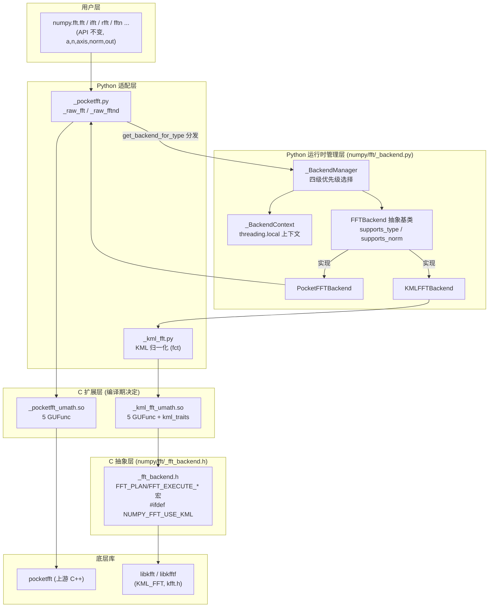
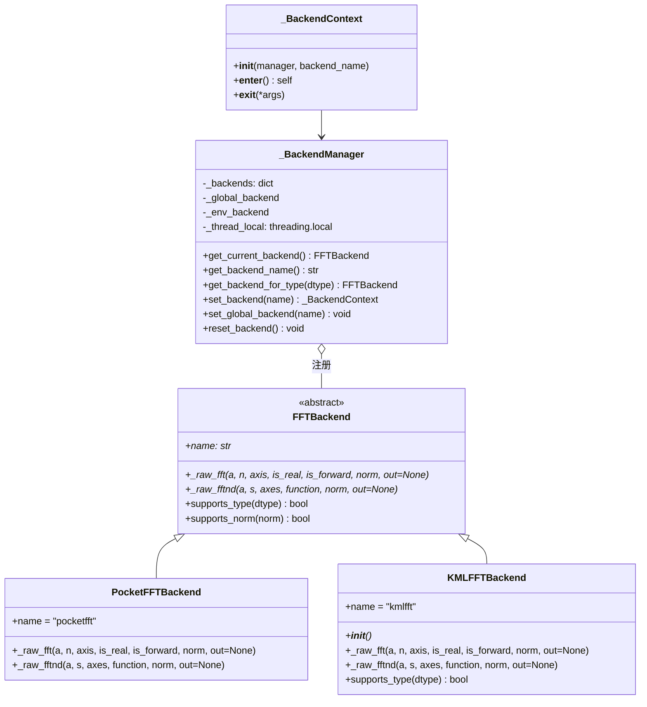
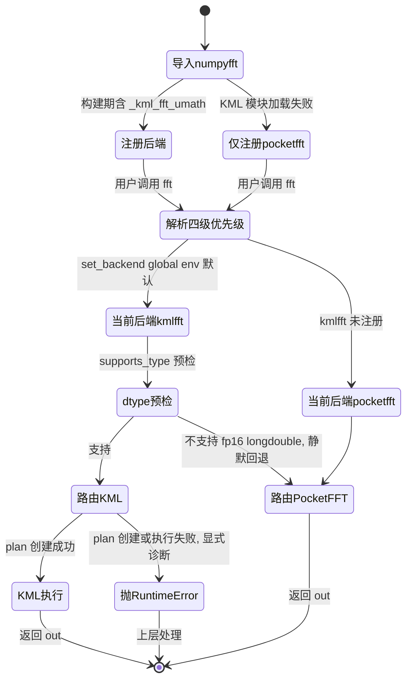
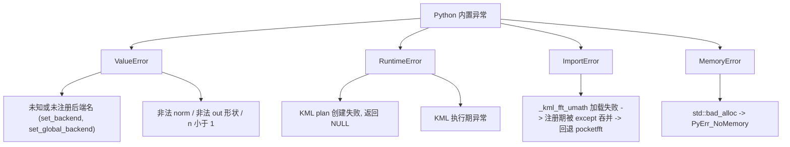

**状态 (Status):** Reviewing

**作者 (Authors):** luozisheng

**创建日期 (Created):** 2026-07-21

**更新日期 (Updated):** 2026-07-21

**相关 Issue/PR:** FUNC002026041424750066（fft adapter）

---

# 1. 概述

## 1.1 简介

本提案为 NumPy 的 `numpy.fft` 模块引入可插拔的 FFT 后端体系，使默认的 PocketFFT 与鲲鹏数学库 KML_FFT 以**双 C 扩展并存 + 运行时 Python Backend Manager** 的混合架构协同工作。底层沿用 NumPy BLAS 的编译时 C 接口抽象范式（`npy_cblas_base.h` 的宏映射思想，对应 `_fft_backend.h`），上层沿用 SciPy.fft 的运行时后端切换范式（`set_backend` / `set_global_backend` / 环境变量）。用户侧 `numpy.fft` 的全部 API（`fft`、`ifft`、`rfft`、`fftn` 等）签名与语义保持不变，鲲鹏平台在条件满足时透明获得 KML_FFT 的硬件加速收益。

适配层（KML 专有 C 扩展 `_kml_fft_umath`、Python 包装 `_kml_fft.py`）涉及鲲鹏平台闭源库调用，按本项目"上游/平行"双线策略走**平行社区**；而其中通用的 Highway SIMD 优化与算法改进则按 NEP 38/54 的跨架构公平原则剥离至上游（[NEP 54](https://numpy.org/neps/nep-0054-simd-cpp-highway.html) 原文："Highway has a policy that they must be implemented in a way that fairly balances across CPU architectures"，即新指令须在各 CPU 架构间公平平衡，鲲鹏特化指令不得走上游）。

## 1.2 动机

NumPy 2.x 的 FFT 模块以 PocketFFT（C++ 模板、GUFUNC 架构、`out` 参数支持）为唯一后端，跨平台兼容性良好但**未针对鲲鹏 920B/950 的 ARM 微架构深度优化**。在不做本提案的情况下：

- **性能损失**：在鲲鹏平台的高频 FFT 负载（信号处理、频谱分析、卷积加速）中，用户无法利用 KML_FFT 针对该处理器缓存的 plan 优化与多线程实现，相对 KML_FFT 存在可观测的性能差距（大尺寸 1-D 与多维变换尤甚）。
- **维护成本**：若以"硬编码替换 PocketFFT"的方式直接走 KML，则失去运行时切换能力，分发与回滚成本随硬件型号线性增长，且无法满足"库缺失即静默回退"的业务可用性要求。
- **生态价值**：缺乏统一后端抽象时，鲲鹏特化代码侵入 `numpy.fft` 主干，与上游 NumPy 社区保守文化冲突，长期 rebase 成本高。

本提案通过"编译时抽象 + 运行时管理"双层结构，使 KML 收益可按场景获得，同时保证无 KML 环境下行为与上游 NumPy 完全一致，最大化用户价值并最小化维护与对接成本。

## 1.3 目标

**目标：**

- 在 `numpy.fft` 下提供 `get_backend` / `set_backend` / `set_global_backend` / `reset_backend` 与环境变量 `NUMPY_FFT_BACKEND` 五条后端管理通路。
- 以双 C 扩展（`_pocketfft_umath` 默认 + `_kml_fft_umath` 可选）并存，运行时按优先级选择后端。
- 后端选择优先级（高→低）：`set_backend` 线程级上下文 > `set_global_backend` 全局 > `NUMPY_FFT_BACKEND` 环境变量 > 硬编码默认 `"pocketfft"`。
- KML 适配层封装 KML_FTT 的 C2C / R2C / C2R Plan-Execute 模型为 5 个与 PocketFFT 同签名的 GUFUNC。
- 库级回退：KML 库缺失 / 版本过旧 / ABI 不兼容 / 动态库加载失败均回退 PocketFFT，禁止影响 `numpy.fft` 的可导入性与默认调用。
- dtype 级回退：KML 不支持的 dtype 经 `supports_type` 预检回退 PocketFFT。
- 精度一致性：KML 与 PocketFFT 结果在 1–3 ULP 误差容忍内一致（对齐 NEP 38 的精度准入要求）。
- 上游对接：通用优化 + Highway SIMD 走上游 NumPy；KML 专有适配层走平行社区。

**非目标（不在本次范围）：**

- 不改变 `numpy.fft` 任何公开 API 的签名、默认值与数值语义（`n` / `axis` / `norm` / `out` 完全一致）。
- 不实现 KML_FFT 的半精度 `fp16`（`kml_ffth_*`）路径——本期仅 `double` / `float`。
- 不提供 `register_backend` 运行时注册第三方后端的公开 API（后端在构建期决定）。
- 不替换 PocketFFT 上游来源、不修改 `pocketfft/` 子模块。

# 2. 用例分析

下表覆盖 5 种 KML 库可用性场景。验证基线统一为"通过 NumPy 官方 `numpy.fft` test suite（`tests/test_pocketfft.py` + `tests/test_fft_backend.py`）验证适配后各函数的计算精度与异常处理逻辑"。

| 场景 | 触发条件 | 功能要求 | 性能要求 | DFX（兼容/可维护/可测试/可靠） |
| --- | --- | --- | --- | --- |
| UC-1 KML 已装且兼容 | 构建期 `fft-backend=kml` 并提供 `fft-include-dir` / `fft-lib-dir`；运行期 `libkfft` / `libkfftf` 可加载，`_kml_fft_umath.so` 导入成功 | `fft/ifft/rfft/irfft/fftn...` 经 Backend Manager 路由到 KML 的 5 个 GUFUNC；`norm` 语义（backward/ortho/forward）由 Python 层 `fct` 统一 | 大尺寸 1-D 与多维变换相对 PocketFFT 取得鲲鹏平台收益；小尺寸受 plan 创建开销影响不劣化到业务不可接受 | 精度 ≤1–3 ULP；官方 test suite 全绿；`get_backend()=="kmlfft"` |
| UC-2 KML 未装 | 未启用 `fft-backend=kml`，或 `_kml_fft_umath` 未编译 | `import numpy.fft` 不抛 `ImportError`；KML 后端不注册；全部调用走 PocketFFT | 与上游 NumPy 等价（无额外开销，分发路径无 KML 依赖） | 静默回退，无告警；`get_backend()=="pocketfft"`；官方 test suite 全绿 |
| UC-3 KML 版本过旧 | `libkfft` 缺少本适配层引用的符号（如 `kml_fft_plan_dft_r2c_1d`） | `_kml_fft_umath.so` 加载期 `ImportError`；`_BackendManager.__init__` 以 `except ImportError: pass` 静默不注册 kmlfft | 回退 PocketFFT，无性能劣化 | 静默回退；若用户经 `NUMPY_FFT_BACKEND=kmlfft` 显式请求则发 `RuntimeWarning` 并回退；官方 test suite 全绿 |
| UC-4 ABI 不兼容 | KML 头与库 ABI 不一致（结构体布局/枚举值漂移）导致模块加载或首次 plan 失败 | 模块加载失败按 UC-3 路径回退；运行期 plan 创建失败抛 `RuntimeError` 供上层诊断（不静默吞错） | 回退 PocketFFT | 加载期回退；运行期异常可诊断、可复现；官方 test suite 在 PocketFFT 路径全绿 |
| UC-5 动态库加载失败 | `libkfft.so` / `libkfftf.so` 文件缺失或路径错误 | `import numpy.fft` 仍成功（`_kml_fft_umath` 导入失败被吞）；调用走 PocketFFT | 回退 PocketFFT | 静默回退（显式请求则告警）；官方 test suite 全绿 |

**共性 DFX 要求：**

- *兼容性*：无 KML 环境下行为与上游 NumPy 2.x 完全一致；KML 启用不改变任何公开 API 行为。
- *可维护性*：KML 适配层与 PocketFFT 主干代码物理隔离（独立文件、独立构建节点），便于独立升级与向上游剥离。
- *可测试性*：`test_fft_backend.py` 以 `KMLFFT_AVAILABLE` 标记跳过/启用，5 类回退路径均有对应用例。
- *可靠性*：库级失败一律回退，不阻断 `numpy.fft` 可用性；plan 创建/执行失败显式抛错而非静默继续。

# 3. 方案设计

## 3.1 总体方案

采用**混合架构**：编译时 C 接口抽象层 + 运行时 Python Backend Manager。底层 C 扩展按构建期配置编译为 PocketFFT 或 KML 实现，上层 Python 管理器在运行时按四级优先级选择后端实例并分发。双层职责严格分离。



**双层职责说明：**

- **C 抽象层（`_fft_backend.h`）**：仿照 `npy_cblas_base.h` 用 `BLASNAME` 宏屏蔽不同 BLAS 提供方的范式，用 `FFT_PLAN` / `FFT_EXECUTE_DFT` / `FFT_DESTROY_PLAN` 等宏在编译期映射到 `kml_fft_*`（double）与 `kml_fftf_*`（float）。构建期由 `-DNUMPY_FFT_USE_KML` 决定。
- **Python 管理层（`_backend.py`）**：仿照 SciPy.fft 的 `BackendManager` / `uarray` 范式，提供后端注册、四级优先级解析、线程级上下文、dtype 预检回退。

## 3.2 技术选型

三种候选方案对比（字段与历史 `arch-design.md` 一致；结论仍为方案三）：

| 对比维度 | 方案一：编译时链接 C 接口抽象层 | 方案二：Python 层后端切换系统 | 方案三：混合架构（采纳） |
| --- | --- | --- | --- |
| 架构层次 | 纯 C 层 | Python 层 + C 扩展 | C 层 + Python 层双层 |
| 后端切换时机 | 编译时 | 运行时 | 运行时配置 + 编译时链接 |
| 性能开销 | 无运行时开销 | Python 层调度开销 | C 层执行无开销（仅注册期一次解析） |
| 实现复杂度 | 中等 | 较低 | 较高 |
| 维护成本 | 低 | 中等 | 中等 |
| 用户迁移成本 | 高（需重新编译） | 低（直接切换） | 低（直接切换） |
| 生态兼容性 | BLAS 模式 | SciPy 模式 | 两者结合 |
| 优点 | 极致性能；代码纯净；部署稳定 | 灵活性极高；实现维护简单；SciPy 兼容 | 兼顾性能与灵活；执行路径短；用户透明 |
| 缺点 | 灵活性差；分发复杂 | 微小调度开销；二进制体积膨胀；全局状态线程安全风险 | 实现复杂度最高；编译配置繁琐 |

**选择方案三的理由：**

1. **性能**：实际执行落在 C 层 GUFUNC 内，无每次调用的 Python-C 分发；后端选择仅在 `_raw_fft` 入口解析一次（`get_backend_for_type`）。
2. **灵活性**：用户经 `set_backend` / 环境变量即可切换，无需重新编译；分发一个二进制即可。
3. **兼容性**：C 层抽象与 NumPy BLAS 范式一致，上层 API 与 SciPy.fft 后端范式一致，契合上游社区文化。
4. **可维护/可扩展**：新增后端只需新增 C 扩展 + Python 包装 + 注册，不动核心架构。

方案一被否因切换需重新编译、分发成本随硬件型号线性增长；方案二被否因每次调用 Python 层分发在大规模小尺寸 FFT 循环中产生可观测累积延迟，且对 KML plan 机制利用不充分。

## 3.3 功能与性能设计

### 3.3.1 Python 层 Backend 抽象类图



类图说明：`FFTBackend` 定义统一接口（`_raw_fft` / `_raw_fftnd` 与 `_pocketfft.py` 内部签名一致）；`PocketFFTBackend` 委托 `_pocketfft._raw_fft`；`KMLFFTBackend` 在 `__init__` 中 `from . import _kml_fft` 探活（C 扩展缺失即抛 `ImportError` 由管理器捕获）；`_BackendContext` 用 `threading.local` 实现线程级隔离与自动恢复；`_BackendManager` 单例解析四级优先级。

**FFT 公开 API 面（不变签名，与 `numpy/fft/_pocketfft.py` 严格一致）：**

| 函数 | 原型 |
| --- | --- |
| fft / ifft / rfft / irfft / hfft / ihfft | `f(a, n=None, axis=-1, norm=None, out=None)` |
| fftn / ifftn / rfftn / irfftn | `f(a, s=None, axes=None, norm=None, out=None)` |
| fft2 / ifft2 / rfft2 / irfft2 | `f(a, s=None, axes=(-2, -1), norm=None, out=None)` |

适配层不增改上述任何签名；`norm` 取值 `{None, "backward", "ortho", "forward"}`，KML 路径的归一化差异由 `_kml_fft._raw_fft` 计算的 `fct` 在 C 层 `apply_fct*` 抹平。

### 3.3.2 C 扩展结构

两个 C 扩展并存（`numpy/fft/meson.build`）：

| C 扩展 | 源文件 | 构建条件 | GUFunc | 类型 |
| --- | --- | --- | --- | --- |
| `_pocketfft_umath` | `_pocketfft_umath.cpp` | 永远构建 | `fft/ifft/rfft_n_even/rfft_n_odd/irfft` | double/float/longdouble |
| `_kml_fft_umath` | `_kml_fft_umath.cpp` | `fft-backend=='kml'` 且 include/lib 路径非空 | `fft/ifft/rfft_n_even/rfft_n_odd/irfft`（同签名） | double/float（无 longdouble） |

`_kml_fft_umath.cpp` 关键结构（贴合真实代码）：

- **异常桥接**：`kml_ufunc_adapter<loop_fn>` 模板用 `NPY_ALLOW_C_API_DEF` + try/catch，将 `std::bad_alloc→PyErr_NoMemory`、`std::exception→PyExc_RuntimeError`。
- **类型派发**：`kml_traits<double>` / `kml_traits<float>` 模板特化，分别绑定 `FFT_*`（double，映射 `kml_fft_*`）与 `FFTF_*`（float，映射 `kml_fftf_*`）宏。
- **5 个 GUFUNC loop**：`fft_loop`（C2C）、`rfft_loop` + `rfft_n_even_loop` / `rfft_n_odd_loop`（R2C，按 `n` 奇偶选 npts）、`irfft_loop`（C2R）。每个 loop 处理非连续步幅的 `copy_input` / `copy_output` 缓冲与 `apply_fct` 归一化。
- **GUFunc 注册**：`PyUFunc_FromFuncAndDataAndSignature`，签名 `"(n),()->(m)"`（fft/rfft）、`"(m),()->(n)"`（ifft/irfft）；`fft_data`/`ifft_data` 携带 `FFT_FORWARD`/`FFT_BACKWARD` 方向标志。
- **模块初始化**：`Py_mod_exec` 槽执行 `PyArray_ImportNumPyAPI` / `PyUFunc_ImportUFuncAPI` / `kml_traits<*>::init_threads()`；声明 `Py_mod_multiple_interpreters=NOT_SUPPORTED`、`Py_mod_gil=NOT_USED`（Py3.13+）。

### 3.3.3 回退判定流程



说明：库级失败（场景 UC-2/3/4/5）在导入期被 `except ImportError: pass` 静默处理；dtype 级失败在 `_raw_fft` 入口经 `get_backend_for_type` 静默回退；运行期 plan/执行失败显式抛 `RuntimeError`。

## 3.4 安全隐私与 DFX 设计

### 3.4.1 异常处理（基于实际实现的异常层次）

本提案不引入自定义 `FFTError` 异常族（保持与上游 NumPy 一致的最小异常面），沿用标准异常，层次与触发场景如下：



| 错误类型 | 触发场景 | 处理策略 | 是否阻断业务 |
| --- | --- | --- | --- |
| `ImportError` | KML 库缺失/版本过旧/ABI 不兼容/动态库加载失败 | `_BackendManager.__init__` 中 `except ImportError: pass`，不注册 kmlfft，回退 pocketfft | 否（静默回退；显式 `NUMPY_FFT_BACKEND=kmlfft` 请求则 `RuntimeWarning` 后回退） |
| `ValueError` | 未知后端名 / 非法 `norm` / `out` 形状不匹配 / `n<1` | 即时抛出，由上层处理 | 是（参数错误，应修正调用） |
| `RuntimeError` | KML plan 创建返回 NULL / 执行期 `std::exception` | `kml_ufunc_adapter` 桥接抛出 | 是（运行期 KML 失败，显式诊断而非静默继续） |
| `MemoryError` | C 层 `std::bad_alloc` | `PyErr_NoMemory` | 是（资源不足） |

### 3.4.2 线程安全分层

| 组件 | 层级 | 职责 | 线程安全机制（实际实现） |
| --- | --- | --- | --- |
| `_BackendManager` | Python | 后端选择、全局状态管理 | `threading.Lock` 保护 `_global_backend` 写入；GIL 保护状态变更 |
| `set_backend` 上下文 | Python | 线程级后端隔离 | `threading.local` 存储，线程间互不干扰 |
| Backend 实例 | Python | FFT 接口封装、参数校验 | 无状态委托，GIL 保护调用 |
| `_kml_fft_umath.so` | C 扩展 | FFT 实际计算 | **GIL 持有**（计算期不释放 GIL）；`NPY_ALLOW_C_API`/`NPY_DISABLE_C_API` 仅用于异常桥接；`kml_fft_init_threads` 初始化 KML 内部线程池 |

多线程保护关键点：当前计算期持有 GIL，Python 侧多线程经 GIL 串行化；KML 内部多线程在 GIL 持有下仍可由 KML 自身线程池并行计算。计算期释放 GIL 以提升并发列为未解决问题。

### 3.4.3 精度一致性

- KML 与 PocketFFT 结果以 `np.testing.assert_allclose(rtol=1e-10)` 对齐（对应 `test_fft_backend.py` 中 `test_kmlfft_backend_works` / `test_set_kmlfft_and_compute` 的断言）。
- ULP 容忍遵循 NEP 38 的 SIMD 优化四项准入标准之一："the new code must not decrease accuracy by more than 1-3 ULPs"（[NEP 38](https://numpy.org/neps/nep-0038-SIMD-optimizations.html)）。KML 适配层不改变算法语义，仅替换实现，精度差异源自浮点累加顺序，控制在 1–3 ULP。

### 3.4.4 可测试性

- `tests/test_fft_backend.py` 覆盖：`get_backend`（默认/全局/上下文/环境变量优先级）、`set_backend`（恢复/嵌套/线程隔离/非法名）、`set_global_backend`（生效/末次生效/非法）、`reset_backend`（清除全局/保留环境变量）、`TestNoKMLFFT`（无 KML 时 4 类回退断言）、`TestEnvVarBackend`（非法/未注册告警）、抽象基类与 PocketFFT 直接调用、`get_backend_for_type` 不支持 dtype 回退。
- 5 类库可用性场景均以"通过 `numpy.fft` 官方 test suite（`test_pocketfft.py` + `test_fft_backend.py`）"为验收基线（见第 2 章）。
- `KMLFFT_AVAILABLE` 标记自动跳过无 KML 环境的用例，保证无 KML CI 不红。

## 3.5 编程与调用设计

### 3.5.1 编程模型基本设计

**开发环境设计：**

- 语言/框架：C99/C++（GUFUNC）、Python（后端管理器）；遵循 [NEP 45 — C style guide](https://numpy.org/neps/nep-0045-c_style_guide.html)（原文："Use C99 (that is, the standard defined by ISO/IEC 9899:1999)."、"No compiler warnings with major compilers"、"Public Macros should have a `NPY_` prefix"）。
- 构建系统：Meson（`numpy/fft/meson.build` + `meson.options`）。
- KML 依赖：构建期通过 `fft-include-dir` 指向 `kfft.h` 目录、`fft-lib-dir` 指向 `libkfft` / `libkfftf` 目录；运行期需 `libkfft.so` / `libkfftf.so` 可被动态链接器定位。
- 调试工具链：`import numpy; numpy.fft.get_backend()` 查询当前后端；`NUMPY_FFT_BACKEND=kmlfft` 环境变量切换；`pytest numpy/fft/tests/` 验证。

**开发约束：**

- 硬件平台：鲲鹏 920B/950（aarch64，上游 Tier 1）；x86/AMD 作为对比基线。
- 编程语言限制：C 扩展须 C99 兼容、无编译警告；Python 须通过 `ruff`。
- 后端名大小写不敏感（管理器统一 `.lower()`）。
- KML 不支持 `longdouble`，须在 `supports_type` 中如实声明并回退。

**可验收设计：**

- 功能验收：`pytest numpy/fft/tests/test_pocketfft.py numpy/fft/tests/test_fft_backend.py` 全绿。
- 性能验收：鲲鹏平台 `benchmarks/` 下 FFT 用例，KML 路径相对 PocketFFT 在大尺寸场景取得收益，小尺寸不劣化到业务不可接受；输出标准化对比报告并归档。
- 精度验收：KML 与 PocketFFT 结果 `assert_allclose(rtol=1e-10)` 一致；ULP ≤ 1–3。

### 3.5.2 接口定义与设计

#### 3.5.2.1 get_backend

- **接口描述：** 返回当前生效的 FFT 后端名称字符串。
- **接口原型：** `numpy.fft.get_backend() -> str`
- **输入/输出参数：**

  | 参数名称 | 输入/输出 | 类型 | 描述 | 取值范围 |
  | --- | --- | --- | --- | --- |
  | （无） | — | — | 本函数无参数 | — |

- **返回参数：**

  | 参数名称 | 类型 | 描述 | 取值范围 |
  | --- | --- | --- | --- |
  | out | str | 当前后端名 | `"pocketfft"` / `"kmlfft"` |

- **异常处理：** 无。
- **约束说明：** 后端选择优先级（高→低）：线程级 `set_backend` 上下文 > `set_global_backend` 全局 > `NUMPY_FFT_BACKEND` 环境变量 > 硬编码默认 `"pocketfft"`。
- **变更说明：** 新增 API。
- **调用参考代码：**

```python
import numpy as np
print(np.fft.get_backend())  # "pocketfft"（默认）
```

#### 3.5.2.2 set_backend

- **接口描述：** 返回上下文管理器，在其作用域内强制使用指定 FFT 后端，退出自动恢复。
- **接口原型：** `numpy.fft.set_backend(backend: str) -> _BackendContext`
- **输入/输出参数：**

  | 参数名称 | 输入/输出 | 类型 | 描述 | 取值范围 |
  | --- | --- | --- | --- | --- |
  | backend | 输入 | str | 后端名，大小写不敏感 | `"pocketfft"` / `"kmlfft"` |

- **返回参数：**

  | 参数名称 | 类型 | 描述 | 取值范围 |
  | --- | --- | --- | --- |
  | ctx | _BackendContext | 上下文管理器 | 支持 `with` 嵌套 |

- **异常处理：** `ValueError`——后端名未注册或当前不可用。
- **约束说明：** 用 `threading.local` 实现线程级隔离，不影响其他线程；可嵌套，内层退出恢复外层。
- **变更说明：** 新增 API。
- **调用参考代码：**

```python
import numpy as np
data = np.arange(128) + 1j * np.arange(128)
with np.fft.set_backend("kmlfft"):
    assert np.fft.get_backend() == "kmlfft"
    result = np.fft.fft(data)
assert np.fft.get_backend() == "pocketfft"  # 退出后恢复
```

#### 3.5.2.3 set_global_backend

- **接口描述：** 将指定后端设为全局默认，影响此后所有未显式指定后端的 `numpy.fft` 调用。
- **接口原型：** `numpy.fft.set_global_backend(backend: str) -> None`
- **输入/输出参数：**

  | 参数名称 | 输入/输出 | 类型 | 描述 | 取值范围 |
  | --- | --- | --- | --- | --- |
  | backend | 输入 | str | 后端名，大小写不敏感 | `"pocketfft"` / `"kmlfft"` |

- **返回参数：**

  | 参数名称 | 类型 | 描述 | 取值范围 |
  | --- | --- | --- | --- |
  | （无） | None | — | — |

- **异常处理：** `ValueError`——后端名未注册；若 KML 因库缺失在注册期未注册，则对 `"kmlfft"` 抛 `ValueError`。
- **约束说明：** 持久化至进程结束或下一次 `set_global_backend` / `reset_backend`；优先级低于线程级 `set_backend`，高于环境变量与默认。
- **变更说明：** 新增 API。
- **调用参考代码：**

```python
import numpy as np
np.fft.set_global_backend("kmlfft")
try:
    data = np.random.default_rng(42).standard_normal(64).astype(np.complex128)
    result = np.fft.fft(data)
finally:
    np.fft.reset_backend()
```

#### 3.5.2.4 reset_backend

- **接口描述：** 将后端管理器显式状态重置为初始：清除全局后端；环境变量与默认仍生效。
- **接口原型：** `numpy.fft.reset_backend() -> None`
- **输入/输出参数：**

  | 参数名称 | 输入/输出 | 类型 | 描述 | 取值范围 |
  | --- | --- | --- | --- | --- |
  | （无） | — | — | — | — |

- **返回参数：**

  | 参数名称 | 类型 | 描述 | 取值范围 |
  | --- | --- | --- | --- | --- |
  | （无） | None | — | — |

- **异常处理：** 无。
- **约束说明：** 仅清除 `set_global_backend` 设置的全局后端；`NUMPY_FFT_BACKEND` 与硬编码默认不受影响；线程级上下文由 `with` 退出自动恢复。
- **变更说明：** 新增 API。
- **调用参考代码：**

```python
import numpy as np
np.fft.set_global_backend("kmlfft")
np.fft.reset_backend()
assert np.fft.get_backend() == "pocketfft"
```

#### 3.5.2.5 NUMPY_FFT_BACKEND（环境变量）

- **接口描述：** 进程启动时指定默认 FFT 后端，作为系统默认前的后备选择。
- **接口原型：** 环境变量 `NUMPY_FFT_BACKEND`（`str`，大小写不敏感）。
- **输入/输出参数：**

  | 参数名称 | 输入/输出 | 类型 | 描述 | 取值范围 |
  | --- | --- | --- | --- | --- |
  | NUMPY_FFT_BACKEND | 输入 | str | 后端名 | `"pocketfft"` / `"kmlfft"` |

- **返回参数：** 不适用（环境变量）。
- **异常处理：** 若值未注册或实例化失败，发 `RuntimeWarning` 并回退系统默认 `"pocketfft"`。
- **约束说明：** 仅在 `_BackendManager.__init__`（模块首次导入）时读取一次生效；优先级低于全局后端，高于硬编码默认。
- **变更说明：** 新增环境变量。
- **调用参考代码：**

```bash
NUMPY_FFT_BACKEND=kmlfft python -c "import numpy as np; print(np.fft.get_backend())"
# kmlfft（若已注册），否则 RuntimeWarning + pocketfft
```

### 3.5.3 编程手册设计

单独输出为 `doc/fft_backend.rst`

# 4. 缺点和风险

| 风险/缺点 | 影响 | 应对措施 |
| --- | --- | --- |
| **二进制体积** | `_kml_fft_umath.so` 额外增加体积 | 仅在 `fft-backend=kml` 时构建；默认构建不含 KML |
| **实现复杂度** | 双层抽象维护成本高于单层 | C 层与 Python 层物理隔离，独立升级；通用部分可剥离上游降低长期成本 |

# 5. 现有技术

| 现有方案 | 借鉴点 | 差异 |
| --- | --- | --- |
| **NumPy BLAS（`npy_cblas_base.h`）** | 编译时 C 接口抽象、`BLASNAME` 宏映射、函数指针表统一调用 | BLAS 为纯编译时绑定无运行时切换；本提案在 C 抽象之上叠加 Python 运行时管理器 |
| **SciPy.fft 后端（uarray）** | 抽象后端基类、后端管理器、`set_backend`/环境变量、运行时动态切换 | SciPy 用 uarray multimethod 每次调用 Python 分发；本提案执行落 C 层 GUFUNC，仅入口解析一次 |

# 6. 未解决问题

---

# 附录

- **参考资料链接：**
  - [NEP 38 — Using SIMD optimization instructions for performance](https://numpy.org/neps/nep-0038-SIMD-optimizations.html)（SIMD 优化四项准入标准：correctness ≤1–3 ULPs / code bloat / maintainability / performance benchmarks）
  - [NEP 45 — C style guide](https://numpy.org/neps/nep-0045-c_style_guide.html)（C99、无编译警告、`NPY_` 前缀）
  - [NEP 54 — SIMD infrastructure evolution: adopting Google Highway when moving to C++](https://numpy.org/neps/nep-0054-simd-cpp-highway.html)（Highway 跨架构公平原则）
  - [NumPy Roadmap](https://numpy.org/neps/roadmap.html)
- **术语表：**

  | 术语 | 含义 |
  | --- | --- |
  | KML | Kunpeng Math Library，华为鲲鹏平台数学库，含 KML_FFT（`libkfft`/`libkfftf`，头 `kfft.h`） |
  | PocketFFT | NumPy 2.x 默认 FFT 实现（C++ 模板，`pocketfft/` 子模块） |
  | GUFunc | Generalized UFunc，广义通用函数，支持核心维度签名如 `(n),()->(m)` |
  | vtable | 函数指针表，C 接口抽象层用宏模拟的统一调用入口集合 |
  | uarray | SciPy 用的多方法分发库，运行时按后端动态分发 |
  | Backend Manager | 本提案的 `_BackendManager`，运行时按优先级解析后端实例 |
  | Plan-Execute | KML/FFTW 风格：先 `plan_*` 创建计划，再 `execute_*` 执行，最后 `destroy_plan` 释放 |
  | ULP | Unit in the Last Place，浮点精度单位，NEP 38 以 ≤1–3 ULPs 为精度准入线 |
- **文档更新计划：**
  - T+0：本 RFC 评审。
  - T+1：新增 `doc/fft_backend.rst` 编程手册；`numpy.fft` 模块 docstring 增加"Backend management"章节（已新增 `get_backend` 等的 autosummary）。
  - T+2：`benchmarks/` 新增 KML vs PocketFFT 对比基线脚本；`building_with_meson.rst` 补充 `fft-backend` / `fft-include-dir` / `fft-lib-dir` 构建说明。
